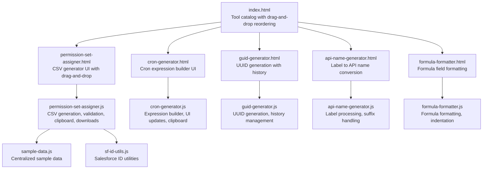
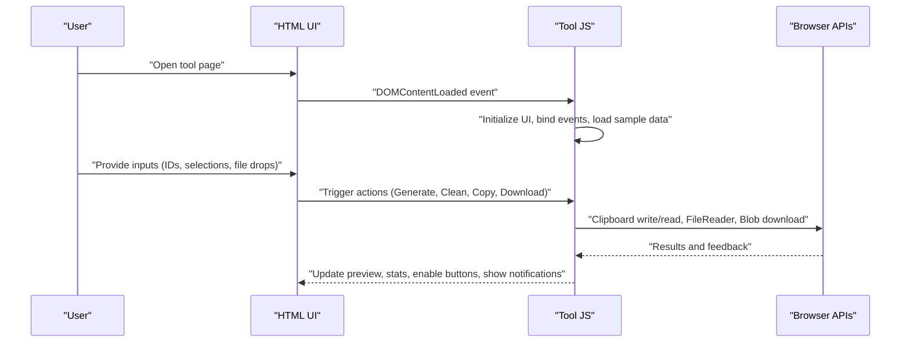
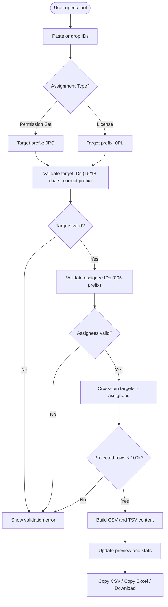
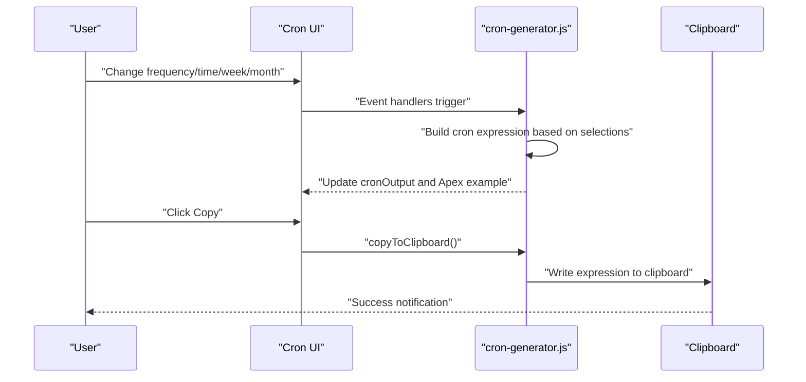
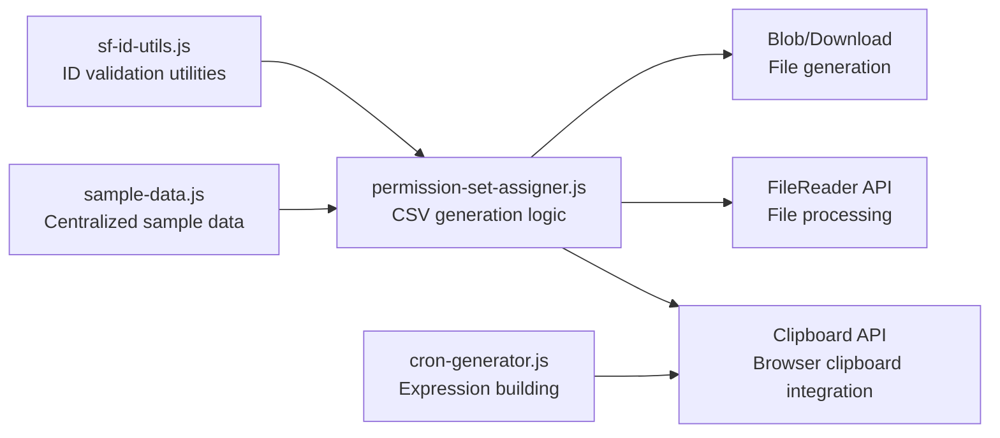
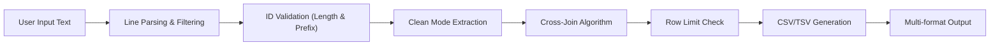

# Administrative Tools

<cite>
**Referenced Files in This Document**
- [README.md](file://README.md)
- [index.html](file://index.html)
- [permission-set-assigner.html](file://permission-set-assigner.html)
- [permission-set-assigner.js](file://permission-set-assigner.js)
- [sample-data.js](file://sample-data.js)
- [cron-generator.html](file://cron-generator.html)
- [cron-generator.js](file://cron-generator.js)
- [sf-id-utils.js](file://sf-id-utils.js)
- [guid-generator.html](file://guid-generator.html)
- [api-name-generator.html](file://api-name-generator.html)
- [formula-formatter.html](file://formula-formatter.html)
</cite>

## Update Summary
**Changes Made**
- Enhanced Permission Set Assigner documentation with comprehensive CSV generation workflows
- Expanded Cron Generator coverage with detailed expression building and validation
- Added documentation for additional administrative utilities including GUID Generator, API Name Generator, and Formula Formatter
- Updated security and privacy considerations with comprehensive client-side processing details
- Enhanced troubleshooting guidance with specific error scenarios and resolutions
- Improved user interface patterns documentation with drag-and-drop and validation workflows

## Table of Contents
1. [Introduction](#introduction)
2. [Project Structure](#project-structure)
3. [Core Components](#core-components)
4. [Architecture Overview](#architecture-overview)
5. [Detailed Component Analysis](#detailed-component-analysis)
6. [Dependency Analysis](#dependency-analysis)
7. [Performance Considerations](#performance-considerations)
8. [Troubleshooting Guide](#troubleshooting-guide)
9. [Conclusion](#conclusion)
10. [Appendices](#appendices)

## Introduction
This document describes the comprehensive suite of administrative utilities designed for Salesforce administrators. The tools are part of a secure, offline-first platform that runs entirely in the browser, ensuring complete data privacy and security. The suite includes:

- **Permission Set Assigner**: Advanced CSV generation for bulk Permission Set and License assignments with cross-join logic and clean mode
- **Cron Generator**: Apex System.schedule() expression builder with validation and formatting options
- **GUID Generator**: Secure UUID v4 generation with bulk creation and session history
- **API Name Generator**: Salesforce label to API name conversion with suffix support
- **Formula Formatter**: Massively formatted formula field indentation and readability enhancement

These tools provide practical workflows for preparing assignment files, generating scheduled job expressions, and integrating seamlessly with Salesforce import processes while maintaining 100% client-side processing.

## Project Structure
The project is organized as a collection of standalone HTML pages with associated JavaScript logic and shared assets. The administrative tools suite consists of:

- **Permission Set Assigner**: CSV generator for Permission Set and License assignments with drag-and-drop support
- **Cron Generator**: Apex scheduling expression builder with frequency selection and validation
- **Additional Utilities**: GUID generation, API name conversion, and formula formatting tools

**Diagram sources**
- [index.html:38-232](file://index.html#L38-L232)
- [permission-set-assigner.html:1-184](file://permission-set-assigner.html#L1-L184)
- [permission-set-assigner.js:1-499](file://permission-set-assigner.js#L1-L499)
- [sample-data.js:1-69](file://sample-data.js#L1-L69)
- [sf-id-utils.js:1-45](file://sf-id-utils.js#L1-L45)
- [cron-generator.html:1-156](file://cron-generator.html#L1-L156)
- [cron-generator.js:1-202](file://cron-generator.js#L1-L202)

**Section sources**
- [README.md:1-63](file://README.md#L1-L63)
- [index.html:38-232](file://index.html#L38-L232)

## Core Components

### Permission Set Assigner
- **Advanced CSV Generation**: Creates CSV files for Permission Set or Permission Set License assignments with comprehensive validation
- **Cross-Join Logic**: Produces rows for every combination of target(s) and assignee(s) with row limit enforcement
- **Clean Mode**: Extracts valid 15/18-character Salesforce IDs with correct prefixes from arbitrary text
- **Drag-and-Drop Support**: Reads files containing assignee IDs with visual feedback
- **Multi-format Output**: Generates CSV preview, Excel-friendly TSV, and downloadable CSV files
- **Real-time Validation**: Immediate feedback on ID validity and row count projections

### Cron Generator
- **Apex Expression Builder**: Constructs System.schedule() cron expressions from user selections
- **Flexible Frequency Options**: Supports hourly, daily, weekly, and monthly scheduling patterns
- **Time Selection**: Configurable hour and minute settings with dropdown validation
- **Advanced Options**: Weekly day selection and monthly day configuration with custom day support
- **Live Preview**: Real-time display of cron expressions and Apex code examples
- **Clipboard Integration**: One-click copy functionality with success notifications

### Additional Administrative Utilities
- **GUID Generator**: Secure UUID v4 generation with bulk creation (1-20) and session history tracking
- **API Name Generator**: Converts Salesforce labels to valid API names with customizable suffixes (__c, __r, __mdt, __e)
- **Formula Formatter**: Formats complex Salesforce formulas with configurable indentation (2, 4 spaces, or tabs)

**Section sources**
- [README.md:19-46](file://README.md#L19-L46)
- [permission-set-assigner.html:66-138](file://permission-set-assigner.html#L66-L138)
- [permission-set-assigner.js:201-333](file://permission-set-assigner.js#L201-L333)
- [cron-generator.html:40-146](file://cron-generator.html#L40-L146)
- [cron-generator.js:68-107](file://cron-generator.js#L68-L107)

## Architecture Overview
All tools are implemented as single-page applications with Bootstrap-based UI components and vanilla JavaScript. They leverage local browser APIs for clipboard operations, file reading, and downloads, ensuring complete data privacy.

**Diagram sources**
- [permission-set-assigner.js:1-403](file://permission-set-assigner.js#L1-L403)
- [cron-generator.js:1-118](file://cron-generator.js#L1-L118)

## Detailed Component Analysis

### Permission Set Assigner
This tool generates CSV files for bulk assignment uploads to Salesforce with advanced validation and user experience features:

**Key Features:**
- **Assignment Type Management**: Toggle between Permission Set (0PS) and Permission Set License (0PL) assignments
- **Multi-format ID Extraction**: Clean mode extracts valid Salesforce IDs from mixed text content
- **Drag-and-Drop Interface**: Visual file drop zone with real-time feedback
- **Real-time Statistics**: Line counting for both target and assignee inputs
- **Row Limit Enforcement**: Prevents generation of oversized CSV files (≤100,000 rows)
- **Multi-format Clipboard Support**: Tab-separated values for Excel paste operations

**Workflow Process:**

**Practical Usage Examples:**
- **Bulk Assignment Generation**: Paste target Permission Set IDs and assignee User IDs, click Generate, then copy to Salesforce Import Wizard
- **Data Cleaning Workflow**: Use Clean mode to extract valid IDs from mixed text content, then proceed with validation
- **File-based Processing**: Drag and drop CSV files containing User IDs for automated processing
- **Sample Data Loading**: Load pre-populated sample data for testing and demonstration purposes

**Integration with Salesforce Processes:**
- CSV headers automatically adapt based on assignment type (PermissionSetId vs PermissionSetLicenseId)
- TSV format optimized for Excel paste operations
- Row limit ensures compliance with Salesforce bulk operation constraints
- Real-time validation prevents failed imports due to invalid ID formats

**Section sources**
- [permission-set-assigner.html:66-176](file://permission-set-assigner.html#L66-L176)
- [permission-set-assigner.js:115-170](file://permission-set-assigner.js#L115-L170)
- [permission-set-assigner.js:201-333](file://permission-set-assigner.js#L201-L333)
- [sample-data.js:38-41](file://sample-data.js#L38-L41)

### Cron Generator
This tool builds Apex System.schedule() cron expressions with intuitive frequency selection and validation:

**Core Functionality:**
- **Frequency Configuration**: Hourly, daily, weekly, and monthly scheduling options
- **Time Selection Interface**: Separate hour and minute dropdowns with validation
- **Weekly Pattern Support**: Multiple day selection with day-of-week field construction
- **Monthly Flexibility**: Fixed day options (1st, 15th, Last) and custom day entry
- **Live Expression Preview**: Real-time cron expression display and Apex code example
- **Clipboard Integration**: One-click copy with success notification system

**Expression Construction Process:**

**Expression Format Support:**
- **Standard Five-field Format**: Seconds Minutes Hours DayOfMonth Month DayOfWeek
- **Optional Year Field**: Excluded for simplicity and compatibility
- **Wildcard Support**: Flexible patterns for different scheduling requirements
- **Validation Integration**: Real-time validation prevents malformed expressions

**Section sources**
- [cron-generator.html:40-146](file://cron-generator.html#L40-L146)
- [cron-generator.js:68-107](file://cron-generator.js#L68-L107)

### Additional Administrative Utilities

#### GUID Generator
- **Secure UUID v4 Generation**: Cryptographically secure random identifier creation
- **Bulk Generation Support**: Create 1-20 GUIDs in a single operation
- **Session History Tracking**: Maintains last 20 generated GUID sets with timestamps
- **Copy Functionality**: One-click clipboard integration for individual GUIDs or entire sets
- **Visual Feedback**: Success notifications and status indicators

#### API Name Generator
- **Label Processing**: Converts human-readable labels to valid Salesforce API names
- **Suffix Configuration**: Supports standard (__c), relationship (__r), metadata (__mdt), and event (__e) suffixes
- **Validation Integration**: Ensures generated names meet Salesforce naming conventions
- **Batch Processing**: Handles multiple labels with consistent formatting

#### Formula Formatter
- **Massive Formula Support**: Processes complex formula fields with extensive nesting
- **Configurable Indentation**: 2-space, 4-space, or tab-based formatting options
- **Readability Enhancement**: Improves formula comprehension through structured formatting
- **Sample Data Integration**: Pre-loaded examples for testing and demonstration

**Section sources**
- [guid-generator.html:55-123](file://guid-generator.html#L55-L123)
- [api-name-generator.html:40-107](file://api-name-generator.html#L40-L107)
- [formula-formatter.html:40-108](file://formula-formatter.html#L40-L108)

## Dependency Analysis
The administrative tools suite demonstrates a modular architecture with shared utilities and centralized data management:

**Core Dependencies:**
- **Permission Set Assigner**: Depends on sample-data.js for demo content, sf-id-utils.js for ID validation, Bootstrap for UI framework
- **Cron Generator**: Self-contained with Bootstrap for UI styling and clipboard API integration
- **Shared Utilities**: All tools utilize Bootstrap CSS framework and custom styling for consistent appearance

**Data Flow Architecture:**

**Diagram sources**
- [permission-set-assigner.js:1-403](file://permission-set-assigner.js#L1-L403)
- [sample-data.js:1-69](file://sample-data.js#L1-L69)
- [sf-id-utils.js:1-45](file://sf-id-utils.js#L1-L45)
- [cron-generator.js:1-118](file://cron-generator.js#L1-L118)

**Section sources**
- [permission-set-assigner.js:1-403](file://permission-set-assigner.js#L1-L403)
- [cron-generator.js:1-118](file://cron-generator.js#L1-L118)

## Performance Considerations
The administrative tools prioritize performance and user experience through several optimization strategies:

**Client-Side Processing Benefits:**
- **Zero Network Overhead**: All processing occurs locally, eliminating latency and bandwidth concerns
- **Memory Efficiency**: Optimized algorithms prevent browser slowdowns during large operations
- **Responsive Design**: Mobile-first approach ensures optimal performance across devices
- **Progressive Enhancement**: Graceful degradation when advanced browser APIs are unavailable

**Performance Optimization Strategies:**
- **Row Limit Enforcement**: Prevents memory issues during large CSV generation operations
- **Real-time Validation**: Immediate feedback reduces unnecessary processing cycles
- **Efficient DOM Manipulation**: Minimal DOM updates for smooth user interactions
- **Lazy Loading**: Tool-specific scripts loaded only when needed

**Security and Privacy Guarantees:**
- **100% Client-Side Processing**: No data transmission to external servers
- **No Persistent Storage**: All data processed in memory only
- **Secure Context Requirement**: Clipboard API requires HTTPS for enhanced security
- **Input Sanitization**: Automatic cleaning of potentially malicious content

## Troubleshooting Guide

### Common Issues and Resolutions

**Permission Set Assigner Issues:**
- **Invalid ID Format Detection**: Ensure target and assignee IDs are 15 or 18 characters with correct prefixes (0PS for Permission Sets, 0PL for Licenses, 005 for Users)
- **Clean Mode Not Working**: Verify input contains valid ID patterns; Clean mode extracts IDs using regex patterns
- **Row Limit Exceeded**: Reduce target or assignee count to stay under 100,000 projected rows
- **Drag-and-Drop Failure**: Check file accessibility and browser compatibility; use paste functionality as alternative

**Cron Generator Issues:**
- **Expression Copy Failures**: Verify browser clipboard permissions; fallback to manual copy if needed
- **Weekly/Monthly Option Conflicts**: Ensure proper selection combinations; weekly requires day selection, monthly requires day specification
- **Invalid Time Values**: Hour must be 0-23, minute must be 0, 15, 30, or 45 for standard configurations

**General Tool Issues:**
- **Browser Compatibility**: Tools require modern browsers with ES6 support and Clipboard API availability
- **HTTPS Requirements**: Some features require secure contexts for full functionality
- **Mobile Responsiveness**: Touch gestures may vary by device; use desktop for complex operations when possible

**Advanced Troubleshooting:**
- **Performance Optimization**: Close unused tabs to free memory for large operations
- **Storage Management**: Clear browser cache if experiencing storage-related issues
- **Feature Testing**: Use sample data to verify tool functionality before processing production data

**Section sources**
- [permission-set-assigner.js:231-269](file://permission-set-assigner.js#L231-L269)
- [permission-set-assigner.js:271-276](file://permission-set-assigner.js#L271-L276)
- [permission-set-assigner.js:448-486](file://permission-set-assigner.js#L448-L486)
- [cron-generator.js:163-201](file://cron-generator.js#L163-L201)

## Conclusion
The administrative tools suite provides comprehensive, secure solutions for Salesforce administrators:

**Core Value Proposition:**
- **Complete Offline Processing**: All tools operate 100% client-side with zero data transmission
- **Enhanced Productivity**: Streamlined workflows for bulk operations and repetitive tasks
- **Robust Validation**: Built-in error detection and prevention mechanisms
- **Modern User Experience**: Intuitive interfaces with real-time feedback and responsive design

**Integration Benefits:**
- **Salesforce Native**: Direct integration with Salesforce import processes and Apex scheduling
- **Quality Assurance**: Validation ensures compliance with Salesforce requirements
- **Scalability**: Handles enterprise-scale operations with performance optimizations
- **Security**: Zero data exposure with comprehensive privacy guarantees

The suite represents a mature, production-ready solution for administrative automation that maintains the highest standards of security, performance, and user experience.

## Appendices

### Appendix A: Permission Set Assigner Data Processing Workflow
**Input Processing Pipeline:**
- **Text Parsing**: Line-by-line processing with automatic trimming and filtering
- **ID Validation**: Comprehensive validation including length (15/18 chars) and prefix verification
- **Cross-Join Algorithm**: Mathematical calculation of all target × assignee combinations
- **Output Generation**: Dual format production (CSV and TSV) with row limit enforcement
- **Statistical Reporting**: Real-time line counting and projection calculations

**Data Flow Architecture:**

**Section sources**
- [permission-set-assigner.js:201-333](file://permission-set-assigner.js#L201-L333)

### Appendix B: Cron Generator Expression Builder
**Expression Construction Logic:**
- **Frequency-Based Templates**: Different cron patterns for hourly, daily, weekly, monthly schedules
- **Time Configuration**: Hour and minute dropdowns with validation and sanitization
- **Day Selection Processing**: Multi-day combinations for weekly patterns with proper field formatting
- **Month Configuration**: Fixed day options and custom day validation with range checking
- **Real-time Preview**: Dynamic expression updates as user selections change

**Expression Format Specifications:**
- **Standard Five-field Format**: Seconds Minutes Hours DayOfMonth Month DayOfWeek
- **Wildcard Implementation**: Proper use of wildcards (*) and ranges (1-31, SUN-SAT)
- **Validation Integration**: Real-time validation prevents malformed cron expressions
- **Apex Code Generation**: Complete System.schedule() method construction with job naming

**Section sources**
- [cron-generator.js:68-107](file://cron-generator.js#L68-L107)

### Appendix C: Security and Privacy Framework
**Comprehensive Security Measures:**
- **Local Processing Only**: All data processing occurs within browser memory
- **No Data Persistence**: Information is not stored beyond current session
- **Secure Context Requirements**: HTTPS enforcement for sensitive APIs
- **Input Sanitization**: Automatic cleaning of potentially malicious content
- **Privacy Guarantees**: Zero data collection, no analytics, no tracking

**Implementation Details:**
- **Clipboard API Security**: Requires user gesture and secure context
- **File Processing Safety**: FileReader API with proper error handling
- **Memory Management**: Automatic cleanup of generated content
- **Cross-Origin Protection**: Strict isolation between tools and external resources

**Section sources**
- [README.md:52-58](file://README.md#L52-L58)