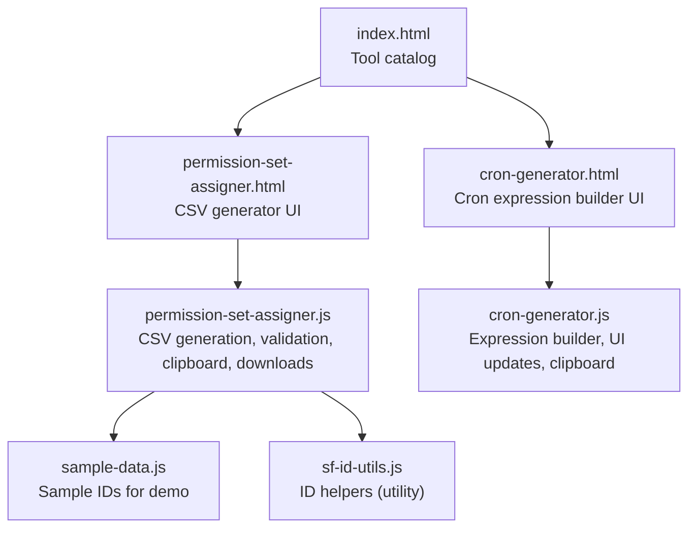
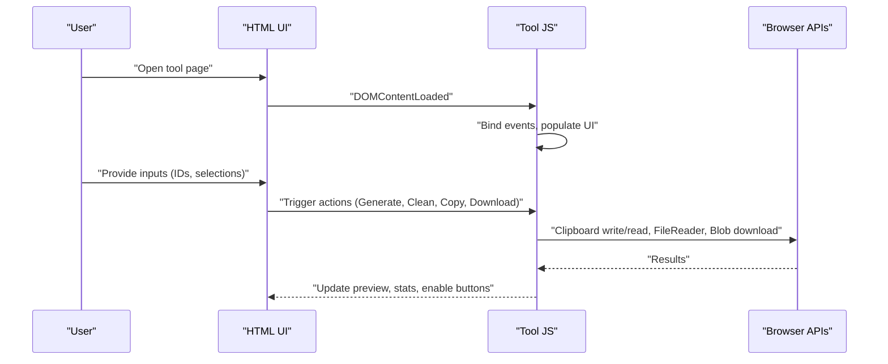
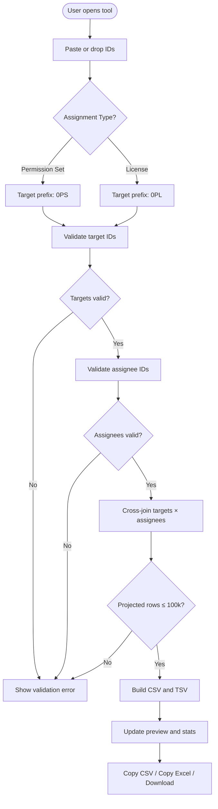
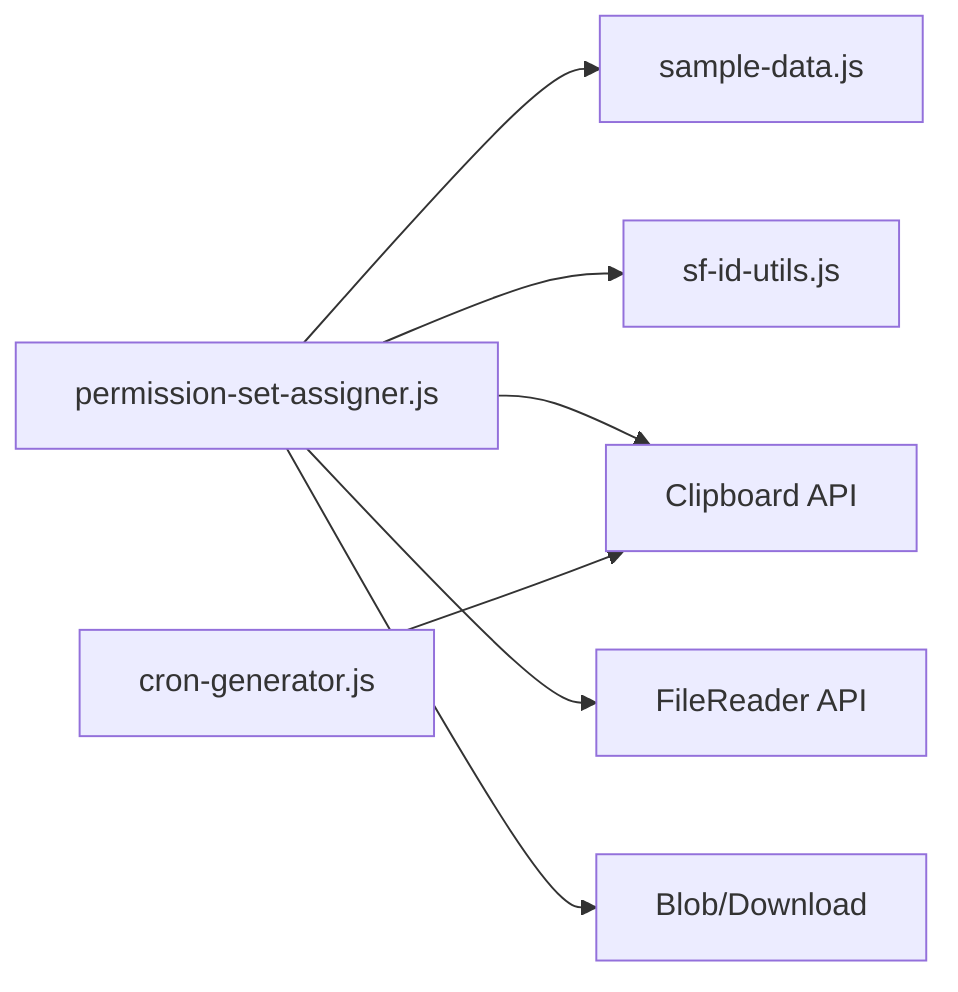

# Administrative Tools

<cite>
**Referenced Files in This Document**
- [README.md](file://README.md)
- [index.html](file://index.html)
- [permission-set-assigner.html](file://permission-set-assigner.html)
- [permission-set-assigner.js](file://permission-set-assigner.js)
- [sample-data.js](file://sample-data.js)
- [cron-generator.html](file://cron-generator.html)
- [cron-generator.js](file://cron-generator.js)
- [sf-id-utils.js](file://sf-id-utils.js)
</cite>

## Table of Contents
1. [Introduction](#introduction)
2. [Project Structure](#project-structure)
3. [Core Components](#core-components)
4. [Architecture Overview](#architecture-overview)
5. [Detailed Component Analysis](#detailed-component-analysis)
6. [Dependency Analysis](#dependency-analysis)
7. [Performance Considerations](#performance-considerations)
8. [Troubleshooting Guide](#troubleshooting-guide)
9. [Conclusion](#conclusion)
10. [Appendices](#appendices)

## Introduction
This document describes the administrative utilities designed for Salesforce administrators. It focuses on:
- Permission Set Assigner: CSV generation, cross-join logic for bulk assignments, clean mode for extracting valid IDs, and license support.
- Cron Generator: Apex scheduling expression builder, expression validation, and formatting options.

These tools are part of a secure, offline-first suite that runs entirely in the browser. They provide practical workflows for preparing assignment files, generating scheduled job expressions, and integrating with Salesforce import processes.

## Project Structure
The project is organized as a set of standalone HTML pages with associated JavaScript logic and shared assets. The administrative tools are:
- Permission Set Assigner: a CSV generator for Permission Set and Permission Set License assignments.
- Cron Generator: a builder for Apex System.schedule() cron expressions.

**Diagram sources**
- [index.html:38-232](file://index.html#L38-L232)
- [permission-set-assigner.html:1-184](file://permission-set-assigner.html#L1-L184)
- [permission-set-assigner.js:1-499](file://permission-set-assigner.js#L1-L499)
- [sample-data.js:1-69](file://sample-data.js#L1-L69)
- [sf-id-utils.js:1-45](file://sf-id-utils.js#L1-L45)
- [cron-generator.html:1-156](file://cron-generator.html#L1-L156)
- [cron-generator.js:1-202](file://cron-generator.js#L1-L202)

**Section sources**
- [README.md:1-63](file://README.md#L1-L63)
- [index.html:38-232](file://index.html#L38-L232)

## Core Components
- Permission Set Assigner
  - Generates CSV files for Permission Set or Permission Set License assignments.
  - Cross-joins multiple targets against multiple assignees.
  - Provides clean mode to extract valid Salesforce IDs from arbitrary text.
  - Supports drag-and-drop file input for assignee IDs.
  - Outputs CSV and tab-separated clipboard content for Excel.

- Cron Generator
  - Builds Apex System.schedule() cron expressions from user selections.
  - Supports hourly, daily, weekly, and monthly frequencies.
  - Validates and formats expressions for immediate use in Apex.

**Section sources**
- [README.md:19-23](file://README.md#L19-L23)
- [permission-set-assigner.html:66-138](file://permission-set-assigner.html#L66-L138)
- [permission-set-assigner.js:201-333](file://permission-set-assigner.js#L201-L333)
- [cron-generator.html:40-146](file://cron-generator.html#L40-L146)
- [cron-generator.js:68-107](file://cron-generator.js#L68-L107)

## Architecture Overview
Both tools are single-page applications with a Bootstrap-based UI and vanilla JavaScript. They rely on local browser APIs for clipboard operations, file reading, and downloads.

**Diagram sources**
- [permission-set-assigner.js:1-403](file://permission-set-assigner.js#L1-L403)
- [cron-generator.js:1-118](file://cron-generator.js#L1-L118)

## Detailed Component Analysis

### Permission Set Assigner
This tool generates CSV files for bulk assignment uploads to Salesforce. It supports:
- Assignment types: Permission Set and Permission Set License.
- Bulk cross-join: Produces rows for every combination of target(s) and assignee(s).
- Clean mode: Extracts valid 15/18-character IDs with correct prefixes.
- Drag-and-drop: Reads a file containing assignee IDs.
- Output: CSV preview, Excel-friendly TSV, and downloadable CSV.

Key behaviors:
- Assignment type toggles change the header and target prefix used in the CSV.
- Validation ensures target and assignee IDs meet Salesforce ID requirements.
- A row count cap prevents overly large outputs.
- Clipboard content is generated as tab-separated for Excel paste.

**Diagram sources**
- [permission-set-assigner.html:66-138](file://permission-set-assigner.html#L66-L138)
- [permission-set-assigner.js:201-333](file://permission-set-assigner.js#L201-L333)

Practical examples:
- Generating assignment files
  - Paste target Permission Set IDs and assignee User IDs.
  - Click Generate to produce CSV and preview.
  - Use Copy as CSV or Copy as Excel to paste into Salesforce import wizard.
  - Use Download to save the CSV file for later import.

- Preparing CSV exports
  - Use Clean on both inputs to extract valid IDs from mixed text.
  - Drag and drop a file containing assignee IDs into the drop zone.
  - Confirm the counts and generate the CSV.

- Creating scheduled job expressions
  - Use the Cron Generator to build a cron expression.
  - Copy the expression and paste it into Apex code for System.schedule.

Integration with Salesforce import processes:
- The generated CSV uses the correct headers for Permission Set or License assignments.
- The TSV variant is suitable for Excel paste operations.
- The row limit enforces a safe upper bound for bulk operations.

User interface patterns and validation:
- Real-time statistics show line counts for inputs.
- Validation messages appear when inputs fail checks.
- Buttons provide feedback on success and errors.
- Tooltips and hints guide correct ID formats.

**Section sources**
- [permission-set-assigner.html:66-176](file://permission-set-assigner.html#L66-L176)
- [permission-set-assigner.js:115-170](file://permission-set-assigner.js#L115-L170)
- [permission-set-assigner.js:201-333](file://permission-set-assigner.js#L201-L333)
- [sample-data.js:38-41](file://sample-data.js#L38-L41)

### Cron Generator
This tool builds Apex System.schedule() cron expressions based on user selections for frequency, time, and optional weekly/monthly specifics. It provides:
- Frequency selection: hourly, daily, weekly, monthly.
- Time selection: hour and minute.
- Weekly days: multiple checkboxes for selected days.
- Monthly day: fixed options or custom numeric day.
- Live preview of the cron expression and Apex code example.
- Copy to clipboard functionality.

**Diagram sources**
- [cron-generator.html:40-146](file://cron-generator.html#L40-L146)
- [cron-generator.js:68-107](file://cron-generator.js#L68-L107)
- [cron-generator.js:115-117](file://cron-generator.js#L115-L117)

Practical examples:
- Building a daily schedule at 09:15
  - Select Daily frequency.
  - Choose hour 09 and minute 15.
  - Copy the expression and use it in Apex System.schedule.

- Scheduling a weekly job on specific days
  - Select Weekly frequency.
  - Check desired days of week.
  - Copy the expression and integrate into Apex.

- Monthly schedules with custom day
  - Select Monthly frequency.
  - Choose Custom and enter a day (1–31).
  - Copy the expression for Apex.

Expression validation and formatting:
- The tool constructs a standard five-field cron expression (seconds, minutes, hours, day-of-month, month, day-of-week).
- Optional year field is omitted for simplicity.
- The UI reflects the expression and an Apex code example for easy copy-paste.

**Section sources**
- [cron-generator.html:40-146](file://cron-generator.html#L40-L146)
- [cron-generator.js:68-107](file://cron-generator.js#L68-L107)

## Dependency Analysis
- Permission Set Assigner depends on:
  - sample-data.js for pre-populating demo IDs.
  - sf-id-utils.js for ID-related utilities (utility module).
  - Bootstrap and custom styles for UI.
  - Clipboard and File APIs for user actions.

- Cron Generator depends on:
  - Bootstrap and custom styles for UI.
  - Clipboard API for copying expressions.

**Diagram sources**
- [permission-set-assigner.js:1-403](file://permission-set-assigner.js#L1-L403)
- [sample-data.js:1-69](file://sample-data.js#L1-L69)
- [sf-id-utils.js:1-45](file://sf-id-utils.js#L1-L45)
- [cron-generator.js:1-118](file://cron-generator.js#L1-L118)

**Section sources**
- [permission-set-assigner.js:1-403](file://permission-set-assigner.js#L1-L403)
- [cron-generator.js:1-118](file://cron-generator.js#L1-L118)

## Performance Considerations
- Permission Set Assigner enforces a maximum projected row count to prevent browser slowdowns during large cross-joins.
- Both tools rely on client-side processing only, avoiding network overhead and ensuring privacy.
- Clipboard operations fall back gracefully if the modern Clipboard API is unavailable.

[No sources needed since this section provides general guidance]

## Troubleshooting Guide
Common issues and resolutions:
- Invalid IDs detected
  - Ensure target and assignee IDs are 15 or 18 characters and start with the correct prefix (0PS for Permission Sets, 0PL for Licenses, 005 for Users).
  - Use Clean to extract valid IDs from mixed text.

- Too many rows generated
  - Reduce the number of targets or assignees to keep the total under the 100,000-row limit.

- Nothing copied to clipboard
  - Try the fallback copy mechanism if the modern Clipboard API fails.
  - Ensure the browser allows clipboard access in your environment.

- Drag-and-drop not working
  - Verify the file is readable and try again.
  - Use the paste area as an alternative.

**Section sources**
- [permission-set-assigner.js:231-269](file://permission-set-assigner.js#L231-L269)
- [permission-set-assigner.js:271-276](file://permission-set-assigner.js#L271-L276)
- [permission-set-assigner.js:448-486](file://permission-set-assigner.js#L448-L486)
- [cron-generator.js:163-201](file://cron-generator.js#L163-L201)

## Conclusion
The administrative utilities streamline common Salesforce admin tasks:
- Permission Set Assigner automates CSV generation for bulk assignments with robust validation and clean mode.
- Cron Generator simplifies building Apex scheduling expressions with a guided UI and live previews.

Together, they offer secure, efficient workflows that integrate directly with Salesforce import processes and Apex scheduling.

[No sources needed since this section summarizes without analyzing specific files]

## Appendices

### Appendix A: Permission Set Assigner Data Processing Workflow
- Input parsing: Split by line and trim entries.
- Validation: Check length and prefix for each ID category.
- Cross-join: Produce rows for every target × assignee combination.
- Output: CSV and TSV variants; enforce row limit; update UI stats.

**Section sources**
- [permission-set-assigner.js:201-333](file://permission-set-assigner.js#L201-L333)

### Appendix B: Cron Generator Expression Builder
- Frequency and time selection drive the cron construction.
- Weekly and monthly options adjust day-of-week and day-of-month fields.
- Live preview updates as selections change.

**Section sources**
- [cron-generator.js:68-107](file://cron-generator.js#L68-L107)