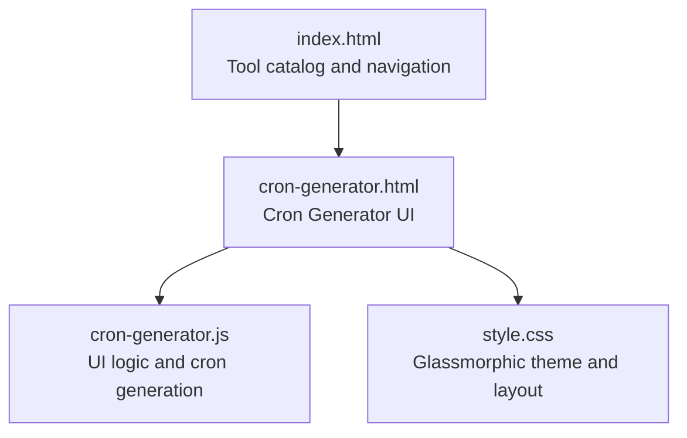
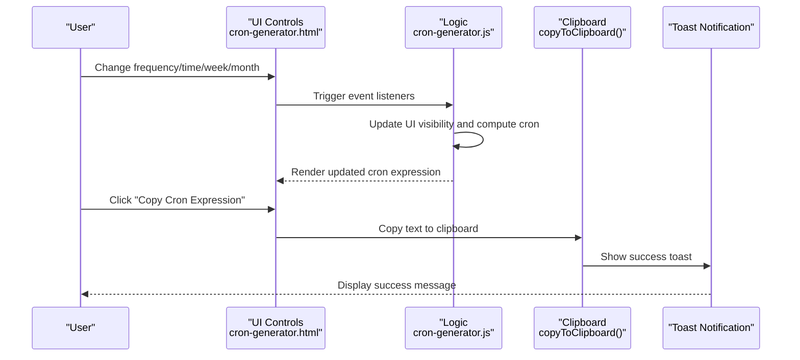
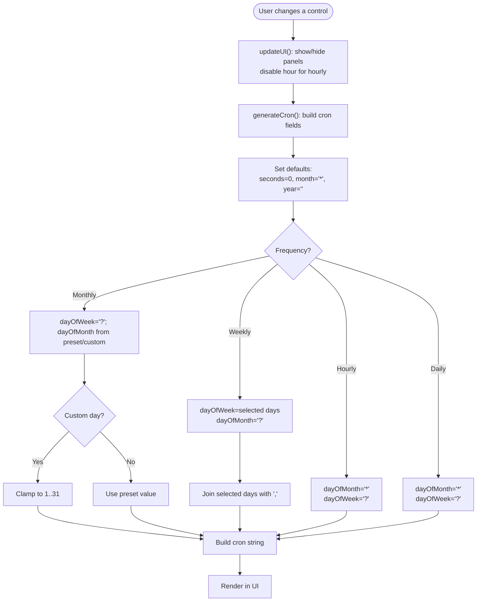
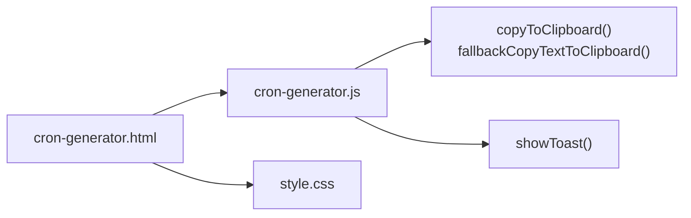

# Cron Generator

<cite>
**Referenced Files in This Document**
- [cron-generator.html](file://cron-generator.html)
- [cron-generator.js](file://cron-generator.js)
- [index.html](file://index.html)
- [style.css](file://style.css)
</cite>

## Table of Contents
1. [Introduction](#introduction)
2. [Project Structure](#project-structure)
3. [Core Components](#core-components)
4. [Architecture Overview](#architecture-overview)
5. [Detailed Component Analysis](#detailed-component-analysis)
6. [Dependency Analysis](#dependency-analysis)
7. [Performance Considerations](#performance-considerations)
8. [Troubleshooting Guide](#troubleshooting-guide)
9. [Conclusion](#conclusion)
10. [Appendices](#appendices)

## Introduction
The Cron Generator is a browser-based utility that helps developers create Apex scheduling expressions compatible with Salesforce’s System.schedule method. It provides a simple, visual interface to configure minute, hour, day, month, and day-of-week parameters, and generates a valid cron expression in real time. The tool emphasizes usability and immediate feedback, with live updates and a copy-to-clipboard action.

## Project Structure
The Cron Generator is implemented as a standalone HTML page with embedded JavaScript and shared styles. It integrates with the broader Dev Utils suite, which runs entirely in the browser and stores preferences locally.

**Diagram sources**
- [index.html:189-203](file://index.html#L189-L203)
- [cron-generator.html:1-156](file://cron-generator.html#L1-L156)
- [cron-generator.js:1-202](file://cron-generator.js#L1-L202)
- [style.css:1-293](file://style.css#L1-L293)

**Section sources**
- [index.html:1-406](file://index.html#L1-L406)
- [cron-generator.html:1-156](file://cron-generator.html#L1-L156)
- [cron-generator.js:1-202](file://cron-generator.js#L1-L202)
- [style.css:1-293](file://style.css#L1-L293)

## Core Components
- Frequency selector: Allows choosing hourly, daily, weekly, or monthly schedules.
- Time selection: Hour and minute dropdowns; hour is disabled for hourly frequency.
- Weekly options: Multi-select checkboxes for days of the week.
- Monthly options: Day-of-month presets and a custom numeric input.
- Output panel: Displays the generated cron expression and an Apex example snippet.
- Copy button: Copies the cron expression to the clipboard with a toast notification.

Key behaviors:
- Real-time updates: Changing any input immediately regenerates the cron expression.
- Conditional UI: Weekly and monthly option panels appear based on frequency selection.
- Validation: Basic sanitization for custom day-of-month input (clamps to 1–31).
- Formatting: Outputs a five-field cron expression suitable for Salesforce Apex.

**Section sources**
- [cron-generator.html:44-127](file://cron-generator.html#L44-L127)
- [cron-generator.js:30-118](file://cron-generator.js#L30-L118)

## Architecture Overview
The Cron Generator follows a straightforward client-side architecture:
- HTML defines the UI and binds to JavaScript event handlers.
- JavaScript manages UI state, computes cron expressions, and handles user actions.
- CSS provides a cohesive, glassmorphic theme.

**Diagram sources**
- [cron-generator.html:30-44](file://cron-generator.html#L30-L44)
- [cron-generator.js:30-118](file://cron-generator.js#L30-L118)
- [cron-generator.js:163-201](file://cron-generator.js#L163-L201)

## Detailed Component Analysis

### Expression Builder Interface
The interface is organized into two main panels:
- Schedule Configuration: Job name, frequency, time, and optional weekly/monthly options.
- Result Panel: Displays the cron expression and an Apex example, with a copy action.

User interactions:
- Frequency change toggles visibility of weekly/monthly options and disables hour selection for hourly mode.
- Weekly selection builds a comma-separated day-of-week field.
- Monthly selection supports presets (1st, 15th, last day) and a custom numeric day (validated to 1–31).
- Real-time updates occur on minute, hour, weekly checkbox, and monthly selection changes.

**Diagram sources**
- [cron-generator.js:46-107](file://cron-generator.js#L46-L107)

**Section sources**
- [cron-generator.html:44-127](file://cron-generator.html#L44-L127)
- [cron-generator.js:30-118](file://cron-generator.js#L30-L118)

### Validation Logic and Constraints
- Hour selection is disabled for hourly frequency to prevent invalid combinations.
- Weekly day-of-week is a comma-separated list of selected days; if none selected, falls back to wildcard.
- Monthly day-of-month accepts presets or a custom numeric value; custom values are clamped to 1–31.
- The generator sets seconds to zero and month to wildcard, and omits the year field to match typical Apex usage.

These rules ensure generated expressions conform to the five-field cron format and avoid conflicting fields.

**Section sources**
- [cron-generator.js:46-107](file://cron-generator.js#L46-L107)

### Formatting and Display
- The cron expression is rendered in a large, monospace code block for clarity.
- An Apex example snippet shows how to use the expression with System.schedule, including the job name.
- The job name input updates the Apex example dynamically.

Formatting highlights:
- Monospace font for the expression.
- Clear separation between configuration and output.
- Immediate visual feedback on changes.

**Section sources**
- [cron-generator.html:131-146](file://cron-generator.html#L131-L146)
- [cron-generator.js:109-112](file://cron-generator.js#L109-L112)

### User Interface Components
- Dropdown selectors:
  - Frequency: hourly, daily, weekly, monthly.
  - Hour: populated programmatically with 0–23.
  - Minute: predefined quarter-hour increments.
  - Day-of-month: presets plus custom numeric input.
- Checkboxes: Days of the week for weekly selection.
- Input fields: Job name and custom day-of-month numeric input.
- Validation indicators: None are shown; basic sanitization is performed internally.

Accessibility and UX:
- Bootstrap-based layout with responsive grid.
- Glassmorphic design with dark theme and subtle animations.
- Immediate feedback on changes.

**Section sources**
- [cron-generator.html:46-126](file://cron-generator.html#L46-L126)
- [cron-generator.js:21-28](file://cron-generator.js#L21-L28)

### Practical Examples
Below are common scheduling patterns generated by the tool. Replace placeholders with your own values.

- Hourly at minute 0
  - Frequency: Hourly
  - Minute: 0
  - Result: seconds=0, minute=0, hour=*, dayOfMonth=*, month=*, dayOfWeek='?'
  - Expression: 0 0 * * * ?
  - Apex example: String cronExp = '0 0 * * * ?'; System.schedule('Your Job Name', cronExp, new YourSchedulableClass());

- Daily at 9:15 AM
  - Frequency: Daily
  - Hour: 9, Minute: 15
  - Result: 0 15 9 * * ?
  - Apex example: String cronExp = '0 15 9 * * ?'; System.schedule('Your Job Name', cronExp, new YourSchedulableClass());

- Weekly on Tuesdays and Thursdays at 14:30
  - Frequency: Weekly
  - Select: TUE, THU
  - Result: 0 30 14 ? * TUE,THU
  - Apex example: String cronExp = '0 30 14 ? * TUE,THU'; System.schedule('Your Job Name', cronExp, new YourSchedulableClass());

- Monthly on the 15th at 00:00
  - Frequency: Monthly
  - Day-of-month: 15
  - Result: 0 0 0 15 * ?
  - Apex example: String cronExp = '0 0 0 15 * ?'; System.schedule('Your Job Name', cronExp, new YourSchedulableClass());

- Monthly on the last day at 18:45
  - Frequency: Monthly
  - Day-of-month: Last day
  - Result: 0 45 18 L * ?
  - Apex example: String cronExp = '0 45 18 L * ?'; System.schedule('Your Job Name', cronExp, new YourSchedulableClass());

- Monthly on a custom day (e.g., day 28) at 12:00
  - Frequency: Monthly
  - Day-of-month: Custom, value 28
  - Result: 0 0 12 28 * ?
  - Apex example: String cronExp = '0 0 12 28 * ?'; System.schedule('Your Job Name', cronExp, new YourSchedulableClass());

Notes:
- The tool sets seconds to 0 and month to wildcard, and omits the year field.
- Day-of-week uses the standard three-letter abbreviations (SUN, MON, TUE, WED, THU, FRI, SAT).

**Section sources**
- [cron-generator.js:68-107](file://cron-generator.js#L68-L107)

### Underlying Algorithms and Generation Logic
- Field defaults:
  - seconds: 0
  - month: wildcard
  - year: omitted
- Frequency-specific rules:
  - Hourly: dayOfMonth='*', dayOfWeek='?'
  - Daily: dayOfMonth='*', dayOfWeek='?'
  - Weekly: dayOfMonth='?', dayOfWeek is a comma-separated list of selected days
  - Monthly: dayOfWeek='?', dayOfMonth from preset or custom value
- Custom day-of-month sanitization:
  - If custom value is outside 1–31, it is clamped to 1.

Complexity:
- UI updates are O(n) in the number of checked boxes for weekly selection.
- Expression building is O(1) with constant-time concatenation.

Edge cases handled:
- Disabled hour for hourly frequency prevents invalid combinations.
- Weekly selection falls back to wildcard if no days are selected.
- Monthly custom input is sanitized to a valid range.

**Section sources**
- [cron-generator.js:68-107](file://cron-generator.js#L68-L107)

### Error Handling and Edge Cases
- No explicit validation messages are shown; the UI remains functional and informative.
- Custom day-of-month input is sanitized to 1–31; invalid inputs are coerced to 1.
- Weekly selection without any days selected yields a wildcard for day-of-week.
- Hourly frequency disables hour selection to avoid conflicts.

Limitations:
- The tool does not validate that the resulting cron expression is executable by Salesforce; it produces a syntactically valid five-field expression.
- The year field is omitted; if a yearly schedule is required, it must be constructed externally.

**Section sources**
- [cron-generator.js:94-99](file://cron-generator.js#L94-L99)
- [cron-generator.js:87-90](file://cron-generator.js#L87-L90)
- [cron-generator.js:53-57](file://cron-generator.js#L53-L57)

### Integration with Salesforce’s Scheduled Job System
- The generated expression follows the five-field cron format expected by Apex’s System.schedule.
- The Apex example snippet demonstrates how to pass the expression and job name to System.schedule.
- The tool does not connect to Salesforce; it is purely a local utility for constructing expressions.

**Section sources**
- [cron-generator.html:137-141](file://cron-generator.html#L137-L141)

## Dependency Analysis
The Cron Generator has minimal dependencies:
- HTML provides the UI structure and binds to JavaScript.
- JavaScript encapsulates all logic for UI updates and cron generation.
- CSS provides the visual theme and layout.

**Diagram sources**
- [cron-generator.html:1-156](file://cron-generator.html#L1-L156)
- [cron-generator.js:1-202](file://cron-generator.js#L1-L202)
- [style.css:1-293](file://style.css#L1-L293)

**Section sources**
- [cron-generator.js:163-201](file://cron-generator.js#L163-L201)
- [cron-generator.js:122-161](file://cron-generator.js#L122-L161)

## Performance Considerations
- The tool performs lightweight DOM updates and string concatenation; performance impact is negligible.
- Event listeners are attached to a small set of controls; no heavy computations occur on user input.
- Clipboard operations use the modern Clipboard API with a fallback to execCommand for compatibility.

Recommendations:
- Keep the number of weekly checkboxes low; the tool iterates over them to build the day-of-week list.
- Avoid extremely long job names; they are reflected in the Apex example but do not affect cron validity.

[No sources needed since this section provides general guidance]

## Troubleshooting Guide
Common issues and resolutions:
- Hourly frequency still allows selecting an hour:
  - The hour dropdown is disabled for hourly mode; ensure the frequency is set to hourly.
- Weekly schedule not applying:
  - Select at least one day of the week; otherwise, day-of-week becomes a wildcard.
- Monthly schedule not working:
  - For custom day, ensure the value is between 1 and 31; values outside this range are clamped to 1.
- Copy button fails:
  - The tool attempts Clipboard API first; if unavailable, it falls back to a text area and execCommand. If both fail, check browser permissions and console errors.

**Section sources**
- [cron-generator.js:53-57](file://cron-generator.js#L53-L57)
- [cron-generator.js:87-90](file://cron-generator.js#L87-L90)
- [cron-generator.js:94-99](file://cron-generator.js#L94-L99)
- [cron-generator.js:163-201](file://cron-generator.js#L163-L201)

## Conclusion
The Cron Generator provides a fast, reliable way to construct Apex scheduling expressions. Its clean UI, real-time updates, and robust sanitization make it easy to produce valid cron expressions for hourly, daily, weekly, and monthly schedules. While it does not validate against Salesforce-specific constraints, it generates syntactically correct five-field expressions suitable for System.schedule.

## Appendices

### UI Component Reference
- Job Name: Text input; updates the Apex example.
- Frequency: Select dropdown with options for hourly, daily, weekly, monthly.
- Time: Hour and minute dropdowns; hour disabled for hourly frequency.
- Weekly Options: Seven checkboxes for days of the week.
- Monthly Options: Day-of-month select with presets and a custom numeric input.
- Output: Large code block displaying the cron expression and an Apex example.
- Copy Button: Copies the cron expression to the clipboard with a toast notification.

**Section sources**
- [cron-generator.html:44-146](file://cron-generator.html#L44-L146)
- [cron-generator.js:30-118](file://cron-generator.js#L30-L118)