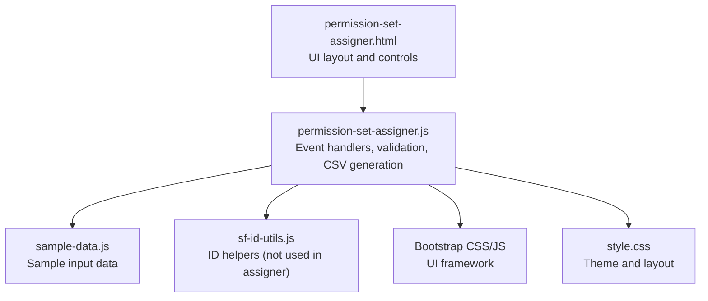
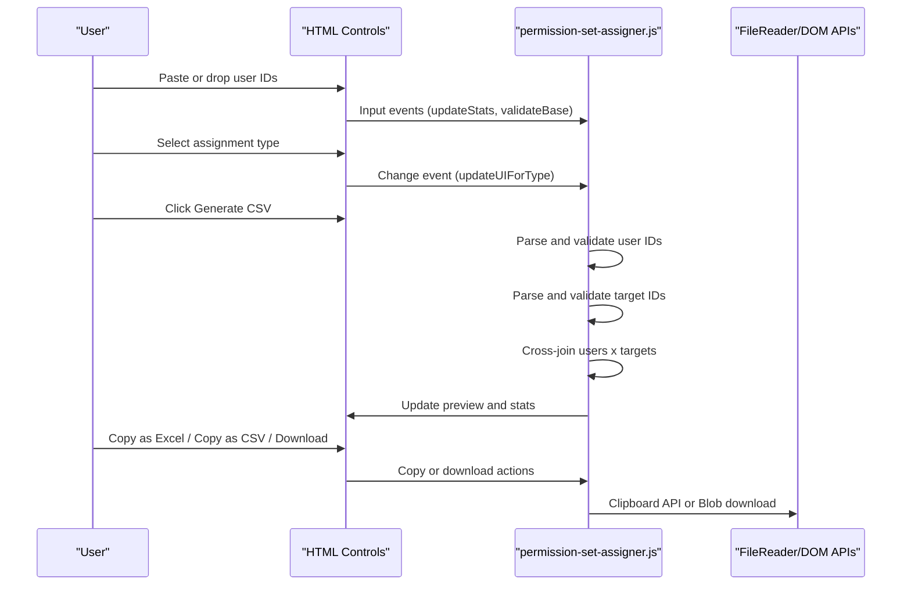
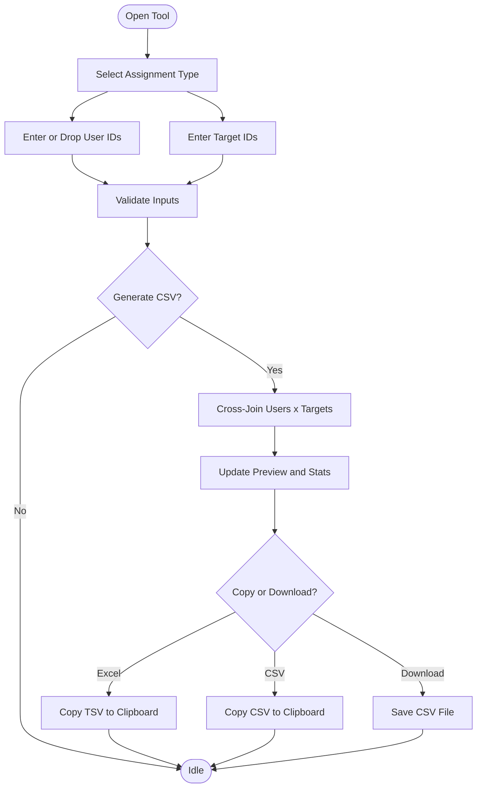
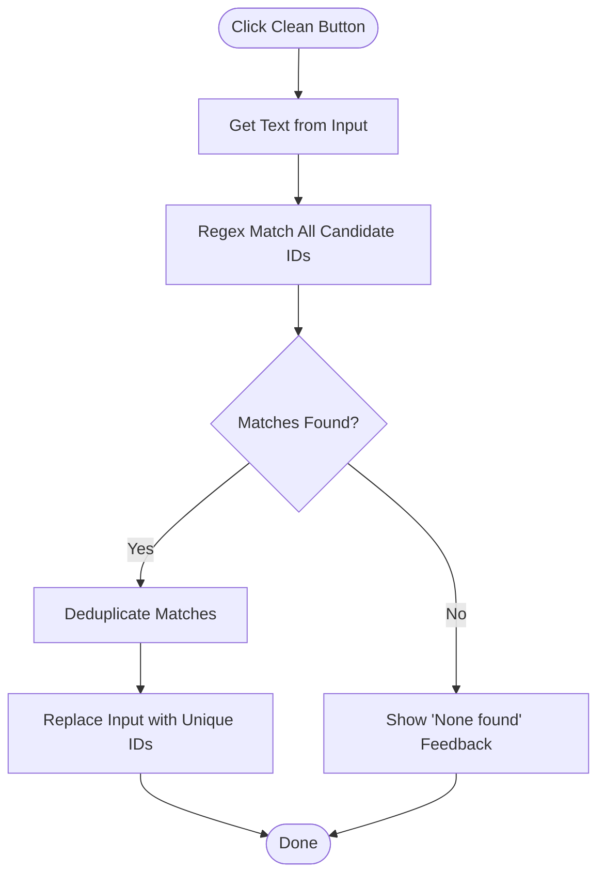
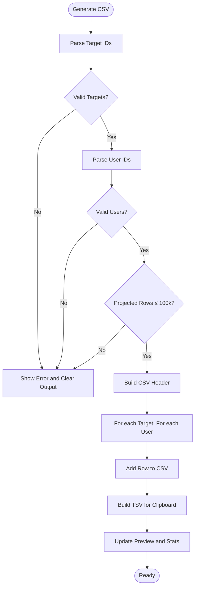
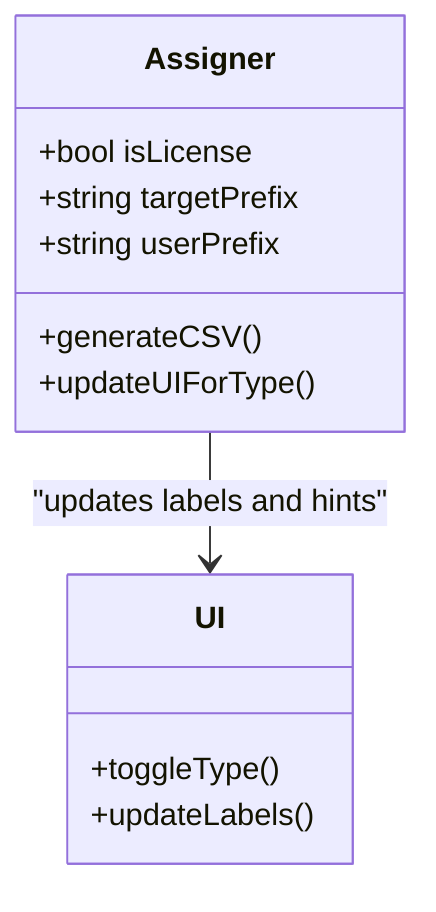
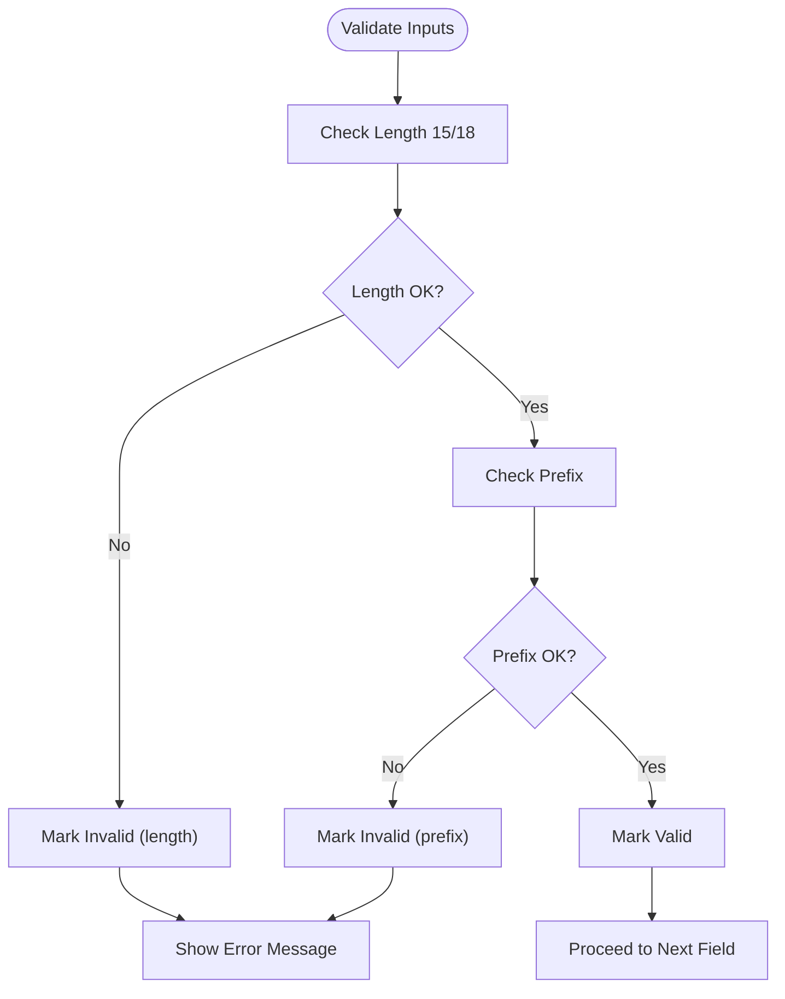
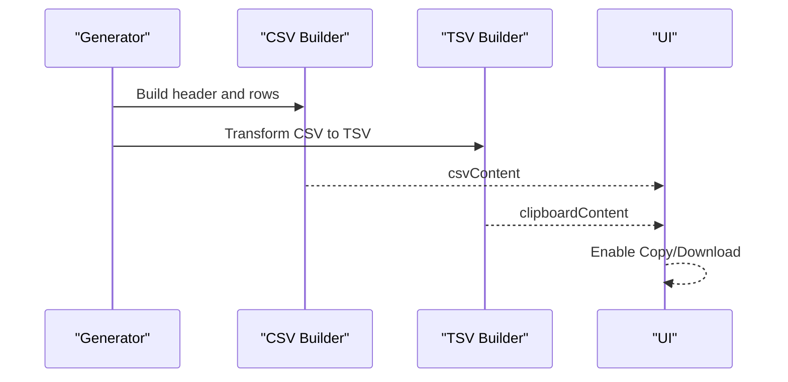
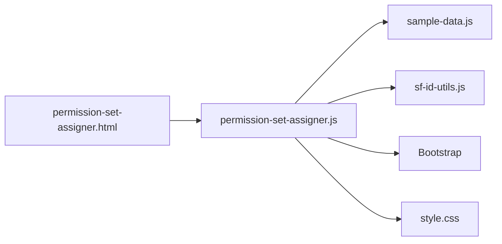

# Permission Set Assigner

<cite>
**Referenced Files in This Document**
- [permission-set-assigner.html](file://permission-set-assigner.html)
- [permission-set-assigner.js](file://permission-set-assigner.js)
- [sf-id-utils.js](file://sf-id-utils.js)
- [sample-data.js](file://sample-data.js)
- [README.md](file://README.md)
</cite>

## Table of Contents
1. [Introduction](#introduction)
2. [Project Structure](#project-structure)
3. [Core Components](#core-components)
4. [Architecture Overview](#architecture-overview)
5. [Detailed Component Analysis](#detailed-component-analysis)
6. [Dependency Analysis](#dependency-analysis)
7. [Performance Considerations](#performance-considerations)
8. [Troubleshooting Guide](#troubleshooting-guide)
9. [Conclusion](#conclusion)
10. [Appendices](#appendices)

## Introduction
The Permission Set Assigner is a browser-based utility that generates CSV files for bulk assigning Permission Sets or Permission Set Licenses to users in Salesforce. It supports:
- Cross-join logic to produce all combinations of users and targets
- Clean mode to extract valid Salesforce IDs from mixed input
- Assignment type selection between Permission Set and Permission Set License
- Drag-and-drop file upload for user IDs
- Real-time validation and output preview
- Clipboard and download actions for downstream integration with Salesforce’s bulk import processes

## Project Structure
The tool is implemented as a single-page application with HTML, CSS, and JavaScript. It relies on a shared sample data module and a small utility library for Salesforce ID validation and conversion.

**Diagram sources**
- [permission-set-assigner.html:1-184](file://permission-set-assigner.html#L1-L184)
- [permission-set-assigner.js:1-499](file://permission-set-assigner.js#L1-L499)
- [sample-data.js:1-69](file://sample-data.js#L1-L69)
- [sf-id-utils.js:1-45](file://sf-id-utils.js#L1-L45)

**Section sources**
- [permission-set-assigner.html:1-184](file://permission-set-assigner.html#L1-L184)
- [permission-set-assigner.js:1-499](file://permission-set-assigner.js#L1-L499)
- [sample-data.js:1-69](file://sample-data.js#L1-L69)
- [sf-id-utils.js:1-45](file://sf-id-utils.js#L1-L45)
- [README.md:19-23](file://README.md#L19-L23)

## Core Components
- UI container and form controls for user IDs, permission set IDs, and action buttons
- Assignment type toggle between Permission Set and Permission Set License
- Validation and statistics counters for input lines and output rows
- CSV generation engine that performs cross-join and applies row limits
- Clipboard and download utilities for exporting results
- Drag-and-drop handler for loading user IDs from files

Key behaviors:
- Clean mode extracts valid IDs from arbitrary text using prefix and length rules
- Assignment type determines header and record format
- Output preview updates immediately after generation
- Large result sets are rejected to protect browser performance

**Section sources**
- [permission-set-assigner.html:66-176](file://permission-set-assigner.html#L66-L176)
- [permission-set-assigner.js:131-333](file://permission-set-assigner.js#L131-L333)

## Architecture Overview
The application follows a straightforward event-driven architecture:
- DOMContentLoaded initializes UI and attaches listeners
- User actions trigger validation and generation
- Generation produces CSV and TSV content for preview and clipboard
- Output is presented in a read-only preview with copy/download actions

**Diagram sources**
- [permission-set-assigner.html:66-176](file://permission-set-assigner.html#L66-L176)
- [permission-set-assigner.js:63-127](file://permission-set-assigner.js#L63-L127)
- [permission-set-assigner.js:201-333](file://permission-set-assigner.js#L201-L333)
- [permission-set-assigner.js:448-498](file://permission-set-assigner.js#L448-L498)

## Detailed Component Analysis

### UI Layout and Controls
- Assignment Type: Radio buttons toggle between Permission Set and Permission Set License modes
- User IDs Input: Text area with drag-and-drop zone, sample loader, clean, and clear actions
- Permission Set IDs Input: Text area with clean and clear actions; label and hint reflect selected type
- Action Panel: Generate CSV button, validation message area
- Output Preview: Read-only text area with row count and copy/download controls

**Diagram sources**
- [permission-set-assigner.html:66-176](file://permission-set-assigner.html#L66-L176)
- [permission-set-assigner.js:201-333](file://permission-set-assigner.js#L201-L333)

**Section sources**
- [permission-set-assigner.html:66-176](file://permission-set-assigner.html#L66-L176)

### Clean Mode: Extracting Valid IDs
Clean mode uses a regular expression to extract candidate IDs from user-provided text:
- Pattern matches 15 or 18-character alphanumeric strings
- Prefix depends on assignment type: 005 for users, 0PS for Permission Sets, 0PL for Licenses
- Results are deduplicated and reinserted into the respective input field
- Visual feedback indicates success or “None found”

**Diagram sources**
- [permission-set-assigner.js:131-170](file://permission-set-assigner.js#L131-L170)

**Section sources**
- [permission-set-assigner.js:131-170](file://permission-set-assigner.js#L131-L170)

### CSV Generation Workflow and Cross-Join Logic
The generator:
- Validates target IDs against length and prefix rules
- Validates user IDs against length and prefix rules
- Enforces a maximum projected row count to prevent browser overload
- Produces a CSV header and iterates over all combinations of users and targets
- Generates a TSV variant for Excel-friendly copying

**Diagram sources**
- [permission-set-assigner.js:201-333](file://permission-set-assigner.js#L201-L333)

**Section sources**
- [permission-set-assigner.js:201-333](file://permission-set-assigner.js#L201-L333)

### Assignment Type and License Support
- Permission Set mode: Uses 0PS prefix for targets and “PermissionSetId” header
- Permission Set License mode: Uses 0PL prefix for targets and “PermissionSetLicenseId” header
- UI updates dynamically to reflect the selected mode (label, hint, and validation)

**Diagram sources**
- [permission-set-assigner.js:172-182](file://permission-set-assigner.js#L172-L182)
- [permission-set-assigner.js:201-305](file://permission-set-assigner.js#L201-L305)

**Section sources**
- [permission-set-assigner.js:172-182](file://permission-set-assigner.js#L172-L182)
- [permission-set-assigner.js:201-305](file://permission-set-assigner.js#L201-L305)

### Data Validation and Error Handling
- Input validation checks:
  - Length: 15 or 18 characters
  - Prefix: 005 for users, 0PS for Permission Sets, 0PL for Licenses
- Error messages are displayed and the output is cleared
- A hard cap of 100,000 rows prevents browser freezing
- Visual feedback is provided for copy actions and button state changes

**Diagram sources**
- [permission-set-assigner.js:209-269](file://permission-set-assigner.js#L209-L269)
- [permission-set-assigner.js:335-344](file://permission-set-assigner.js#L335-L344)

**Section sources**
- [permission-set-assigner.js:209-269](file://permission-set-assigner.js#L209-L269)
- [permission-set-assigner.js:335-344](file://permission-set-assigner.js#L335-L344)

### Output Formatting and Integration with Salesforce
- CSV header differs by assignment type:
  - Permission Set: “AssigneeId”, “PermissionSetId”
  - Permission Set License: “AssigneeId”, “PermissionSetLicenseId”
- Rows follow the format: “[RecordType]”, “AssigneeId”, “TargetId”
- Clipboard content is a tab-separated variant (TSV) for Excel compatibility
- Download saves a .csv file suitable for Salesforce’s bulk import

**Diagram sources**
- [permission-set-assigner.js:278-333](file://permission-set-assigner.js#L278-L333)

**Section sources**
- [permission-set-assigner.js:278-333](file://permission-set-assigner.js#L278-L333)

### Practical Examples
- Generate assignment CSV:
  - Paste user IDs into the left panel
  - Paste target IDs into the right panel
  - Select assignment type
  - Click Generate CSV
  - Copy as Excel or CSV, or download the file
- Handling different ID formats:
  - Clean mode extracts valid IDs from mixed input
  - Drag-and-drop loads a file containing user IDs
  - Sample data can be loaded for quick testing
- Integrating with Salesforce:
  - Use the downloaded CSV for bulk import
  - Ensure RecordType and headers match the target object

**Section sources**
- [permission-set-assigner.html:44-61](file://permission-set-assigner.html#L44-L61)
- [permission-set-assigner.js:44-61](file://permission-set-assigner.js#L44-L61)
- [sample-data.js:38-41](file://sample-data.js#L38-L41)

## Dependency Analysis
- permission-set-assigner.html: Provides UI structure and references to scripts and styles
- permission-set-assigner.js: Implements all logic, including validation, generation, clipboard, and download
- sample-data.js: Supplies sample input for demonstration and testing
- sf-id-utils.js: Utility library for ID validation/conversion (not used by the assigner)

**Diagram sources**
- [permission-set-assigner.html:179-181](file://permission-set-assigner.html#L179-L181)
- [permission-set-assigner.js:1-403](file://permission-set-assigner.js#L1-L403)
- [sample-data.js:1-69](file://sample-data.js#L1-L69)
- [sf-id-utils.js:1-45](file://sf-id-utils.js#L1-L45)

**Section sources**
- [permission-set-assigner.html:179-181](file://permission-set-assigner.html#L179-L181)
- [permission-set-assigner.js:1-403](file://permission-set-assigner.js#L1-L403)
- [sample-data.js:1-69](file://sample-data.js#L1-L69)
- [sf-id-utils.js:1-45](file://sf-id-utils.js#L1-L45)

## Performance Considerations
- Row limit: The generator enforces a maximum projected row count of 100,000 to prevent browser memory issues
- Memory management: CSV and TSV content are built in arrays and joined once; clipboard content is derived from CSV
- Large datasets: Prefer smaller batches to stay under the limit; use Clean mode to reduce noise and duplicates
- Browser performance: Avoid extremely large inputs; keep the number of users and targets balanced

[No sources needed since this section provides general guidance]

## Troubleshooting Guide
Common issues and resolutions:
- Invalid IDs shown in errors:
  - Verify length (15 or 18) and correct prefix (005 for users, 0PS for Permission Sets, 0PL for Licenses)
  - Use Clean mode to extract valid IDs from mixed input
- Too many rows:
  - Reduce the number of users or targets to keep the product under 100,000 rows
- No output:
  - Ensure both user and target inputs are present and valid
  - Confirm assignment type matches the target IDs
- Copy/download failures:
  - Use HTTPS context for clipboard operations
  - Try copying as CSV if Excel format fails

**Section sources**
- [permission-set-assigner.js:231-239](file://permission-set-assigner.js#L231-L239)
- [permission-set-assigner.js:261-269](file://permission-set-assigner.js#L261-L269)
- [permission-set-assigner.js:271-276](file://permission-set-assigner.js#L271-L276)
- [permission-set-assigner.js:335-344](file://permission-set-assigner.js#L335-L344)

## Conclusion
The Permission Set Assigner streamlines bulk assignment creation for Salesforce by combining robust validation, cross-join logic, and user-friendly export options. Its clean mode and drag-and-drop features make it easy to prepare high-quality input data, while safeguards protect performance for large datasets. The resulting CSV integrates directly with Salesforce’s bulk import processes.

[No sources needed since this section summarizes without analyzing specific files]

## Appendices

### UI Component Reference
- Assignment Type: Radio buttons for Permission Set vs Permission Set License
- User IDs Input: Text area with drag zone, sample loader, clean, and clear
- Permission Set IDs Input: Text area with clean and clear
- Action Panel: Generate CSV, validation message
- Output Preview: Read-only text area with row count and copy/download controls

**Section sources**
- [permission-set-assigner.html:66-176](file://permission-set-assigner.html#L66-L176)

### Assignment Type Behavior
- Permission Set mode:
  - Target prefix: 0PS
  - Header: “AssigneeId”, “PermissionSetId”
- Permission Set License mode:
  - Target prefix: 0PL
  - Header: “AssigneeId”, “PermissionSetLicenseId”

**Section sources**
- [permission-set-assigner.js:172-182](file://permission-set-assigner.js#L172-L182)
- [permission-set-assigner.js:281-287](file://permission-set-assigner.js#L281-L287)

### Clean Mode Details
- Extracts candidate IDs using a regex pattern for 15 or 18-character alphanumeric strings
- Applies prefix filtering based on assignment type
- Deduplicates results and replaces the input field content
- Provides visual feedback for success or “None found”

**Section sources**
- [permission-set-assigner.js:131-170](file://permission-set-assigner.js#L131-L170)

### CSV Generation Notes
- Header format varies by assignment type
- Records follow the format: “[RecordType]”, “AssigneeId”, “TargetId”
- TSV variant is generated for Excel-friendly copying
- Download saves a .csv file with UTF-8 encoding

**Section sources**
- [permission-set-assigner.js:278-333](file://permission-set-assigner.js#L278-L333)
- [permission-set-assigner.js:488-498](file://permission-set-assigner.js#L488-L498)