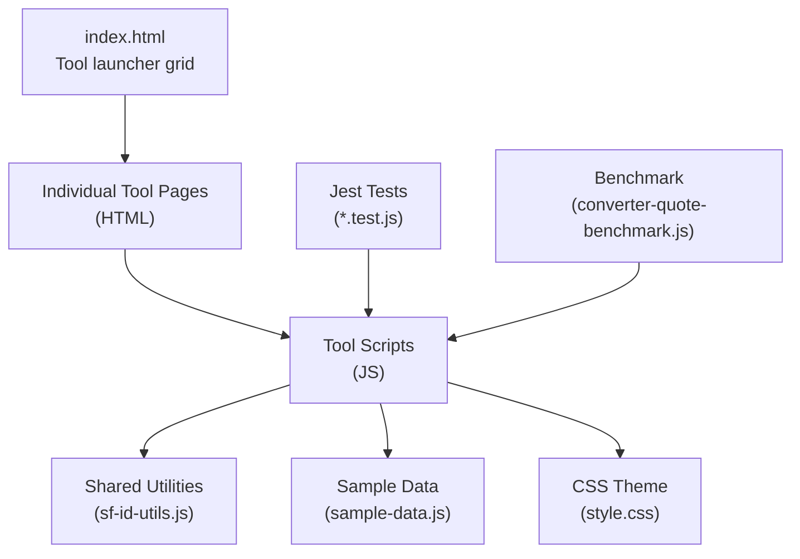
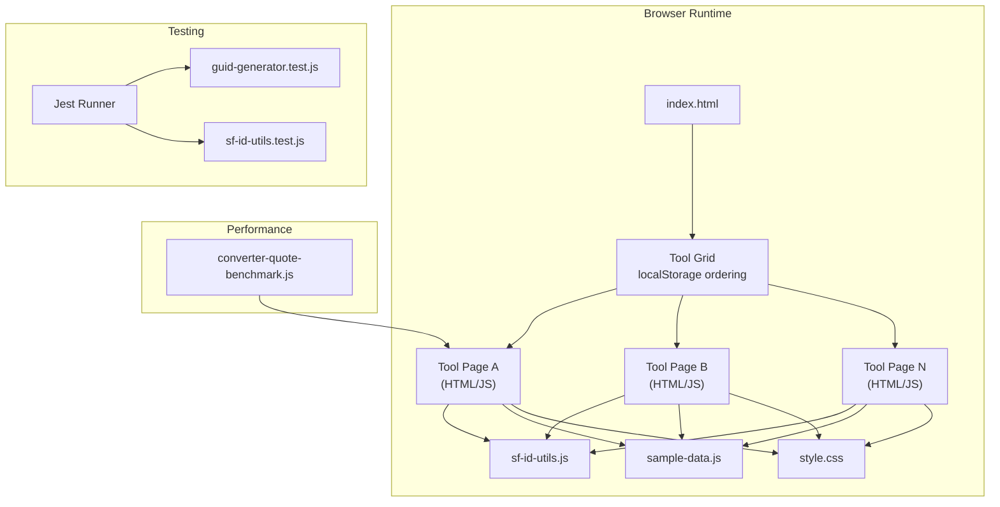
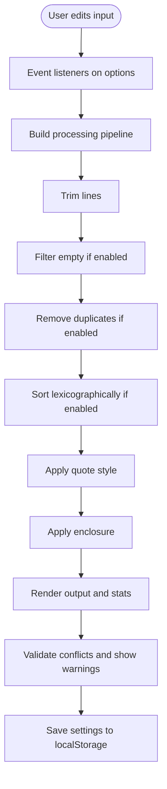
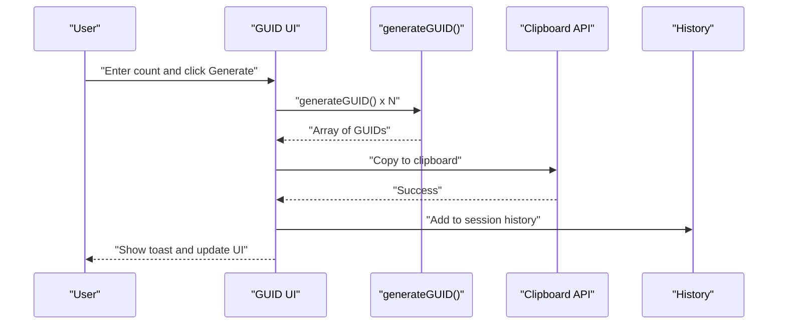
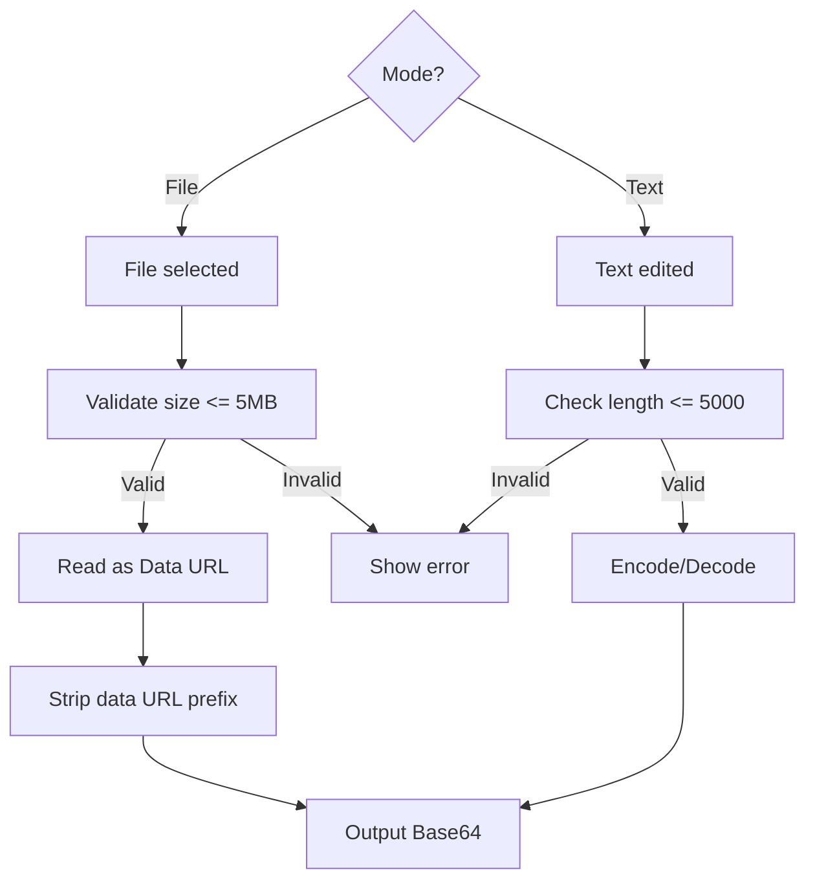
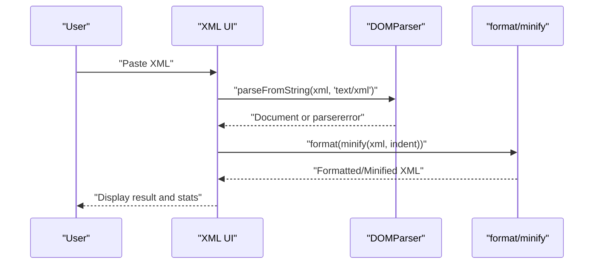
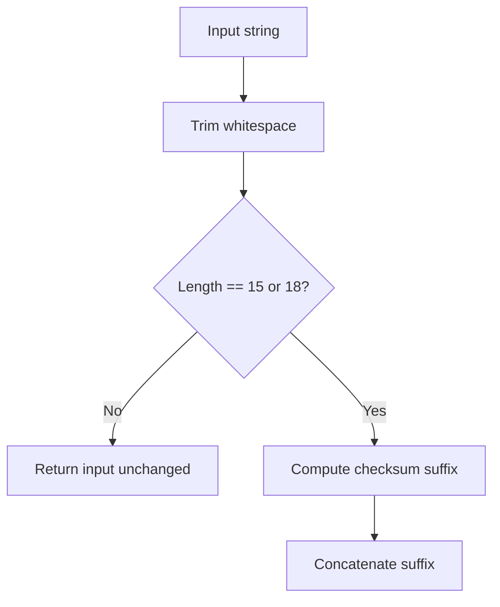
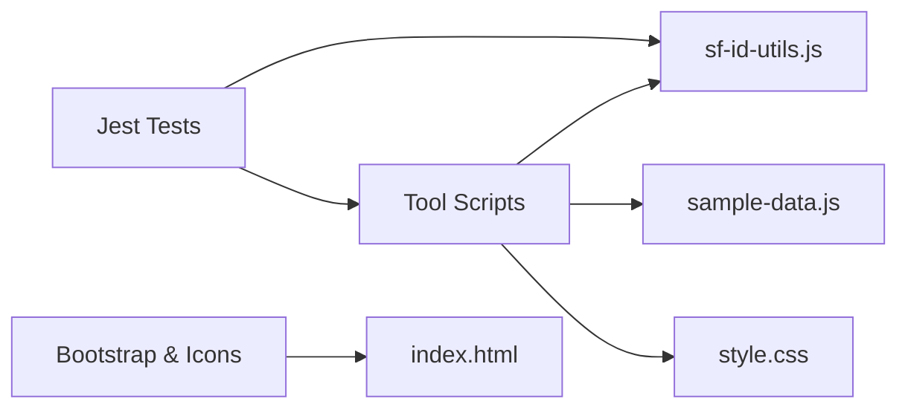

# Contributing and Development

<cite>
**Referenced Files in This Document**
- [README.md](file://README.md)
- [DESIGN.md](file://DESIGN.md)
- [package.json](file://package.json)
- [index.html](file://index.html)
- [style.css](file://style.css)
- [converter.js](file://converter.js)
- [guid-generator.js](file://guid-generator.js)
- [guid-generator.test.js](file://guid-generator.test.js)
- [sf-id-utils.js](file://sf-id-utils.js)
- [sf-id-utils.test.js](file://sf-id-utils.test.js)
- [base64-converter.js](file://base64-converter.js)
- [xml-formatter.js](file://xml-formatter.js)
- [sample-data.js](file://sample-data.js)
- [benchmarks/converter-quote-benchmark.js](file://benchmarks/converter-quote-benchmark.js)
- [fix_sample_data.js](file://fix_sample_data.js)
</cite>

## Table of Contents
1. [Introduction](#introduction)
2. [Project Structure](#project-structure)
3. [Core Components](#core-components)
4. [Architecture Overview](#architecture-overview)
5. [Detailed Component Analysis](#detailed-component-analysis)
6. [Dependency Analysis](#dependency-analysis)
7. [Performance Considerations](#performance-considerations)
8. [Testing Strategy](#testing-strategy)
9. [Development Environment Setup](#development-environment-setup)
10. [Contribution Workflow](#contribution-workflow)
11. [Privacy-First Architecture Guidelines](#privacy-first-architecture-guidelines)
12. [Extending Existing Utilities](#extending-existing-utilities)
13. [Troubleshooting Guide](#troubleshooting-guide)
14. [Conclusion](#conclusion)

## Introduction
This document provides comprehensive guidance for contributing to and developing the Developer Utilities project. It covers environment setup, testing with Jest, code organization patterns, architectural guidelines, performance testing, privacy-first design, and practical examples for extending tools.

## Project Structure
The project is a static, client-side application composed of:
- A single-page application shell (index.html) that hosts a grid of tools
- Per-tool HTML/CSS/JS implementations that run entirely in the browser
- A shared design system (DESIGN.md) and theme (style.css)
- A centralized sample data module (sample-data.js) used across tools
- A benchmark utility for performance validation (benchmarks/converter-quote-benchmark.js)
- A small helper script to adjust sample data export behavior (fix_sample_data.js)

**Diagram sources**
- [index.html](file://index.html)
- [style.css](file://style.css)
- [sf-id-utils.js](file://sf-id-utils.js)
- [sample-data.js](file://sample-data.js)
- [guid-generator.test.js](file://guid-generator.test.js)
- [benchmarks/converter-quote-benchmark.js](file://benchmarks/converter-quote-benchmark.js)

**Section sources**
- [README.md](file://README.md)
- [DESIGN.md](file://DESIGN.md)
- [index.html](file://index.html)
- [style.css](file://style.css)
- [sample-data.js](file://sample-data.js)

## Core Components
- Tool entry and navigation: index.html renders a draggable grid of tools and persists ordering via localStorage.
- Tool implementations: Each tool is a self-contained HTML page with a corresponding JS script that handles DOM events, processing, persistence, and clipboard operations.
- Shared utilities: sf-id-utils.js encapsulates Salesforce ID helpers for reuse across tools.
- Testing: Jest-based unit tests validate core logic (e.g., GUID generation, ID conversion).
- Sample data: sample-data.js centralizes test/sample inputs used by tools.
- Design system: DESIGN.md defines tokens and style components; style.css applies them.

Key patterns:
- All processing runs client-side; no network requests are made.
- Local storage is used for preferences and history (bounded capacity).
- Clipboard APIs are used with graceful fallbacks.
- Input validation and warnings guide users toward correct usage.

**Section sources**
- [index.html](file://index.html)
- [converter.js](file://converter.js)
- [guid-generator.js](file://guid-generator.js)
- [sf-id-utils.js](file://sf-id-utils.js)
- [base64-converter.js](file://base64-converter.js)
- [xml-formatter.js](file://xml-formatter.js)
- [sample-data.js](file://sample-data.js)

## Architecture Overview
The system follows a privacy-first, offline-first architecture:
- All data remains in the browser; no server-side processing or storage.
- Tools are loosely coupled and share common utilities and UI patterns.
- The design system ensures consistent visuals and accessibility.

**Diagram sources**
- [index.html](file://index.html)
- [style.css](file://style.css)
- [sf-id-utils.js](file://sf-id-utils.js)
- [sample-data.js](file://sample-data.js)
- [guid-generator.test.js](file://guid-generator.test.js)
- [sf-id-utils.test.js](file://sf-id-utils.test.js)
- [benchmarks/converter-quote-benchmark.js](file://benchmarks/converter-quote-benchmark.js)

## Detailed Component Analysis

### Tool Pattern: Column to List Converter
- Handles delimiter selection, quoting, enclosure, dedupe, sort, and trimming.
- Provides conflict detection and visual warnings.
- Persists settings and maintains a short-lived session history.

**Diagram sources**
- [converter.js](file://converter.js)

**Section sources**
- [converter.js](file://converter.js)

### Tool Pattern: GUID Generator
- Generates cryptographically secure UUIDs with fallbacks.
- Bulk generation with slider and history management.
- Copy-to-clipboard with toast notifications.

**Diagram sources**
- [guid-generator.js](file://guid-generator.js)

**Section sources**
- [guid-generator.js](file://guid-generator.js)

### Tool Pattern: Base64 Converter
- Supports file drag-and-drop and text modes with encode/decode toggles.
- Validates file size and text length with user feedback.
- Maintains a short history and safe copy behavior.

**Diagram sources**
- [base64-converter.js](file://base64-converter.js)

**Section sources**
- [base64-converter.js](file://base64-converter.js)

### Tool Pattern: XML Formatter
- Parses and validates XML; supports format/minify modes with configurable indentation.
- Uses DOMParser to detect parse errors and provides user-friendly messages.

**Diagram sources**
- [xml-formatter.js](file://xml-formatter.js)

**Section sources**
- [xml-formatter.js](file://xml-formatter.js)

### Shared Utilities: Salesforce ID Helpers
- Validates ID lengths and characters.
- Converts 15-character IDs to 18-character checksum IDs.

**Diagram sources**
- [sf-id-utils.js](file://sf-id-utils.js)

**Section sources**
- [sf-id-utils.js](file://sf-id-utils.js)

## Dependency Analysis
- Internal dependencies:
  - Tools depend on shared utilities (sf-id-utils.js) and sample data (sample-data.js).
  - All tools rely on the design system (DESIGN.md) and theme (style.css).
- External dependencies:
  - Bootstrap CSS/JS and Bootstrap Icons are loaded from CDN in index.html.
  - Jest is configured as a dev dependency for unit testing.
- Test dependencies:
  - Tool logic is tested independently via Jest; utilities are imported directly.

**Diagram sources**
- [index.html](file://index.html)
- [style.css](file://style.css)
- [sf-id-utils.js](file://sf-id-utils.js)
- [sample-data.js](file://sample-data.js)
- [guid-generator.test.js](file://guid-generator.test.js)
- [sf-id-utils.test.js](file://sf-id-utils.test.js)

**Section sources**
- [package.json](file://package.json)
- [index.html](file://index.html)

## Performance Considerations
- Input limits:
  - Base64 text mode caps input at 5000 characters to prevent UI freezes.
  - Base64 file mode caps uploads at 5 MB.
- History limits:
  - Tools enforce bounded history (e.g., 20 for GUIDs, 10 for Base64) to keep memory usage low.
- Benchmarking:
  - A Node-based benchmark compares baseline vs optimized join/quote logic for the column converter, demonstrating measurable improvements.

Recommendations:
- Keep processing loops linear or O(n log n) where possible.
- Prefer streaming or chunked processing for very large inputs.
- Use early exits and minimal DOM updates during live input processing.

**Section sources**
- [base64-converter.js](file://base64-converter.js)
- [guid-generator.js](file://guid-generator.js)
- [benchmarks/converter-quote-benchmark.js](file://benchmarks/converter-quote-benchmark.js)

## Testing Strategy
- Framework: Jest
- Coverage: Unit tests for pure logic modules and isolated UI behaviors.
- Test examples:
  - GUID generator: validates return type, format, and uniqueness.
  - Salesforce ID utilities: validates ID detection and conversion edge cases.
- Running tests:
  - Use the npm script defined in package.json to execute Jest.

Test coverage requirements:
- Aim for high coverage of pure functions and edge cases.
- Validate UI interactions indirectly by testing underlying logic and exported functions.

**Section sources**
- [package.json](file://package.json)
- [guid-generator.test.js](file://guid-generator.test.js)
- [sf-id-utils.test.js](file://sf-id-utils.test.js)

## Development Environment Setup
- Prerequisites:
  - Node.js and npm (for running Jest and scripts).
- Steps:
  - Install dependencies: npm install
  - Run tests: npm test
  - Open index.html in a browser to run tools locally.

Notes:
- The project is designed to run without a build step; all tools are static HTML/JS/CSS.
- The sample data module is exported for both browser and Node usage; a helper script adjusts exports for Node consumption.

**Section sources**
- [package.json](file://package.json)
- [README.md](file://README.md)
- [fix_sample_data.js](file://fix_sample_data.js)

## Contribution Workflow
- Fork and branch from the repository.
- Add or modify tool pages, scripts, and shared utilities as needed.
- Write or update unit tests for new logic.
- Validate performance with the provided benchmark or similar measures.
- Ensure privacy-first behavior: no network calls, no analytics, no cookies.
- Update DESIGN.md and style.css to maintain visual consistency.
- Verify local operation by opening index.html and testing tools.
- Submit a pull request with a clear description of changes.

## Privacy-First Architecture Guidelines
- Never send data to servers; all processing is client-side.
- Avoid analytics, cookies, or third-party tracking.
- Sanitize user inputs and avoid executing decoded outputs.
- Respect input limits to prevent resource exhaustion.
- Use secure contexts for clipboard APIs when available.

**Section sources**
- [README.md](file://README.md)

## Extending Existing Utilities
Examples of extending current tools:
- Adding a new option to the column converter:
  - Extend the settings persistence and UI controls.
  - Update the processing pipeline and validation logic.
  - Add a test case covering the new behavior.
- Enhancing the Base64 converter:
  - Introduce new modes or validations while preserving existing behavior.
  - Keep the history limit and input caps aligned with performance goals.
- Improving XML formatter:
  - Add new formatting options (e.g., preserve comments) with appropriate defaults.
  - Ensure robust error handling and user feedback.

Guidelines:
- Keep logic pure where possible; isolate DOM manipulation.
- Export reusable functions for testing and cross-tool usage.
- Maintain backward compatibility for persisted settings.

**Section sources**
- [converter.js](file://converter.js)
- [base64-converter.js](file://base64-converter.js)
- [xml-formatter.js](file://xml-formatter.js)
- [sf-id-utils.js](file://sf-id-utils.js)

## Troubleshooting Guide
Common issues and resolutions:
- Clipboard fails:
  - The code falls back to execCommand when the Clipboard API is unavailable; ensure the page is served in a secure context for API usage.
- Large input causes slow UI:
  - Respect the documented input limits; consider chunking or debouncing for live processing.
- History not persisting:
  - Confirm localStorage availability and that the tool’s history logic is invoked after processing.
- Sample data not loading:
  - Ensure sample-data.js is loaded and the export matches the expected shape.

**Section sources**
- [guid-generator.js](file://guid-generator.js)
- [base64-converter.js](file://base64-converter.js)
- [xml-formatter.js](file://xml-formatter.js)
- [sample-data.js](file://sample-data.js)

## Conclusion
This project emphasizes privacy-first, offline-first development with a clean, modular structure. By following the established patterns, testing practices, and architectural guidelines, contributors can reliably add new tools and enhancements while maintaining performance and user trust.