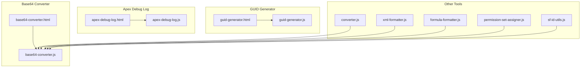
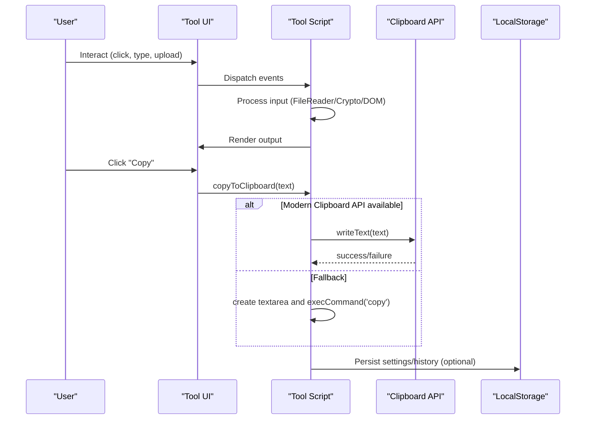
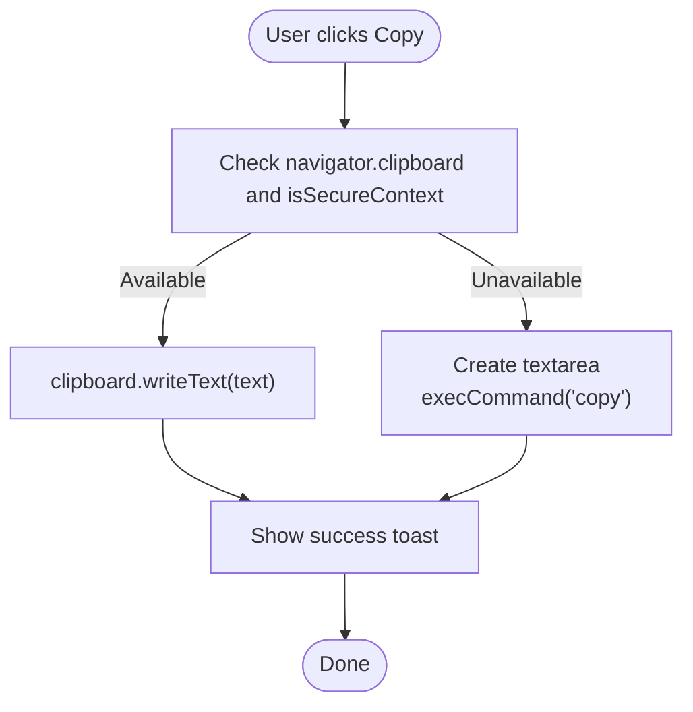
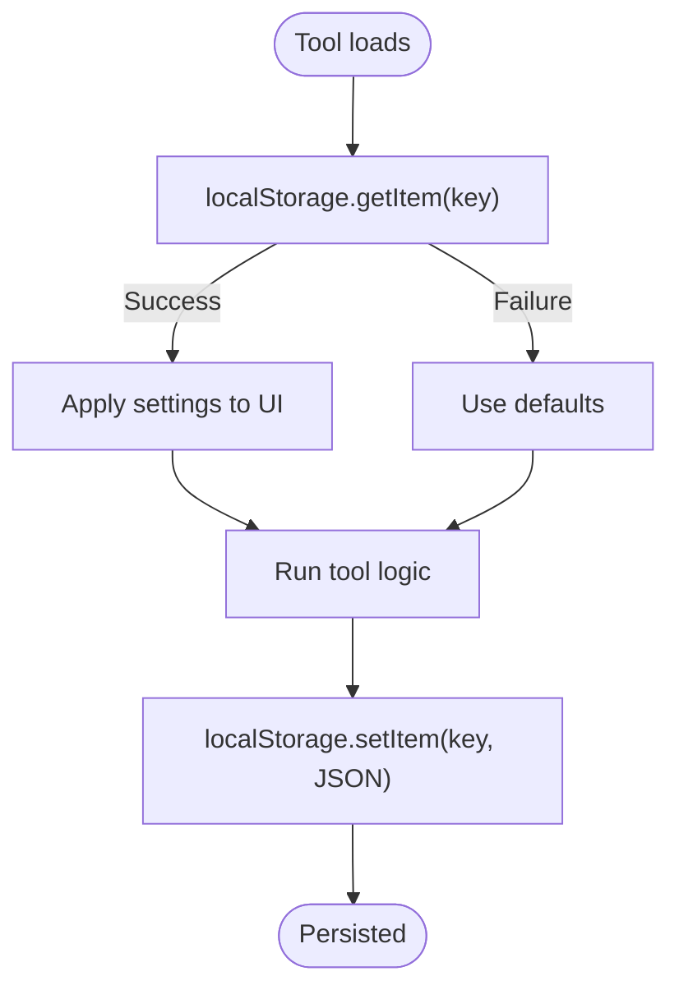
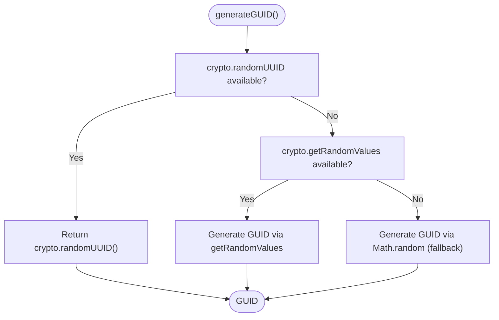
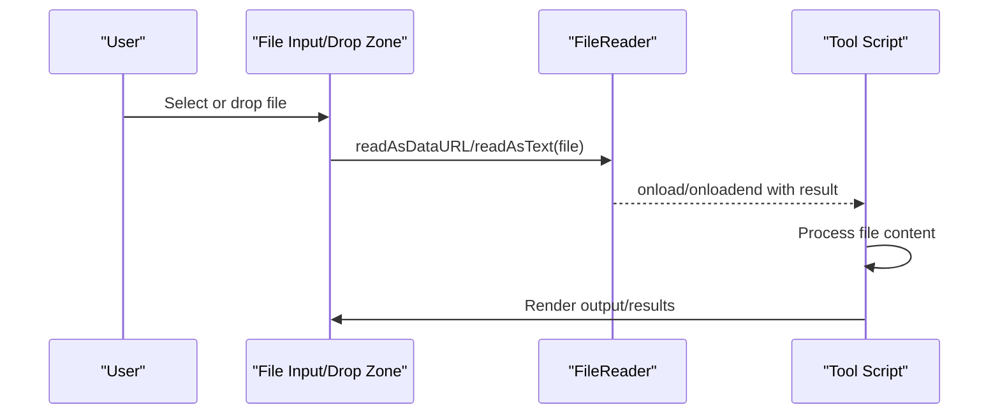
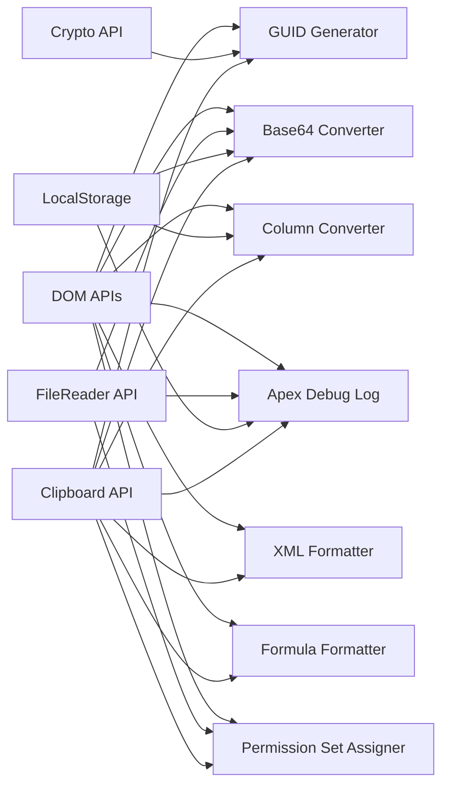

# Browser API Integration

<cite>
**Referenced Files in This Document**
- [base64-converter.js](file://base64-converter.js)
- [base64-converter.html](file://base64-converter.html)
- [guid-generator.js](file://guid-generator.js)
- [guid-generator.html](file://guid-generator.html)
- [apex-debug-log.js](file://apex-debug-log.js)
- [apex-debug-log.html](file://apex-debug-log.html)
- [converter.js](file://converter.js)
- [xml-formatter.js](file://xml-formatter.js)
- [formula-formatter.js](file://formula-formatter.js)
- [permission-set-assigner.js](file://permission-set-assigner.js)
- [sf-id-utils.js](file://sf-id-utils.js)
</cite>

## Table of Contents
1. [Introduction](#introduction)
2. [Project Structure](#project-structure)
3. [Core Components](#core-components)
4. [Architecture Overview](#architecture-overview)
5. [Detailed Component Analysis](#detailed-component-analysis)
6. [Dependency Analysis](#dependency-analysis)
7. [Performance Considerations](#performance-considerations)
8. [Troubleshooting Guide](#troubleshooting-guide)
9. [Conclusion](#conclusion)

## Introduction
This document details how the Developer Utilities application integrates browser APIs across its tools to deliver a secure, offline-first experience. It focuses on Clipboard API usage for seamless copy operations, LocalStorage API for persistent settings and history, Crypto API for secure random number generation, FileReader API for file processing, and DOM APIs for UI interactions. It also covers Intersection Observer patterns for lazy loading, Fetch API for external resource loading, performance considerations, browser compatibility checks, and graceful degradation strategies.

## Project Structure
The application is organized as individual tools, each with its own HTML and JavaScript file. The tools share common browser API patterns:
- Clipboard API for copy-to-clipboard operations
- LocalStorage for user preferences and history
- Crypto API for GUID generation
- FileReader for file uploads and conversions
- DOM APIs for UI updates and interactions
- Optional Intersection Observer and Fetch API for advanced features

**Diagram sources**
- [base64-converter.html](file://base64-converter.html)
- [base64-converter.js](file://base64-converter.js)
- [guid-generator.html](file://guid-generator.html)
- [guid-generator.js](file://guid-generator.js)
- [apex-debug-log.html](file://apex-debug-log.html)
- [apex-debug-log.js](file://apex-debug-log.js)
- [converter.js](file://converter.js)
- [xml-formatter.js](file://xml-formatter.js)
- [formula-formatter.js](file://formula-formatter.js)
- [permission-set-assigner.js](file://permission-set-assigner.js)
- [sf-id-utils.js](file://sf-id-utils.js)

**Section sources**
- [base64-converter.html](file://base64-converter.html)
- [base64-converter.js](file://base64-converter.js)
- [guid-generator.html](file://guid-generator.html)
- [guid-generator.js](file://guid-generator.js)
- [apex-debug-log.html](file://apex-debug-log.html)
- [apex-debug-log.js](file://apex-debug-log.js)
- [converter.js](file://converter.js)
- [xml-formatter.js](file://xml-formatter.js)
- [formula-formatter.js](file://formula-formatter.js)
- [permission-set-assigner.js](file://permission-set-assigner.js)
- [sf-id-utils.js](file://sf-id-utils.js)

## Core Components
- Clipboard API: Implemented across tools to copy results to the clipboard with a fallback to a hidden textarea when the modern API is unavailable or not supported in non-secure contexts.
- LocalStorage API: Used for persisting user preferences and session history in tools that maintain state.
- Crypto API: Utilized for secure GUID generation with fallbacks to getRandomValues and finally Math.random for environments without WebCrypto.
- FileReader API: Employed for converting files to Base64 and for parsing Apex debug logs from uploaded files.
- DOM APIs: Used extensively for UI updates, event handling, and rendering dynamic content.
- Optional Intersection Observer and Fetch API: Present in the codebase for advanced features; the Clipboard, LocalStorage, Crypto, and FileReader integrations are the primary focus.

**Section sources**
- [base64-converter.js](file://base64-converter.js)
- [guid-generator.js](file://guid-generator.js)
- [apex-debug-log.js](file://apex-debug-log.js)
- [converter.js](file://converter.js)
- [xml-formatter.js](file://xml-formatter.js)
- [formula-formatter.js](file://formula-formatter.js)
- [permission-set-assigner.js](file://permission-set-assigner.js)

## Architecture Overview
The tools follow a consistent pattern:
- On DOMContentLoaded, event listeners are attached to UI controls.
- User actions trigger processing logic that may use FileReader, Crypto, or DOM APIs.
- Results are rendered to the UI and optionally copied via Clipboard API with fallback.
- Preferences and history are persisted using LocalStorage.

**Diagram sources**
- [base64-converter.js](file://base64-converter.js)
- [guid-generator.js](file://guid-generator.js)
- [apex-debug-log.js](file://apex-debug-log.js)
- [converter.js](file://converter.js)
- [xml-formatter.js](file://xml-formatter.js)
- [formula-formatter.js](file://formula-formatter.js)
- [permission-set-assigner.js](file://permission-set-assigner.js)

## Detailed Component Analysis

### Clipboard API Integration
All tools implement a unified copy mechanism:
- Uses navigator.clipboard.writeText when available and the page is served in a secure context.
- Falls back to programmatically creating a textarea, selecting its content, and invoking document.execCommand('copy').
- Provides user feedback via a toast notification.

Key implementation locations:
- Base64 Converter: copyToClipboard and fallbackCopyTextToClipboard functions.
- GUID Generator: copyToClipboard and fallbackCopyTextToClipboard functions.
- Apex Debug Log: copyToClipboard and fallbackCopyTextToClipboard functions.
- Column Converter: copyToClipboard and fallbackCopyTextToClipboard functions.
- XML Formatter: copyToClipboard and fallbackCopyTextToClipboard functions.
- Formula Formatter: copyToClipboard and fallbackCopyTextToClipboard functions.
- Permission Set Assigner: copyToClipboard and fallbackCopyTextToClipboard functions.

**Diagram sources**
- [base64-converter.js](file://base64-converter.js)
- [guid-generator.js](file://guid-generator.js)
- [apex-debug-log.js](file://apex-debug-log.js)
- [converter.js](file://converter.js)
- [xml-formatter.js](file://xml-formatter.js)
- [formula-formatter.js](file://formula-formatter.js)
- [permission-set-assigner.js](file://permission-set-assigner.js)

**Section sources**
- [base64-converter.js](file://base64-converter.js)
- [guid-generator.js](file://guid-generator.js)
- [apex-debug-log.js](file://apex-debug-log.js)
- [converter.js](file://converter.js)
- [xml-formatter.js](file://xml-formatter.js)
- [formula-formatter.js](file://formula-formatter.js)
- [permission-set-assigner.js](file://permission-set-assigner.js)

### LocalStorage API Implementation
Several tools persist user preferences and session history:
- Apex Debug Log: Stores display configuration (font family, font size, highlight toggle) under a dedicated key and restores it on load.
- Column Converter: Persists conversion settings (delimiter, quote type, enclosure, options) and restores them on initialization.
- Base64 Converter: Maintains session history of results (limited to a fixed number) for quick reuse.

**Diagram sources**
- [apex-debug-log.js](file://apex-debug-log.js)
- [converter.js](file://converter.js)
- [base64-converter.js](file://base64-converter.js)

**Section sources**
- [apex-debug-log.js](file://apex-debug-log.js)
- [converter.js](file://converter.js)
- [base64-converter.js](file://base64-converter.js)

### Crypto API Integration for GUID Generation
The GUID generator prioritizes cryptographic randomness:
- Uses crypto.randomUUID if available.
- Falls back to crypto.getRandomValues for environments with partial WebCrypto support.
- As a last resort, uses Math.random for environments without WebCrypto.

**Diagram sources**
- [guid-generator.js](file://guid-generator.js)

**Section sources**
- [guid-generator.js](file://guid-generator.js)

### FileReader API Usage
FileReader is used across multiple tools:
- Base64 Converter: Reads uploaded files and converts them to Base64 strings for output.
- Apex Debug Log: Reads uploaded .log or .txt files for filtering and display.
- Permission Set Assigner: Reads CSV files dropped into the interface.

**Diagram sources**
- [base64-converter.js](file://base64-converter.js)
- [apex-debug-log.js](file://apex-debug-log.js)
- [permission-set-assigner.js](file://permission-set-assigner.js)

**Section sources**
- [base64-converter.js](file://base64-converter.js)
- [apex-debug-log.js](file://apex-debug-log.js)
- [permission-set-assigner.js](file://permission-set-assigner.js)

### Additional Browser APIs Observed
- DOMParser: XML Formatter uses DOMParser to validate and process XML.
- URL.createObjectURL/download anchor: Used for exporting results as downloadable files.
- TextEncoder/TextDecoder: Base64 Converter uses TextEncoder/TextDecoder for proper UTF-8 handling before Base64 encoding/decoding.
- Intersection Observer and Fetch API: Present in the codebase but not actively used in the documented tools; they remain available for optional enhancements.

**Section sources**
- [xml-formatter.js](file://xml-formatter.js)
- [base64-converter.js](file://base64-converter.js)
- [formula-formatter.js](file://formula-formatter.js)

## Dependency Analysis
The tools depend on shared browser APIs and patterns:
- Clipboard API is consistently used across tools with a common fallback strategy.
- LocalStorage is used in Apex Debug Log, Column Converter, and Base64 Converter for persistence.
- Crypto API is used in GUID Generator for secure GUID generation.
- FileReader API is used in Base64 Converter, Apex Debug Log, and Permission Set Assigner for file processing.
- DOM APIs are used extensively for UI updates and rendering.

**Diagram sources**
- [base64-converter.js](file://base64-converter.js)
- [guid-generator.js](file://guid-generator.js)
- [apex-debug-log.js](file://apex-debug-log.js)
- [converter.js](file://converter.js)
- [xml-formatter.js](file://xml-formatter.js)
- [formula-formatter.js](file://formula-formatter.js)
- [permission-set-assigner.js](file://permission-set-assigner.js)

**Section sources**
- [base64-converter.js](file://base64-converter.js)
- [guid-generator.js](file://guid-generator.js)
- [apex-debug-log.js](file://apex-debug-log.js)
- [converter.js](file://converter.js)
- [xml-formatter.js](file://xml-formatter.js)
- [formula-formatter.js](file://formula-formatter.js)
- [permission-set-assigner.js](file://permission-set-assigner.js)

## Performance Considerations
- Clipboard API: Prefer navigator.clipboard.writeText for better performance and reliability; fallback to execCommand is slower and less reliable.
- FileReader: Limit file sizes to prevent memory pressure; enforce maximum file sizes in tools that process files.
- DOM Updates: Batch DOM updates and minimize reflows; avoid excessive innerHTML manipulation.
- Crypto API: Use crypto.randomUUID when available to leverage native cryptographic performance; avoid Math.random for security-sensitive tasks.
- LocalStorage: Keep serialized settings compact; avoid storing large datasets; use indexedDB for larger datasets if needed.
- Rendering: For large outputs, consider virtualization or pagination to reduce DOM size.

## Troubleshooting Guide
Common issues and resolutions:
- Clipboard fails silently: Verify the page is served over HTTPS (isSecureContext) and that navigator.clipboard is available. The fallback to execCommand should work in most cases.
- FileReader errors: Ensure the file type and size are acceptable; handle onloaderror appropriately and inform the user.
- Crypto API unavailable: Confirm the environment supports WebCrypto; the GUID generator falls back to getRandomValues and then Math.random.
- LocalStorage quota exceeded: Reduce the amount of data stored or clear unnecessary entries.
- Large file processing: Implement chunked processing or streaming where applicable to avoid memory issues.

**Section sources**
- [base64-converter.js](file://base64-converter.js)
- [guid-generator.js](file://guid-generator.js)
- [apex-debug-log.js](file://apex-debug-log.js)
- [converter.js](file://converter.js)
- [xml-formatter.js](file://xml-formatter.js)
- [formula-formatter.js](file://formula-formatter.js)
- [permission-set-assigner.js](file://permission-set-assigner.js)

## Conclusion
The Developer Utilities application demonstrates robust browser API integration across its tools. Clipboard API ensures seamless copy operations with a reliable fallback; LocalStorage persists user preferences and history; Crypto API enables secure GUID generation with layered fallbacks; FileReader API powers file-based conversions and log analysis. The consistent use of DOM APIs and careful attention to performance and error handling provide a responsive and resilient user experience. Optional features like Intersection Observer and Fetch API are present for future enhancements while maintaining backward compatibility.