# Component Relationships

<cite>
**Referenced Files in This Document**
- [index.html](file://index.html)
- [style.css](file://style.css)
- [converter.js](file://converter.js)
- [sf-id-utils.js](file://sf-id-utils.js)
- [sample-data.js](file://sample-data.js)
- [column-converter.html](file://column-converter.html)
- [id-converter.html](file://id-converter.html)
- [id-converter.js](file://id-converter.js)
- [base64-converter.js](file://base64-converter.js)
- [list-diff.js](file://list-diff.js)
- [permission-set-assigner.js](file://permission-set-assigner.js)
- [xml-formatter.js](file://xml-formatter.js)
- [formula-formatter.js](file://formula-formatter.js)
- [apex-debug-log.js](file://apex-debug-log.js)
- [api-name-generator.js](file://api-name-generator.js)
</cite>

## Table of Contents
1. [Introduction](#introduction)
2. [Project Structure](#project-structure)
3. [Core Components](#core-components)
4. [Architecture Overview](#architecture-overview)
5. [Detailed Component Analysis](#detailed-component-analysis)
6. [Dependency Analysis](#dependency-analysis)
7. [Performance Considerations](#performance-considerations)
8. [Troubleshooting Guide](#troubleshooting-guide)
9. [Conclusion](#conclusion)

## Introduction
This document explains the component relationships and data flow patterns in the Developer Utilities application. The application follows a hub-to-tool communication model centered on index.html, which acts as the main navigation controller. Tools are self-contained HTML pages that share common utilities and styling. The shared utility layer includes converter.js for text processing, sf-id-utils.js for Salesforce ID operations, and sample-data.js for test data. The event-driven architecture emphasizes real-time input processing, debouncing via change/input events, and state synchronization across components. The CSS architecture relies on style.css for centralized styling, Bootstrap for UI consistency, and glassmorphism effects for the UI theme.

## Project Structure
The project is organized around a central hub (index.html) and individual tool pages. Each tool page includes its own JavaScript logic and references shared resources.

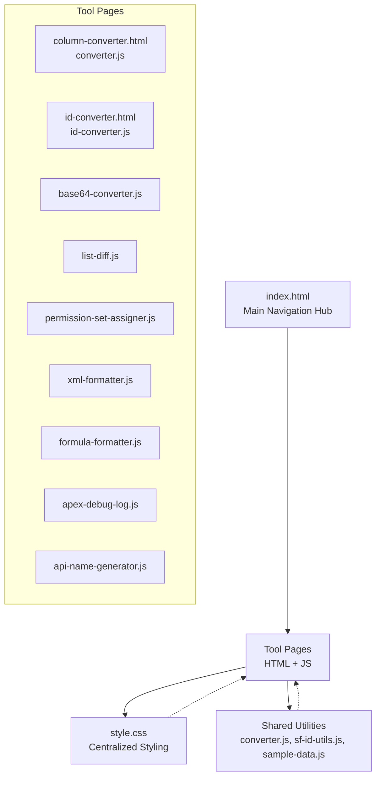

**Diagram sources**
- [index.html](file://index.html)
- [style.css](file://style.css)
- [converter.js](file://converter.js)
- [sf-id-utils.js](file://sf-id-utils.js)
- [sample-data.js](file://sample-data.js)
- [column-converter.html](file://column-converter.html)
- [id-converter.html](file://id-converter.html)
- [id-converter.js](file://id-converter.js)
- [base64-converter.js](file://base64-converter.js)
- [list-diff.js](file://list-diff.js)
- [permission-set-assigner.js](file://permission-set-assigner.js)
- [xml-formatter.js](file://xml-formatter.js)
- [formula-formatter.js](file://formula-formatter.js)
- [apex-debug-log.js](file://apex-debug-log.js)
- [api-name-generator.js](file://api-name-generator.js)

**Section sources**
- [index.html](file://index.html)
- [style.css](file://style.css)

## Core Components
- Hub-to-tool coordination: index.html provides a grid of tool cards and manages persistent ordering via localStorage. It also hosts a global navigation bar and drag-and-drop reordering of tools.
- Shared utilities:
  - converter.js: Provides text processing for the Column to List tool, including delimiter selection, quoting, enclosure, deduplication, sorting, conflict detection, and history.
  - sf-id-utils.js: Supplies ID validation and 15-to-18 character conversion for Salesforce IDs.
  - sample-data.js: Supplies centralized sample data used across tools for quick testing.
- Tool-specific modules: Each tool page includes a dedicated script that handles its UI, events, and processing logic.

**Section sources**
- [index.html](file://index.html)
- [converter.js](file://converter.js)
- [sf-id-utils.js](file://sf-id-utils.js)
- [sample-data.js](file://sample-data.js)

## Architecture Overview
The system uses a static hub-to-tool model:
- index.html loads Bootstrap and style.css, defines the global navigation, and renders a draggable tool grid. It persists the tool order in localStorage and reloads it on load.
- Each tool page loads Bootstrap and style.css, then loads shared resources (sample-data.js, converter.js, sf-id-utils.js) before its own tool-specific script.
- Tools are event-driven: input/change events trigger immediate processing, with optional debouncing via event coalescing (multiple listeners per element).

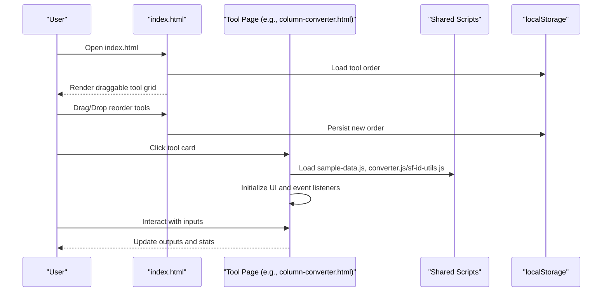

**Diagram sources**
- [index.html](file://index.html)
- [column-converter.html](file://column-converter.html)
- [converter.js](file://converter.js)
- [sf-id-utils.js](file://sf-id-utils.js)
- [sample-data.js](file://sample-data.js)

## Detailed Component Analysis

### Hub: index.html
- Responsibilities:
  - Global navigation and branding.
  - Tool grid rendering with draggable cards.
  - Drag-and-drop reordering with live feedback and persistence.
  - Reset order button to clear persisted preferences.
- Data flow:
  - Reads/writes a tool order array to localStorage keyed by a constant storage key.
  - On load, reads the saved order and reorders the DOM accordingly.
  - On drag-and-drop, updates the DOM order and saves immediately.
- UI/UX:
  - Uses Bootstrap classes and style.css for glassmorphism and responsive layout.
  - Provides visual feedback during drag operations.

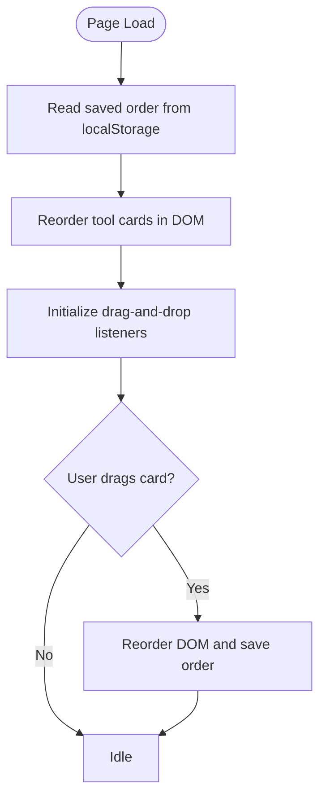

**Diagram sources**
- [index.html](file://index.html)

**Section sources**
- [index.html](file://index.html)

### Shared Utilities: converter.js
- Responsibilities:
  - Text processing pipeline for the Column to List tool.
  - Real-time conversion on input/change events.
  - Settings persistence and defaults.
  - Conflict detection and warnings.
  - Session history management with copy/delete actions.
- Data flow:
  - Reads input textarea and settings from the UI.
  - Processes lines through trim, filter, dedupe, sort, quoting, and enclosure.
  - Updates output textarea and statistics.
  - Persists settings to localStorage and restores on load.
  - Saves results to session history and exposes copy/delete actions.

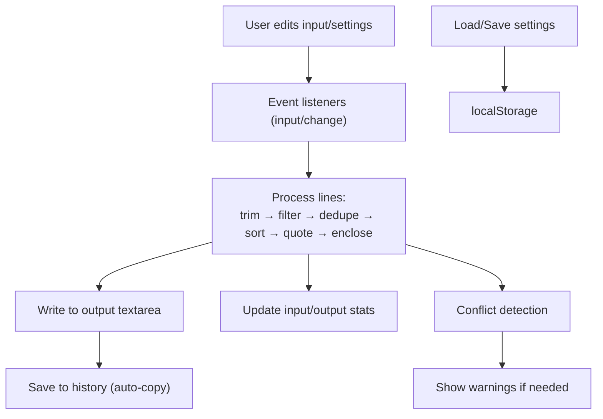

**Diagram sources**
- [converter.js](file://converter.js)

**Section sources**
- [converter.js](file://converter.js)

### Shared Utilities: sf-id-utils.js
- Responsibilities:
  - Validates Salesforce IDs (15 or 18 characters).
  - Converts 15-character IDs to 18-character case-safe IDs.
- Integration:
  - Used by id-converter.js for ID normalization and by list-diff.js for smart SF ID comparison.

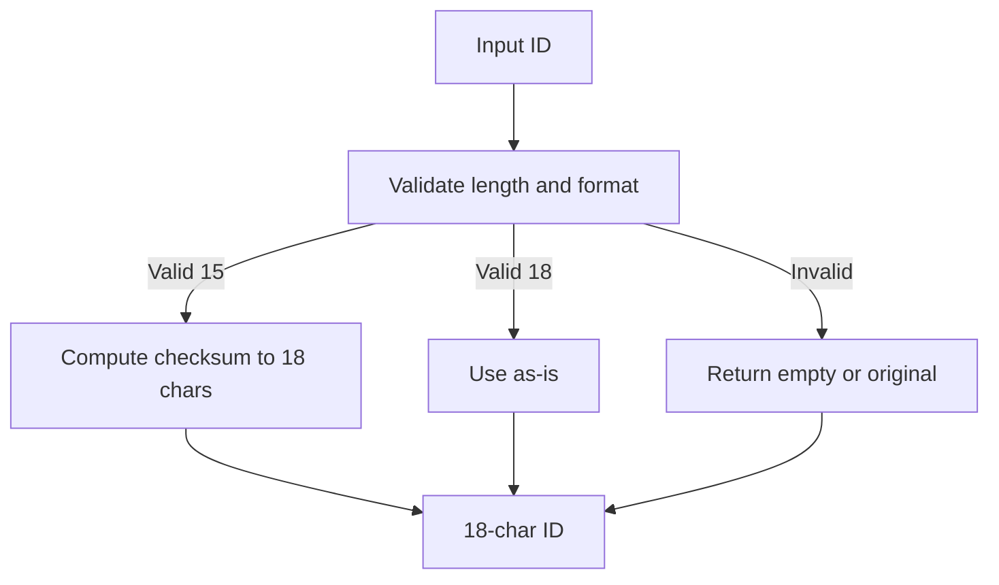

**Diagram sources**
- [sf-id-utils.js](file://sf-id-utils.js)

**Section sources**
- [sf-id-utils.js](file://sf-id-utils.js)

### Shared Utilities: sample-data.js
- Responsibilities:
  - Centralized sample data for all tools.
  - Provides pre-filled inputs for quick testing.
- Integration:
  - Loaded by tool pages to populate input areas with realistic examples.

**Section sources**
- [sample-data.js](file://sample-data.js)

### Tool: Column to List (column-converter.html + converter.js)
- Composition:
  - HTML defines three panels: input, controls, and output, with a collapsible history panel.
  - converter.js orchestrates processing, settings, and history.
- Event-driven behavior:
  - Watches multiple inputs (delimiter, quote type, enclosure, toggles).
  - Real-time updates on input and change events.
  - Load sample, copy/save, and clear actions.

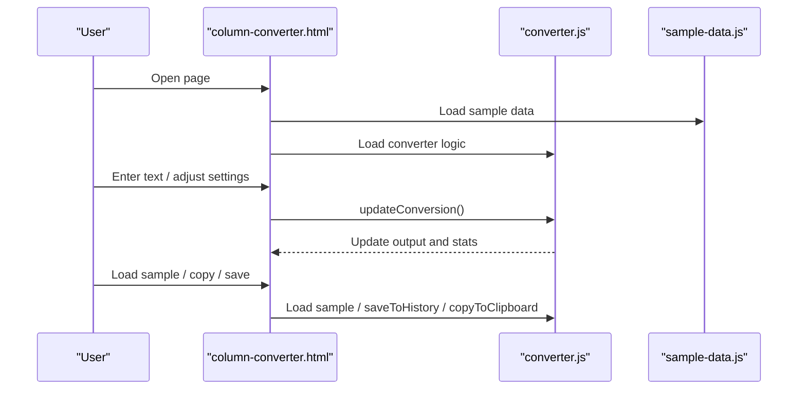

**Diagram sources**
- [column-converter.html](file://column-converter.html)
- [converter.js](file://converter.js)
- [sample-data.js](file://sample-data.js)

**Section sources**
- [column-converter.html](file://column-converter.html)
- [converter.js](file://converter.js)
- [sample-data.js](file://sample-data.js)

### Tool: Salesforce ID Converter (id-converter.html + id-converter.js + sf-id-utils.js)
- Composition:
  - HTML provides input/output panels and toggles for SOQL formatting and cleaning.
  - id-converter.js performs validation, conversion, and formatting.
  - sf-id-utils.js supplies ID validation and conversion.
- Event-driven behavior:
  - Real-time conversion on input and toggle changes.
  - Load sample data and copy to clipboard.

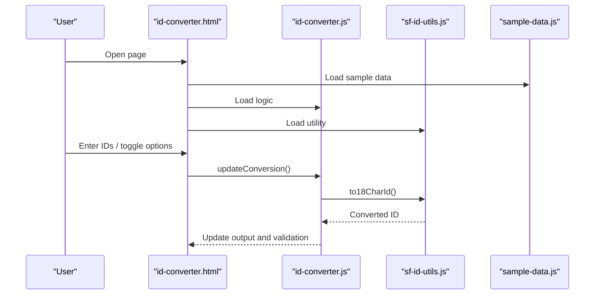

**Diagram sources**
- [id-converter.html](file://id-converter.html)
- [id-converter.js](file://id-converter.js)
- [sf-id-utils.js](file://sf-id-utils.js)
- [sample-data.js](file://sample-data.js)

**Section sources**
- [id-converter.html](file://id-converter.html)
- [id-converter.js](file://id-converter.js)
- [sf-id-utils.js](file://sf-id-utils.js)
- [sample-data.js](file://sample-data.js)

### Tool: Base64 Converter (base64-converter.js)
- Composition:
  - File and text modes with tabs.
  - Drag-and-drop zone for files.
  - History panel for recent conversions.
- Event-driven behavior:
  - Tab switching, file selection, drag-and-drop, text input.
  - Real-time validation and conversion with error handling.
  - Copy to clipboard and history management.

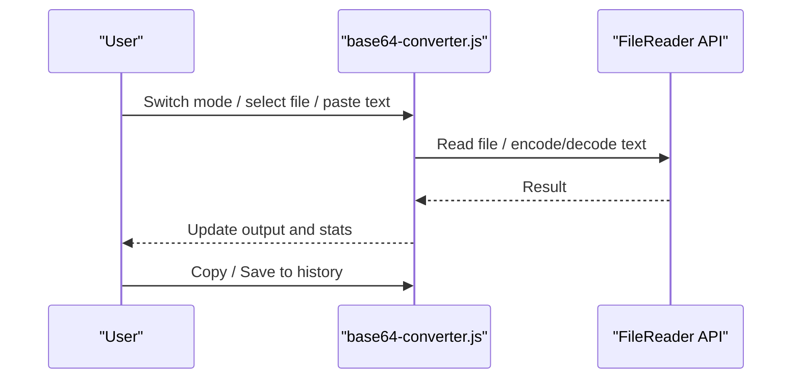

**Diagram sources**
- [base64-converter.js](file://base64-converter.js)

**Section sources**
- [base64-converter.js](file://base64-converter.js)

### Tool: List Difference (list-diff.js + sf-id-utils.js)
- Composition:
  - Two input areas, options for smart SF mode, case sensitivity, dedupe, trim, and sort.
  - Three output areas for unique A, unique B, and common items.
- Event-driven behavior:
  - Real-time diff computation on input and option changes.
  - Smart SF normalization using sf-id-utils.js.

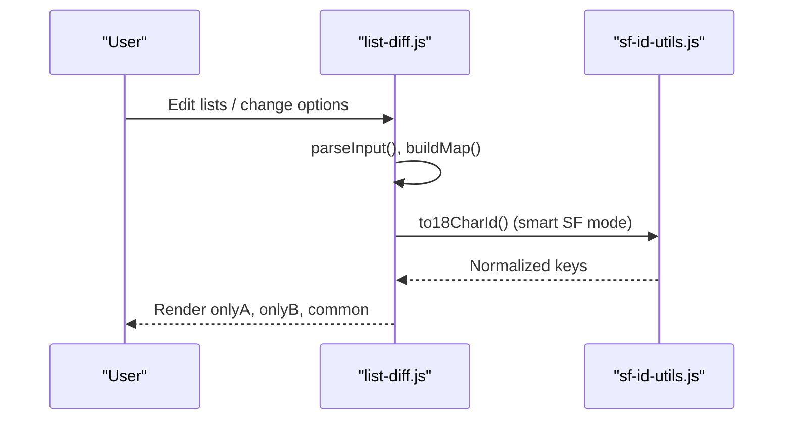

**Diagram sources**
- [list-diff.js](file://list-diff.js)
- [sf-id-utils.js](file://sf-id-utils.js)

**Section sources**
- [list-diff.js](file://list-diff.js)
- [sf-id-utils.js](file://sf-id-utils.js)

### Tool: Permission Set Assigner (permission-set-assigner.js)
- Composition:
  - User and Permission Set ID inputs, type toggles (Permission Set vs License), validation, stats, and output preview.
  - Drag-and-drop file upload for user IDs.
- Event-driven behavior:
  - Real-time validation and stats updates.
  - Cross-join generation with limits and clipboard/download actions.

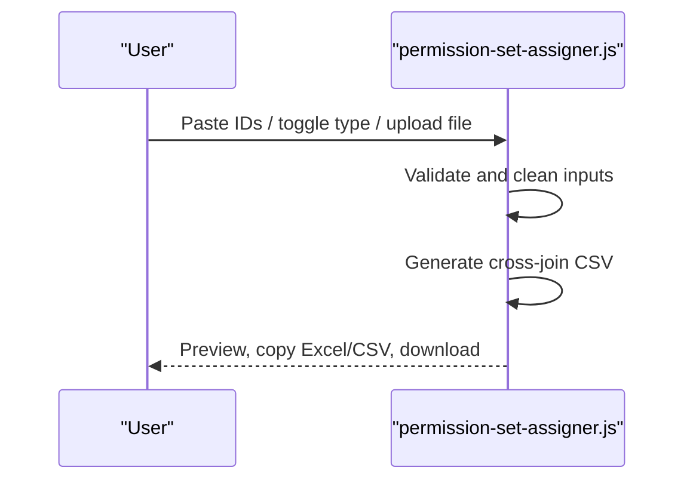

**Diagram sources**
- [permission-set-assigner.js](file://permission-set-assigner.js)

**Section sources**
- [permission-set-assigner.js](file://permission-set-assigner.js)

### Tool: XML Formatter (xml-formatter.js)
- Composition:
  - Format/minify buttons, indent size selector, validation messages.
- Event-driven behavior:
  - Real-time parsing and formatting on input and mode changes.

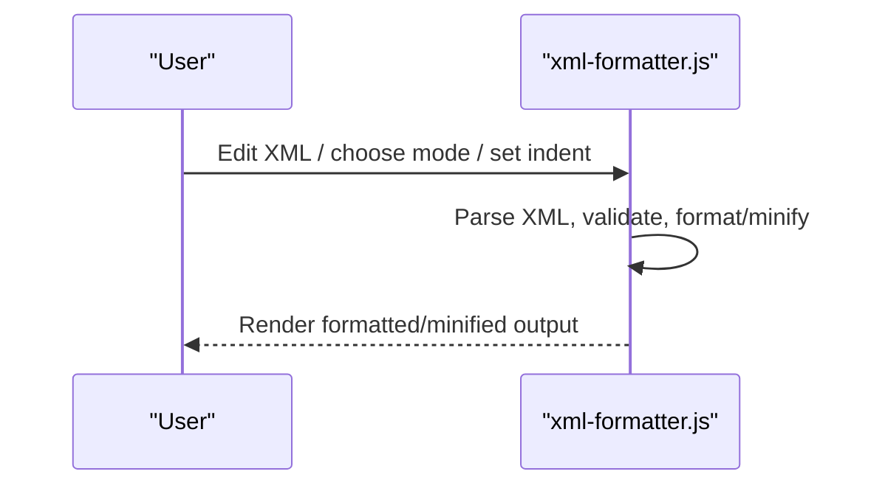

**Diagram sources**
- [xml-formatter.js](file://xml-formatter.js)

**Section sources**
- [xml-formatter.js](file://xml-formatter.js)

### Tool: Formula Formatter (formula-formatter.js)
- Composition:
  - Indent size selector and format button.
- Event-driven behavior:
  - Real-time formatting on click with indentation logic.

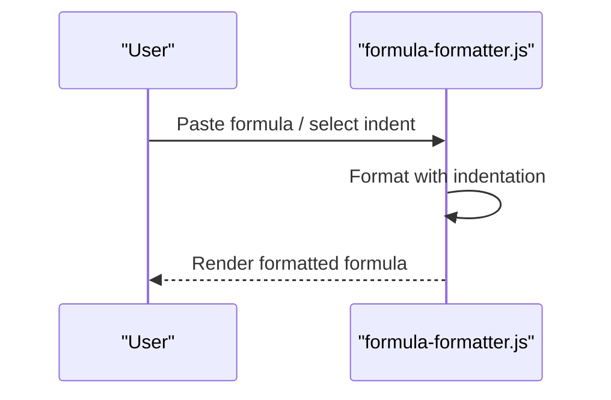

**Diagram sources**
- [formula-formatter.js](file://formula-formatter.js)

**Section sources**
- [formula-formatter.js](file://formula-formatter.js)

### Tool: Apex Debug Log Filter (apex-debug-log.js)
- Composition:
  - File upload, filter checkboxes, custom filter text, display settings (font family, size, highlight).
- Event-driven behavior:
  - Real-time filtering and syntax highlighting with configuration persistence.

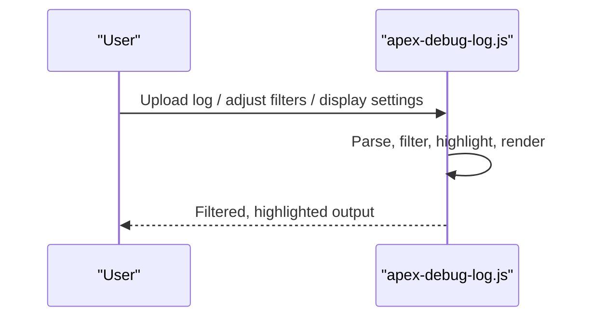

**Diagram sources**
- [apex-debug-log.js](file://apex-debug-log.js)

**Section sources**
- [apex-debug-log.js](file://apex-debug-log.js)

### Tool: API Name Generator (api-name-generator.js)
- Composition:
  - Label input, suffix selector, counts, and generate/copy/clear actions.
- Event-driven behavior:
  - Real-time counting and generation on input and click.

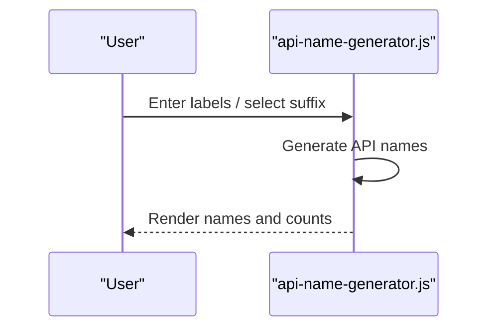

**Diagram sources**
- [api-name-generator.js](file://api-name-generator.js)

**Section sources**
- [api-name-generator.js](file://api-name-generator.js)

## Dependency Analysis
- Hub-to-tool dependencies:
  - index.html depends on style.css and Bootstrap for UI and glassmorphism.
  - Tool pages depend on style.css and Bootstrap; they optionally load shared utilities.
- Shared utility dependencies:
  - converter.js depends on sample-data.js for sample inputs.
  - id-converter.js depends on sf-id-utils.js for ID conversion.
  - list-diff.js depends on sf-id-utils.js for smart SF ID normalization.
- Internal tool dependencies:
  - Many tools depend on shared copyToClipboard/toast helpers defined within their own files.

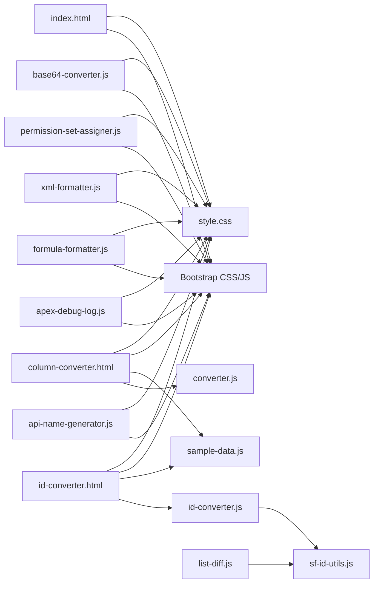

**Diagram sources**
- [index.html](file://index.html)
- [style.css](file://style.css)
- [column-converter.html](file://column-converter.html)
- [converter.js](file://converter.js)
- [sample-data.js](file://sample-data.js)
- [id-converter.html](file://id-converter.html)
- [id-converter.js](file://id-converter.js)
- [sf-id-utils.js](file://sf-id-utils.js)
- [list-diff.js](file://list-diff.js)
- [base64-converter.js](file://base64-converter.js)
- [permission-set-assigner.js](file://permission-set-assigner.js)
- [xml-formatter.js](file://xml-formatter.js)
- [formula-formatter.js](file://formula-formatter.js)
- [apex-debug-log.js](file://apex-debug-log.js)
- [api-name-generator.js](file://api-name-generator.js)

**Section sources**
- [index.html](file://index.html)
- [style.css](file://style.css)
- [converter.js](file://converter.js)
- [sf-id-utils.js](file://sf-id-utils.js)
- [sample-data.js](file://sample-data.js)
- [column-converter.html](file://column-converter.html)
- [id-converter.html](file://id-converter.html)
- [id-converter.js](file://id-converter.js)
- [base64-converter.js](file://base64-converter.js)
- [list-diff.js](file://list-diff.js)
- [permission-set-assigner.js](file://permission-set-assigner.js)
- [xml-formatter.js](file://xml-formatter.js)
- [formula-formatter.js](file://formula-formatter.js)
- [apex-debug-log.js](file://apex-debug-log.js)
- [api-name-generator.js](file://api-name-generator.js)

## Performance Considerations
- Debouncing and event coalescing:
  - Tools use input/change listeners to react immediately to user input. While effective for responsiveness, avoid excessive recomputation by batching UI updates when possible.
- Memory and rendering:
  - Large outputs (e.g., XML, formulas) should be formatted incrementally to prevent UI stalls.
- Clipboard operations:
  - Copy operations are lightweight; ensure they are triggered after state is finalized to avoid copying stale data.
- Storage:
  - localStorage usage is minimal and efficient for small settings and histories.

## Troubleshooting Guide
- Tool order not persisting:
  - Verify localStorage availability and that the storage key matches the implementation.
- Conversion conflicts:
  - converter.js highlights potential delimiter or quote conflicts; adjust settings to avoid collisions.
- Invalid IDs:
  - id-converter.js shows validation warnings for invalid lengths or prefixes; ensure IDs conform to expected formats.
- XML parsing errors:
  - xml-formatter.js displays validation messages for malformed XML; correct syntax before formatting.
- Apex log filtering:
  - Ensure at least one filter or custom text is provided; otherwise, no output is shown.
- Clipboard failures:
  - Fallback to execCommand is used when Clipboard API is unavailable; confirm secure context and permissions.

**Section sources**
- [index.html](file://index.html)
- [converter.js](file://converter.js)
- [id-converter.js](file://id-converter.js)
- [xml-formatter.js](file://xml-formatter.js)
- [apex-debug-log.js](file://apex-debug-log.js)

## Conclusion
The Developer Utilities application employs a clean hub-to-tool architecture centered on index.html, with each tool operating independently while sharing common utilities and styling. The event-driven design ensures real-time responsiveness, while shared utilities provide consistent functionality across tools. The CSS architecture with style.css and Bootstrap delivers a cohesive, glassmorphic UI with responsive patterns. Together, these patterns create a maintainable, extensible system for local developer utilities.