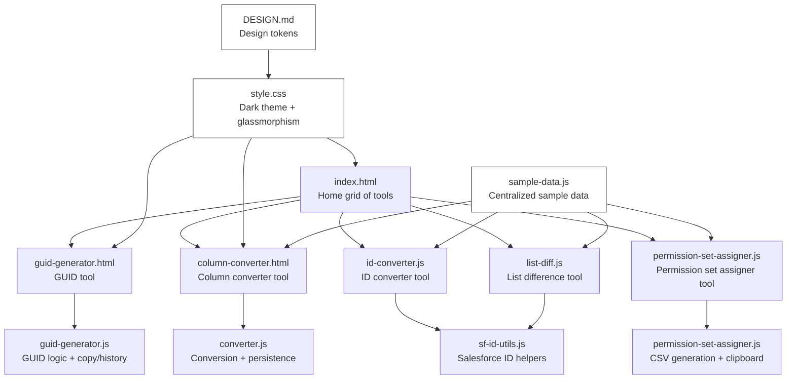
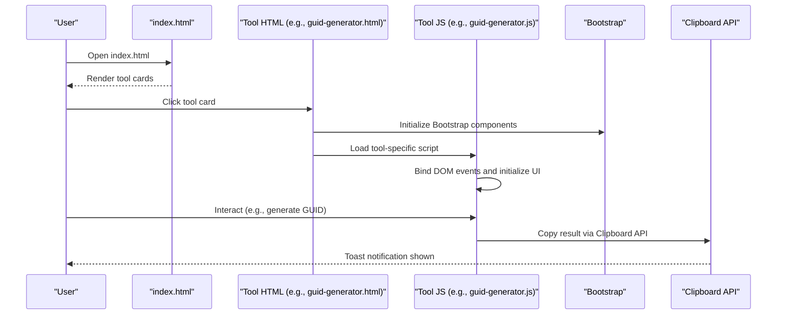
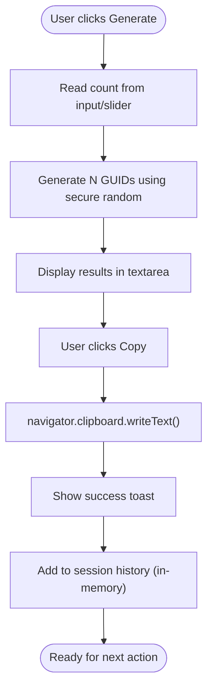
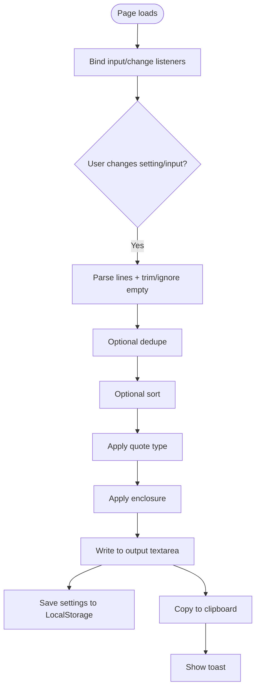
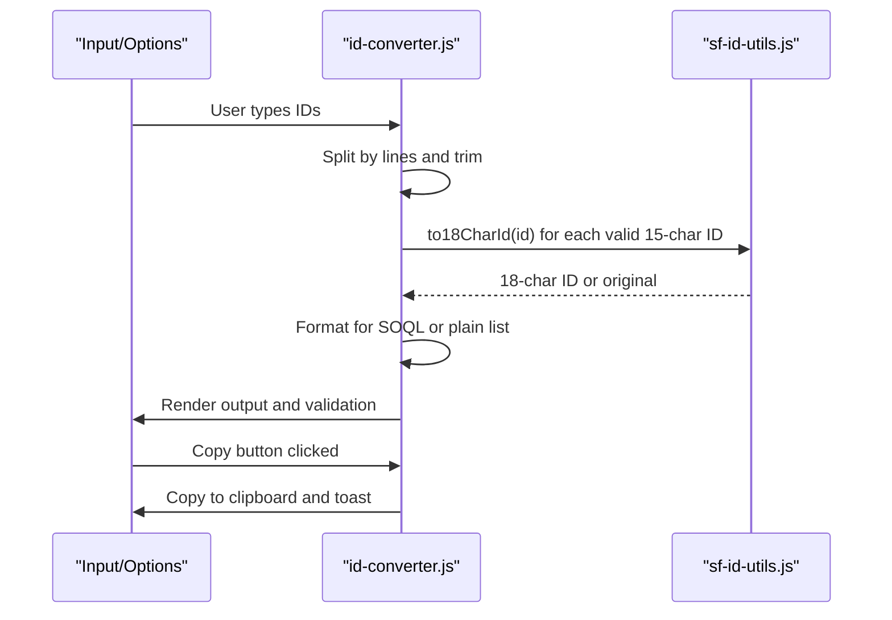
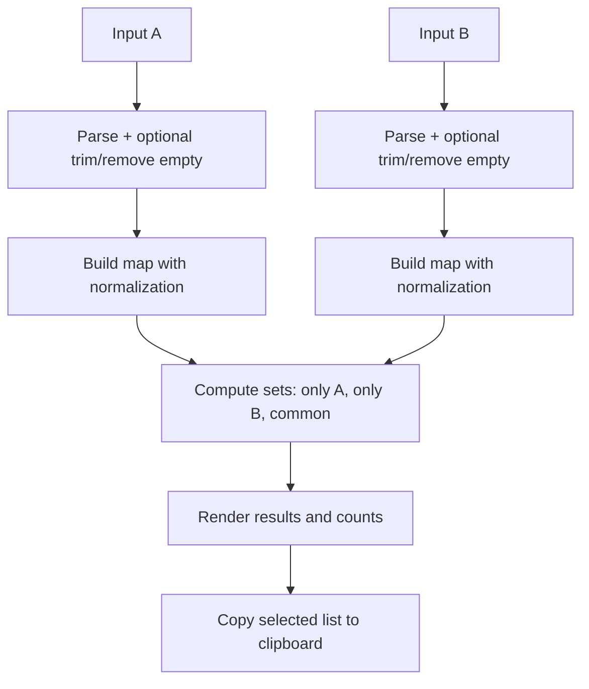
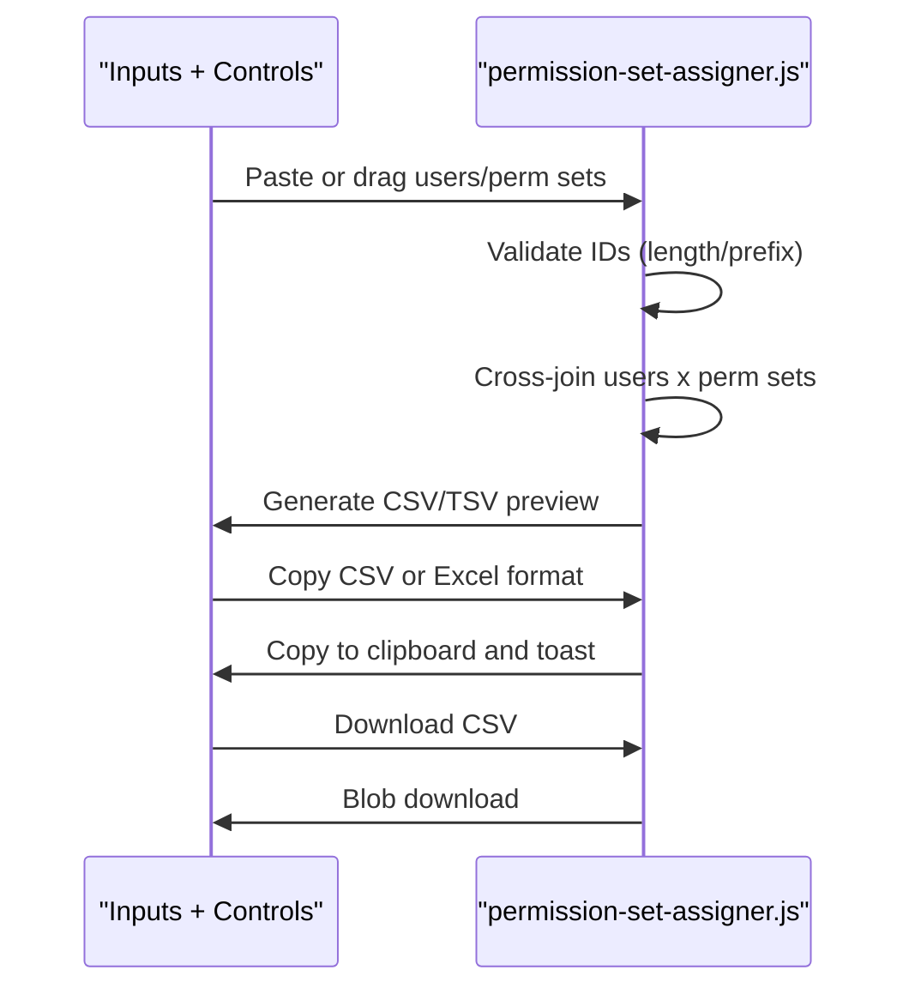
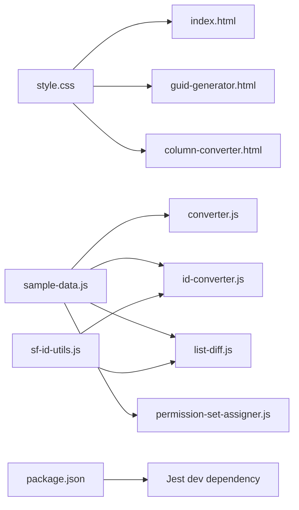

# Core Architecture

<cite>
**Referenced Files in This Document**
- [index.html](file://index.html)
- [style.css](file://style.css)
- [DESIGN.md](file://DESIGN.md)
- [guid-generator.html](file://guid-generator.html)
- [guid-generator.js](file://guid-generator.js)
- [column-converter.html](file://column-converter.html)
- [converter.js](file://converter.js)
- [id-converter.js](file://id-converter.js)
- [sf-id-utils.js](file://sf-id-utils.js)
- [list-diff.js](file://list-diff.js)
- [permission-set-assigner.js](file://permission-set-assigner.js)
- [sample-data.js](file://sample-data.js)
- [README.md](file://README.md)
- [package.json](file://package.json)
</cite>

## Table of Contents
1. [Introduction](#introduction)
2. [Project Structure](#project-structure)
3. [Core Components](#core-components)
4. [Architecture Overview](#architecture-overview)
5. [Detailed Component Analysis](#detailed-component-analysis)
6. [Dependency Analysis](#dependency-analysis)
7. [Performance Considerations](#performance-considerations)
8. [Troubleshooting Guide](#troubleshooting-guide)
9. [Conclusion](#conclusion)

## Introduction
This document describes the architectural design of the Developer Utilities (Dev Utils) application. It is a secure, offline-first Single Page Application (SPA) where each tool is implemented as an independent module. The application emphasizes 100% client-side processing, robust XSS prevention, and local-only data retention. It integrates Bootstrap for UI components, employs a cohesive CSS architecture with a dark theme and glassmorphism effects, and follows progressive enhancement for cross-browser compatibility.

## Project Structure
Dev Utils is organized around a central index page that lists tools as draggable cards. Each tool has its own HTML page and shared JavaScript logic. A centralized stylesheet defines the dark theme and glassmorphism styles. A shared sample data module supplies test inputs across tools. The project uses Bootstrap for layout and interactive components, with custom toast notifications and copy-to-clipboard utilities.

**Diagram sources**
- [index.html](file://index.html)
- [guid-generator.html](file://guid-generator.html)
- [guid-generator.js](file://guid-generator.js)
- [column-converter.html](file://column-converter.html)
- [converter.js](file://converter.js)
- [id-converter.js](file://id-converter.js)
- [sf-id-utils.js](file://sf-id-utils.js)
- [list-diff.js](file://list-diff.js)
- [permission-set-assigner.js](file://permission-set-assigner.js)
- [style.css](file://style.css)
- [DESIGN.md](file://DESIGN.md)
- [sample-data.js](file://sample-data.js)

**Section sources**
- [index.html](file://index.html)
- [style.css](file://style.css)
- [DESIGN.md](file://DESIGN.md)
- [sample-data.js](file://sample-data.js)

## Core Components
- Central index and navigation: Home page with draggable tool cards and global navigation.
- Tool pages: Each tool page encapsulates its UI and logic in a self-contained HTML and JS pair.
- Shared utilities: Clipboard API wrapper, toast notifications, and XSS-safe rendering helpers.
- Persistence: LocalStorage for settings and ordering; in-memory session history per tool.
- Bootstrap integration: UI components, toasts, tooltips, and responsive layout.
- CSS architecture: Dark theme with glassmorphism, gradients, and consistent design tokens.

**Section sources**
- [index.html](file://index.html)
- [style.css](file://style.css)
- [DESIGN.md](file://DESIGN.md)
- [guid-generator.js](file://guid-generator.js)
- [converter.js](file://converter.js)

## Architecture Overview
The application follows a modular SPA pattern:
- Entry point: index.html renders a grid of tool cards.
- Navigation: Clicking a card navigates to the tool’s HTML page.
- Tool runtime: Each tool initializes its DOM listeners, performs client-side transformations, and manages its own history and settings.
- Shared concerns: Clipboard API, toasts, and XSS prevention are implemented consistently across tools.

**Diagram sources**
- [index.html](file://index.html)
- [guid-generator.html](file://guid-generator.html)
- [guid-generator.js](file://guid-generator.js)
- [style.css](file://style.css)

## Detailed Component Analysis

### GUID Generator Module
- Purpose: Generate bulk UUID v4 values, copy to clipboard, and maintain a session history.
- Browser APIs:
  - Crypto API: Uses crypto.randomUUID or crypto.getRandomValues for secure randomness.
  - Clipboard API: Copies generated values with a success toast.
  - LocalStorage: Persists tool ordering in the home grid (not per-session history).
- Factory pattern: The GUID generator function encapsulates the selection of the best available random generation method, acting as a lightweight factory for UUID creation.

**Diagram sources**
- [guid-generator.js](file://guid-generator.js)

**Section sources**
- [guid-generator.html](file://guid-generator.html)
- [guid-generator.js](file://guid-generator.js)

### Column to List Converter Module
- Purpose: Transform multi-line input into delimited lists with optional quoting and enclosure.
- Persistence: Uses LocalStorage to persist conversion settings across sessions.
- XSS Prevention: Uses an escape function to sanitize output before insertion into the DOM.
- Clipboard: Copies results to clipboard and optionally saves to history.

**Diagram sources**
- [column-converter.html](file://column-converter.html)
- [converter.js](file://converter.js)

**Section sources**
- [column-converter.html](file://column-converter.html)
- [converter.js](file://converter.js)

### ID Converter Module
- Purpose: Convert 15-character Salesforce IDs to 18-character case-safe IDs, with optional SOQL formatting and “clean” mode.
- XSS Prevention: Uses an escape function to safely render results.
- Clipboard: Copies results to clipboard with a toast.

**Diagram sources**
- [id-converter.js](file://id-converter.js)
- [sf-id-utils.js](file://sf-id-utils.js)

**Section sources**
- [id-converter.js](file://id-converter.js)
- [sf-id-utils.js](file://sf-id-utils.js)

### List Difference Module
- Purpose: Compare two lists and compute unique/common items, with smart Salesforce ID normalization.
- XSS Prevention: Uses an escape function to render list items safely.
- Clipboard: Copies computed differences to clipboard.

**Diagram sources**
- [list-diff.js](file://list-diff.js)
- [sf-id-utils.js](file://sf-id-utils.js)

**Section sources**
- [list-diff.js](file://list-diff.js)
- [sf-id-utils.js](file://sf-id-utils.js)

### Permission Set Assigner Module
- Purpose: Generate CSV/TSV for Permission Set or License assignments using a cross-join of users and permission sets.
- Clipboard: Copies CSV or Excel-friendly TSV to clipboard.
- File Handling: Supports drag-and-drop of CSV files into the user IDs input.
- XSS Prevention: Uses a safe escape function for rendering.

**Diagram sources**
- [permission-set-assigner.js](file://permission-set-assigner.js)

**Section sources**
- [permission-set-assigner.js](file://permission-set-assigner.js)

### Shared Utilities and Patterns
- Clipboard API: A unified copyToClipboard function checks navigator.clipboard availability and falls back to execCommand when needed. It triggers a reusable toast notification.
- Toast Notifications: A singleton toast container is lazily created and reused across tools.
- XSS Prevention: Escape functions sanitize text before innerHTML insertion. Inline onclick handlers are used sparingly and rely on window-exposed functions.
- LocalStorage: Used for:
  - Tool ordering persistence in the home grid.
  - Conversion settings persistence in the column converter.
- Crypto API: Used in GUID generation for secure randomness with graceful fallbacks.

**Section sources**
- [guid-generator.js](file://guid-generator.js)
- [converter.js](file://converter.js)
- [id-converter.js](file://id-converter.js)
- [list-diff.js](file://list-diff.js)
- [permission-set-assigner.js](file://permission-set-assigner.js)

## Dependency Analysis
- Tool-to-tool dependencies: Minimal. Modules share a common CSS and sample data module where applicable.
- Shared modules:
  - style.css: Provides dark theme, glass panels, and typography.
  - sample-data.js: Supplies test inputs for multiple tools.
  - sf-id-utils.js: Provides Salesforce ID utilities used by ID converter and list difference.
- External libraries:
  - Bootstrap CSS/JS for UI components and toasts.
  - Bootstrap Icons for icons.
  - Jest for tests (development dependency).

**Diagram sources**
- [style.css](file://style.css)
- [index.html](file://index.html)
- [guid-generator.html](file://guid-generator.html)
- [column-converter.html](file://column-converter.html)
- [sample-data.js](file://sample-data.js)
- [sf-id-utils.js](file://sf-id-utils.js)
- [package.json](file://package.json)

**Section sources**
- [style.css](file://style.css)
- [sample-data.js](file://sample-data.js)
- [sf-id-utils.js](file://sf-id-utils.js)
- [package.json](file://package.json)

## Performance Considerations
- Client-side processing: All tools run entirely in the browser; avoid server requests.
- Input limits and safeguards:
  - Column converter enforces reasonable defaults and disables actions when output is empty.
  - Permission Set Assigner validates IDs and caps the number of generated rows to prevent browser overload.
- Progressive enhancement:
  - Uses navigator.clipboard when available; falls back to execCommand for older browsers.
  - Ensures Bootstrap components are initialized only when present.
- Memory management:
  - Session histories are capped (e.g., 20 items) to keep memory bounded.

[No sources needed since this section provides general guidance]

## Troubleshooting Guide
- Clipboard fails silently:
  - The app checks navigator.clipboard and window.isSecureContext. If unavailable, it falls back to a textarea-based copy. Verify the page is served in a secure context (HTTPS/local file) for Clipboard API.
- Toaster not appearing:
  - Ensure Bootstrap Toast is available. The app conditionally uses bootstrap.Toast or a manual show/hide mechanism.
- XSS warnings or unexpected output:
  - Confirm that escapeHtml is used when inserting dynamic text into innerHTML. Inline onclick handlers should reference window-exposed functions.
- Settings not persisting:
  - Verify LocalStorage is enabled and not blocked by browser privacy settings.
- Drag-and-drop ordering not saving:
  - Confirm localStorage is writable and the storage key exists. Reset order via the reset button to restore default ordering.

**Section sources**
- [guid-generator.js](file://guid-generator.js)
- [converter.js](file://converter.js)
- [id-converter.js](file://id-converter.js)
- [list-diff.js](file://list-diff.js)
- [permission-set-assigner.js](file://permission-set-assigner.js)

## Conclusion
Dev Utils demonstrates a clean, modular SPA architecture where each tool is a self-contained module sharing common utilities and styles. Its security model is robust: 100% client-side processing, strict XSS prevention, and no server-side data retention. The Bootstrap integration, cohesive CSS design with dark theme and glassmorphism, and progressive enhancement ensure broad compatibility and a polished user experience.