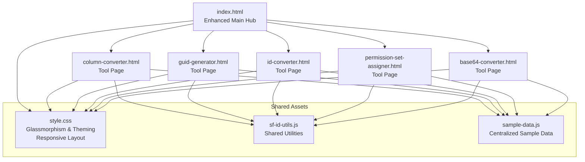
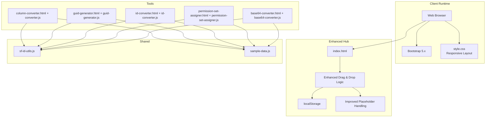
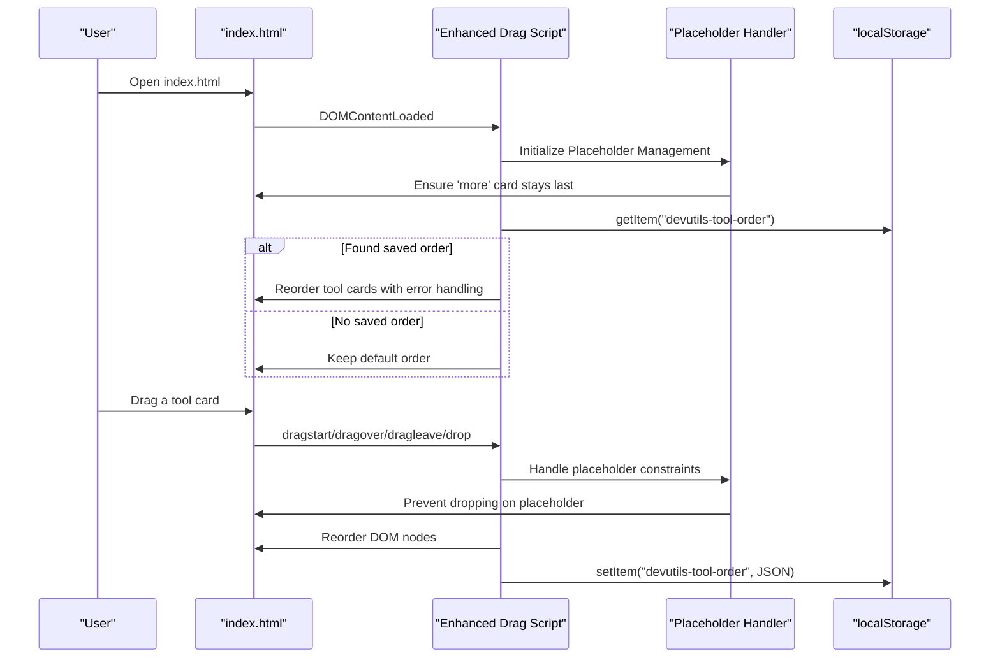
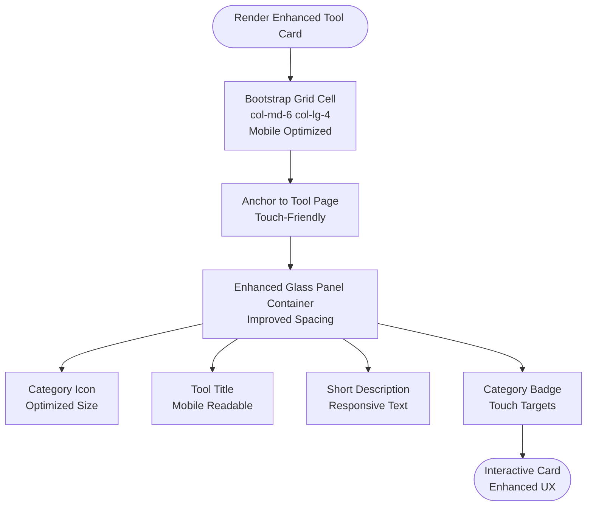
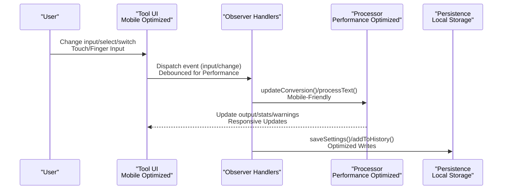
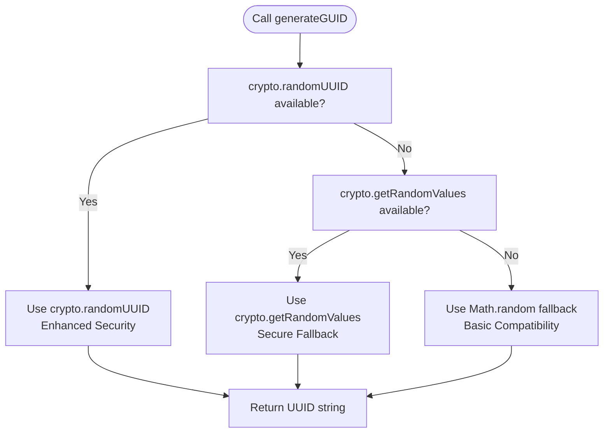
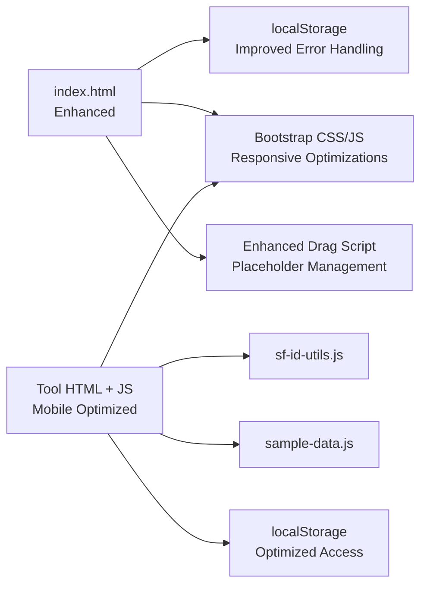

# Modular Tool Design Patterns

<cite>
**Referenced Files in This Document**
- [index.html](file://index.html)
- [style.css](file://style.css)
- [sf-id-utils.js](file://sf-id-utils.js)
- [converter.js](file://converter.js)
- [guid-generator.js](file://guid-generator.js)
- [column-converter.html](file://column-converter.html)
- [id-converter.js](file://id-converter.js)
- [permission-set-assigner.js](file://permission-set-assigner.js)
- [base64-converter.js](file://base64-converter.js)
- [sample-data.js](file://sample-data.js)
- [DESIGN.md](file://DESIGN.md)
- [README.md](file://README.md)
- [package.json](file://package.json)
</cite>

## Update Summary
**Changes Made**
- Enhanced drag-and-drop functionality with improved placeholder handling and ordering persistence
- Added responsive layout improvements for mobile device support
- Optimized scroll management for better user experience across devices
- Improved placeholder handling to ensure the "More Coming Soon" card stays at the end
- Enhanced localStorage persistence mechanism for saving user preferences reliably

## Table of Contents
1. [Introduction](#introduction)
2. [Project Structure](#project-structure)
3. [Core Components](#core-components)
4. [Architecture Overview](#architecture-overview)
5. [Detailed Component Analysis](#detailed-component-analysis)
6. [Dependency Analysis](#dependency-analysis)
7. [Performance Considerations](#performance-considerations)
8. [Troubleshooting Guide](#troubleshooting-guide)
9. [Conclusion](#conclusion)

## Introduction
This document explains the modular tool design patterns used in Developer Utilities. It focuses on how each tool operates as an independent module while sharing common utilities, the enhanced drag-and-drop reordering system for customizing tool arrangements with improved placeholder handling, the localStorage persistence mechanism, the tool card architecture with Bootstrap integration and glassmorphism UI, responsive design patterns optimized for mobile devices, and the factory, observer, and module patterns in practice. It also covers the tool discovery system, badge categorization, and the relationship between the main index hub and individual tool pages.

## Project Structure
The project is organized around a central index hub that lists tools as interactive cards with enhanced drag-and-drop capabilities. Each tool is a standalone HTML page with its own JavaScript logic, enabling independent operation while sharing common assets (CSS, shared utilities, and sample data). The index hub manages user preferences (tool ordering) via localStorage with improved placeholder handling and integrates Bootstrap's grid system for responsive layouts optimized for mobile devices.

**Diagram sources**
- [index.html](file://index.html)
- [column-converter.html](file://column-converter.html)
- [guid-generator.js](file://guid-generator.js)
- [id-converter.js](file://id-converter.js)
- [permission-set-assigner.js](file://permission-set-assigner.js)
- [base64-converter.js](file://base64-converter.js)
- [style.css](file://style.css)
- [sf-id-utils.js](file://sf-id-utils.js)
- [sample-data.js](file://sample-data.js)

**Section sources**
- [index.html](file://index.html)
- [style.css](file://style.css)
- [DESIGN.md](file://DESIGN.md)

## Core Components
- Enhanced Index Hub and Tool Cards
  - The hub renders a responsive grid of tool cards using Bootstrap's grid classes with improved mobile support. Each card is a draggable element with a category badge and links to the tool page.
  - Enhanced drag-and-drop reordering now includes robust placeholder handling, ensuring the "More Coming Soon" card stays at the end while preserving user preferences in localStorage under a dedicated key and restoring order on load.
- Shared Utilities Module
  - A small, self-contained utility module provides shared functions (e.g., Salesforce ID helpers) consumed by multiple tools.
- Tool Pages and Real-Time Processing
  - Each tool page initializes its own DOM listeners and processing pipeline, implementing an observer-like pattern by listening to input events and updating outputs reactively.
- Factory Pattern in GUID Generation
  - The GUID generator uses a factory-style function that selects the most secure method available and falls back gracefully, returning a UUID string.
- Module Pattern for Encapsulated Functions
  - Several tools expose helper functions (e.g., copy, toast, escape HTML) scoped to the module and attached to the window for inline handlers, demonstrating a module pattern with controlled exposure.

**Section sources**
- [index.html](file://index.html)
- [sf-id-utils.js](file://sf-id-utils.js)
- [converter.js](file://converter.js)
- [guid-generator.js](file://guid-generator.js)
- [column-converter.html](file://column-converter.html)
- [id-converter.js](file://id-converter.js)
- [permission-set-assigner.js](file://permission-set-assigner.js)
- [base64-converter.js](file://base64-converter.js)

## Architecture Overview
The system follows a modular, client-side-first architecture with enhanced responsive design:
- Central index hub orchestrates navigation and user preferences with improved drag-and-drop capabilities.
- Individual tools are self-contained pages with local state and persistence, optimized for mobile devices.
- Shared resources (CSS, utilities, sample data) are reused across tools with responsive layout improvements.
- UI patterns emphasize glassmorphism, Bootstrap grid, responsive breakpoints, and optimized scroll management.

**Diagram sources**
- [index.html](file://index.html)
- [column-converter.html](file://column-converter.html)
- [guid-generator.js](file://guid-generator.js)
- [id-converter.js](file://id-converter.js)
- [permission-set-assigner.js](file://permission-set-assigner.js)
- [base64-converter.js](file://base64-converter.js)
- [sf-id-utils.js](file://sf-id-utils.js)
- [sample-data.js](file://sample-data.js)
- [style.css](file://style.css)

## Detailed Component Analysis

### Enhanced Drag-and-Drop Reordering and localStorage Persistence
The hub implements an enhanced, self-executing script that:
- Loads saved order from localStorage and reorders the grid accordingly with improved error handling.
- Adds drag-and-drop listeners to each tool card with robust placeholder management.
- Updates the DOM order during drops and saves the new order to localStorage.
- Provides a reset button to clear saved preferences and reload the page.
- Ensures the "More Coming Soon" placeholder card stays at the end regardless of user actions.

**Diagram sources**
- [index.html](file://index.html)

**Section sources**
- [index.html](file://index.html)

### Tool Card Architecture and Glassmorphism UI
Each tool card is a Bootstrap grid cell with enhanced responsive design:
- Draggable attribute for DnD with improved visual feedback.
- A link to the tool page with hover effects optimized for touch devices.
- A glass-panel container with hover effects and mobile-friendly spacing.
- A category badge indicating tool domain with responsive sizing.
- Responsive sizing via col-md-6 col-lg-4 with mobile optimizations.

The design system defines:
- Glass panels with backdrop-filter blur and enhanced hover animations.
- Gradient accents and typography tokens optimized for mobile readability.
- Hover transforms and subtle shadows with touch-friendly interaction targets.
- Responsive breakpoints with optimized container paddings and mobile-specific styles.

**Diagram sources**
- [index.html](file://index.html)
- [style.css](file://style.css)
- [DESIGN.md](file://DESIGN.md)

**Section sources**
- [index.html](file://index.html)
- [style.css](file://style.css)
- [DESIGN.md](file://DESIGN.md)

### Observer Pattern in Real-Time Input Processing
Multiple tools implement an observer-like pattern with enhanced mobile support:
- They attach listeners to input elements and react to change/input events with optimized performance.
- On each event, they compute derived outputs, update statistics, and optionally persist settings.
- Mobile-specific optimizations ensure smooth interactions on touch devices.

Examples:
- Column Converter: Watches delimiter, quote, enclosure, and toggles; recomputes output and validates conflicts with mobile-friendly UI updates.
- ID Converter: Reacts to SOQL and clean modes to toggle output formatting and validation UI with responsive layouts.
- Permission Set Assigner: Validates and generates CSV on input changes with touch-optimized controls.
- Base64 Converter: Reacts to tab switches and encode/decode toggles to process text or files with mobile-specific optimizations.

**Diagram sources**
- [converter.js](file://converter.js)
- [id-converter.js](file://id-converter.js)
- [permission-set-assigner.js](file://permission-set-assigner.js)
- [base64-converter.js](file://base64-converter.js)

**Section sources**
- [converter.js](file://converter.js)
- [id-converter.js](file://id-converter.js)
- [permission-set-assigner.js](file://permission-set-assigner.js)
- [base64-converter.js](file://base64-converter.js)

### Factory Pattern in GUID Generation
The GUID generator exposes a factory-style function that:
- Prefers crypto.randomUUID for strong randomness with fallback support.
- Falls back to crypto.getRandomValues for broad compatibility.
- Uses a legacy Math.random-based approach for environments without secure crypto.

**Diagram sources**
- [guid-generator.js](file://guid-generator.js)

**Section sources**
- [guid-generator.js](file://guid-generator.js)

### Module Pattern for Encapsulated Utility Functions
Several tools define helper functions scoped to the module and attach them to the window for inline event handlers:
- Copy to clipboard with graceful fallback and enhanced error handling.
- Toast notifications with dynamic container creation and mobile optimization.
- HTML escaping for safe rendering with improved performance.

These functions are encapsulated within the tool's script and exposed only when the DOM is ready, minimizing global pollution while maintaining mobile-friendly accessibility.

**Section sources**
- [converter.js](file://converter.js)
- [guid-generator.js](file://guid-generator.js)
- [id-converter.js](file://id-converter.js)
- [permission-set-assigner.js](file://permission-set-assigner.js)
- [base64-converter.js](file://base64-converter.js)

### Tool Discovery System and Badge Categorization
- Discovery: The hub enumerates tools as cards with enhanced drag-and-drop capabilities, each linking to a dedicated page.
- Badge categorization: Each card displays a small badge indicating the tool's domain (e.g., Security, Utility, Admin, Developer, Salesforce) with improved mobile visibility.
- Relationship to main hub: The global navigation returns users to the hub with enhanced responsive design; each tool page includes a back button to the hub with optimized touch targets.

**Section sources**
- [index.html](file://index.html)
- [column-converter.html](file://column-converter.html)

### Shared Utilities and Sample Data
- Shared utilities: A small module provides reusable functions (e.g., Salesforce ID validation and conversion) consumed by tools that need ID normalization.
- Centralized sample data: A single module exports sample inputs for multiple tools, enabling quick demos and testing with enhanced mobile accessibility.

**Section sources**
- [sf-id-utils.js](file://sf-id-utils.js)
- [sample-data.js](file://sample-data.js)

## Dependency Analysis
The hub depends on:
- localStorage for user preferences with enhanced error handling.
- Bootstrap CSS/JS for UI and components with responsive optimizations.
- Inline drag-and-drop script for reordering with improved placeholder management.

Tools depend on:
- Shared utilities and sample data modules with enhanced mobile support.
- Bootstrap for layout and components with responsive design patterns.
- Local storage for per-tool settings/history with optimized performance.

**Diagram sources**
- [index.html](file://index.html)
- [column-converter.html](file://column-converter.html)
- [guid-generator.js](file://guid-generator.js)
- [id-converter.js](file://id-converter.js)
- [permission-set-assigner.js](file://permission-set-assigner.js)
- [base64-converter.js](file://base64-converter.js)
- [sf-id-utils.js](file://sf-id-utils.js)
- [sample-data.js](file://sample-data.js)
- [style.css](file://style.css)

**Section sources**
- [index.html](file://index.html)
- [column-converter.html](file://column-converter.html)
- [guid-generator.js](file://guid-generator.js)
- [id-converter.js](file://id-converter.js)
- [permission-set-assigner.js](file://permission-set-assigner.js)
- [base64-converter.js](file://base64-converter.js)
- [sf-id-utils.js](file://sf-id-utils.js)
- [sample-data.js](file://sample-data.js)
- [style.css](file://style.css)

## Performance Considerations
- Local-first processing ensures no network overhead and keeps data private with enhanced error handling.
- Input limits and validation prevent UI freezes (e.g., Base64 tool enforces character limits) with mobile optimizations.
- Enhanced DOM manipulation during drag-and-drop reduces layout thrashing with improved placeholder management.
- Encapsulation avoids unnecessary global state and reduces coupling with responsive design patterns.
- Mobile-specific optimizations improve touch interactions and scroll performance.

## Troubleshooting Guide
- Enhanced drag-and-drop not working
  - Ensure the drag script runs after DOMContentLoaded and that localStorage is accessible with proper error handling.
  - Verify that tool cards have the draggable attribute and proper event listeners.
  - Check that the placeholder card ("more") is properly handled and stays at the end.
- Tool settings not persisting
  - Confirm the tool-specific storage keys exist and are being written/read correctly with enhanced error handling.
  - Check for JSON parsing errors when restoring settings with improved logging.
- Copy to clipboard failures
  - Some environments lack secure context; the tools include a fallback using a temporary textarea with enhanced error reporting.
- Validation warnings
  - Tools surface warnings when detected conflicts are present (e.g., delimiter in input, quotes, brackets) with improved mobile accessibility.
- Mobile responsiveness issues
  - Ensure viewport meta tag is properly configured for responsive design.
  - Check that touch targets are appropriately sized for mobile devices.
  - Verify that scroll management works correctly across different screen sizes.

**Section sources**
- [index.html](file://index.html)
- [converter.js](file://converter.js)
- [base64-converter.js](file://base64-converter.js)
- [guid-generator.js](file://guid-generator.js)
- [id-converter.js](file://id-converter.js)
- [permission-set-assigner.js](file://permission-set-assigner.js)

## Conclusion
Developer Utilities demonstrates a clean, modular architecture where each tool is an independent module sharing common utilities and UI patterns. The enhanced index hub provides discovery and customization via improved drag-and-drop reordering with localStorage persistence and robust placeholder handling. Tools implement real-time processing using an observer-like pattern with mobile optimizations, while shared utilities and sample data reduce duplication. The enhanced glassmorphism UI and Bootstrap grid deliver a cohesive, responsive experience across devices with optimized scroll management and touch-friendly interactions.