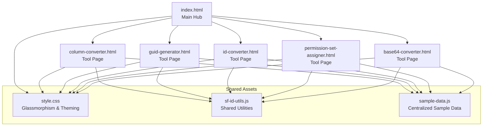
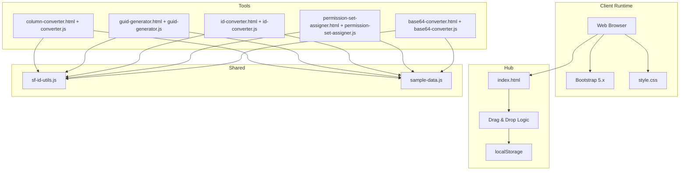
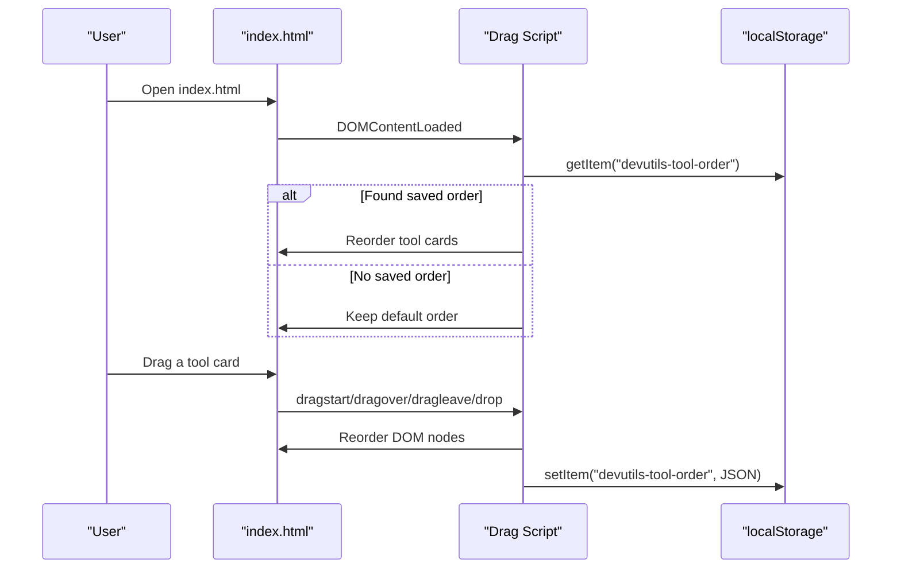
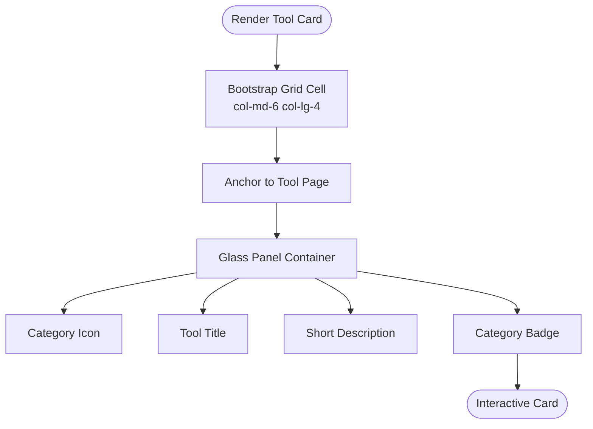
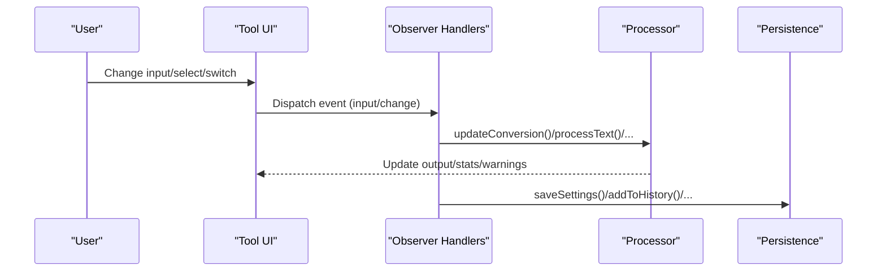
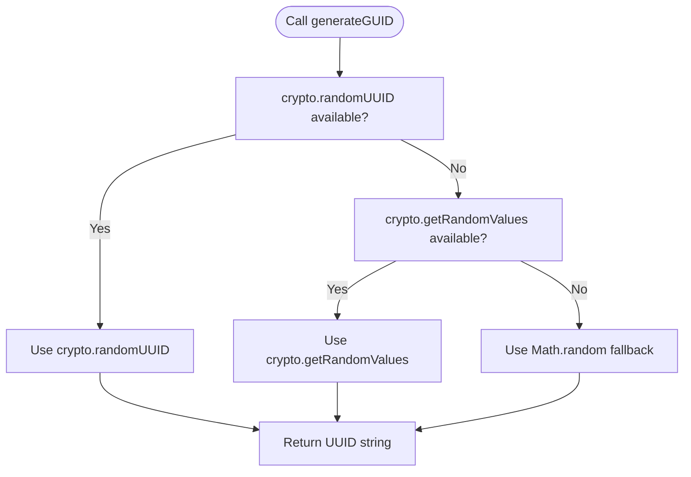
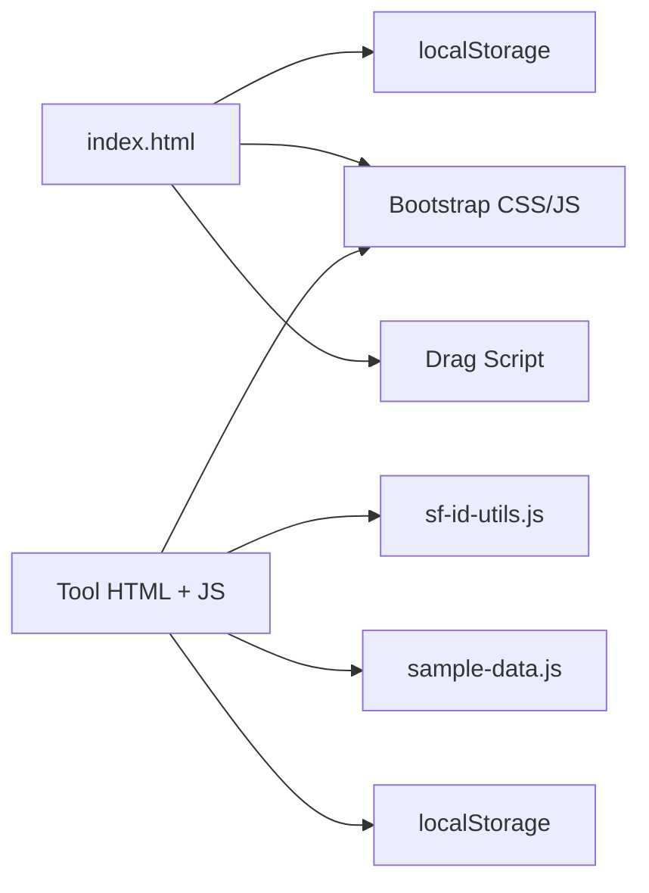

# Modular Tool Design Patterns

<cite>
**Referenced Files in This Document**
- [index.html](file://index.html)
- [style.css](file://style.css)
- [sf-id-utils.js](file://sf-id-utils.js)
- [converter.js](file://converter.js)
- [guid-generator.js](file://guid-generator.js)
- [column-converter.html](file://column-converter.html)
- [id-converter.js](file://id-converter.js)
- [permission-set-assigner.js](file://permission-set-assigner.js)
- [base64-converter.js](file://base64-converter.js)
- [sample-data.js](file://sample-data.js)
- [DESIGN.md](file://DESIGN.md)
- [README.md](file://README.md)
- [package.json](file://package.json)
</cite>

## Table of Contents
1. [Introduction](#introduction)
2. [Project Structure](#project-structure)
3. [Core Components](#core-components)
4. [Architecture Overview](#architecture-overview)
5. [Detailed Component Analysis](#detailed-component-analysis)
6. [Dependency Analysis](#dependency-analysis)
7. [Performance Considerations](#performance-considerations)
8. [Troubleshooting Guide](#troubleshooting-guide)
9. [Conclusion](#conclusion)

## Introduction
This document explains the modular tool design patterns used in Developer Utilities. It focuses on how each tool operates as an independent module while sharing common utilities, the drag-and-drop reordering system for customizing tool arrangements, the localStorage persistence mechanism, the tool card architecture with Bootstrap integration and glassmorphism UI, responsive design patterns, and the factory, observer, and module patterns in practice. It also covers the tool discovery system, badge categorization, and the relationship between the main index hub and individual tool pages.

## Project Structure
The project is organized around a central index hub that lists tools as interactive cards. Each tool is a standalone HTML page with its own JavaScript logic, enabling independent operation while sharing common assets (CSS, shared utilities, and sample data). The index hub manages user preferences (tool ordering) via localStorage and integrates Bootstrap’s grid system for responsive layouts.

**Diagram sources**
- [index.html](file://index.html)
- [column-converter.html](file://column-converter.html)
- [guid-generator.js](file://guid-generator.js)
- [id-converter.js](file://id-converter.js)
- [permission-set-assigner.js](file://permission-set-assigner.js)
- [base64-converter.js](file://base64-converter.js)
- [style.css](file://style.css)
- [sf-id-utils.js](file://sf-id-utils.js)
- [sample-data.js](file://sample-data.js)

**Section sources**
- [index.html](file://index.html)
- [style.css](file://style.css)
- [DESIGN.md](file://DESIGN.md)

## Core Components
- Index Hub and Tool Cards
  - The hub renders a responsive grid of tool cards using Bootstrap’s grid classes. Each card is a draggable element with a category badge and links to the tool page.
  - Drag-and-drop reordering persists user preferences in localStorage under a dedicated key and restores order on load.
- Shared Utilities Module
  - A small, self-contained utility module provides shared functions (e.g., Salesforce ID helpers) consumed by multiple tools.
- Tool Pages and Real-Time Processing
  - Each tool page initializes its own DOM listeners and processing pipeline, implementing an observer-like pattern by listening to input events and updating outputs reactively.
- Factory Pattern in GUID Generation
  - The GUID generator uses a factory-style function that selects the most secure method available and falls back gracefully, returning a UUID string.
- Module Pattern for Encapsulated Functions
  - Several tools expose helper functions (e.g., copy, toast, escape HTML) scoped to the module and attached to the window for inline handlers, demonstrating a module pattern with controlled exposure.

**Section sources**
- [index.html](file://index.html)
- [sf-id-utils.js](file://sf-id-utils.js)
- [converter.js](file://converter.js)
- [guid-generator.js](file://guid-generator.js)
- [column-converter.html](file://column-converter.html)
- [id-converter.js](file://id-converter.js)
- [permission-set-assigner.js](file://permission-set-assigner.js)
- [base64-converter.js](file://base64-converter.js)

## Architecture Overview
The system follows a modular, client-side-first architecture:
- Central index hub orchestrates navigation and user preferences.
- Individual tools are self-contained pages with local state and persistence.
- Shared resources (CSS, utilities, sample data) are reused across tools.
- UI patterns emphasize glassmorphism, Bootstrap grid, and responsive breakpoints.

**Diagram sources**
- [index.html](file://index.html)
- [column-converter.html](file://column-converter.html)
- [guid-generator.js](file://guid-generator.js)
- [id-converter.js](file://id-converter.js)
- [permission-set-assigner.js](file://permission-set-assigner.js)
- [base64-converter.js](file://base64-converter.js)
- [sf-id-utils.js](file://sf-id-utils.js)
- [sample-data.js](file://sample-data.js)
- [style.css](file://style.css)

## Detailed Component Analysis

### Drag-and-Drop Reordering and localStorage Persistence
The hub implements a compact, self-executing script that:
- Loads saved order from localStorage and reorders the grid accordingly.
- Adds drag-and-drop listeners to each tool card.
- Updates the DOM order during drops and saves the new order to localStorage.
- Provides a reset button to clear saved preferences and reload the page.

**Diagram sources**
- [index.html](file://index.html)

**Section sources**
- [index.html](file://index.html)

### Tool Card Architecture and Glassmorphism UI
Each tool card is a Bootstrap grid cell with:
- Draggable attribute for DnD.
- A link to the tool page.
- A glass-panel container with hover effects.
- A category badge indicating tool domain.
- Responsive sizing via col-md-6 col-lg-4.

The design system defines:
- Glass panels with backdrop-filter blur.
- Gradient accents and typography tokens.
- Hover transforms and subtle shadows.
- Responsive breakpoints and container paddings.

**Diagram sources**
- [index.html](file://index.html)
- [style.css](file://style.css)
- [DESIGN.md](file://DESIGN.md)

**Section sources**
- [index.html](file://index.html)
- [style.css](file://style.css)
- [DESIGN.md](file://DESIGN.md)

### Observer Pattern in Real-Time Input Processing
Multiple tools implement an observer-like pattern:
- They attach listeners to input elements and react to change/input events.
- On each event, they compute derived outputs, update statistics, and optionally persist settings.

Examples:
- Column Converter: Watches delimiter, quote, enclosure, and toggles; recomputes output and validates conflicts.
- ID Converter: Reacts to SOQL and clean modes to toggle output formatting and validation UI.
- Permission Set Assigner: Validates and generates CSV on input changes.
- Base64 Converter: Reacts to tab switches and encode/decode toggles to process text or files.

**Diagram sources**
- [converter.js](file://converter.js)
- [id-converter.js](file://id-converter.js)
- [permission-set-assigner.js](file://permission-set-assigner.js)
- [base64-converter.js](file://base64-converter.js)

**Section sources**
- [converter.js](file://converter.js)
- [id-converter.js](file://id-converter.js)
- [permission-set-assigner.js](file://permission-set-assigner.js)
- [base64-converter.js](file://base64-converter.js)

### Factory Pattern in GUID Generation
The GUID generator exposes a factory-style function that:
- Prefers crypto.randomUUID for strong randomness.
- Falls back to crypto.getRandomValues for broad compatibility.
- Uses a legacy Math.random-based approach for environments without secure crypto.

**Diagram sources**
- [guid-generator.js](file://guid-generator.js)

**Section sources**
- [guid-generator.js](file://guid-generator.js)

### Module Pattern for Encapsulated Utility Functions
Several tools define helper functions scoped to the module and attach them to the window for inline event handlers:
- Copy to clipboard with graceful fallback.
- Toast notifications with dynamic container creation.
- HTML escaping for safe rendering.

These functions are encapsulated within the tool’s script and exposed only when the DOM is ready, minimizing global pollution.

**Section sources**
- [converter.js](file://converter.js)
- [guid-generator.js](file://guid-generator.js)
- [id-converter.js](file://id-converter.js)
- [permission-set-assigner.js](file://permission-set-assigner.js)
- [base64-converter.js](file://base64-converter.js)

### Tool Discovery System and Badge Categorization
- Discovery: The hub enumerates tools as cards, each linking to a dedicated page.
- Badge categorization: Each card displays a small badge indicating the tool’s domain (e.g., Security, Utility, Admin, Developer, Salesforce).
- Relationship to main hub: The global navigation returns users to the hub; each tool page includes a back button to the hub.

**Section sources**
- [index.html](file://index.html)
- [column-converter.html](file://column-converter.html)

### Shared Utilities and Sample Data
- Shared utilities: A small module provides reusable functions (e.g., Salesforce ID validation and conversion) consumed by tools that need ID normalization.
- Centralized sample data: A single module exports sample inputs for multiple tools, enabling quick demos and testing.

**Section sources**
- [sf-id-utils.js](file://sf-id-utils.js)
- [sample-data.js](file://sample-data.js)

## Dependency Analysis
The hub depends on:
- localStorage for user preferences.
- Bootstrap CSS/JS for UI and components.
- Inline drag-and-drop script for reordering.

Tools depend on:
- Shared utilities and sample data modules.
- Bootstrap for layout and components.
- Local storage for per-tool settings/history.

**Diagram sources**
- [index.html](file://index.html)
- [column-converter.html](file://column-converter.html)
- [guid-generator.js](file://guid-generator.js)
- [id-converter.js](file://id-converter.js)
- [permission-set-assigner.js](file://permission-set-assigner.js)
- [base64-converter.js](file://base64-converter.js)
- [sf-id-utils.js](file://sf-id-utils.js)
- [sample-data.js](file://sample-data.js)
- [style.css](file://style.css)

**Section sources**
- [index.html](file://index.html)
- [column-converter.html](file://column-converter.html)
- [guid-generator.js](file://guid-generator.js)
- [id-converter.js](file://id-converter.js)
- [permission-set-assigner.js](file://permission-set-assigner.js)
- [base64-converter.js](file://base64-converter.js)
- [sf-id-utils.js](file://sf-id-utils.js)
- [sample-data.js](file://sample-data.js)
- [style.css](file://style.css)

## Performance Considerations
- Local-first processing ensures no network overhead and keeps data private.
- Input limits and validation prevent UI freezes (e.g., Base64 tool enforces character limits).
- Minimal DOM manipulation during drag-and-drop reduces layout thrashing.
- Encapsulation avoids unnecessary global state and reduces coupling.

[No sources needed since this section provides general guidance]

## Troubleshooting Guide
- Drag-and-drop not working
  - Ensure the drag script runs after DOMContentLoaded and that localStorage is accessible.
  - Verify that tool cards have the draggable attribute and proper event listeners.
- Tool settings not persisting
  - Confirm the tool-specific storage keys exist and are being written/read correctly.
  - Check for JSON parsing errors when restoring settings.
- Copy to clipboard failures
  - Some environments lack secure context; the tools include a fallback using a temporary textarea.
- Validation warnings
  - Tools surface warnings when detected conflicts are present (e.g., delimiter in input, quotes, brackets). Adjust settings accordingly.

**Section sources**
- [index.html](file://index.html)
- [converter.js](file://converter.js)
- [base64-converter.js](file://base64-converter.js)
- [guid-generator.js](file://guid-generator.js)
- [id-converter.js](file://id-converter.js)
- [permission-set-assigner.js](file://permission-set-assigner.js)

## Conclusion
Developer Utilities demonstrates a clean, modular architecture where each tool is an independent module sharing common utilities and UI patterns. The index hub provides discovery and customization via drag-and-drop reordering with localStorage persistence. Tools implement real-time processing using an observer-like pattern, while shared utilities and sample data reduce duplication. The glassmorphism UI and Bootstrap grid deliver a cohesive, responsive experience across devices.

[No sources needed since this section summarizes without analyzing specific files]