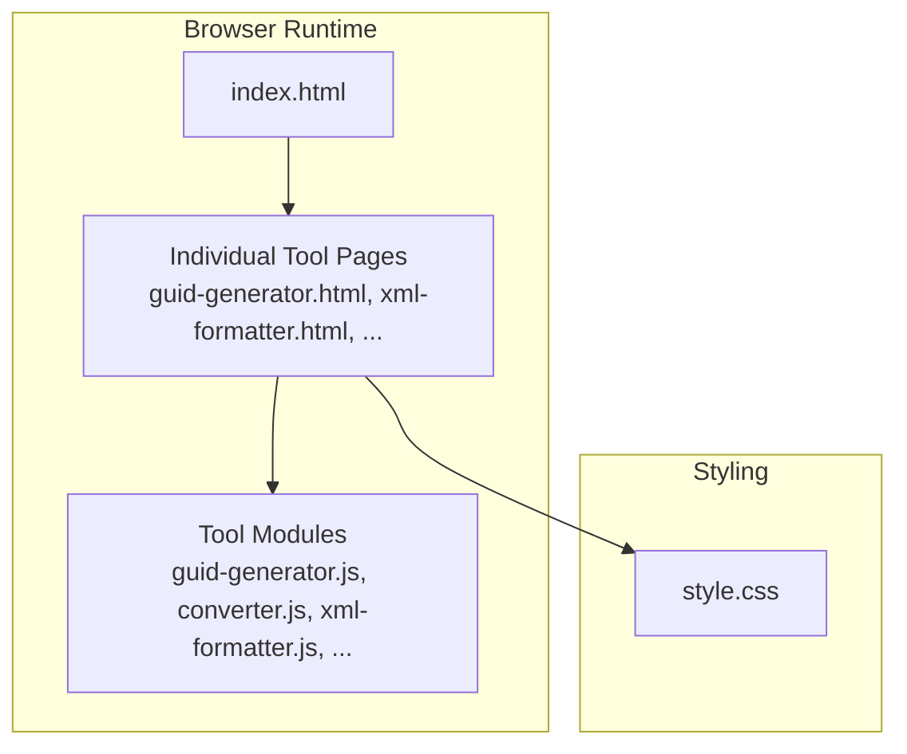
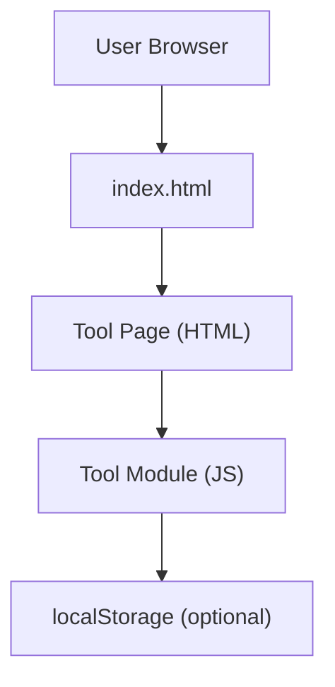
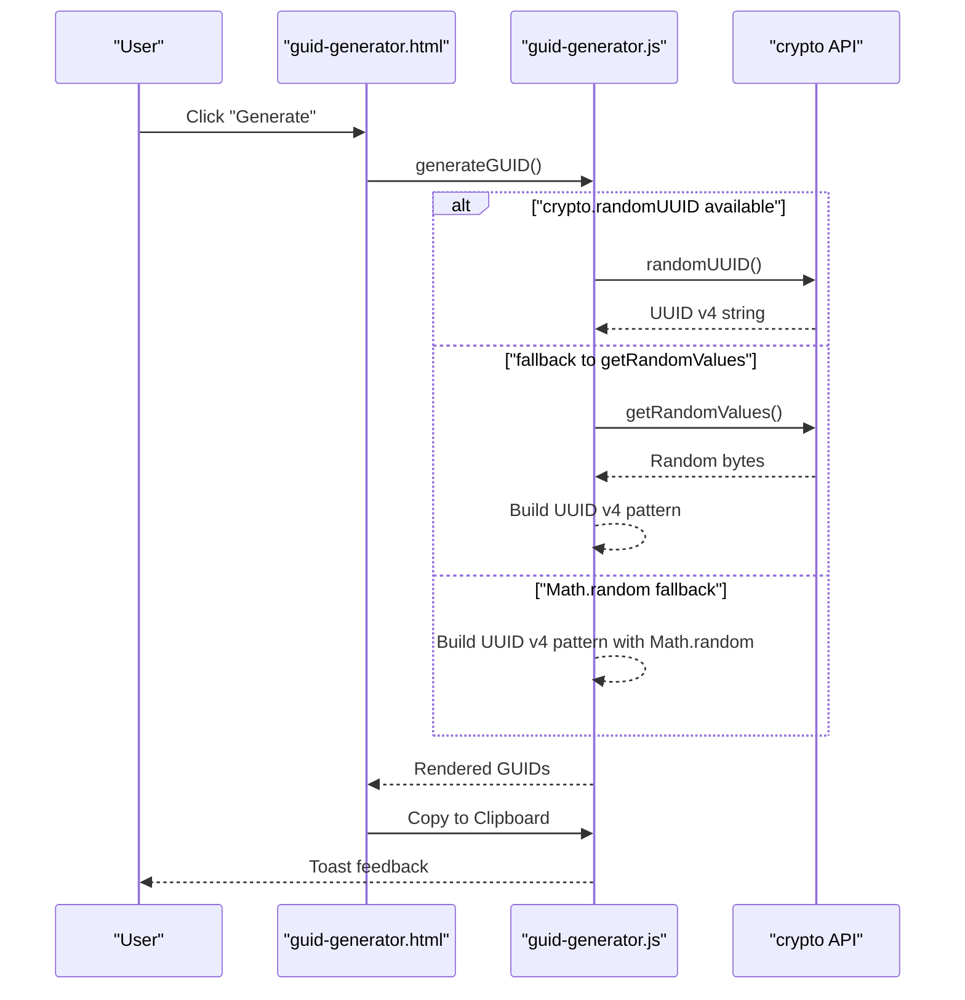
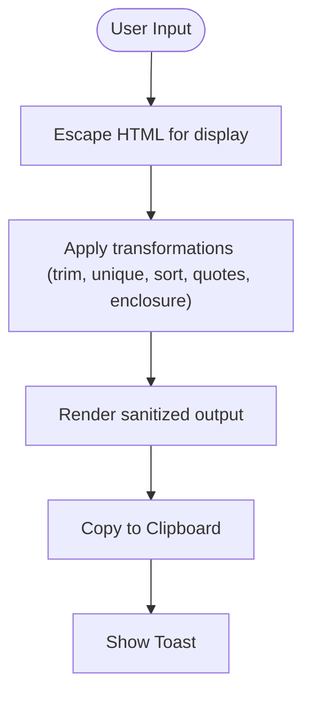
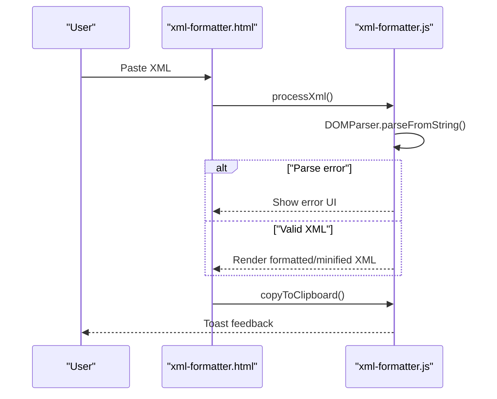
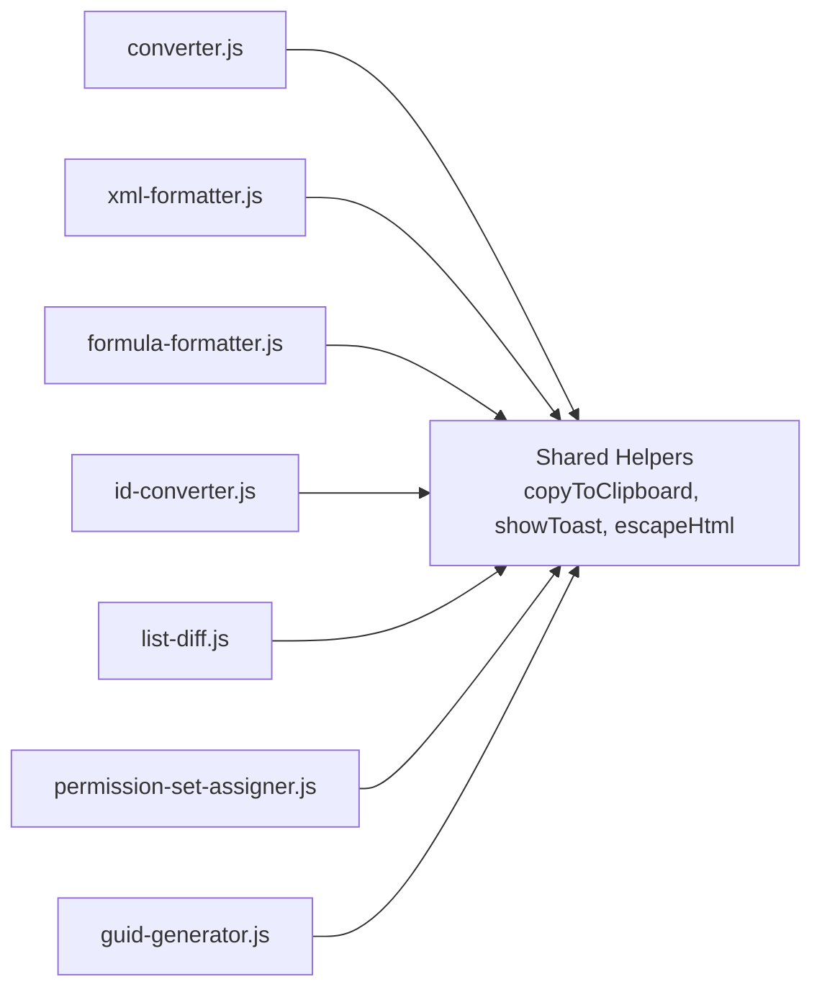

# Security Model

<cite>
**Referenced Files in This Document**
- [package.json](file://package.json)
- [DESIGN.md](file://DESIGN.md)
- [index.html](file://index.html)
- [style.css](file://style.css)
- [guid-generator.html](file://guid-generator.html)
- [guid-generator.js](file://guid-generator.js)
- [converter.js](file://converter.js)
- [xml-formatter.js](file://xml-formatter.js)
- [formula-formatter.js](file://formula-formatter.js)
- [id-converter.js](file://id-converter.js)
- [list-diff.js](file://list-diff.js)
- [permission-set-assigner.js](file://permission-set-assigner.js)
- [sf-id-utils.js](file://sf-id-utils.js)
- [guid-generator.test.js](file://guid-generator.test.js)
- [sf-id-utils.test.js](file://sf-id-utils.test.js)
</cite>

## Table of Contents
1. [Introduction](#introduction)
2. [Project Structure](#project-structure)
3. [Core Components](#core-components)
4. [Architecture Overview](#architecture-overview)
5. [Detailed Component Analysis](#detailed-component-analysis)
6. [Dependency Analysis](#dependency-analysis)
7. [Performance Considerations](#performance-considerations)
8. [Troubleshooting Guide](#troubleshooting-guide)
9. [Conclusion](#conclusion)
10. [Appendices](#appendices)

## Introduction
This document defines the security model for Developer Utilities with a privacy-first, local-first design. The system is architected to perform all processing on the user’s device, ensuring no data is transmitted beyond the browser. It documents XSS prevention, secure random number generation, cryptographic guarantees for GUIDs, data retention and deletion controls, trust model, threat modeling, and best practices for local-first applications.

## Project Structure
Developer Utilities is a static, client-side application composed of multiple tools, each implemented as a self-contained HTML page plus a JavaScript module. The application emphasizes:
- All processing runs locally in the browser
- Minimal external dependencies
- Transparent, user-controlled data handling

**Diagram sources**
- [index.html](file://index.html)
- [guid-generator.html](file://guid-generator.html)
- [style.css](file://style.css)

**Section sources**
- [package.json](file://package.json)
- [DESIGN.md](file://DESIGN.md)
- [index.html](file://index.html)
- [style.css](file://style.css)

## Core Components
- Privacy-first runtime: All tools run entirely in the browser with no network requests.
- XSS prevention: Input validation, output encoding, and safe rendering patterns.
- Secure randomness: Prefer WebCrypto APIs with graceful fallbacks.
- Data retention: Session-scoped history with explicit user controls; optional persistent settings stored in localStorage.
- Trust model: No server-side logging or data collection; all data remains on the device.

**Section sources**
- [package.json](file://package.json)
- [DESIGN.md](file://DESIGN.md)
- [guid-generator.js](file://guid-generator.js)
- [converter.js](file://converter.js)

## Architecture Overview
The application follows a static, single-page-application-like architecture where each tool is a separate HTML page that loads its corresponding JavaScript module. There is no backend; all state is ephemeral per-session unless persisted via localStorage.

**Diagram sources**
- [index.html](file://index.html)
- [guid-generator.html](file://guid-generator.html)
- [guid-generator.js](file://guid-generator.js)

**Section sources**
- [index.html](file://index.html)
- [guid-generator.html](file://guid-generator.html)
- [guid-generator.js](file://guid-generator.js)

## Detailed Component Analysis

### GUID Generator Security
- Randomness: Uses WebCrypto randomUUID when available, falls back to crypto.getRandomValues, and finally to Math.random for legacy contexts. The fallback preserves functionality while acknowledging reduced cryptographic strength.
- Output rendering: History previews are escaped before insertion into the DOM to prevent XSS.
- Session history: Stored in-memory with a fixed limit; cleared on page reload.

**Diagram sources**
- [guid-generator.html](file://guid-generator.html)
- [guid-generator.js](file://guid-generator.js)

**Section sources**
- [guid-generator.js](file://guid-generator.js)
- [guid-generator.html](file://guid-generator.html)
- [guid-generator.test.js](file://guid-generator.test.js)

### Column Converter Security
- XSS prevention: Input and output are HTML-escaped before rendering into the DOM.
- Settings persistence: Uses localStorage with a scoped key; no server communication.
- Clipboard operations: Uses the Clipboard API when available and safe; otherwise falls back to a textarea-based method.

**Diagram sources**
- [converter.js](file://converter.js)

**Section sources**
- [converter.js](file://converter.js)

### XML Formatter Security
- DOM parsing: Uses DOMParser with strict XML parsing; errors are caught and surfaced safely.
- Clipboard operations: Same secure copy strategy as other tools.

**Diagram sources**
- [xml-formatter.js](file://xml-formatter.js)

**Section sources**
- [xml-formatter.js](file://xml-formatter.js)

### Formula Formatter Security
- Safe rendering: Output is shown in a textarea and copied via secure methods.
- Clipboard operations: Same secure copy strategy.

**Section sources**
- [formula-formatter.js](file://formula-formatter.js)

### ID Converter Security
- Input validation: Validates Salesforce ID lengths and formats; invalid entries are marked.
- Output formatting: Supports clean or verbose modes; invalid IDs are clearly indicated.
- Clipboard operations: Secure copy with fallback.

**Section sources**
- [id-converter.js](file://id-converter.js)
- [sf-id-utils.js](file://sf-id-utils.js)
- [sf-id-utils.test.js](file://sf-id-utils.test.js)

### List Diff Security
- Safe rendering: Results are HTML-escaped before insertion into the DOM.
- Clipboard operations: Secure copy with fallback.

**Section sources**
- [list-diff.js](file://list-diff.js)

### Permission Set Assigner Security
- Input cleaning: Regex-based extraction of IDs with optional deduplication.
- Output generation: CSV/TSV produced in memory; downloaded or copied securely.
- Clipboard operations: Secure copy with fallback.

**Section sources**
- [permission-set-assigner.js](file://permission-set-assigner.js)

## Dependency Analysis
- Internal dependencies: Tools depend on shared helpers (e.g., copyToClipboard, showToast, escapeHtml) implemented within each module.
- External dependencies: Bootstrap and Bootstrap Icons loaded from CDN; these are used for UI and icons only, not for analytics or telemetry.
- Storage: localStorage is used for settings persistence in some tools; session history is in-memory.

**Diagram sources**
- [converter.js](file://converter.js)
- [xml-formatter.js](file://xml-formatter.js)
- [formula-formatter.js](file://formula-formatter.js)
- [id-converter.js](file://id-converter.js)
- [list-diff.js](file://list-diff.js)
- [permission-set-assigner.js](file://permission-set-assigner.js)
- [guid-generator.js](file://guid-generator.js)

**Section sources**
- [converter.js](file://converter.js)
- [xml-formatter.js](file://xml-formatter.js)
- [formula-formatter.js](file://formula-formatter.js)
- [id-converter.js](file://id-converter.js)
- [list-diff.js](file://list-diff.js)
- [permission-set-assigner.js](file://permission-set-assigner.js)
- [guid-generator.js](file://guid-generator.js)

## Performance Considerations
- Client-side processing: Heavy transformations occur in the browser; performance depends on device capabilities.
- Clipboard operations: Prefer the Clipboard API when available to avoid DOM manipulation overhead.
- Rendering: Avoid unnecessary reflows by batching DOM updates (already applied in most tools).

## Troubleshooting Guide
- Clipboard fails: The application gracefully falls back to a textarea-based copy mechanism. If both fail, the user is notified via toast messages.
- XML parsing errors: Errors are caught and displayed; ensure input is valid XML.
- History not persisting: History is session-scoped and cleared on reload. Use copy/save actions to retain results.

**Section sources**
- [guid-generator.js](file://guid-generator.js)
- [converter.js](file://converter.js)
- [xml-formatter.js](file://xml-formatter.js)
- [formula-formatter.js](file://formula-formatter.js)
- [id-converter.js](file://id-converter.js)
- [list-diff.js](file://list-diff.js)
- [permission-set-assigner.js](file://permission-set-assigner.js)

## Conclusion
Developer Utilities adheres to a privacy-first, local-first security model. All processing occurs in the browser, with robust XSS prevention, secure clipboard handling, and minimal data retention. The design ensures no server-side logging or data collection, maintaining user trust and compliance with privacy expectations.

## Appendices

### XSS Prevention Measures
- Input sanitization: Regular expressions and validation routines restrict input formats.
- Output encoding: Functions escape HTML before rendering into the DOM.
- Safe rendering: Results are inserted into textareas or sanitized containers.

**Section sources**
- [converter.js](file://converter.js)
- [list-diff.js](file://list-diff.js)
- [id-converter.js](file://id-converter.js)

### Secure Random Number Generation
- Prefer WebCrypto randomUUID for strong randomness.
- Fallback to crypto.getRandomValues for broad compatibility.
- Final fallback to Math.random for legacy environments, with a note that it is less secure.

**Section sources**
- [guid-generator.js](file://guid-generator.js)
- [guid-generator.test.js](file://guid-generator.test.js)

### Cryptographic Security of GUIDs
- UUID v4 generation: Pattern-based construction with cryptographically strong randomness when available.
- Collision probability: For UUID v4, the probability of collision is negligible for practical usage within this application.

**Section sources**
- [guid-generator.js](file://guid-generator.js)
- [guid-generator.test.js](file://guid-generator.test.js)

### Data Retention Policies
- Session-based history: Maintained in-memory with a fixed limit; automatically pruned.
- User-controlled deletion: Users can delete individual history items or rely on natural pruning.
- Optional persistent settings: Stored in localStorage with a scoped key; users can clear browser data to remove persisted settings.

**Section sources**
- [guid-generator.js](file://guid-generator.js)
- [converter.js](file://converter.js)

### Trust Model
- No server-side logging: The application does not transmit data beyond the browser.
- Minimal data collection: Only localStorage-backed settings are persisted; no analytics or telemetry.
- Transparent data handling: All data remains on the user’s device; users can review and delete results.

**Section sources**
- [package.json](file://package.json)
- [DESIGN.md](file://DESIGN.md)

### Threat Modeling and Best Practices
- Attack surface: Minimal; no backend, no third-party scripts except UI libraries.
- Best practices:
  - Always escape HTML when rendering dynamic content.
  - Prefer Clipboard API with secure context checks.
  - Validate and sanitize inputs rigorously.
  - Keep session history bounded and user-controlled.
  - Avoid storing sensitive data in localStorage unless absolutely necessary.

[No sources needed since this section provides general guidance]