# Styling Architecture

<cite>
**Referenced Files in This Document**
- [style.css](file://style.css)
- [DESIGN.md](file://DESIGN.md)
- [style-guide.html](file://style-guide.html)
- [index.html](file://index.html)
- [apex-debug-log.html](file://apex-debug-log.html)
- [column-converter.html](file://column-converter.html)
- [guid-generator.html](file://guid-generator.html)
- [xml-formatter.html](file://xml-formatter.html)
- [package.json](file://package.json)
</cite>

## Table of Contents
1. [Introduction](#introduction)
2. [Project Structure](#project-structure)
3. [Core Components](#core-components)
4. [Architecture Overview](#architecture-overview)
5. [Detailed Component Analysis](#detailed-component-analysis)
6. [Dependency Analysis](#dependency-analysis)
7. [Performance Considerations](#performance-considerations)
8. [Troubleshooting Guide](#troubleshooting-guide)
9. [Conclusion](#conclusion)
10. [Appendices](#appendices)

## Introduction
This document describes the styling architecture and design system of Developer Utilities. The project integrates Bootstrap 5.3.2 for layout primitives and component defaults, augments them with a cohesive dark theme centered on glassmorphism, and applies a utility-first approach with reusable classes. The system emphasizes:
- Bootstrap 5.3.2 integration and customization
- A custom CSS variable-driven theming system
- Glassmorphism effects via backdrop filters and modern shadows
- Inter and monospace font families, plus Bootstrap Icons
- Responsive design with mobile-first Bootstrap grid and custom breakpoints
- A style guide for consistent component variants and usage
- Accessibility-aligned contrast and motion guidelines

## Project Structure
The styling system is organized around a single stylesheet and a style guide page that documents reusable components and patterns. Individual tool pages share a common base layout and rely on shared styles for consistency.

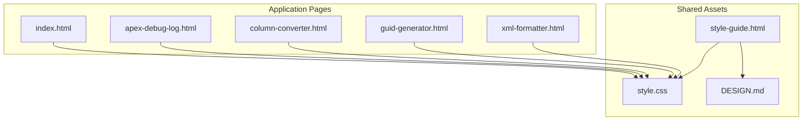

**Diagram sources**
- [style.css](file://style.css)
- [DESIGN.md](file://DESIGN.md)
- [style-guide.html](file://style-guide.html)
- [index.html](file://index.html)
- [apex-debug-log.html](file://apex-debug-log.html)
- [column-converter.html](file://column-converter.html)
- [guid-generator.html](file://guid-generator.html)
- [xml-formatter.html](file://xml-formatter.html)

**Section sources**
- [style.css](file://style.css)
- [DESIGN.md](file://DESIGN.md)
- [style-guide.html](file://style-guide.html)
- [index.html](file://index.html)
- [apex-debug-log.html](file://apex-debug-log.html)
- [column-converter.html](file://column-converter.html)
- [guid-generator.html](file://guid-generator.html)
- [xml-formatter.html](file://xml-formatter.html)

## Core Components
The core styling system revolves around:
- CSS custom properties for theming
- Glass panels and hover effects
- Typography and gradient text
- Form controls and glass inputs
- Buttons and segmented controls
- Navigation and tabs
- Scrollbar customization
- Responsive desktop app layout and mobile overrides

Key implementation anchors:
- Theming variables and gradients
- Glass panel and hover-glass classes
- Typography and text-gradient
- Form controls and glass-input
- Buttons and outline-light
- Global navigation and dropdown
- Segmented control active state
- Glass tabs
- Table fixes inside glass panels
- Scrollbar overrides

**Section sources**
- [style.css](file://style.css)
- [DESIGN.md](file://DESIGN.md)

## Architecture Overview
The styling architecture blends Bootstrap’s utility classes with custom CSS variables and reusable component classes. The design system centers on a dark theme with glassmorphism, consistent spacing, and a developer-focused aesthetic.

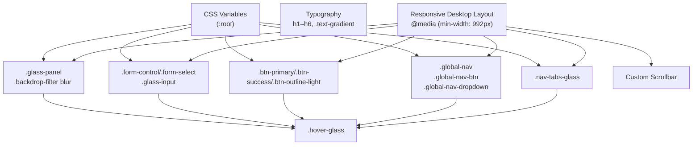

**Diagram sources**
- [style.css](file://style.css)

**Section sources**
- [style.css](file://style.css)

## Detailed Component Analysis

### Theming and CSS Variables
- Purpose: Centralize color tokens, gradients, and shadows for consistent theming across components.
- Implementation: Defines variables for background, card surfaces, text, accents, borders, and glass shadows.
- Usage: Consumed by components to maintain a unified palette and reduce duplication.

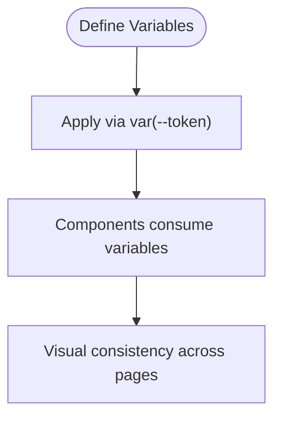

**Diagram sources**
- [style.css](file://style.css)

**Section sources**
- [style.css](file://style.css)
- [DESIGN.md](file://DESIGN.md)

### Glassmorphism Panels and Hover Effects
- Purpose: Provide layered, translucent surfaces with backdrop blur for depth and modern UI.
- Implementation: A dedicated class sets background, border, radius, and shadow; hover variant enhances elevation and border accent.
- Usage: Applied to panels, cards, and dropdowns for consistent depth.

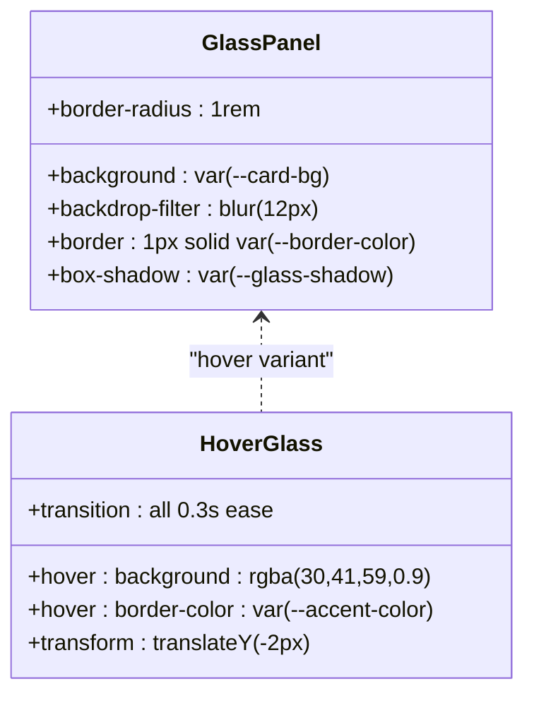

**Diagram sources**
- [style.css](file://style.css)

**Section sources**
- [style.css](file://style.css)

### Typography and Gradient Text
- Purpose: Establish a readable, modern typographic scale with a branded gradient highlight.
- Implementation: Headings emphasize weight and letter-spacing; gradient text uses background clipping.
- Usage: Applied across headers, labels, and inline highlights.

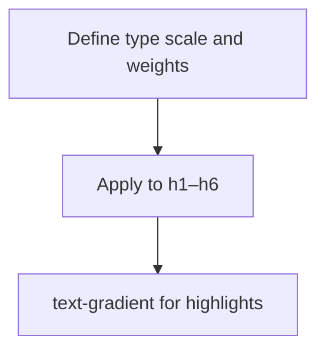

**Diagram sources**
- [style.css](file://style.css)
- [DESIGN.md](file://DESIGN.md)

**Section sources**
- [style.css](file://style.css)
- [DESIGN.md](file://DESIGN.md)

### Form Controls and Glass Inputs
- Purpose: Provide dark-mode compatible inputs with subtle focus states and monospace options for code-like editing.
- Implementation: Standard Bootstrap form controls overridden with dark theme values; a dedicated glass input class standardizes textarea styling.
- Usage: Used across tools for data entry and code editing.

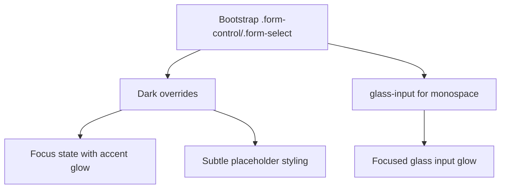

**Diagram sources**
- [style.css](file://style.css)

**Section sources**
- [style.css](file://style.css)

### Buttons and Segmented Controls
- Purpose: Deliver actionable elements with gradient backgrounds and hover lift effects.
- Implementation: Primary and success buttons use gradient backgrounds; outline-light offers a subtle, accessible option. Segmented control active state is standardized.
- Usage: Across tools for actions, toggles, and selections.

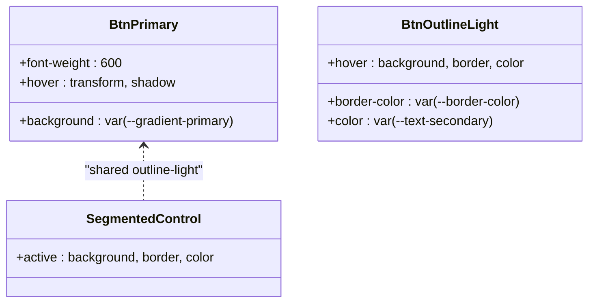

**Diagram sources**
- [style.css](file://style.css)

**Section sources**
- [style.css](file://style.css)

### Navigation and Tabs
- Purpose: Provide persistent navigation affordances and tabbed interfaces with glass styling.
- Implementation: Fixed global nav with glass button and dropdown; tabs use a dedicated glass variant.
- Usage: Home navigation and tool-specific tabbed layouts.

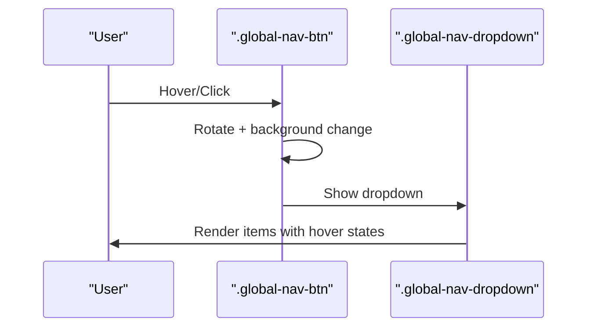

**Diagram sources**
- [style.css](file://style.css)

**Section sources**
- [style.css](file://style.css)

### Tables Inside Glass Panels
- Purpose: Ensure table borders render cleanly atop glass surfaces without visual overlap.
- Implementation: Adjust border-collapse and spacing; override Bootstrap table variables for dark mode.
- Usage: History tables and summary grids.

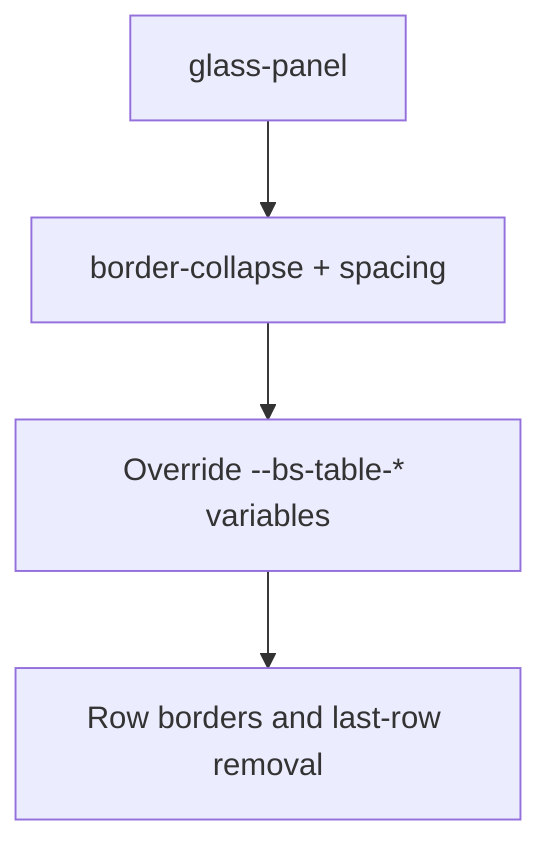

**Diagram sources**
- [style.css](file://style.css)

**Section sources**
- [style.css](file://style.css)

### Responsive Desktop Layout and Mobile Overrides
- Purpose: Enable a desktop app layout with constrained heights and scrollable areas while preserving mobile usability.
- Implementation: Media query activates fixed heights and overflow control on desktop; individual tools include targeted mobile adjustments.
- Usage: Full-screen tool containers with collapsible sections on small screens.

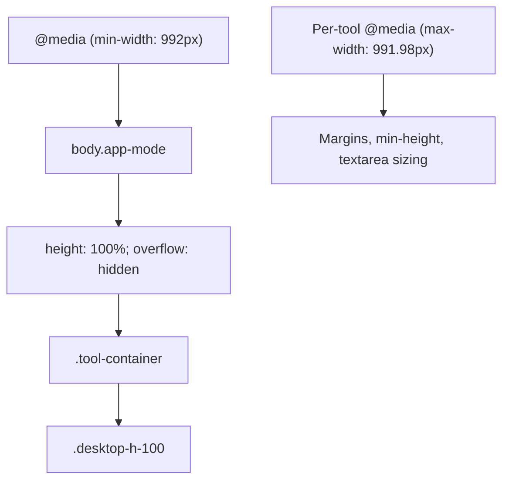

**Diagram sources**
- [style.css](file://style.css)
- [apex-debug-log.html](file://apex-debug-log.html)
- [column-converter.html](file://column-converter.html)
- [guid-generator.html](file://guid-generator.html)
- [xml-formatter.html](file://xml-formatter.html)

**Section sources**
- [style.css](file://style.css)
- [apex-debug-log.html](file://apex-debug-log.html)
- [column-converter.html](file://column-converter.html)
- [guid-generator.html](file://guid-generator.html)
- [xml-formatter.html](file://xml-formatter.html)

### Style Guide Organization
- Purpose: Document color palettes, typography scales, spacing, components, and usage patterns.
- Content: Includes color tokens, semantic colors, gradients, background effects, type scale, spacing units, breakpoints, and component specs.
- Usage: Serves as a reference for developers and designers to maintain consistency.

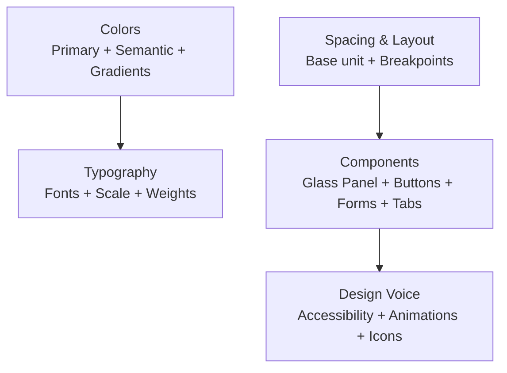

**Diagram sources**
- [DESIGN.md](file://DESIGN.md)

**Section sources**
- [DESIGN.md](file://DESIGN.md)

## Dependency Analysis
External dependencies and integrations:
- Bootstrap 5.3.2: CSS framework for grid, utilities, and components.
- Inter font: Primary font family for typography.
- Bootstrap Icons 1.11.1: Icon set integrated via CDN.
- Local stylesheet: Provides theming, glass effects, and component overrides.

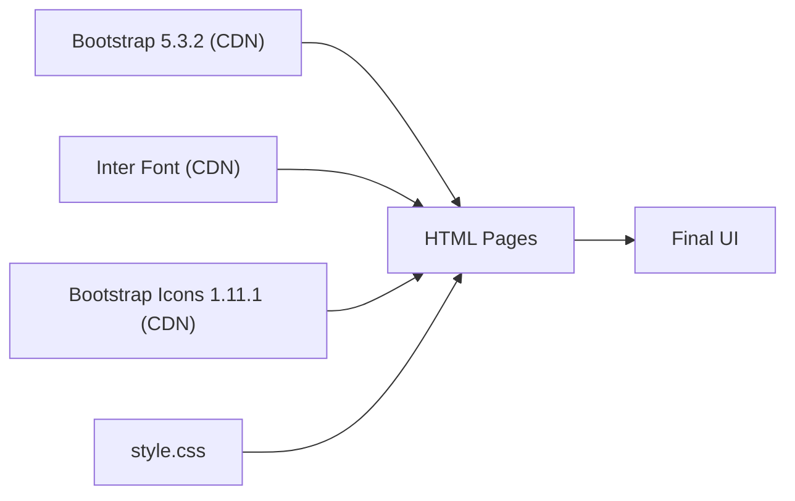

**Diagram sources**
- [index.html](file://index.html)
- [style.css](file://style.css)
- [package.json](file://package.json)

**Section sources**
- [index.html](file://index.html)
- [style.css](file://style.css)
- [package.json](file://package.json)

## Performance Considerations
- Backdrop filters: While visually appealing, backdrop-filter can be expensive on low-power devices. Use judiciously and avoid excessive blur radii.
- Gradients and shadows: Prefer CSS variables to minimize reflows and keep rendering consistent.
- Scrollbars: Custom scrollbars improve UX but do not impact performance significantly.
- Fonts: Preloaded via CDN; ensure efficient loading and consider local fallbacks if needed.

## Troubleshooting Guide
Common styling issues and resolutions:
- Table borders overlapping glass panels: Apply the documented border-collapse and spacing adjustments inside glass containers.
- Focus outlines not visible: Ensure focus styles remain accessible; verify that focus rings are not unintentionally hidden by backdrop effects.
- Mobile layout glitches: Confirm per-tool media queries are applied and that textarea min-heights are sufficient on small screens.
- Contrast and accessibility: Verify WCAG contrast ratios for text and interactive elements; adjust accent or background variables if needed.

**Section sources**
- [style.css](file://style.css)

## Conclusion
Developer Utilities employs a clean, modular styling architecture that harmonizes Bootstrap’s robust layout system with a custom dark theme and glassmorphism aesthetic. Through CSS variables, reusable component classes, and a comprehensive style guide, the project achieves visual consistency, developer-friendly UX, and strong accessibility foundations. The responsive design and utility-first approach enable rapid iteration across diverse tools while maintaining a cohesive brand identity.

## Appendices

### Color Palette and Gradients
- Primary palette: Background, card surface, text, accent, and border tokens.
- Semantic colors: Success, error, warning, info, disabled text.
- Gradients: Primary and success gradients for buttons/highlights; text gradient for emphasis.

**Section sources**
- [DESIGN.md](file://DESIGN.md)
- [style.css](file://style.css)

### Typography Scale and Spacing
- Type scale: Defined sizes and line heights for headings and body text.
- Spacing scale: Base unit and derived scales for margins, paddings, and gaps.
- Breakpoints: Bootstrap-aligned breakpoints with custom desktop enhancements.

**Section sources**
- [DESIGN.md](file://DESIGN.md)
- [style.css](file://style.css)

### Component Variants Reference
- Glass panel: Surface with backdrop blur and subtle borders.
- Buttons: Primary, success, and outline-light variants with hover states.
- Form inputs: Dark-themed controls and glass textarea variants.
- Navigation: Fixed global nav with dropdown and tab variants.
- Tables: Dark table variants optimized for glass panels.

**Section sources**
- [DESIGN.md](file://DESIGN.md)
- [style.css](file://style.css)