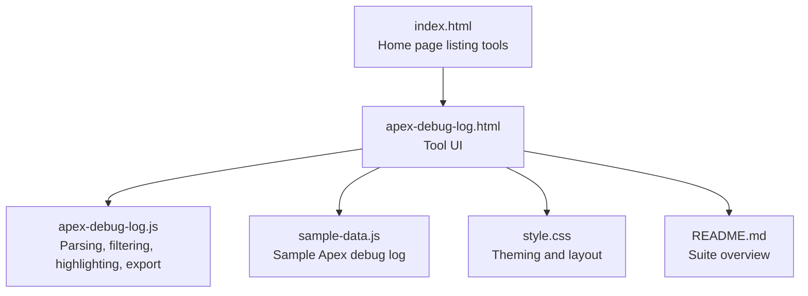
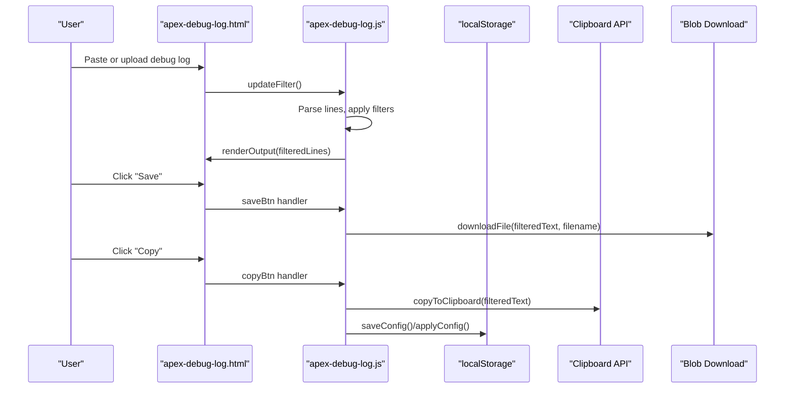
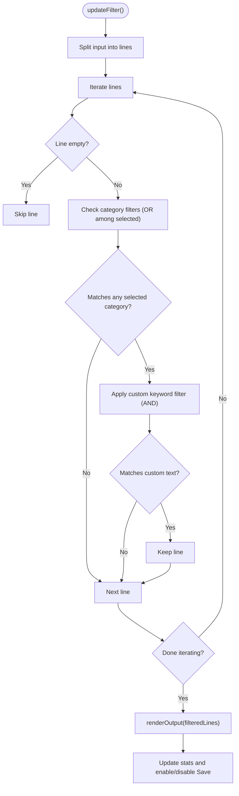
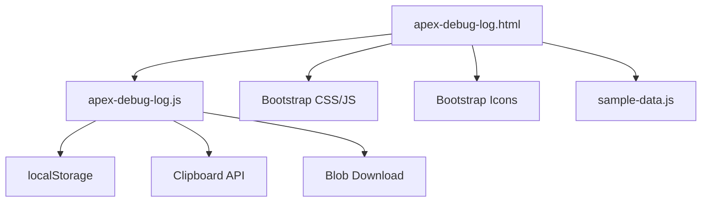

# Apex Debug Log Analyzer

<cite>
**Referenced Files in This Document**
- [apex-debug-log.html](file://apex-debug-log.html)
- [apex-debug-log.js](file://apex-debug-log.js)
- [sample-data.js](file://sample-data.js)
- [README.md](file://README.md)
- [index.html](file://index.html)
- [DESIGN.md](file://DESIGN.md)
- [style.css](file://style.css)
</cite>

## Table of Contents
1. [Introduction](#introduction)
2. [Project Structure](#project-structure)
3. [Core Components](#core-components)
4. [Architecture Overview](#architecture-overview)
5. [Detailed Component Analysis](#detailed-component-analysis)
6. [Dependency Analysis](#dependency-analysis)
7. [Performance Considerations](#performance-considerations)
8. [Troubleshooting Guide](#troubleshooting-guide)
9. [Conclusion](#conclusion)
10. [Appendices](#appendices)

## Introduction
The Apex Debug Log Analyzer is a browser-based tool designed to parse and filter raw Salesforce Apex debug logs. It enables developers to quickly extract meaningful execution context such as method entries/exits, SOQL query execution, user debug messages, and exception events. The tool provides:
- Timestamp extraction and syntax highlighting
- Filtering by log categories (USER_DEBUG, EXCEPTION_THROWN, FATAL_ERROR, METHOD_ENTRY, METHOD_EXIT, SOQL_EXECUTE_BEGIN)
- Custom keyword search
- Export and copy-to-clipboard functionality
- Integration with Salesforce debug logging by accepting .log and .txt files

The tool runs entirely in the browser, ensuring local processing and privacy.

## Project Structure
The Apex Debug Log Analyzer consists of a single-page application with HTML, JavaScript, and shared styles. The key files are:
- apex-debug-log.html: UI layout and controls for input, filtering, display, and output
- apex-debug-log.js: Core logic for parsing, filtering, highlighting, exporting, and copying
- sample-data.js: Provides a sample Apex debug log for quick testing
- index.html: Entry point listing available developer utilities
- style.css: Theming and responsive layout for the app
- DESIGN.md: Design tokens and guidelines used across Dev Utils
- README.md: Overview of the Dev Utils suite

**Diagram sources**
- [index.html](file://index.html)
- [apex-debug-log.html](file://apex-debug-log.html)
- [apex-debug-log.js](file://apex-debug-log.js)
- [sample-data.js](file://sample-data.js)
- [style.css](file://style.css)
- [README.md](file://README.md)

**Section sources**
- [apex-debug-log.html](file://apex-debug-log.html)
- [apex-debug-log.js](file://apex-debug-log.js)
- [sample-data.js](file://sample-data.js)
- [index.html](file://index.html)
- [README.md](file://README.md)
- [DESIGN.md](file://DESIGN.md)
- [style.css](file://style.css)

## Core Components
- Input area for raw debug log content or file upload
- Filter controls for log categories and custom keyword search
- Display options for syntax highlighting, font family, and font size
- Output area with filtered lines and statistics
- Export and copy-to-clipboard actions

Key capabilities:
- Timestamp extraction using a pattern matching approach
- Syntax highlighting for errors, debug, flow/execution, and limits
- Category-based filtering (checkboxes) and custom text filtering
- File upload (.log/.txt) with size validation
- Export filtered log to a downloadable file
- Copy filtered content to clipboard with fallback support

**Section sources**
- [apex-debug-log.html](file://apex-debug-log.html)
- [apex-debug-log.js](file://apex-debug-log.js)
- [sample-data.js](file://sample-data.js)

## Architecture Overview
The tool follows a client-side architecture:
- UI is rendered in the browser using HTML and Bootstrap
- JavaScript handles parsing, filtering, and rendering
- Local storage persists display preferences
- Clipboard API and Blob-based download enable export/copy

**Diagram sources**
- [apex-debug-log.html](file://apex-debug-log.html)
- [apex-debug-log.js](file://apex-debug-log.js)

## Detailed Component Analysis

### UI and Controls (apex-debug-log.html)
Responsibilities:
- Hosts input and output areas
- Provides filter checkboxes for log categories
- Offers custom keyword search input
- Controls display options (syntax highlighting, font family, font size)
- Exposes actions to load sample data, clear input, save, and copy

Highlights:
- File upload accepts .log, .txt, and text/plain
- Load Sample button injects a sample Apex debug log and enables SOQL filter by default
- Stats counters for input and output line counts
- Responsive layout with glassmorphic panels and themed controls

**Section sources**
- [apex-debug-log.html](file://apex-debug-log.html)

### Parsing and Filtering Engine (apex-debug-log.js)
Responsibilities:
- Parse raw input into lines
- Apply category-based filters (checkboxes) and custom keyword filter
- Render filtered output with optional syntax highlighting
- Manage display configuration (font family, size, highlight toggle)
- Persist and restore display preferences
- Export filtered content to file and copy to clipboard

Key logic:
- Line filtering uses OR logic among selected categories and AND logic with custom text
- Timestamp extraction uses a pattern anchored at the start of each line
- Syntax highlighting groups keywords into categories (error, debug, flow, limit)
- File upload validates file type and size before reading
- Export derives a filename based on the original file name and appends "_filtered"

**Diagram sources**
- [apex-debug-log.js](file://apex-debug-log.js)

**Section sources**
- [apex-debug-log.js](file://apex-debug-log.js)

### Syntax Highlighting and Display
- Timestamps are extracted and wrapped in a dedicated class for subtle highlighting
- Keywords are grouped into categories:
  - Error: fatal errors, thrown exceptions, and common Apex exception types
  - Debug: user debug and system debug markers
  - Flow: method entry/exit, SOQL/DML begin/end, code unit lifecycle
  - Limit: governor limit and heap allocation markers
- Highlighting is toggled via a switch and persisted in local storage

**Section sources**
- [apex-debug-log.js](file://apex-debug-log.js)

### Export and Copy Operations
- Save: Generates a downloadable file named after the original with "_filtered" appended
- Copy: Uses Clipboard API when available, with a fallback to execCommand('copy')
- Toast notifications confirm successful copy operations

**Section sources**
- [apex-debug-log.js](file://apex-debug-log.js)

### Sample Data Integration
- The sample data includes a representative Apex debug log with execution lifecycle markers, user debug statements, SOQL execution, and exception events
- Loading the sample pre-enables SOQL filter for immediate visibility of queries

**Section sources**
- [sample-data.js](file://sample-data.js)
- [apex-debug-log.html](file://apex-debug-log.html)

## Dependency Analysis
The tool is self-contained with minimal external dependencies:
- Bootstrap CSS/JS for UI components and toast notifications
- Bootstrap Icons for UI icons
- Local storage for persisting display preferences
- Clipboard API and Blob for export/copy
- Optional sample data module for demonstration

**Diagram sources**
- [apex-debug-log.html](file://apex-debug-log.html)
- [apex-debug-log.js](file://apex-debug-log.js)
- [sample-data.js](file://sample-data.js)

**Section sources**
- [apex-debug-log.html](file://apex-debug-log.html)
- [apex-debug-log.js](file://apex-debug-log.js)
- [sample-data.js](file://sample-data.js)

## Performance Considerations
- Input size validation prevents large files from freezing the browser during read operations
- Rendering uses a single pass over filtered lines with lightweight DOM updates
- Highlighting is disabled when syntax highlighting is turned off to reduce overhead
- Local storage operations are minimal and triggered on user actions

[No sources needed since this section provides general guidance]

## Troubleshooting Guide
Common issues and resolutions:
- Empty output after filtering:
  - Ensure at least one category checkbox is selected or a custom keyword is entered
  - Verify the input contains lines with the expected markers
- Large file upload fails:
  - Confirm the file is under the size limit enforced by the tool
  - Try uploading a .log or .txt file with text/plain MIME type
- Copy operation fails:
  - Use a secure context (HTTPS) for Clipboard API support
  - The tool falls back to a document-based copy mechanism if Clipboard API is unavailable
- Display settings not persisting:
  - Check that local storage is enabled in the browser
  - Use the Reset button to restore defaults

**Section sources**
- [apex-debug-log.js](file://apex-debug-log.js)
- [apex-debug-log.html](file://apex-debug-log.html)

## Conclusion
The Apex Debug Log Analyzer provides a fast, privacy-preserving way to filter and analyze Salesforce Apex debug logs directly in the browser. Its category-based filtering, custom keyword search, and syntax highlighting streamline the debugging process. While the current implementation focuses on filtering and presentation, the foundation is in place to extend capabilities such as performance metrics extraction and advanced error detection in future iterations.

[No sources needed since this section summarizes without analyzing specific files]

## Appendices

### Practical Examples

- Analyzing long-running transactions:
  - Load a sample or real debug log
  - Enable METHOD_ENTRY and METHOD_EXIT filters to track execution flow
  - Use custom keyword search to isolate specific classes or methods
  - Review timestamps to identify slow method boundaries

- Identifying performance bottlenecks:
  - Enable SOQL_EXECUTE_BEGIN to capture query execution
  - Combine with METHOD_ENTRY/EXIT to correlate queries with method calls
  - Use custom filters to focus on specific SOQL patterns

- Debugging complex Apex code execution:
  - Enable USER_DEBUG to surface debug messages
  - Enable EXCEPTION_THROWN and FATAL_ERROR to locate failures
  - Use syntax highlighting to visually scan for error markers

[No sources needed since this section provides general guidance]

### Log Categories and Patterns
- Method lifecycle: METHOD_ENTRY, METHOD_EXIT
- SOQL lifecycle: SOQL_EXECUTE_BEGIN, SOQL_EXECUTE_END
- DML lifecycle: DML_BEGIN, DML_END
- Exceptions: EXCEPTION_THROWN, FATAL_ERROR
- Debug: USER_DEBUG, SYSTEM_DEBUG
- Limits: LIMIT_USAGE_FOR_NS, CUMULATIVE_LIMIT_USAGE, HEAP_ALLOCATE

**Section sources**
- [apex-debug-log.js](file://apex-debug-log.js)