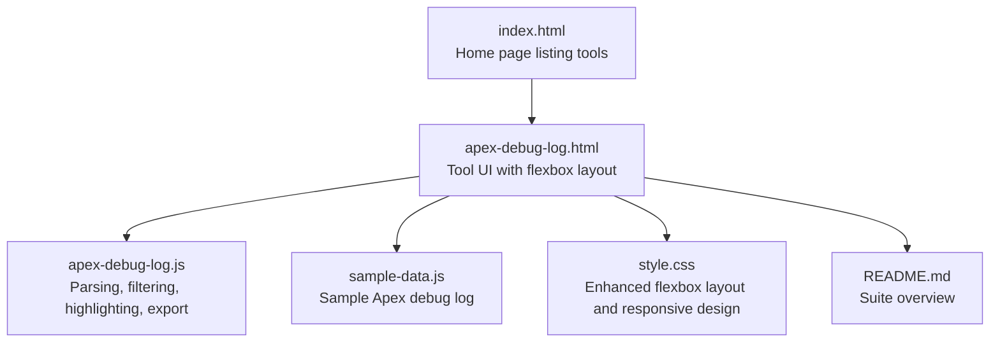
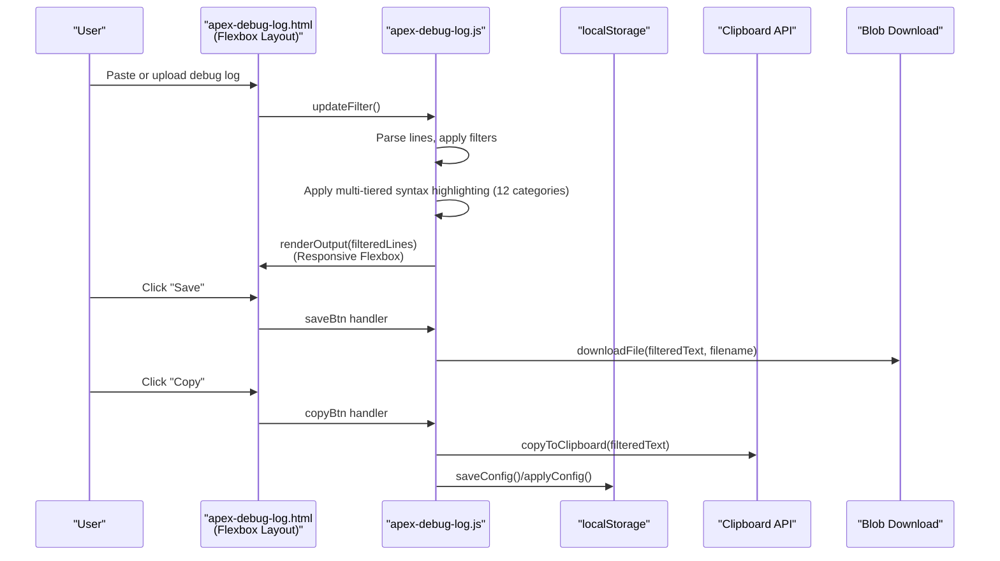
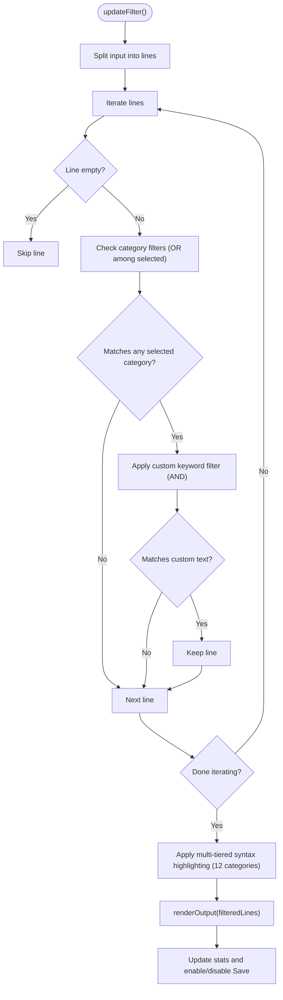
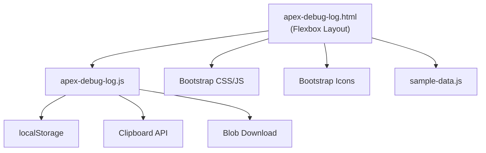

# Apex Debug Log Analyzer

<cite>
**Referenced Files in This Document**
- [apex-debug-log.html](file://apex-debug-log.html)
- [apex-debug-log.js](file://apex-debug-log.js)
- [sample-data.js](file://sample-data.js)
- [README.md](file://README.md)
- [index.html](file://index.html)
- [DESIGN.md](file://DESIGN.md)
- [style.css](file://style.css)
</cite>

## Update Summary
**Changes Made**
- Complete overhaul of syntax highlighting system with multi-tiered classification of Apex debug log events
- Added dedicated color schemes for error conditions, Apex code execution, debugging statements, callout operations, database operations, workflow/flow processes, profiling metrics, data access events, NBA events, event service communications, cursor operations, variable scope tracking, statement execution, and timestamp formatting
- Enhanced visual categorization system with 12 distinct event type classifications
- Updated UI architecture section to reflect conversion from Bootstrap grid to flexbox layout
- Enhanced responsive design documentation with full viewport height support
- Added comprehensive mobile experience improvements
- Updated layout and styling sections with new flexbox implementation details
- Revised component analysis to include new flexbox-based responsive design

## Table of Contents
1. [Introduction](#introduction)
2. [Project Structure](#project-structure)
3. [Core Components](#core-components)
4. [Architecture Overview](#architecture-overview)
5. [Detailed Component Analysis](#detailed-component-analysis)
6. [Dependency Analysis](#dependency-analysis)
7. [Performance Considerations](#performance-considerations)
8. [Troubleshooting Guide](#troubleshooting-guide)
9. [Conclusion](#conclusion)
10. [Appendices](#appendices)

## Introduction
The Apex Debug Log Analyzer is a browser-based tool designed to parse and filter raw Salesforce Apex debug logs. It enables developers to quickly extract meaningful execution context such as method entries/exits, SOQL query execution, user debug messages, and exception events. The tool provides:
- Timestamp extraction and syntax highlighting
- Filtering by log categories (USER_DEBUG, EXCEPTION_THROWN, FATAL_ERROR, METHOD_ENTRY, METHOD_EXIT, SOQL_EXECUTE_BEGIN)
- Custom keyword search
- Export and copy-to-clipboard functionality
- Integration with Salesforce debug logging by accepting .log and .txt files

**Updated** The tool now features a modern flexbox-based layout with full viewport height support and enhanced mobile responsiveness, providing a superior user experience across all devices. The syntax highlighting system has been completely overhauled with a multi-tiered classification system that provides visual categorization of 12 distinct event types.

The tool runs entirely in the browser, ensuring local processing and privacy.

## Project Structure
The Apex Debug Log Analyzer consists of a single-page application with HTML, JavaScript, and shared styles. The key files are:
- apex-debug-log.html: UI layout and controls for input, filtering, display, and output
- apex-debug-log.js: Core logic for parsing, filtering, highlighting, exporting, and copying
- sample-data.js: Provides a sample Apex debug log for quick testing
- index.html: Entry point listing available developer utilities
- style.css: Theming and responsive layout for the app with enhanced flexbox implementation
- DESIGN.md: Design tokens and guidelines used across Dev Utils
- README.md: Overview of the Dev Utils suite

**Diagram sources**
- [index.html](file://index.html)
- [apex-debug-log.html](file://apex-debug-log.html)
- [apex-debug-log.js](file://apex-debug-log.js)
- [sample-data.js](file://sample-data.js)
- [style.css](file://style.css)
- [README.md](file://README.md)

**Section sources**
- [apex-debug-log.html](file://apex-debug-log.html)
- [apex-debug-log.js](file://apex-debug-log.js)
- [sample-data.js](file://sample-data.js)
- [index.html](file://index.html)
- [README.md](file://README.md)
- [DESIGN.md](file://DESIGN.md)
- [style.css](file://style.css)

## Core Components
- Input area for raw debug log content or file upload
- Filter controls for log categories and custom keyword search
- Display options for syntax highlighting, font family, and font size
- Output area with filtered lines and statistics
- Export and copy-to-clipboard actions

**Updated** Key capabilities with enhanced UI:
- Timestamp extraction using a pattern matching approach
- **New**: Multi-tiered syntax highlighting system with 12 distinct event classifications
- **New**: Color-coded visual categorization for error conditions, Apex code execution, debugging statements, callout operations, database operations, workflow/flow processes, profiling metrics, data access events, NBA events, event service communications, cursor operations, variable scope tracking, statement execution, and timestamp formatting
- Category-based filtering (checkboxes) and custom text filtering
- File upload (.log/.txt) with size validation
- Export filtered log to a downloadable file
- Copy filtered content to clipboard with fallback support
- **New**: Flexbox-based responsive layout with full viewport height support
- **New**: Enhanced mobile experience with optimized touch targets and scrollable areas

**Section sources**
- [apex-debug-log.html](file://apex-debug-log.html)
- [apex-debug-log.js](file://apex-debug-log.js)
- [sample-data.js](file://sample-data.js)

## Architecture Overview
The tool follows a client-side architecture with enhanced responsive design:
- UI is rendered using flexbox layout with full viewport height support
- JavaScript handles parsing, filtering, and rendering with improved mobile responsiveness
- Local storage persists display preferences
- Clipboard API and Blob-based download enable export/copy
- **New**: Bootstrap grid replaced with flexbox for better responsive behavior
- **New**: Multi-tiered syntax highlighting system with 12 distinct event classifications

**Diagram sources**
- [apex-debug-log.html](file://apex-debug-log.html)
- [apex-debug-log.js](file://apex-debug-log.js)

## Detailed Component Analysis

### UI and Controls (apex-debug-log.html)
**Updated** Responsibilities with enhanced layout:
- Hosts input and output areas using flexbox layout with full viewport height support
- Provides filter checkboxes for log categories with improved spacing and touch targets
- Offers custom keyword search input with responsive design
- Controls display options (syntax highlighting, font family, font size) with enhanced mobile experience
- Exposes actions to load sample data, clear input, save, and copy with optimized button layouts

**Updated** Highlights with new flexbox implementation:
- Flexbox container with `display: flex; flex-direction: column; height: 100vh` for full viewport height
- Three-column layout using flexbox: input (left), controls (middle), output (right)
- Each panel uses `display: flex; flex-direction: column` with `flex-grow: 1` for equal distribution
- Mobile optimization with `min-height: 0` and `overflow: hidden` for proper scrolling
- Enhanced responsive breakpoints with improved mobile touch targets
- Glassmorphic panels with consistent styling across all screen sizes

**Section sources**
- [apex-debug-log.html](file://apex-debug-log.html)

### Parsing and Filtering Engine (apex-debug-log.js)
Responsibilities:
- Parse raw input into lines
- Apply category-based filters (checkboxes) and custom keyword filter
- Render filtered output with optional multi-tiered syntax highlighting
- Manage display configuration (font family, size, highlight toggle)
- Persist and restore display preferences
- Export filtered content to file and copy to clipboard

Key logic:
- Line filtering uses OR logic among selected categories and AND logic with custom text
- Timestamp extraction uses a pattern anchored at the start of each line
- **New**: Multi-tiered syntax highlighting groups keywords into 12 distinct categories:
  - Error: fatal errors, thrown exceptions, and common Apex exception types
  - Debug: user debug and system debug markers
  - Apex: code unit lifecycle, constructor events, method execution
  - Database: SOQL, DML, and SOSL operations
  - Callout: HTTP requests and response events
  - Workflow: flow and workflow automation events
  - Event: event service publish/subscribe operations
  - Cursor: cursor creation and data fetching
  - Profiling: governor limit and heap allocation markers
  - Data Access: data evaluation events
  - NBA: navigation and business analytics events
  - Variable: variable scope management
  - Statement: statement execution tracking
- File upload validates file type and size before reading
- Export derives a filename based on the original file name and appends "_filtered"

**Diagram sources**
- [apex-debug-log.js](file://apex-debug-log.js)

**Section sources**
- [apex-debug-log.js](file://apex-debug-log.js)

### Enhanced Layout System (apex-debug-log.html)
**Updated** The layout system has been completely redesigned from Bootstrap grid to flexbox:
- Main container uses `display: flex; flex-direction: column; height: 100vh` for full viewport height
- Tool container `.tool-container` ensures consistent height across all devices
- Three-column layout with flexbox: `flex: 1 1 0` for equal distribution with `min-height: 0`
- Each panel uses `display: flex; flex-direction: column` with `flex-grow: 1` for dynamic sizing
- Mobile optimization with `min-height: 0` and `overflow: hidden` prevents layout issues
- Responsive breakpoints adjust spacing and touch targets for optimal mobile experience
- Enhanced scroll behavior with `overflow-y: auto` for content areas

**Section sources**
- [apex-debug-log.html](file://apex-debug-log.html)

### Multi-Tiered Syntax Highlighting System (apex-debug-log.js)
**Updated** The syntax highlighting system has been completely overhauled with a sophisticated multi-tiered classification system:

#### Core Highlighting Categories:
- **Timestamp Formatting**: Extracted and wrapped in dedicated `.log-timestamp` class for subtle highlighting
- **Error Conditions**: High-priority error detection with `.log-error` class (red, bold)
- **Apex Code Execution**: Code unit lifecycle and method execution events with `.log-apex` class (purple)
- **Debug Statements**: User and system debug messages with `.log-debug` class (light green)
- **Database Operations**: SOQL, DML, and SOSL operations with `.log-database` class (cyan)
- **Callout Operations**: HTTP request/response events with `.log-callout` class (orange)
- **Workflow/Flow Processes**: Flow and workflow automation events with `.log-workflow` class (light blue)
- **Event Service Communications**: Event publishing/subscribing with `.log-event` class (rose)
- **Cursor Operations**: Cursor creation and data fetching with `.log-cursor` class (teal)
- **Profiling Metrics**: Governor limit and heap allocation with `.log-profiling` class (gray)
- **Data Access Events**: Data evaluation and access patterns with `.log-data-access` class (pink)
- **NBA Events**: Navigation and business analytics with `.log-nba` class (green)
- **Variable Scope Tracking**: Variable lifecycle management with `.log-variable` class (yellow)
- **Statement Execution**: Statement-level execution tracking with `.log-statement` class (light green)

#### Implementation Details:
- Priority-based highlighting with error conditions processed first
- Escape HTML to prevent XSS attacks
- Timestamp extraction using regex pattern matching
- Legacy support for profiling events with `.log-limit` class
- Color-coded visual categorization for rapid event identification
- Timestamp formatting preserved with pipe separator highlighting

**Section sources**
- [apex-debug-log.js](file://apex-debug-log.js)

### Export and Copy Operations
- Save: Generates a downloadable file named after the original with "_filtered" appended
- Copy: Uses Clipboard API when available, with a fallback to execCommand('copy')
- Toast notifications confirm successful copy operations
- **Updated** Improved button accessibility with larger touch targets and better visual feedback

**Section sources**
- [apex-debug-log.js](file://apex-debug-log.js)

### Sample Data Integration
- The sample data includes a representative Apex debug log with execution lifecycle markers, user debug statements, SOQL execution, and exception events
- Loading the sample pre-enables SOQL filter for immediate visibility of queries

**Section sources**
- [sample-data.js](file://sample-data.js)
- [apex-debug-log.html](file://apex-debug-log.html)

## Dependency Analysis
The tool is self-contained with minimal external dependencies:
- Bootstrap CSS/JS for UI components and toast notifications
- Bootstrap Icons for UI icons
- Local storage for persisting display preferences
- Clipboard API and Blob for export/copy
- Optional sample data module for demonstration

**Diagram sources**
- [apex-debug-log.html](file://apex-debug-log.html)
- [apex-debug-log.js](file://apex-debug-log.js)
- [sample-data.js](file://sample-data.js)

**Section sources**
- [apex-debug-log.html](file://apex-debug-log.html)
- [apex-debug-log.js](file://apex-debug-log.js)
- [sample-data.js](file://sample-data.js)

## Performance Considerations
- Input size validation prevents large files from freezing the browser during read operations
- Rendering uses a single pass over filtered lines with lightweight DOM updates
- Highlighting is disabled when syntax highlighting is turned off to reduce overhead
- Local storage operations are minimal and triggered on user actions
- **Updated** Flexbox layout reduces reflow calculations compared to Bootstrap grid
- **Updated** Optimized mobile scrolling with proper overflow handling
- **New** Efficient multi-tiered highlighting system with early exit for error conditions

## Troubleshooting Guide
Common issues and resolutions:
- Empty output after filtering:
  - Ensure at least one category checkbox is selected or a custom keyword is entered
  - Verify the input contains lines with the expected markers
- Large file upload fails:
  - Confirm the file is under the size limit enforced by the tool
  - Try uploading a .log or .txt file with text/plain MIME type
- Copy operation fails:
  - Use a secure context (HTTPS) for Clipboard API support
  - The tool falls back to a document-based copy mechanism if Clipboard API is unavailable
- Display settings not persisting:
  - Check that local storage is enabled in the browser
  - Use the Reset button to restore defaults
- **Updated** Layout issues on mobile devices:
  - Ensure device orientation is supported (landscape/portrait switching)
  - Check that viewport meta tag is properly configured
  - Verify flexbox containers have proper height calculations
- **Updated** Syntax highlighting not working:
  - Verify syntax highlighting toggle is enabled
  - Check browser console for JavaScript errors
  - Ensure the debug log format matches expected Salesforce debug log patterns

**Section sources**
- [apex-debug-log.js](file://apex-debug-log.js)
- [apex-debug-log.html](file://apex-debug-log.html)

## Conclusion
The Apex Debug Log Analyzer provides a fast, privacy-preserving way to filter and analyze Salesforce Apex debug logs directly in the browser. Its category-based filtering, custom keyword search, and **enhanced multi-tiered syntax highlighting system** streamline the debugging process. The recent UI improvements with flexbox layout, full viewport height support, and enhanced mobile experience make it even more accessible and user-friendly across all devices.

The new syntax highlighting system provides visual categorization of 12 distinct event types, enabling developers to quickly identify patterns and anomalies in debug logs. From error conditions to Apex code execution, database operations to workflow processes, the tool's comprehensive highlighting system transforms raw log data into actionable insights.

While the current implementation focuses on filtering and presentation, the foundation is in place to extend capabilities such as performance metrics extraction and advanced error detection in future iterations.

## Appendices

### Practical Examples

- Analyzing long-running transactions:
  - Load a sample or real debug log
  - Enable METHOD_ENTRY and METHOD_EXIT filters to track execution flow
  - Use custom keyword search to isolate specific classes or methods
  - Review timestamps to identify slow method boundaries
  - **New**: Use color-coded highlighting to quickly spot error conditions and performance bottlenecks

- Identifying performance bottlenecks:
  - Enable SOQL_EXECUTE_BEGIN to capture query execution
  - Combine with METHOD_ENTRY/EXIT to correlate queries with method calls
  - Use custom filters to focus on specific SOQL patterns
  - **New**: Leverage database operation highlighting (cyan) and profiling metrics (gray) for comprehensive performance analysis

- Debugging complex Apex code execution:
  - Enable USER_DEBUG to surface debug messages
  - Enable EXCEPTION_THROWN and FATAL_ERROR to locate failures
  - Use syntax highlighting to visually scan for error markers (red, bold)
  - **New**: Utilize Apex code execution highlighting (purple) and variable scope tracking (yellow) for detailed code flow analysis

### Layout and Responsive Design Features
**Updated** The tool now features comprehensive responsive design:
- **Full Viewport Height**: Uses `height: 100vh` for consistent layout across devices
- **Flexbox Layout**: Replaced Bootstrap grid with flexbox for better responsive behavior
- **Mobile Optimization**: Touch-friendly controls with larger button sizes and improved spacing
- **Scroll Management**: Proper overflow handling with `min-height: 0` and `overflow: hidden`
- **Adaptive Columns**: Three-column layout that adapts to different screen sizes
- **Glassmorphic Panels**: Consistent styling across all device sizes with backdrop blur effects

### Enhanced Syntax Highlighting Categories
**Updated** The multi-tiered syntax highlighting system now provides comprehensive visual categorization:

#### Primary Categories:
- **Error Conditions**: Fatal errors, exceptions, and common Apex exception types (`.log-error` - red, bold)
- **Apex Code Execution**: Code units, constructors, and method lifecycle (`.log-apex` - purple)
- **Debug Statements**: User and system debug messages (`.log-debug` - light green)
- **Database Operations**: SOQL, DML, and SOSL operations (`.log-database` - cyan)

#### Secondary Categories:
- **Callout Operations**: HTTP requests and responses (`.log-callout` - orange)
- **Workflow/Flow Processes**: Flow and workflow automation (`.log-workflow` - light blue)
- **Event Service Communications**: Event publishing/subscribing (`.log-event` - rose)
- **Cursor Operations**: Cursor creation and data fetching (`.log-cursor` - teal)
- **Profiling Metrics**: Governor limits and heap allocation (`.log-profiling` - gray)
- **Data Access Events**: Data evaluation and access patterns (`.log-data-access` - pink)
- **NBA Events**: Navigation and business analytics (`.log-nba` - green)
- **Variable Scope Tracking**: Variable lifecycle management (`.log-variable` - yellow)
- **Statement Execution**: Statement-level tracking (`.log-statement` - light green)

#### Supporting Features:
- **Timestamp Formatting**: Extracted timestamps with `.log-timestamp` class (light gray)
- **Priority Processing**: Error conditions processed first, then other categories
- **Legacy Support**: Backward compatibility with profiling events (`.log-limit` - orange)
- **Escape HTML**: Prevents XSS attacks during highlighting
- **Color-Coded Visual Categorization**: Rapid event identification across 12 distinct categories

**Section sources**
- [apex-debug-log.js](file://apex-debug-log.js)