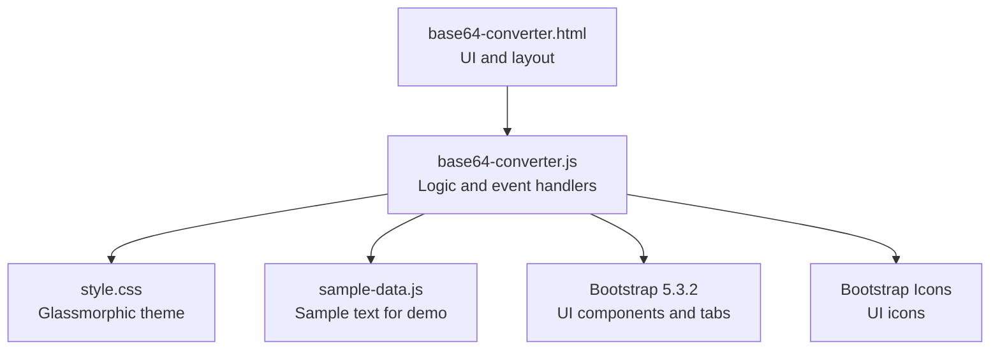
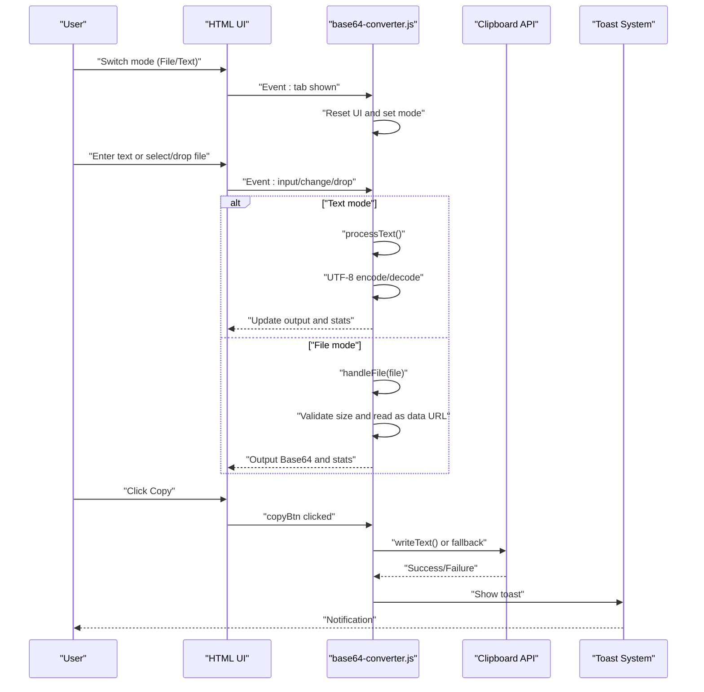
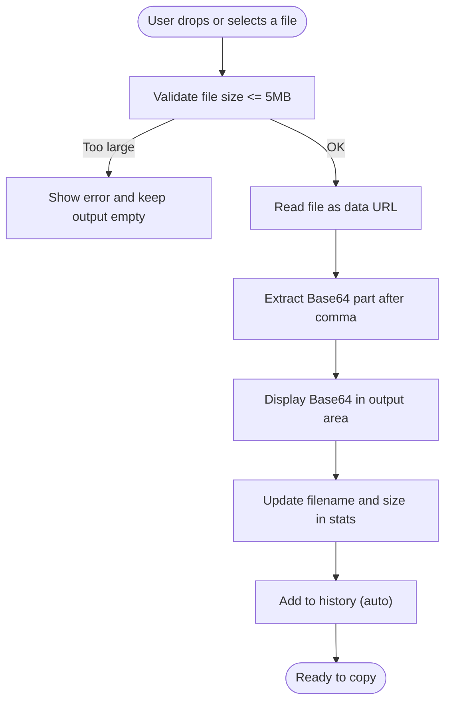
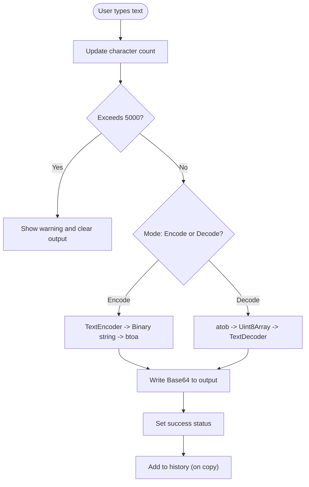
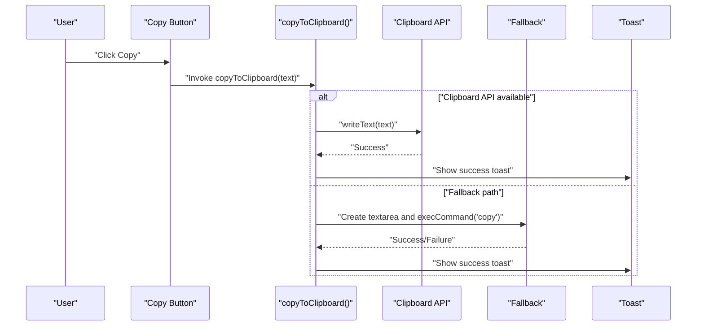
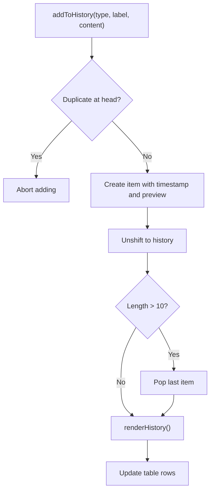
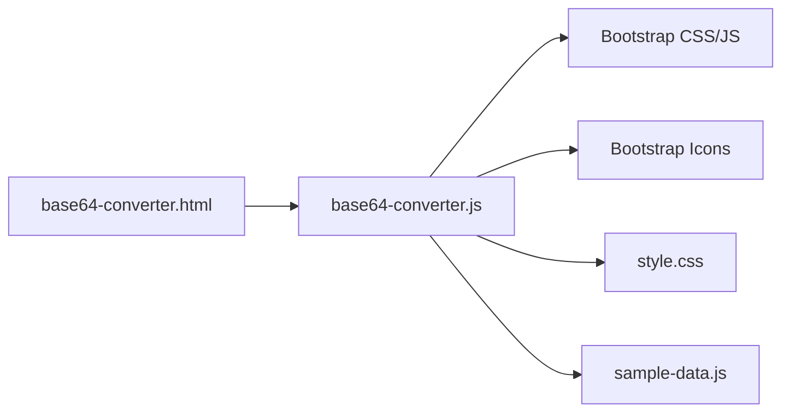

# Base64 Converter

<cite>
**Referenced Files in This Document**
- [base64-converter.html](file://base64-converter.html)
- [base64-converter.js](file://base64-converter.js)
- [README.md](file://README.md)
- [DESIGN.md](file://DESIGN.md)
- [style.css](file://style.css)
- [sample-data.js](file://sample-data.js)
</cite>

## Table of Contents
1. [Introduction](#introduction)
2. [Project Structure](#project-structure)
3. [Core Components](#core-components)
4. [Architecture Overview](#architecture-overview)
5. [Detailed Component Analysis](#detailed-component-analysis)
6. [Dependency Analysis](#dependency-analysis)
7. [Performance Considerations](#performance-considerations)
8. [Troubleshooting Guide](#troubleshooting-guide)
9. [Conclusion](#conclusion)
10. [Appendices](#appendices)

## Introduction
The Base64 Converter is a dual-mode utility that converts files and text to/from Base64. It supports:
- File mode: drag-and-drop or browse to convert any file to a Base64 string (with a 5 MB size limit).
- Text mode: encode text to Base64 or decode Base64 back to text, with real-time character counting and a 5000-character limit.
- Clipboard integration with graceful fallbacks and toast notifications.
- Session history with automatic saving, duplicate prevention, and a sliding window of up to 10 items.
- Mobile-responsive design and a glassmorphic UI theme.

## Project Structure
The Base64 Converter consists of a single HTML page and a single JavaScript module that encapsulates all logic. Supporting assets include shared styles and sample data.

**Diagram sources**
- [base64-converter.html:1-236](file://base64-converter.html#L1-L236)
- [base64-converter.js:1-455](file://base64-converter.js#L1-L455)
- [style.css:1-293](file://style.css#L1-L293)
- [sample-data.js:1-69](file://sample-data.js#L1-L69)

**Section sources**
- [base64-converter.html:1-236](file://base64-converter.html#L1-L236)
- [base64-converter.js:1-455](file://base64-converter.js#L1-L455)
- [style.css:1-293](file://style.css#L1-L293)
- [sample-data.js:1-69](file://sample-data.js#L1-L69)

## Core Components
- Dual-mode UI:
  - File mode: drag-and-drop zone and file input with size validation.
  - Text mode: textarea with character counter and encode/decode toggle.
- Real-time processing:
  - File mode: FileReader reads as data URL, strips prefix, and outputs Base64.
  - Text mode: UTF-8-aware conversion using TextEncoder/TextDecoder and btoa/atob.
- Clipboard integration:
  - Uses Clipboard API when available; falls back to execCommand('copy').
  - Toast notifications for success feedback.
- History management:
  - Stores last 10 items, prevents duplicates at the head, and renders a collapsible table.
- Validation and feedback:
  - Visual alerts, character limit enforcement, and error messages.

**Section sources**
- [base64-converter.html:74-148](file://base64-converter.html#L74-L148)
- [base64-converter.js:177-273](file://base64-converter.js#L177-L273)
- [base64-converter.js:290-347](file://base64-converter.js#L290-L347)
- [base64-converter.js:373-454](file://base64-converter.js#L373-L454)

## Architecture Overview
The application follows a single-page, client-side architecture with modular logic inside a DOMContentLoaded handler. The UI is composed of Bootstrap tabs and panels, while the core logic handles file/text processing, clipboard operations, and history persistence.

**Diagram sources**
- [base64-converter.html:74-183](file://base64-converter.html#L74-L183)
- [base64-converter.js:59-146](file://base64-converter.js#L59-L146)
- [base64-converter.js:177-273](file://base64-converter.js#L177-L273)
- [base64-converter.js:373-454](file://base64-converter.js#L373-L454)

## Detailed Component Analysis

### File Mode: Drag-and-Drop and Validation
- Drag-and-drop events are captured and normalized to prevent default behavior and highlight the drop zone.
- File selection triggers size validation against a 5 MB threshold.
- FileReader reads the file as a data URL; the Base64 portion is extracted and displayed.
- On success, the output is enabled and automatically saved to history.

**Diagram sources**
- [base64-converter.js:93-125](file://base64-converter.js#L93-L125)
- [base64-converter.js:177-212](file://base64-converter.js#L177-L212)

**Section sources**
- [base64-converter.html:95-107](file://base64-converter.html#L95-L107)
- [base64-converter.js:93-125](file://base64-converter.js#L93-L125)
- [base64-converter.js:177-212](file://base64-converter.js#L177-L212)

### Text Mode: Encoding and Decoding
- Real-time processing updates the output as the user types.
- Character count updates immediately; exceeding 5000 triggers an error state.
- Encoding uses UTF-8 conversion via TextEncoder, then Base64 via btoa.
- Decoding uses Base64 via atob, then TextDecoder to reconstruct UTF-8.
- Errors during decoding show a specific “Invalid Base64” message.

**Diagram sources**
- [base64-converter.js:214-273](file://base64-converter.js#L214-L273)

**Section sources**
- [base64-converter.html:117-147](file://base64-converter.html#L117-L147)
- [base64-converter.js:214-273](file://base64-converter.js#L214-L273)

### Clipboard Integration and Toast Notifications
- Uses the Clipboard API when available; otherwise falls back to a temporary textarea and execCommand('copy').
- Displays a toast notification on successful copy with a success message.
- The copy button is disabled when there is no output.

**Diagram sources**
- [base64-converter.js:132-144](file://base64-converter.js#L132-L144)
- [base64-converter.js:373-454](file://base64-converter.js#L373-L454)

**Section sources**
- [base64-converter.js:373-454](file://base64-converter.js#L373-L454)

### History Management
- Maintains a session history array with a maximum length of 10.
- Prevents duplicates at the head of the list.
- Renders a table with timestamps, types, previews, and actions (copy/delete).
- Provides global functions for copying and deleting items from history.

**Diagram sources**
- [base64-converter.js:290-347](file://base64-converter.js#L290-L347)

**Section sources**
- [base64-converter.html:188-224](file://base64-converter.html#L188-L224)
- [base64-converter.js:290-347](file://base64-converter.js#L290-L347)

### UI and Theming
- Uses Bootstrap tabs for mode switching and a glassmorphic design with custom CSS variables.
- Responsive layout with a desktop-friendly container and mobile-friendly controls.
- Custom styles for form inputs, buttons, and navigation.

**Section sources**
- [base64-converter.html:13-43](file://base64-converter.html#L13-L43)
- [style.css:1-293](file://style.css#L1-L293)
- [DESIGN.md:1-202](file://DESIGN.md#L1-L202)

## Dependency Analysis
- HTML depends on Bootstrap CSS/JS and Bootstrap Icons for UI components and tabs.
- JavaScript depends on:
  - DOM APIs (FileReader, Clipboard API, execCommand).
  - Browser text encoding APIs (TextEncoder/TextDecoder).
  - Bootstrap’s Tab component for mode switching.
- CSS defines the theme and glassmorphic effects.
- Sample data is loaded to support the “Load Sample” feature.

**Diagram sources**
- [base64-converter.html:8-11](file://base64-converter.html#L8-L11)
- [base64-converter.js:230-233](file://base64-converter.js#L230-L233)
- [style.css:1-12](file://style.css#L1-L12)
- [sample-data.js:1-69](file://sample-data.js#L1-L69)

**Section sources**
- [base64-converter.html:8-11](file://base64-converter.html#L8-L11)
- [base64-converter.js:230-233](file://base64-converter.js#L230-L233)
- [style.css:1-12](file://style.css#L1-L12)
- [sample-data.js:1-69](file://sample-data.js#L1-L69)

## Performance Considerations
- File size limit: 5 MB to prevent memory pressure and slow processing.
- Text character limit: 5000 to avoid blocking the UI thread and to keep performance predictable.
- UTF-8 handling: Proper conversion ensures correctness for international text without performance overhead.
- Clipboard fallback: Ensures compatibility across browsers without relying on async Clipboard API failures.
- History window: Fixed-size array with unshift/pop maintains O(1) insertion/deletion at the head.

[No sources needed since this section provides general guidance]

## Troubleshooting Guide
Common issues and resolutions:
- Large file errors: Ensure the file is under 5 MB; the app will show a warning and keep the output empty.
- Invalid Base64 decoding: When decoding, invalid Base64 produces an error message; correct the input or switch to encode mode.
- Copy fails: If Clipboard API is unavailable, the fallback mechanism uses a temporary textarea; ensure pop-ups are not blocked.
- Exceeded character limit: Reduce input to under 5000 characters; the UI will show a warning and clear the output.
- History not updating: Ensure the mode is switched appropriately; history auto-saves on copy in text mode and on successful file processing.

**Section sources**
- [base64-converter.js:184-188](file://base64-converter.js#L184-L188)
- [base64-converter.js:262-272](file://base64-converter.js#L262-L272)
- [base64-converter.js:373-411](file://base64-converter.js#L373-L411)
- [base64-converter.js:228-233](file://base64-converter.js#L228-L233)

## Conclusion
The Base64 Converter delivers a secure, client-side solution for converting files and text to/from Base64 with a polished, responsive UI. Its robust validation, UTF-8-aware processing, clipboard integration, and session history make it suitable for everyday development tasks, from encoding images to preparing data for APIs.

[No sources needed since this section summarizes without analyzing specific files]

## Appendices

### Practical Examples
- Converting an image to Base64:
  - Switch to File mode, drag-and-drop or browse an image, and copy the resulting Base64 string.
- Encoding sensitive data:
  - Use Text mode to encode short, sensitive strings; copy to clipboard and clear the input afterward.
- Batch processing workflows:
  - Use the history panel to review recent conversions; copy items quickly or delete unnecessary entries.

[No sources needed since this section provides general guidance]