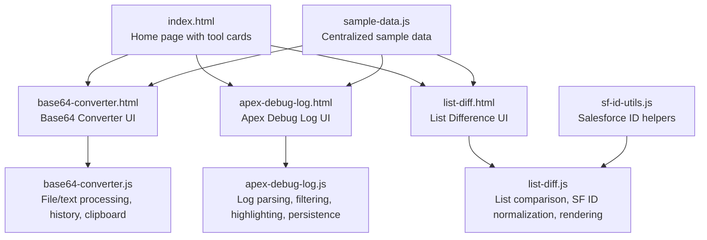
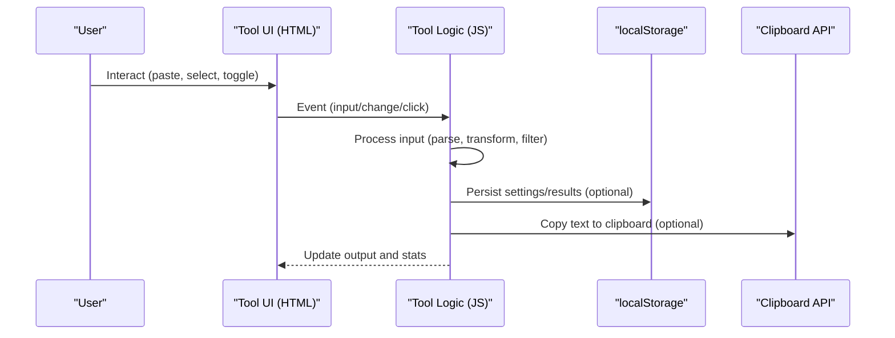
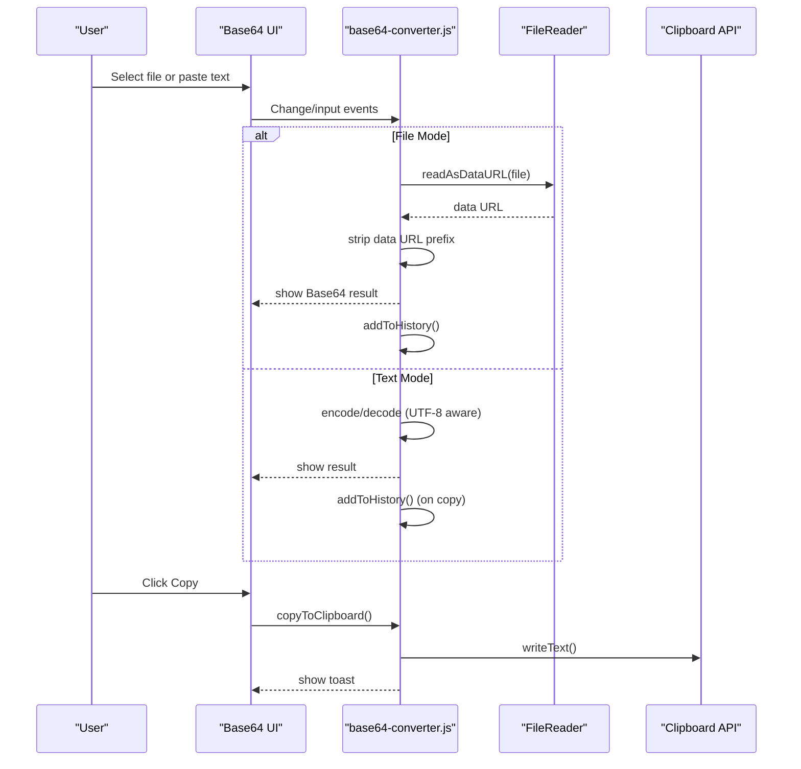
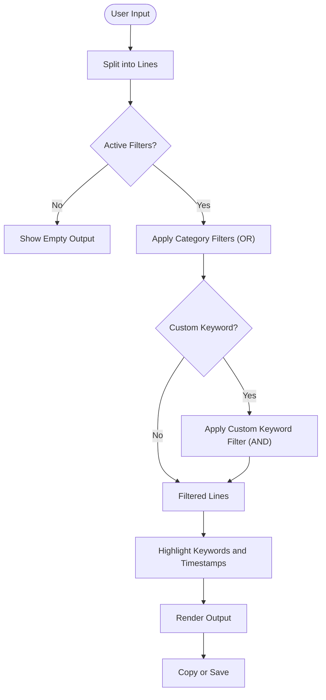
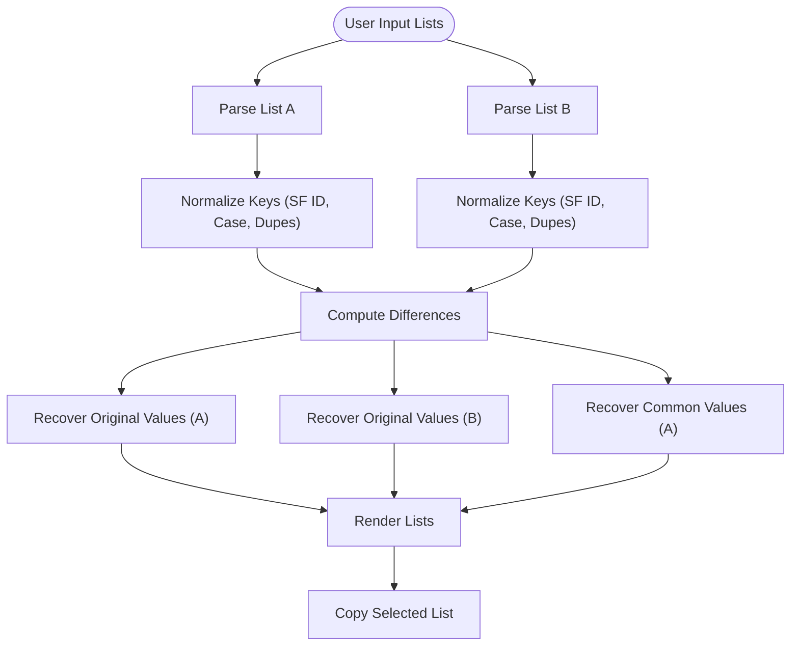
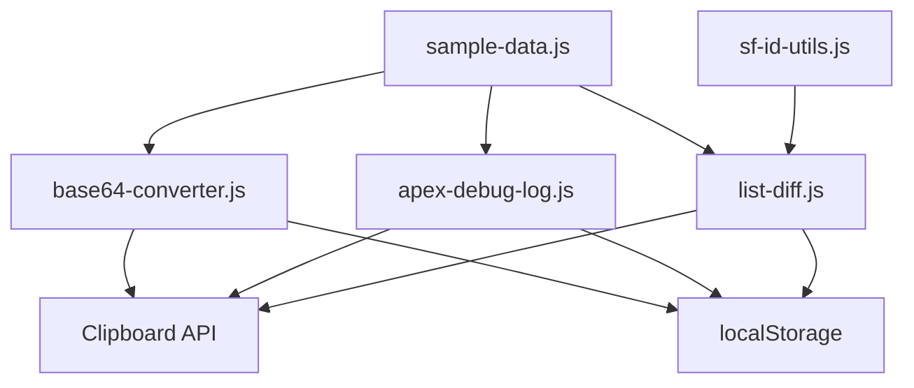

# Development Utilities

<cite>
**Referenced Files in This Document**
- [index.html](file://index.html)
- [README.md](file://README.md)
- [base64-converter.html](file://base64-converter.html)
- [base64-converter.js](file://base64-converter.js)
- [apex-debug-log.html](file://apex-debug-log.html)
- [apex-debug-log.js](file://apex-debug-log.js)
- [list-diff.html](file://list-diff.html)
- [list-diff.js](file://list-diff.js)
- [sample-data.js](file://sample-data.js)
- [sf-id-utils.js](file://sf-id-utils.js)
- [converter.js](file://converter.js)
</cite>

## Table of Contents
1. [Introduction](#introduction)
2. [Project Structure](#project-structure)
3. [Core Components](#core-components)
4. [Architecture Overview](#architecture-overview)
5. [Detailed Component Analysis](#detailed-component-analysis)
6. [Dependency Analysis](#dependency-analysis)
7. [Performance Considerations](#performance-considerations)
8. [Troubleshooting Guide](#troubleshooting-guide)
9. [Conclusion](#conclusion)

## Introduction
This document provides comprehensive documentation for the development-focused utilities in the repository. It focuses on three primary tools:
- Base64 Converter: File encoding, text encoding/decoding, history management, and mobile-friendly interface.
- Apex Debug Log Analyzer: Log parsing, filtering, error detection, and custom keyword search.
- List Difference Tool: Advanced comparison algorithms, smart Salesforce ID support, case sensitivity options, and duplicate handling.

The documentation covers input validation, performance optimizations, practical usage scenarios, clipboard integration, local storage persistence, and browser API usage patterns.

## Project Structure
The project is organized as a static web application with dedicated HTML and JavaScript files per tool. The index page serves as the central hub for navigation. Each tool’s HTML defines its UI layout, while the corresponding JS file implements the logic, event handling, and persistence.

**Diagram sources**
- [index.html:38-232](file://index.html#L38-L232)
- [base64-converter.html:1-236](file://base64-converter.html#L1-L236)
- [base64-converter.js:1-455](file://base64-converter.js#L1-L455)
- [apex-debug-log.html:1-277](file://apex-debug-log.html#L1-L277)
- [apex-debug-log.js:1-492](file://apex-debug-log.js#L1-L492)
- [list-diff.html:1-264](file://list-diff.html#L1-L264)
- [list-diff.js:1-345](file://list-diff.js#L1-L345)
- [sample-data.js:1-69](file://sample-data.js#L1-L69)
- [sf-id-utils.js:1-45](file://sf-id-utils.js#L1-L45)

**Section sources**
- [index.html:1-406](file://index.html#L1-L406)
- [README.md:1-63](file://README.md#L1-L63)

## Core Components
- Base64 Converter: Provides file-to-Base64 conversion via drag-and-drop or file selection, and text-to/Base64 conversion with encode/decode modes. It includes validation, history tracking, and clipboard integration.
- Apex Debug Log Analyzer: Parses raw debug logs, filters by categories (USER_DEBUG, EXCEPTION_THROWN, FATAL_ERROR, METHOD_ENTRY/EXIT, SOQL_EXECUTE_BEGIN), supports custom keyword search, and offers syntax highlighting and display customization.
- List Difference Tool: Compares two lists with advanced options including smart Salesforce ID normalization (15/18 char), case sensitivity, duplicate removal, trimming, empty line removal, and sorting modes.

**Section sources**
- [base64-converter.html:67-226](file://base64-converter.html#L67-L226)
- [base64-converter.js:149-360](file://base64-converter.js#L149-L360)
- [apex-debug-log.html:145-267](file://apex-debug-log.html#L145-L267)
- [apex-debug-log.js:304-365](file://apex-debug-log.js#L304-L365)
- [list-diff.html:98-253](file://list-diff.html#L98-L253)
- [list-diff.js:63-113](file://list-diff.js#L63-L113)

## Architecture Overview
Each tool follows a consistent pattern:
- HTML defines the UI and initializes the tool.
- JavaScript handles DOM events, processing logic, validation, persistence, and clipboard operations.
- Shared resources (sample data and utility functions) are reused across tools.

**Diagram sources**
- [base64-converter.js:132-146](file://base64-converter.js#L132-L146)
- [apex-debug-log.js:389-393](file://apex-debug-log.js#L389-L393)
- [list-diff.js:242-249](file://list-diff.js#L242-L249)

## Detailed Component Analysis

### Base64 Converter
- Modes and Capabilities
  - File Mode: Drag-and-drop or file picker to convert files to Base64 strings. Validates file size (default 5 MB) and strips data URL prefixes for clean output.
  - Text Mode: Encode text to Base64 and decode Base64 back to text. Uses UTF-8-aware encoding/decoding to ensure correctness.
  - Segmented control toggles between encode and decode modes.
- Validation and Safety
  - Character limit for text input (default 5000 characters) with real-time character count and warnings.
  - Error handling for invalid Base64 decoding and file read errors.
- History Management
  - Maintains a session history of up to 10 items, preventing immediate duplicates at the top. Provides copy/delete actions per history item.
- Mobile-Friendly Interface
  - Responsive layout with full-width segments and collapsible panels for history.
- Clipboard Integration
  - Copy to clipboard with graceful fallback when the Clipboard API is unavailable.
- Browser APIs and Patterns
  - FileReader for file reading, TextEncoder/TextDecoder for UTF-8 handling, Clipboard API with fallback, and DOM manipulation for UI updates.

**Diagram sources**
- [base64-converter.js:177-212](file://base64-converter.js#L177-L212)
- [base64-converter.js:215-273](file://base64-converter.js#L215-L273)
- [base64-converter.js:290-314](file://base64-converter.js#L290-L314)
- [base64-converter.js:373-411](file://base64-converter.js#L373-L411)

**Section sources**
- [base64-converter.html:67-226](file://base64-converter.html#L67-L226)
- [base64-converter.js:149-360](file://base64-converter.js#L149-L360)

### Apex Debug Log Analyzer
- Parsing and Filtering
  - Reads raw logs from textarea or uploads .log/.txt files with size checks.
  - Splits input into lines and filters based on selected categories and a custom keyword filter.
  - Applies OR logic among selected categories and AND logic with custom keyword when both are present.
- Error Detection and Highlighting
  - Highlights error-related keywords (e.g., EXCEPTION_THROWN, FATAL_ERROR) and other categories (USER_DEBUG, METHOD_ENTRY/EXIT, SOQL_EXECUTE_BEGIN) with distinct classes.
  - Timestamps at the start of lines are highlighted for readability.
- Display Customization
  - Toggle for syntax highlighting, font family selection (including JetBrains Mono, Fira Code, Consolas, Courier New, Menlo), and font size slider.
  - Configurations persisted in localStorage with a reset-to-defaults mechanism.
- Clipboard and Download
  - Copies filtered output to clipboard and allows downloading as a .log file with a derived filename.
- Browser APIs and Patterns
  - FileReader for file uploads, localStorage for configuration, Clipboard API with fallback, and DOM manipulation for dynamic highlighting.

**Diagram sources**
- [apex-debug-log.js:304-365](file://apex-debug-log.js#L304-L365)
- [apex-debug-log.js:168-245](file://apex-debug-log.js#L168-L245)
- [apex-debug-log.js:367-386](file://apex-debug-log.js#L367-L386)

**Section sources**
- [apex-debug-log.html:145-267](file://apex-debug-log.html#L145-L267)
- [apex-debug-log.js:304-365](file://apex-debug-log.js#L304-L365)

### List Difference Tool
- Advanced Comparison Algorithms
  - Transforms input lists into normalized keys for comparison:
    - Smart Salesforce ID mode: Normalizes 15-character IDs to 18-character case-safe IDs.
    - Case sensitivity: Applies lowercasing when disabled.
    - Duplicate handling: Option to remove duplicates within lists or preserve all instances.
  - Uses Map-backed sets to compute differences (only in A, only in B, common).
- Rendering and Interaction
  - Renders three result lists (Only in A, Common, Only in B) with counts and copy buttons.
  - Visualizes leading/trailing spaces with a special marker for clarity.
- Clipboard Integration
  - Copies selected result list to clipboard with a unified copy function.
- Browser APIs and Patterns
  - Uses DOM APIs for input parsing, Map/Set for efficient set operations, and Clipboard API with fallback.

**Diagram sources**
- [list-diff.js:63-113](file://list-diff.js#L63-L113)
- [list-diff.js:131-157](file://list-diff.js#L131-L157)
- [list-diff.js:159-181](file://list-diff.js#L159-L181)
- [list-diff.js:242-249](file://list-diff.js#L242-L249)

**Section sources**
- [list-diff.html:98-253](file://list-diff.html#L98-L253)
- [list-diff.js:63-181](file://list-diff.js#L63-L181)

## Dependency Analysis
- Cross-Tool Dependencies
  - sample-data.js provides centralized sample data used by multiple tools for quick testing and demonstration.
  - sf-id-utils.js encapsulates Salesforce ID utilities (validation and 15-to-18 conversion) used by the List Difference Tool.
- Internal Dependencies
  - Each tool’s JS file depends on its HTML for DOM elements and Bootstrap for UI components.
  - Clipboard API and localStorage are used consistently across tools for user experience and persistence.
- Coupling and Cohesion
  - Tools are loosely coupled; each maintains its own state and persistence.
  - Shared helpers (clipboard, toasts) are implemented within each tool’s JS for self-containment.

**Diagram sources**
- [sample-data.js:1-69](file://sample-data.js#L1-L69)
- [sf-id-utils.js:1-45](file://sf-id-utils.js#L1-L45)
- [base64-converter.js:373-411](file://base64-converter.js#L373-L411)
- [apex-debug-log.js:441-452](file://apex-debug-log.js#L441-L452)
- [list-diff.js:306-317](file://list-diff.js#L306-L317)

**Section sources**
- [sample-data.js:1-69](file://sample-data.js#L1-L69)
- [sf-id-utils.js:1-45](file://sf-id-utils.js#L1-L45)

## Performance Considerations
- Input Limits and Validation
  - Base64 Converter enforces a 5 MB file size limit and a 5000-character text limit to prevent UI freezes and memory pressure.
  - Apex Debug Log Analyzer restricts file uploads to 50 MB and disables save when output is empty.
- Efficient Data Structures
  - List Difference Tool uses Map-backed sets for O(1) average-time key lookups and Set operations for difference computation.
- Rendering Optimizations
  - Apex Debug Log uses a single pass to build highlighted HTML and stores raw filtered text for copy/download operations.
  - List Difference Tool renders lists using document fragments to minimize reflows.
- Clipboard and Persistence
  - Clipboard API is preferred with a fallback to textarea execCommand for older browsers.
  - localStorage is used for lightweight persistence (configuration and history) to avoid network overhead.

[No sources needed since this section provides general guidance]

## Troubleshooting Guide
- Base64 Converter
  - Invalid Base64 decoding displays an error message and clears the output. Ensure the input is a valid Base64 string.
  - Large files cause validation errors; reduce file size or split the input.
- Apex Debug Log Analyzer
  - If no output appears, ensure at least one category is selected or a custom keyword is provided.
  - For large files, consider splitting the log or using the upload feature carefully.
- List Difference Tool
  - If results seem incorrect, verify the “Smart SF Mode” setting and case sensitivity options.
  - For duplicate handling, confirm whether duplicates within lists should be removed or preserved.

**Section sources**
- [base64-converter.js:164-174](file://base64-converter.js#L164-L174)
- [apex-debug-log.js:342-356](file://apex-debug-log.js#L342-L356)
- [list-diff.js:131-157](file://list-diff.js#L131-L157)

## Conclusion
These development utilities are designed for secure, offline-first operation with robust input validation, performance optimizations, and a consistent user experience. They leverage browser APIs for clipboard integration and localStorage for persistence, ensuring privacy and responsiveness. The Base64 Converter, Apex Debug Log Analyzer, and List Difference Tool collectively address common developer tasks with practical features tailored for productivity and reliability.