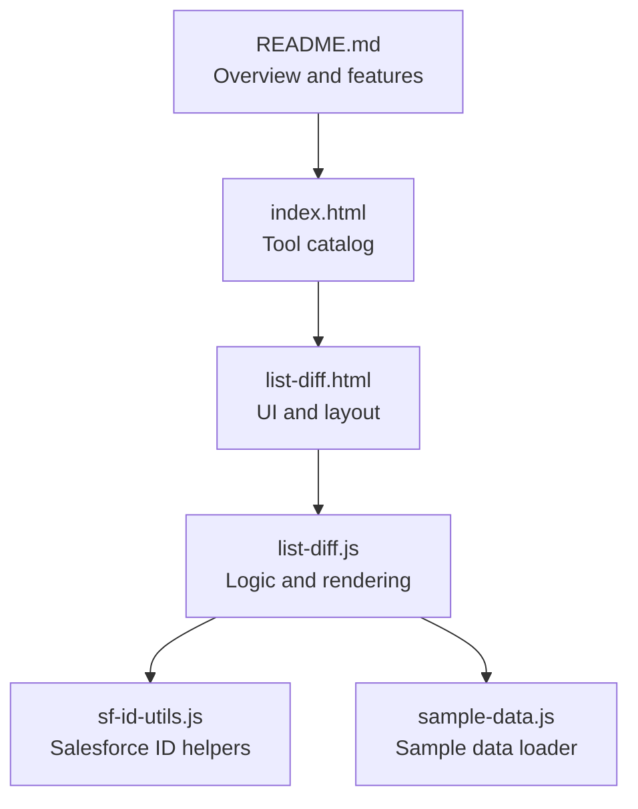
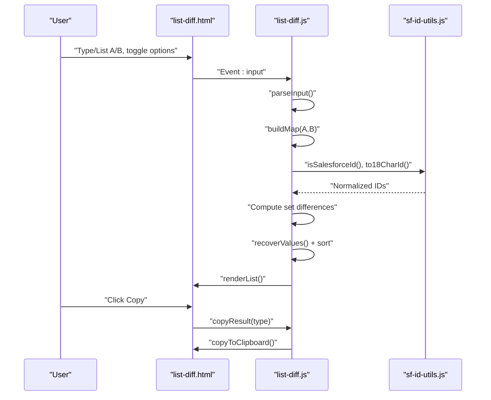
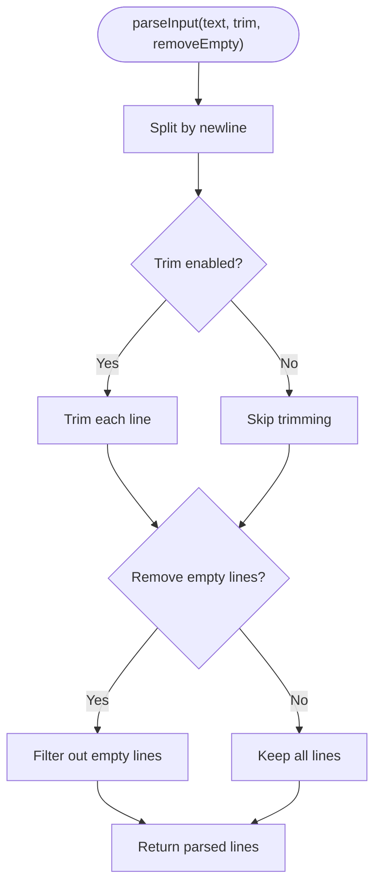
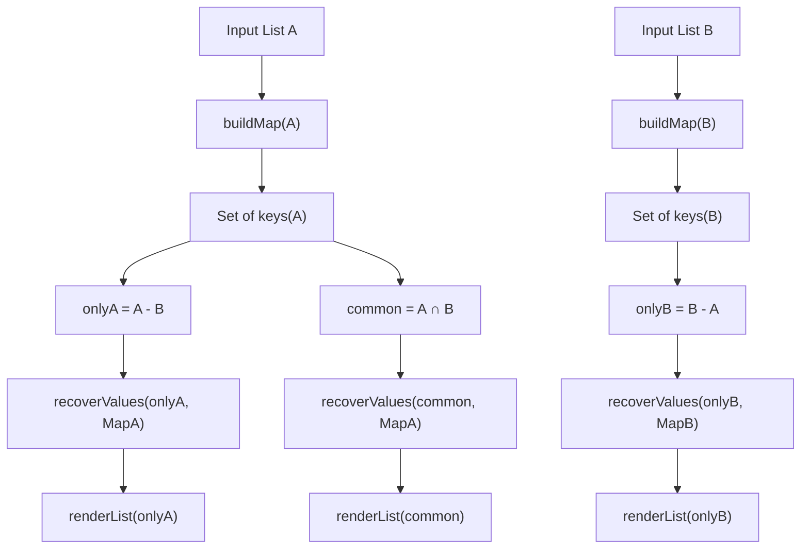
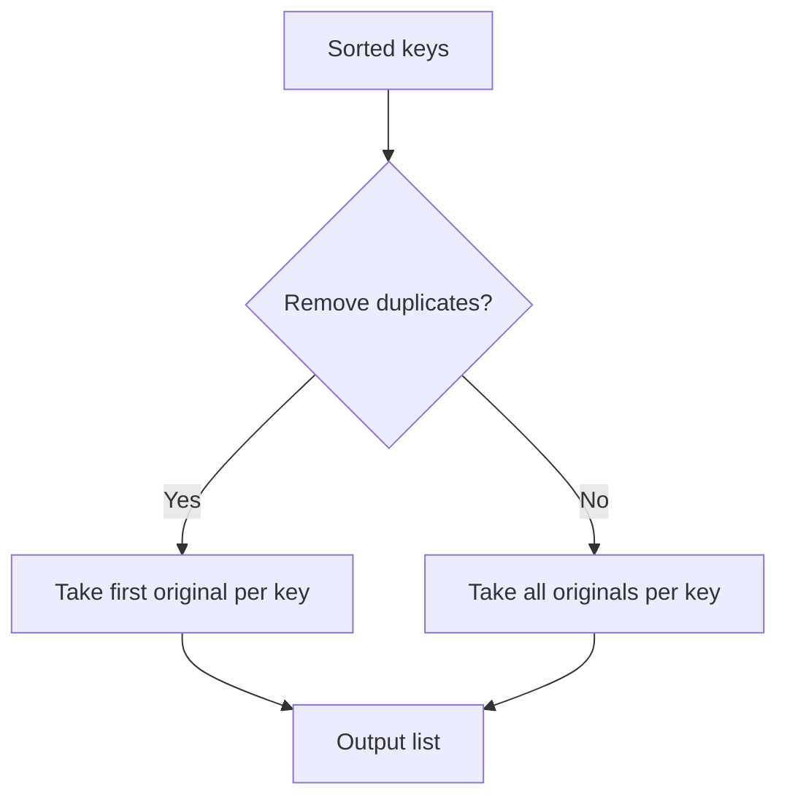
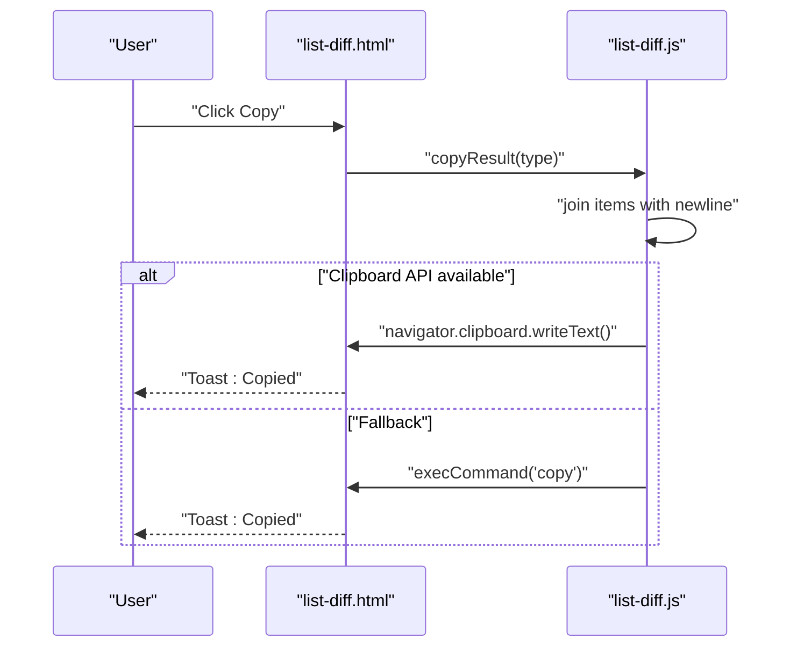
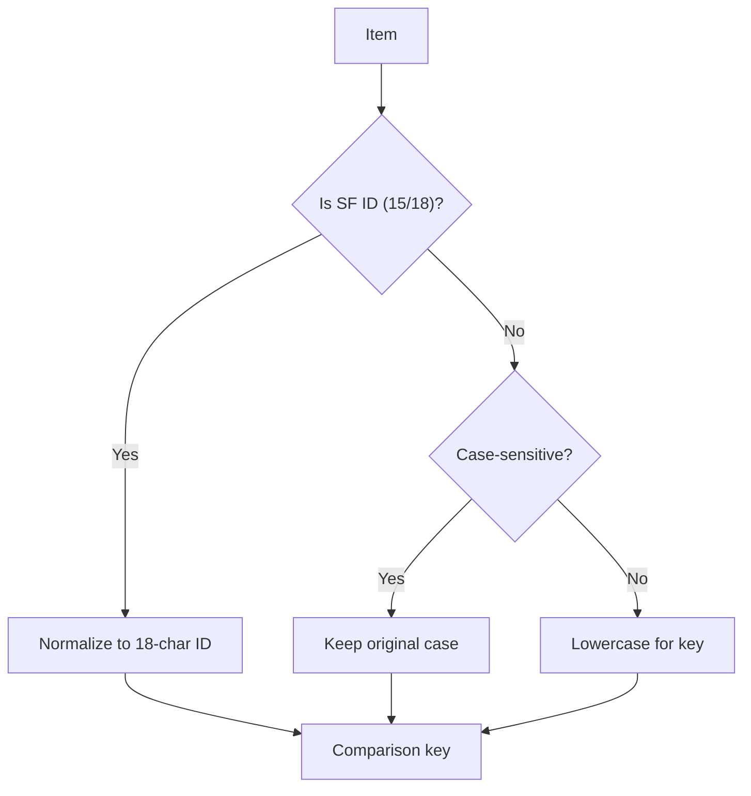
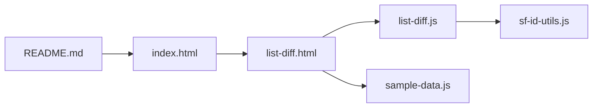

# List Difference Tool

<cite>
**Referenced Files in This Document**
- [list-diff.html](file://list-diff.html)
- [list-diff.js](file://list-diff.js)
- [sf-id-utils.js](file://sf-id-utils.js)
- [sample-data.js](file://sample-data.js)
- [README.md](file://README.md)
- [index.html](file://index.html)
</cite>

## Table of Contents
1. [Introduction](#introduction)
2. [Project Structure](#project-structure)
3. [Core Components](#core-components)
4. [Architecture Overview](#architecture-overview)
5. [Detailed Component Analysis](#detailed-component-analysis)
6. [Dependency Analysis](#dependency-analysis)
7. [Performance Considerations](#performance-considerations)
8. [Troubleshooting Guide](#troubleshooting-guide)
9. [Conclusion](#conclusion)
10. [Appendices](#appendices)

## Introduction
The List Difference Tool compares two lists of identifiers or arbitrary text entries and highlights differences between them. It supports advanced comparison modes including:
- Case-sensitive and case-insensitive comparisons
- Duplicate handling strategies
- Smart Salesforce ID detection and normalization (15-character to 18-character case-safe IDs)
- Flexible input parsing for newlines and optional trimming/empty-line removal
- Real-time rendering of results grouped as “Only in A,” “Only in B,” and “Common”
- Clipboard integration for copying each result segment
- Optional sorting and duplicate removal for clean output

This document explains the algorithms, data flows, UI controls, and practical usage patterns for comparing user lists, identifying missing records across systems, and validating data migrations.

## Project Structure
The List Difference Tool is implemented as a self-contained web page with minimal JavaScript logic and a small utility module for Salesforce ID helpers.

**Diagram sources**
- [list-diff.html](file://list-diff.html)
- [list-diff.js](file://list-diff.js)
- [sf-id-utils.js](file://sf-id-utils.js)
- [sample-data.js](file://sample-data.js)
- [index.html](file://index.html)
- [README.md](file://README.md)

**Section sources**
- [list-diff.html](file://list-diff.html)
- [list-diff.js](file://list-diff.js)
- [sf-id-utils.js](file://sf-id-utils.js)
- [sample-data.js](file://sample-data.js)
- [README.md](file://README.md)
- [index.html](file://index.html)

## Core Components
- Input areas for List A and List B with live counters
- Control panel toggles:
  - Smart Salesforce ID mode
  - Case-sensitive toggle
  - Remove duplicates toggle
  - Trim whitespace toggle
  - Remove empty lines toggle
  - Sort mode selector (A–Z, Z–A, Original)
- Result panels:
  - Only in A
  - Common
  - Only in B
- Copy buttons per result panel
- Sample data loader and clear-all button

Key behaviors:
- Real-time updates on any input change
- Parsing by newline with optional trimming and empty-line removal
- Comparison keys derived from either normalized Salesforce IDs or lowercased text
- Sorting controlled by the selected sort mode
- Rendering with whitespace visualization and safe HTML escaping

**Section sources**
- [list-diff.html](file://list-diff.html)
- [list-diff.js](file://list-diff.js)

## Architecture Overview
The tool follows a reactive, event-driven architecture:
- DOMContentLoaded initializes UI and binds events
- On each input change, the tool re-parses inputs, builds comparison maps, computes set differences, recovers original values, sorts, and renders results
- Clipboard integration writes text to the system clipboard with a fallback for older browsers

**Diagram sources**
- [list-diff.html](file://list-diff.html)
- [list-diff.js](file://list-diff.js)
- [sf-id-utils.js](file://sf-id-utils.js)

## Detailed Component Analysis

### Input Parsing and Normalization
- Split by newline to create lines
- Optional trim and remove-empty-line filtering
- No delimiter parsing (comma, semicolon, tab) is performed; the tool treats each line as a separate item
- Whitespace normalization is handled by trimming and empty-line removal toggles

**Diagram sources**
- [list-diff.js](file://list-diff.js)

**Section sources**
- [list-diff.js](file://list-diff.js)

### Comparison Keys and Duplicate Handling
- For each item, compute a comparison key:
  - If Smart SF mode is enabled and the item matches 15- or 18-character alphanumeric, normalize to 18-character ID
  - Otherwise, if Case-insensitive mode is enabled, lowercase the key
- Build a Map of key -> list of original items
- Differences computed using sets of keys:
  - Only in A: keys in A but not in B
  - Only in B: keys in B but not in A
  - Common: keys in both A and B
- Recover original values:
  - If Remove duplicates is ON, push the first original for each key
  - If OFF, push all originals for each key

**Diagram sources**
- [list-diff.js](file://list-diff.js)

**Section sources**
- [list-diff.js](file://list-diff.js)

### Sorting and Output Formatting
- Sort modes:
  - A–Z: sort ascending
  - Z–A: sort descending
  - Original: preserve insertion order
- Duplicate removal:
  - When enabled, only the first original item is included per key
- Rendering:
  - Safe HTML escaping
  - Whitespace visualization via invisible-space spans
  - Counts updated for each panel

**Diagram sources**
- [list-diff.js](file://list-diff.js)

**Section sources**
- [list-diff.js](file://list-diff.js)

### Clipboard Integration and Session Persistence
- Copy buttons trigger copyResult(type) which joins items with newlines and copies to clipboard
- Uses modern Clipboard API with fallback to execCommand for older browsers
- Toast notifications confirm successful copy
- Sample data loader populates inputs with curated examples and enables Smart SF and Remove duplicates by default
- Clear All resets inputs and re-runs the diff

**Diagram sources**
- [list-diff.js](file://list-diff.js)
- [list-diff.html](file://list-diff.html)

**Section sources**
- [list-diff.js](file://list-diff.js)
- [list-diff.html](file://list-diff.html)
- [sample-data.js](file://sample-data.js)

### Salesforce ID Detection and Normalization
- Smart SF mode detects 15- or 18-character alphanumeric strings
- 15-character IDs are normalized to 18-character case-safe IDs using checksum logic
- Case-sensitive mode applies to non-Salesforce IDs; 18-character IDs remain case-safe for comparison

**Diagram sources**
- [list-diff.js](file://list-diff.js)
- [sf-id-utils.js](file://sf-id-utils.js)

**Section sources**
- [list-diff.js](file://list-diff.js)
- [sf-id-utils.js](file://sf-id-utils.js)

## Dependency Analysis
- list-diff.html depends on list-diff.js for logic and sample-data.js for sample data
- list-diff.js depends on sf-id-utils.js for Salesforce ID utilities
- index.html links to list-diff.html as a tool card
- README.md describes the tool’s role in the suite

**Diagram sources**
- [list-diff.html](file://list-diff.html)
- [list-diff.js](file://list-diff.js)
- [sf-id-utils.js](file://sf-id-utils.js)
- [sample-data.js](file://sample-data.js)
- [index.html](file://index.html)
- [README.md](file://README.md)

**Section sources**
- [list-diff.html](file://list-diff.html)
- [list-diff.js](file://list-diff.js)
- [sf-id-utils.js](file://sf-id-utils.js)
- [sample-data.js](file://sample-data.js)
- [index.html](file://index.html)
- [README.md](file://README.md)

## Performance Considerations
- Time complexity:
  - Parsing: O(n) per list
  - Building maps: O(n) per list
  - Set operations: O(n) for differences
  - Sorting: O(k log k) where k is the number of distinct keys
  - Overall: O(n + k log k)
- Memory:
  - Two maps storing original items per key
  - Temporary arrays for keys and filtered results
- Optimizations:
  - Single pass per list to build maps
  - Efficient Set operations for differences
  - Minimal DOM updates by using document fragments
- Large dataset tips:
  - Prefer removing duplicates to reduce key cardinality
  - Use “Original” sort mode to avoid unnecessary sorting
  - Trim and remove empty lines to reduce noise

[No sources needed since this section provides general guidance]

## Troubleshooting Guide
- Malformed inputs:
  - Non-Salesforce IDs are treated as literal text; ensure IDs are 15 or 18 characters if Smart SF mode is enabled
  - If IDs appear mismatched, disable Smart SF mode to compare as-is
- Unexpected differences:
  - Verify Case-sensitive toggle matches your expectation
  - Confirm Remove duplicates setting aligns with desired output granularity
- Clipboard failures:
  - Ensure the page is served over HTTPS or localhost for Clipboard API availability
  - Older browsers fall back to execCommand; if copy fails, check browser console for errors
- Empty results:
  - Check that inputs are not empty and that Remove empty lines is configured appropriately
  - Validate that sort mode and duplicate removal are not inadvertently filtering all items

**Section sources**
- [list-diff.js](file://list-diff.js)
- [sf-id-utils.js](file://sf-id-utils.js)

## Conclusion
The List Difference Tool provides a fast, client-side solution for comparing two lists with flexible normalization and presentation options. Its Smart SF mode ensures accurate comparisons of Salesforce IDs, while real-time rendering and clipboard integration streamline validation tasks such as identifying missing records and verifying data migrations.

[No sources needed since this section summarizes without analyzing specific files]

## Appendices

### Practical Usage Scenarios
- Comparing user lists:
  - Paste two sets of usernames or email addresses
  - Enable Smart SF mode only if IDs are involved
  - Use “Remove duplicates” to focus on unique differences
- Identifying missing records between systems:
  - Compare exported IDs from System A and System B
  - Review “Only in A” and “Only in B” to locate discrepancies
- Validating data migrations:
  - Compare pre- and post-migration ID sets
  - Normalize 15-character IDs to 18-character for consistent comparison

[No sources needed since this section provides general guidance]

### UI Controls Reference
- Smart SF Mode: Treats 15/18-character alphanumeric strings as Salesforce IDs and normalizes them for comparison
- Case Sensitive: Treats uppercase/lowercase differently
- Remove Duplicates: Removes repeated items within each list before comparison
- Trim: Removes leading/trailing whitespace from each line
- Remove Empty Lines: Filters out blank lines
- Sort: Choose A–Z, Z–A, or Original order
- Load Sample: Populates inputs with curated examples
- Clear All: Resets inputs and reruns comparison

**Section sources**
- [list-diff.html](file://list-diff.html)
- [list-diff.js](file://list-diff.js)
- [sample-data.js](file://sample-data.js)