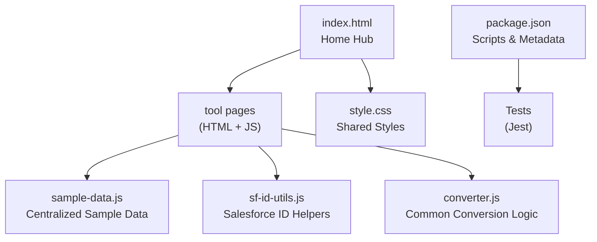
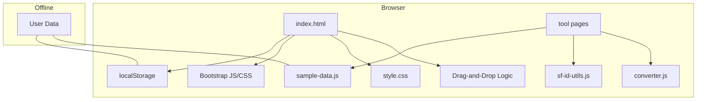
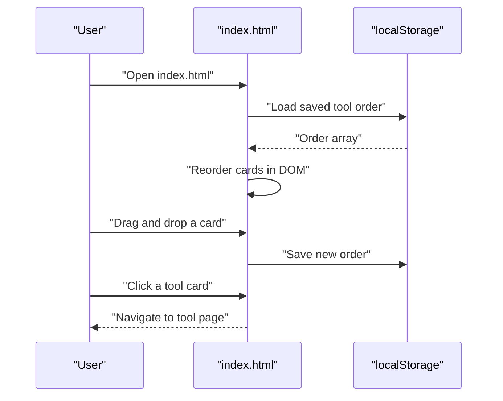
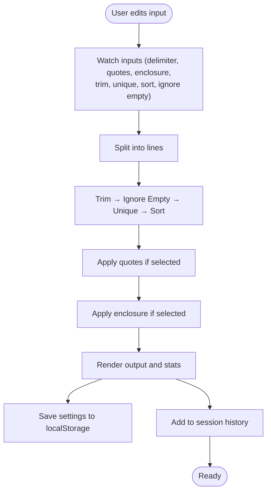
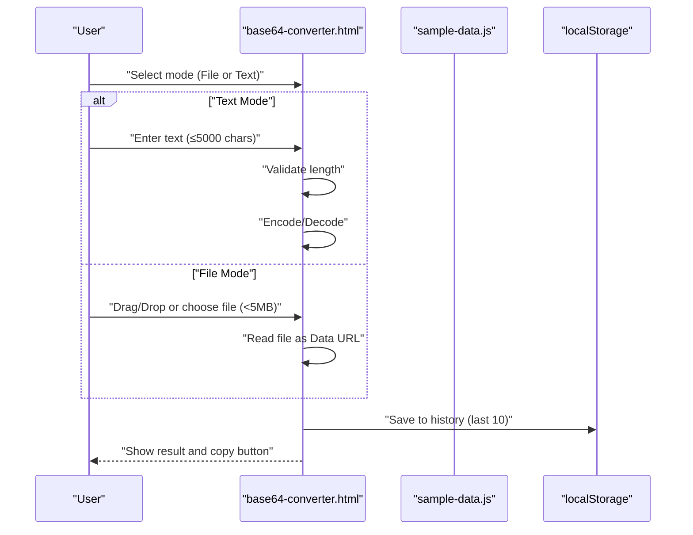
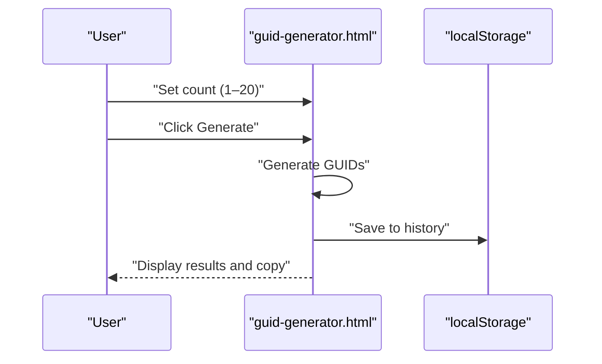
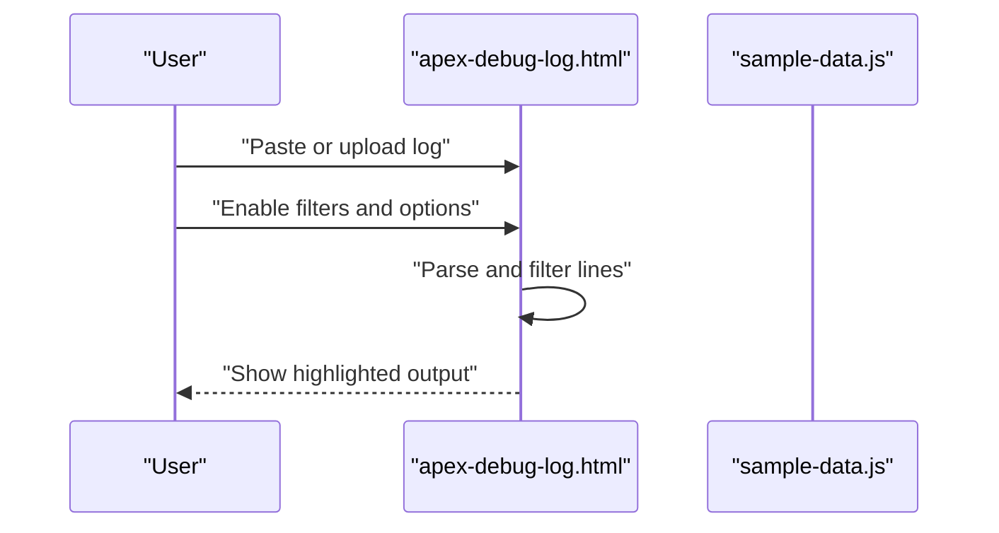
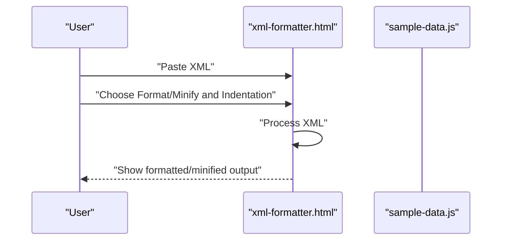
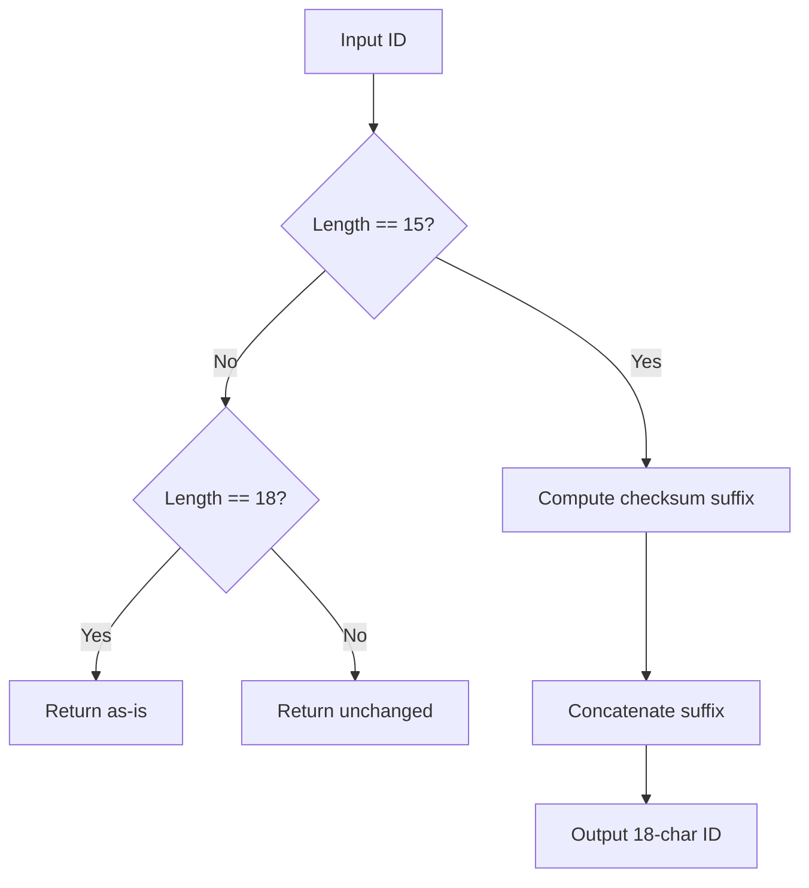
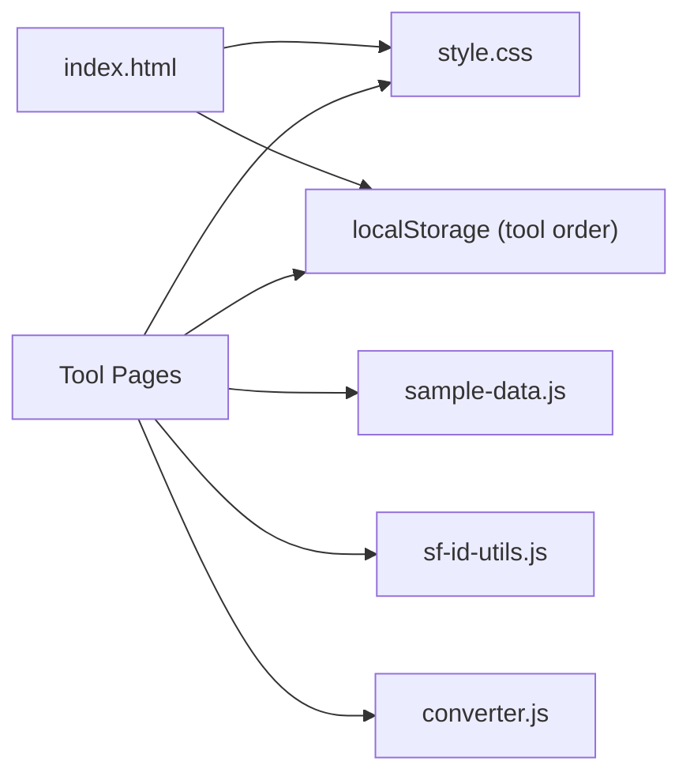

# Getting Started

<cite>
**Referenced Files in This Document**
- [README.md](file://README.md)
- [package.json](file://package.json)
- [index.html](file://index.html)
- [style.css](file://style.css)
- [DESIGN.md](file://DESIGN.md)
- [converter.js](file://converter.js)
- [base64-converter.html](file://base64-converter.html)
- [guid-generator.html](file://guid-generator.html)
- [apex-debug-log.html](file://apex-debug-log.html)
- [xml-formatter.html](file://xml-formatter.html)
- [sf-id-utils.js](file://sf-id-utils.js)
- [sample-data.js](file://sample-data.js)
- [guid-generator.test.js](file://guid-generator.test.js)
- [sf-id-utils.test.js](file://sf-id-utils.test.js)
</cite>

## Table of Contents
1. [Introduction](#introduction)
2. [Project Structure](#project-structure)
3. [Core Components](#core-components)
4. [Architecture Overview](#architecture-overview)
5. [Detailed Component Analysis](#detailed-component-analysis)
6. [Dependency Analysis](#dependency-analysis)
7. [Performance Considerations](#performance-considerations)
8. [Troubleshooting Guide](#troubleshooting-guide)
9. [Conclusion](#conclusion)
10. [Appendices](#appendices)

## Introduction
Dev Utils is a suite of secure, offline-first developer utilities designed to run entirely in your browser. All data processing occurs locally on your machine—no data is ever sent to an external server. The project emphasizes privacy, performance, and usability with a glassmorphic dark theme, responsive layout, and persistent local preferences.

Key goals:
- Run tools directly from your file system without a web server.
- Keep everything client-side with no analytics, cookies, or server-side logging.
- Provide a pleasant developer experience with drag-and-drop reordering, local storage persistence, and sample data loaders.

**Section sources**
- [README.md:1-63](file://README.md#L1-L63)

## Project Structure
At a high level, the project consists of:
- A home hub page that lists tools as draggable cards.
- Individual tool pages that implement specific utilities.
- Shared styles and design tokens.
- Sample data and utility modules used across tools.
- Tests for core utilities.

**Diagram sources**
- [index.html:1-406](file://index.html#L1-L406)
- [style.css:1-293](file://style.css#L1-L293)
- [sample-data.js:1-69](file://sample-data.js#L1-L69)
- [sf-id-utils.js:1-45](file://sf-id-utils.js#L1-L45)
- [converter.js:1-507](file://converter.js#L1-L507)
- [package.json:1-25](file://package.json#L1-L25)

**Section sources**
- [README.md:47-63](file://README.md#L47-L63)
- [index.html:31-232](file://index.html#L31-L232)
- [style.css:14-293](file://style.css#L14-L293)
- [sample-data.js:1-69](file://sample-data.js#L1-L69)
- [sf-id-utils.js:1-45](file://sf-id-utils.js#L1-L45)
- [converter.js:1-507](file://converter.js#L1-L507)
- [package.json:1-25](file://package.json#L1-L25)

## Core Components
- Home Hub (index.html): Lists tools as draggable cards, persists ordering in local storage, and links to each tool page.
- Tool Pages: Each tool page is self-contained with its own HTML, CSS overrides, and JavaScript logic.
- Shared Modules:
  - sample-data.js: Provides centralized sample data for multiple tools.
  - sf-id-utils.js: Validates and converts Salesforce IDs.
  - converter.js: Implements shared conversion logic and persistence for the Column to List tool.
- Styles: style.css defines the dark theme, glass panels, typography, and responsive layout.
- Tests: Jest-based tests for GUID and Salesforce ID utilities.

Quick capabilities:
- Drag-and-drop reordering of tools with automatic persistence.
- Local storage usage for tool order and per-tool settings/history.
- Sample data loaders to accelerate common workflows.
- Offline-first operation with no network dependencies.

**Section sources**
- [index.html:38-232](file://index.html#L38-L232)
- [converter.js:221-269](file://converter.js#L221-L269)
- [style.css:14-293](file://style.css#L14-L293)
- [sample-data.js:1-69](file://sample-data.js#L1-L69)
- [sf-id-utils.js:1-45](file://sf-id-utils.js#L1-L45)
- [package.json:6-11](file://package.json#L6-L11)

## Architecture Overview
The application follows a static, client-side architecture:
- index.html serves as the central hub and manages tool ordering via drag-and-drop and local storage.
- Each tool page loads its own script(s) and shares common assets (Bootstrap, icons, style.css).
- Utilities rely on browser APIs (localStorage, Clipboard API, FileReader) and avoid external dependencies.

**Diagram sources**
- [index.html:274-403](file://index.html#L274-L403)
- [style.css:14-293](file://style.css#L14-L293)
- [sample-data.js:1-69](file://sample-data.js#L1-L69)
- [sf-id-utils.js:1-45](file://sf-id-utils.js#L1-L45)
- [converter.js:1-507](file://converter.js#L1-L507)

## Detailed Component Analysis

### Home Hub (index.html)
- Purpose: Present tools as draggable cards, persist order, and provide navigation.
- Key behaviors:
  - Loads and saves tool order to localStorage keyed by a dedicated storage key.
  - Supports resetting order to defaults.
  - Links to each tool page via anchor tags inside cards.
- Privacy: No analytics, no cookies, no server communication.

**Diagram sources**
- [index.html:274-403](file://index.html#L274-L403)

**Section sources**
- [index.html:38-232](file://index.html#L38-L232)
- [index.html:274-403](file://index.html#L274-L403)

### Column to List Converter (converter.js)
- Purpose: Transform spreadsheet columns into formatted lists with delimiters, quotes, enclosure, dedupe, sort, and whitespace trimming.
- Persistence: Saves settings to localStorage and maintains a session history.
- Sample Data: Integrates with centralized sample data loader.

**Diagram sources**
- [converter.js:67-152](file://converter.js#L67-L152)
- [converter.js:221-269](file://converter.js#L221-L269)
- [converter.js:307-354](file://converter.js#L307-L354)

**Section sources**
- [converter.js:1-507](file://converter.js#L1-L507)
- [sample-data.js:4-12](file://sample-data.js#L4-L12)

### Base64 Converter (base64-converter.html + base64-converter.js)
- Purpose: Convert files to Base64 Data URLs and text to/from Base64 with validation and history.
- Features:
  - File drag-and-drop with a 5 MB recommended limit.
  - Text mode with encode/decode toggle and 5000-character input limit.
  - History panel storing the last 10 conversions.
  - Copy to clipboard with graceful fallback.

**Diagram sources**
- [base64-converter.html:1-236](file://base64-converter.html#L1-L236)
- [sample-data.js:43-44](file://sample-data.js#L43-L44)

**Section sources**
- [base64-converter.html:1-236](file://base64-converter.html#L1-L236)
- [sample-data.js:1-69](file://sample-data.js#L1-L69)

### GUID Generator (guid-generator.html + guid-generator.js)
- Purpose: Generate random UUID v4 with bulk generation (up to 20) and session history.
- Features:
  - Number slider and input with a cap of 20.
  - Copy to clipboard and session history table.

**Diagram sources**
- [guid-generator.html:1-123](file://guid-generator.html#L1-L123)

**Section sources**
- [guid-generator.html:1-123](file://guid-generator.html#L1-L123)

### Apex Debug Log Filter (apex-debug-log.html + apex-debug-log.js)
- Purpose: Filter and highlight relevant sections from raw Apex debug logs.
- Features:
  - Filter toggles for USER_DEBUG, EXCEPTION_THROWN, FATAL_ERROR, METHOD_ENTRY, METHOD_EXIT, SOQL_EXECUTE_BEGIN.
  - Custom substring filtering.
  - Syntax highlighting and font family/size controls.
  - Load sample data and copy/save filtered output.

**Diagram sources**
- [apex-debug-log.html:1-277](file://apex-debug-log.html#L1-L277)
- [sample-data.js:46-57](file://sample-data.js#L46-L57)

**Section sources**
- [apex-debug-log.html:1-277](file://apex-debug-log.html#L1-L277)
- [sample-data.js:1-69](file://sample-data.js#L1-L69)

### XML / package.xml Formatter (xml-formatter.html + xml-formatter.js)
- Purpose: Pretty print and minify XML with configurable indentation.
- Features:
  - Load sample data, format/minify, copy output.
  - Validation warnings for malformed XML.

**Diagram sources**
- [xml-formatter.html:1-143](file://xml-formatter.html#L1-L143)
- [sample-data.js:59-63](file://sample-data.js#L59-L63)

**Section sources**
- [xml-formatter.html:1-143](file://xml-formatter.html#L1-L143)
- [sample-data.js:1-69](file://sample-data.js#L1-L69)

### Salesforce ID Utilities (sf-id-utils.js)
- Purpose: Validate and convert Salesforce IDs between 15 and 18 characters.
- Tests: Jest-based unit tests validate correctness and edge cases.

**Diagram sources**
- [sf-id-utils.js:6-39](file://sf-id-utils.js#L6-L39)

**Section sources**
- [sf-id-utils.js:1-45](file://sf-id-utils.js#L1-L45)
- [sf-id-utils.test.js:1-55](file://sf-id-utils.test.js#L1-L55)

### Shared Styles and Design Tokens (style.css, DESIGN.md)
- Purpose: Provide a cohesive dark theme, glass panels, typography, and responsive layout.
- Highlights:
  - CSS custom properties define colors, gradients, and shadows.
  - Glass panels, hover effects, and custom scrollbars.
  - Responsive breakpoints and desktop app-mode layout.

**Section sources**
- [style.css:1-293](file://style.css#L1-L293)
- [DESIGN.md:1-202](file://DESIGN.md#L1-L202)

## Dependency Analysis
- Internal dependencies:
  - Tool pages depend on shared assets (Bootstrap, icons, style.css).
  - Many tools depend on sample-data.js for quick-start data.
  - converter.js is reused by the Column to List tool for settings and history.
  - sf-id-utils.js is used by ID-related tools/utilities.
- External dependencies:
  - Bootstrap CSS/JS and Bootstrap Icons CDN.
  - Jest for testing (development dependency).
- Storage:
  - localStorage is used for tool ordering, settings, and histories.

**Diagram sources**
- [index.html:274-403](file://index.html#L274-L403)
- [style.css:14-293](file://style.css#L14-L293)
- [sample-data.js:1-69](file://sample-data.js#L1-L69)
- [sf-id-utils.js:1-45](file://sf-id-utils.js#L1-L45)
- [converter.js:1-507](file://converter.js#L1-L507)

**Section sources**
- [index.html:274-403](file://index.html#L274-L403)
- [style.css:14-293](file://style.css#L14-L293)
- [sample-data.js:1-69](file://sample-data.js#L1-L69)
- [sf-id-utils.js:1-45](file://sf-id-utils.js#L1-L45)
- [converter.js:1-507](file://converter.js#L1-L507)
- [package.json:9-11](file://package.json#L9-L11)

## Performance Considerations
- Input limits:
  - Base64 text mode enforces a 5000-character limit for performance safety.
  - Base64 file uploads recommend a 5 MB maximum for optimal performance.
- Local storage:
  - Used for tool order, settings, and histories; keep payloads reasonable to avoid hitting quotas.
- Clipboard API:
  - Falls back gracefully to execCommand when the secure context is unavailable.
- Rendering:
  - Tools use lightweight DOM updates and avoid heavy computations on the main thread.

**Section sources**
- [README.md:29-32](file://README.md#L29-L32)
- [base64-converter.html:105-107](file://base64-converter.html#L105-L107)
- [base64-converter.html:118](file://base64-converter.html#L118)
- [converter.js:468-506](file://converter.js#L468-L506)

## Troubleshooting Guide
- Cannot open index.html directly in some browsers:
  - Some browsers restrict localStorage or Clipboard API when opening files locally. Try serving via a local static server or open in a browser that allows these features for file:// URLs.
- Drag-and-drop not working:
  - Ensure you are using a modern browser that supports HTML5 drag-and-drop and localStorage.
- Clipboard copy fails:
  - The app attempts navigator.clipboard; if unavailable or blocked, it falls back to a document.execCommand approach. If both fail, check browser permissions and security settings.
- Tool settings not persisting:
  - Confirm localStorage is enabled and not blocked by browser settings or private/incognito modes.
- Large Base64 file fails:
  - Reduce file size or split into smaller chunks; the recommended limit is under 5 MB.

Privacy and security:
- All processing runs locally; no data leaves your browser.
- No analytics, cookies, or server-side logging.
- Decoded outputs are displayed as plain text and are not executed.

**Section sources**
- [README.md:52-59](file://README.md#L52-L59)
- [base64-converter.html:105-107](file://base64-converter.html#L105-L107)
- [base64-converter.html:118](file://base64-converter.html#L118)
- [converter.js:468-506](file://converter.js#L468-L506)

## Conclusion
Dev Utils delivers a secure, offline-first toolkit that runs entirely in your browser. With a clean dark theme, responsive design, and practical utilities, it streamlines common developer tasks while preserving your privacy. Use the home hub to organize tools, leverage sample data to accelerate workflows, and rely on local storage for persistence.

[No sources needed since this section summarizes without analyzing specific files]

## Appendices

### Browser Requirements and Compatibility
- Modern browsers with support for:
  - HTML5 drag-and-drop API
  - localStorage
  - Clipboard API (with fallback)
  - FileReader API (for Base64 file uploads)
- Recommended: Chrome, Edge, Firefox, Safari latest versions.

**Section sources**
- [index.html:274-403](file://index.html#L274-L403)
- [base64-converter.html:105-107](file://base64-converter.html#L105-L107)
- [base64-converter.html:118](file://base64-converter.html#L118)

### Step-by-Step Setup and First Run
1. Clone or download the repository to your machine.
2. Open index.html in your browser.
3. Reorder tools by dragging cards; the order is saved automatically.
4. Navigate to a tool page (e.g., Column to List, Base64 Converter).
5. Use the “Load Sample” buttons to quickly populate inputs for testing.
6. Perform conversions or operations; results are displayed locally.
7. Use “Copy” buttons to transfer results to your clipboard.

**Section sources**
- [README.md:47-51](file://README.md#L47-L51)
- [index.html:38-232](file://index.html#L38-L232)
- [sample-data.js:1-69](file://sample-data.js#L1-L69)

### Quick Start Examples
- Column to List:
  - Paste a list of items, choose delimiter and optional quoting, enable dedupe and sort, then copy the result.
- Base64 Converter:
  - Switch to Text mode, enter or paste text (≤5000 chars), choose Encode or Decode, copy the result.
  - Or switch to File mode, drag/drop a file (recommended <5MB), and copy the resulting Data URL.
- GUID Generator:
  - Set the number of GUIDs (1–20), generate, and copy the results.
- Apex Debug Log Filter:
  - Paste or upload a log, enable desired filters, adjust font and highlighting, then copy or save the filtered output.
- XML Formatter:
  - Paste XML, choose Pretty Print or Minify, set indentation, and copy the formatted output.

**Section sources**
- [converter.js:67-152](file://converter.js#L67-L152)
- [base64-converter.html:117-148](file://base64-converter.html#L117-L148)
- [guid-generator.html:62-73](file://guid-generator.html#L62-L73)
- [apex-debug-log.html:177-246](file://apex-debug-log.html#L177-L246)
- [xml-formatter.html:87-110](file://xml-formatter.html#L87-L110)

### Privacy and Offline Behavior
- Local Processing: All tools run client-side; no data is sent to servers.
- Safe Execution: Outputs are rendered as plain text; decoded scripts are not executed.
- Performance: Input limits protect against browser slowdowns.
- No Analytics: No tracking, cookies, or server-side logs.

**Section sources**
- [README.md:52-59](file://README.md#L52-L59)

### Testing
- Run tests with the configured Jest script.
- Tests cover GUID generation and Salesforce ID utilities.

**Section sources**
- [package.json:6-11](file://package.json#L6-L11)
- [guid-generator.test.js:1-24](file://guid-generator.test.js#L1-L24)
- [sf-id-utils.test.js:1-55](file://sf-id-utils.test.js#L1-L55)