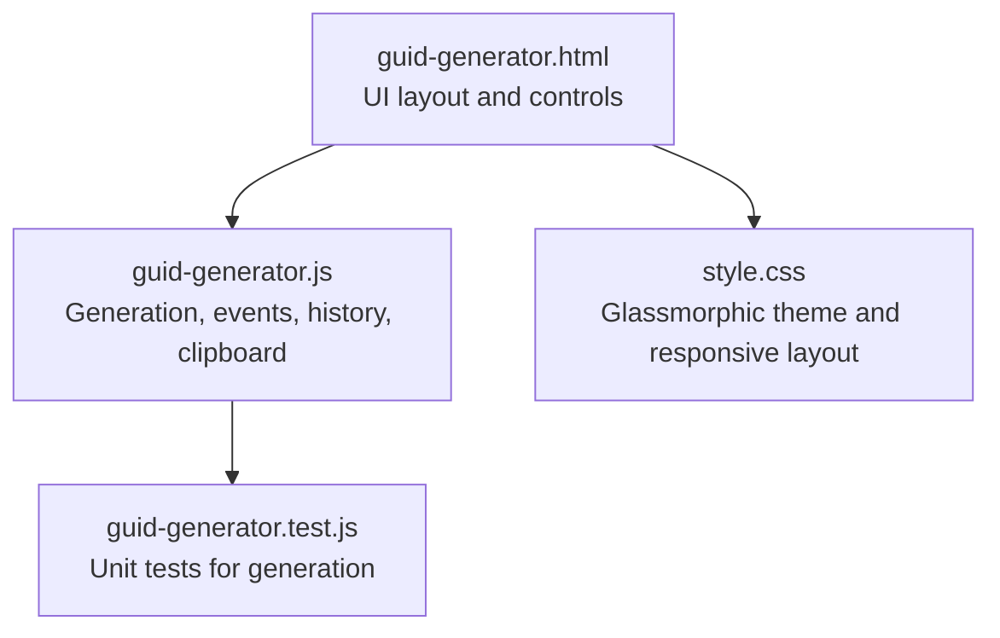
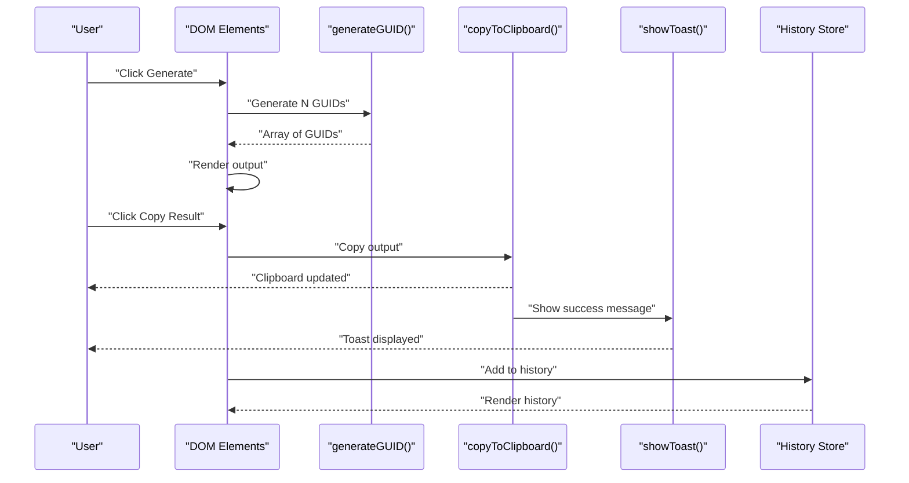
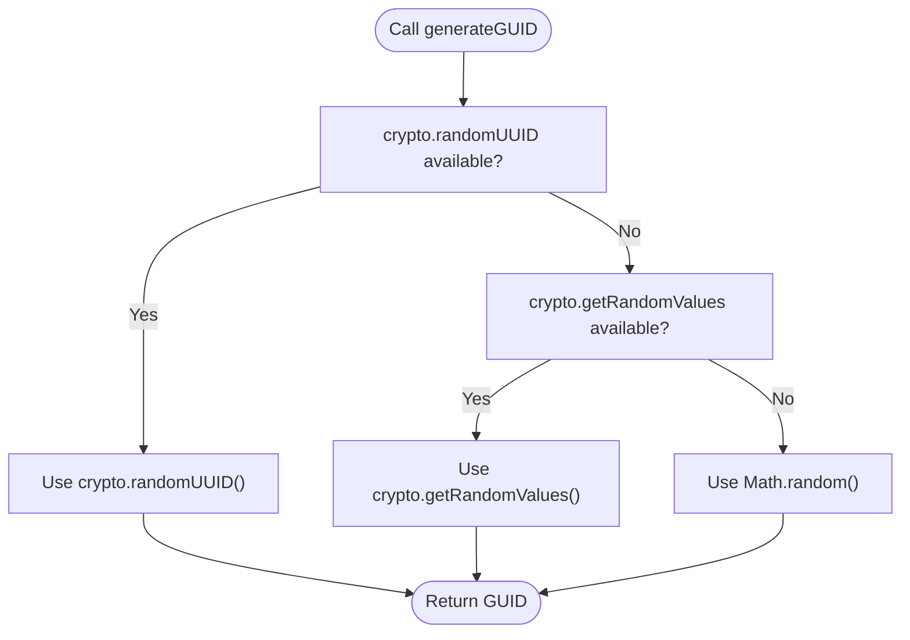
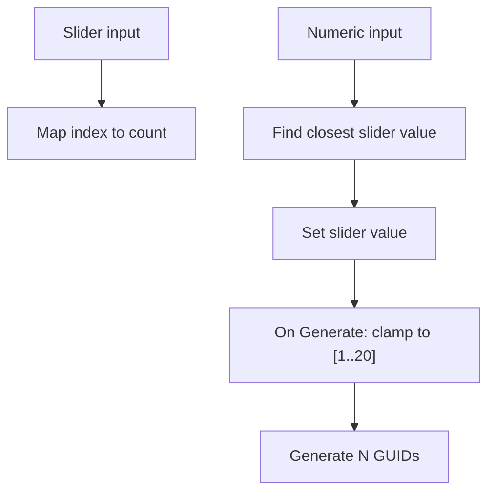
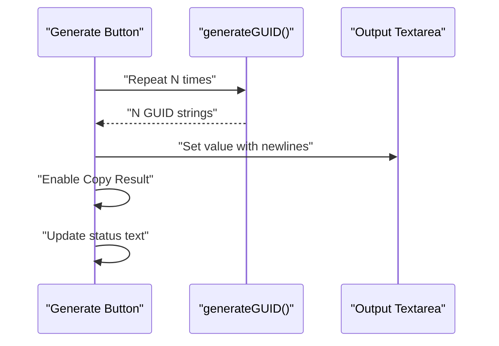
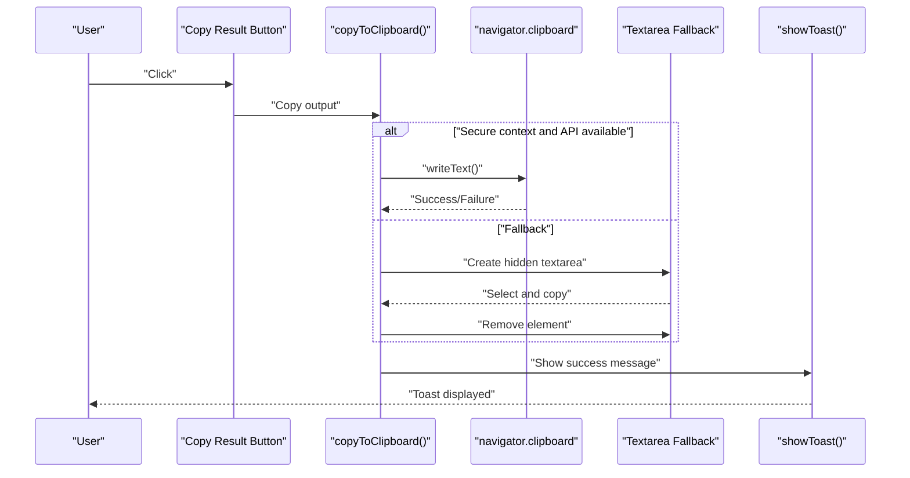
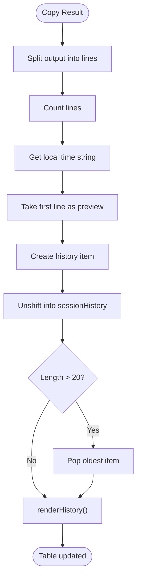
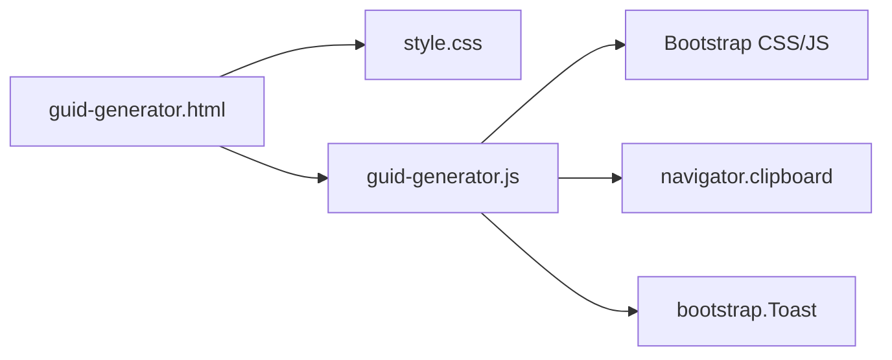

# GUID Generator

<cite>
**Referenced Files in This Document**
- [guid-generator.html](file://guid-generator.html)
- [guid-generator.js](file://guid-generator.js)
- [guid-generator.test.js](file://guid-generator.test.js)
- [README.md](file://README.md)
- [style.css](file://style.css)
</cite>

## Table of Contents
1. [Introduction](#introduction)
2. [Project Structure](#project-structure)
3. [Core Components](#core-components)
4. [Architecture Overview](#architecture-overview)
5. [Detailed Component Analysis](#detailed-component-analysis)
6. [Dependency Analysis](#dependency-analysis)
7. [Performance Considerations](#performance-considerations)
8. [Troubleshooting Guide](#troubleshooting-guide)
9. [Conclusion](#conclusion)
10. [Appendices](#appendices)

## Introduction
The GUID Generator is a secure, offline-first utility that generates Version 4 UUIDs (Universally Unique Identifier) in the browser. It provides:
- Cryptographically secure generation using the best available APIs
- Bulk generation of up to 20 GUIDs per batch
- An intuitive slider-based numeric input with immediate feedback
- Session history with timestamps and preview rows
- Copy-to-clipboard integration with graceful fallbacks
- Toast notifications for user feedback
- Robust DOM event handling and accessibility attributes

The tool emphasizes privacy and security by performing all operations client-side, with no network requests.

## Project Structure
The GUID Generator consists of a minimal HTML page, a JavaScript module implementing generation and UI logic, and shared styles.

**Diagram sources**
- [guid-generator.html:1-123](file://guid-generator.html#L1-L123)
- [guid-generator.js:1-270](file://guid-generator.js#L1-L270)
- [guid-generator.test.js:1-24](file://guid-generator.test.js#L1-L24)
- [style.css:1-293](file://style.css#L1-L293)

**Section sources**
- [guid-generator.html:1-123](file://guid-generator.html#L1-L123)
- [guid-generator.js:1-270](file://guid-generator.js#L1-L270)
- [style.css:1-293](file://style.css#L1-L293)

## Core Components
- Secure GUID generation with fallback chain
- Interactive numeric input with slider synchronization
- Bulk generation and output display
- History tracking with timestamping and preview
- Copy-to-clipboard with graceful fallbacks
- Toast notification system
- DOM event handling and accessibility

**Section sources**
- [guid-generator.js:2-28](file://guid-generator.js#L2-L28)
- [guid-generator.js:35-186](file://guid-generator.js#L35-L186)
- [guid-generator.js:190-270](file://guid-generator.js#L190-L270)

## Architecture Overview
The application follows a modular pattern:
- Generation logic encapsulated in a single function with layered fallbacks
- UI logic bound to DOM elements on load
- Clipboard and toast utilities isolated for reusability
- History stored in memory with a bounded capacity

**Diagram sources**
- [guid-generator.js:79-131](file://guid-generator.js#L79-L131)
- [guid-generator.js:231-270](file://guid-generator.js#L231-L270)

## Detailed Component Analysis

### Secure Random Generation Strategy
The generator implements a robust fallback chain:
1. Prefer the native, cryptographically secure crypto.randomUUID()
2. Fallback to crypto.getRandomValues() for legacy modern browsers
3. Last-resort Math.random() for very old browsers or non-secure contexts

Security implications:
- crypto.randomUUID(): Strong CSPRNG; recommended for modern browsers and secure contexts
- crypto.getRandomValues(): Strong CSPRNG; widely supported; falls back to secure PRNG when available
- Math.random(): Weak PRNG; included only for environments lacking secure APIs; not suitable for cryptographic use

Best practices:
- Prefer secure contexts (HTTPS) for all fallbacks
- Avoid Math.random() in production or sensitive applications
- Test fallbacks in non-secure contexts to ensure graceful degradation

**Diagram sources**
- [guid-generator.js:2-24](file://guid-generator.js#L2-L24)

**Section sources**
- [guid-generator.js:2-24](file://guid-generator.js#L2-L24)

### Interactive Numeric Input and Slider Synchronization
The numeric input field and slider are synchronized:
- Slider values map to discrete counts: [1, 2, 3, 4, 5, 10, 15, 20]
- Input focuses clears the field for immediate typing
- Input changes snap to the nearest slider value
- Clicking Generate enforces bounds (min 1, max 20)

**Diagram sources**
- [guid-generator.js:48-77](file://guid-generator.js#L48-L77)
- [guid-generator.js:79-102](file://guid-generator.js#L79-L102)

**Section sources**
- [guid-generator.html:60-66](file://guid-generator.html#L60-L66)
- [guid-generator.js:48-77](file://guid-generator.js#L48-L77)
- [guid-generator.js:79-102](file://guid-generator.js#L79-L102)

### Bulk Generation and Output Display
- Generates N GUIDs in a loop and joins them with newline separators
- Enables the Copy Result button upon successful generation
- Updates status text with the number of generated GUIDs

**Diagram sources**
- [guid-generator.js:93-102](file://guid-generator.js#L93-L102)

**Section sources**
- [guid-generator.js:93-102](file://guid-generator.js#L93-L102)

### Copy-to-Clipboard Integration and Fallbacks
- Uses navigator.clipboard.writeText when available and in a secure context
- Falls back to a temporary textarea and execCommand('copy') otherwise
- Displays a toast notification on success

**Diagram sources**
- [guid-generator.js:231-270](file://guid-generator.js#L231-L270)
- [guid-generator.js:190-229](file://guid-generator.js#L190-L229)

**Section sources**
- [guid-generator.js:231-270](file://guid-generator.js#L231-L270)
- [guid-generator.js:190-229](file://guid-generator.js#L190-L229)

### History Tracking System
- Stores up to 20 items per session
- Each item includes timestamp, count, preview, and full result
- Renders a table with copy and delete actions
- Uses escapeHtml to prevent XSS in previews

**Diagram sources**
- [guid-generator.js:104-131](file://guid-generator.js#L104-L131)
- [guid-generator.js:148-186](file://guid-generator.js#L148-L186)
- [guid-generator.js:179-184](file://guid-generator.js#L179-L184)

**Section sources**
- [guid-generator.js:104-131](file://guid-generator.js#L104-L131)
- [guid-generator.js:148-186](file://guid-generator.js#L148-L186)
- [guid-generator.js:179-184](file://guid-generator.js#L179-L184)

### DOM Event Handling and Accessibility
- Adds DOMContentLoaded listener to bind all events
- Uses aria-labels and Bootstrap icons for accessibility
- Provides focus behavior for numeric input
- Inline onclick handlers for history actions (window functions)

Key event bindings:
- Slider input updates numeric input
- Numeric input updates slider
- Generate button triggers bulk generation
- Copy button copies output and adds to history
- History actions copy or delete items

**Section sources**
- [guid-generator.html:34-52](file://guid-generator.html#L34-L52)
- [guid-generator.html:60-86](file://guid-generator.html#L60-L86)
- [guid-generator.html:96-114](file://guid-generator.html#L96-L114)
- [guid-generator.js:35-186](file://guid-generator.js#L35-L186)

### Unit Tests
The test suite validates:
- Returned values are strings
- Generated GUIDs match Version 4 UUID regex
- Uniqueness across many iterations

**Section sources**
- [guid-generator.test.js:1-24](file://guid-generator.test.js#L1-L24)

## Dependency Analysis
- HTML depends on Bootstrap CSS/JS and local styles
- JavaScript depends on DOM APIs and Bootstrap Toast for notifications
- Clipboard API requires a secure context
- No external runtime dependencies beyond Bootstrap CDN

**Diagram sources**
- [guid-generator.html:8-120](file://guid-generator.html#L8-L120)
- [guid-generator.js:190-229](file://guid-generator.js#L190-L229)

**Section sources**
- [guid-generator.html:8-120](file://guid-generator.html#L8-L120)
- [guid-generator.js:190-229](file://guid-generator.js#L190-L229)

## Performance Considerations
- Generation cost scales linearly with N (up to 20)
- Rendering output and history is lightweight
- Clipboard operations are asynchronous and non-blocking
- History storage is bounded to 20 items to prevent memory growth

## Troubleshooting Guide
Common issues and resolutions:
- Clipboard fails silently: Ensure the page runs in a secure context (HTTPS) and that the browser supports the Clipboard API
- Math.random() fallbacks in non-secure contexts: This is expected; the tool will still function but uses a weak RNG
- History not updating: Verify DOM elements exist and that the sessionHistory array is initialized
- Slider not syncing: Confirm the sliderValues array and event listeners are attached

Security notes:
- Non-secure contexts disable navigator.clipboard
- Math.random() fallbacks are inherently insecure; avoid in production
- Always prefer crypto.randomUUID() or crypto.getRandomValues()

**Section sources**
- [guid-generator.js:231-270](file://guid-generator.js#L231-L270)
- [guid-generator.js:2-24](file://guid-generator.js#L2-L24)

## Conclusion
The GUID Generator delivers a secure, user-friendly, and privacy-preserving way to generate Version 4 UUIDs in the browser. Its layered fallback ensures broad compatibility while maintaining strong security defaults. The interactive UI, bulk generation, and history tracking make it practical for daily development tasks.

## Appendices

### Practical Usage Examples
- Single GUID generation: Enter 1 in the numeric input or slider, click Generate, then Copy Result
- Bulk generation: Set the slider to a higher value (e.g., 20), click Generate, then Copy Result
- Managing history: Use the Copy buttons in the history table to reuse previous results; use Delete to remove entries
- Browser compatibility: Works in modern browsers with crypto APIs; gracefully degrades in older or non-secure contexts

### Security Best Practices
- Prefer HTTPS and modern browsers for strong CSPRNG
- Avoid Math.random() fallbacks in sensitive applications
- Validate user input and enforce upper limits to prevent abuse
- Sanitize previews to prevent XSS when rendering history

**Section sources**
- [README.md:34-35](file://README.md#L34-L35)
- [guid-generator.js:2-24](file://guid-generator.js#L2-L24)
- [guid-generator.js:104-131](file://guid-generator.js#L104-L131)