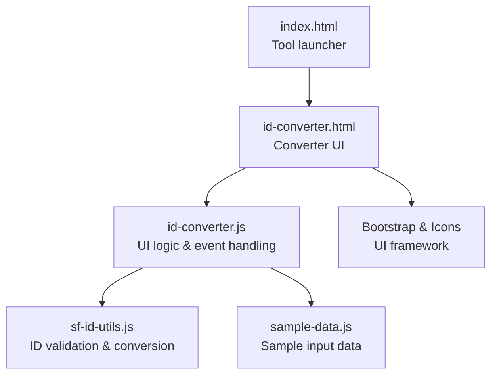
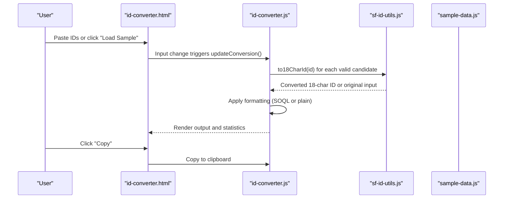
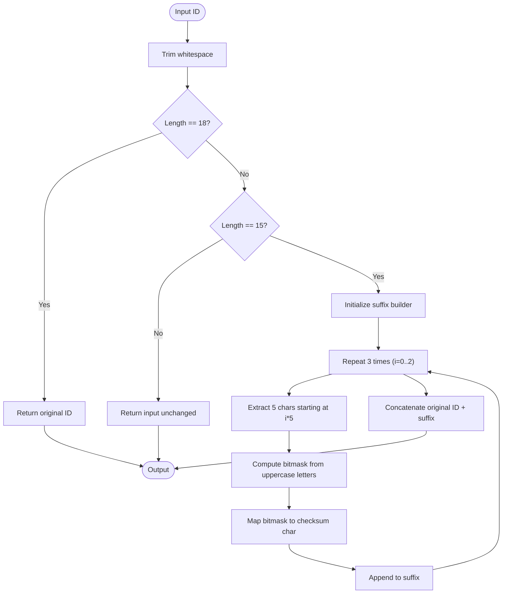
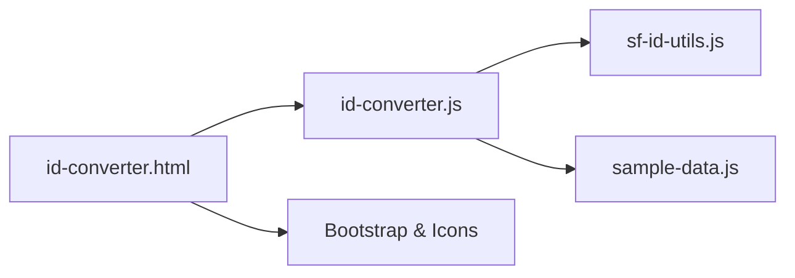

# General ID Converter

<cite>
**Referenced Files in This Document**
- [id-converter.html](file://id-converter.html)
- [id-converter.js](file://id-converter.js)
- [sf-id-utils.js](file://sf-id-utils.js)
- [sample-data.js](file://sample-data.js)
- [README.md](file://README.md)
- [index.html](file://index.html)
</cite>

## Table of Contents
1. [Introduction](#introduction)
2. [Project Structure](#project-structure)
3. [Core Components](#core-components)
4. [Architecture Overview](#architecture-overview)
5. [Detailed Component Analysis](#detailed-component-analysis)
6. [Dependency Analysis](#dependency-analysis)
7. [Performance Considerations](#performance-considerations)
8. [Troubleshooting Guide](#troubleshooting-guide)
9. [Conclusion](#conclusion)
10. [Appendices](#appendices)

## Introduction
The General ID Converter is a specialized tool within the Dev Utils suite designed to convert Salesforce record IDs between two common formats: 15-character case-sensitive IDs and 18-character case-insensitive IDs. It provides an intuitive web interface for pasting or loading ID lists, validating input, performing conversions, and formatting results for immediate use in SOQL queries or other systems.

Beyond Salesforce-specific scenarios, the converter demonstrates a reusable pattern for ID normalization and batch processing that can be adapted to other ID formats and workflows.

## Project Structure
The ID Converter is implemented as a standalone HTML page with associated JavaScript logic and shared utility functions. The tool integrates with a centralized sample data module and relies on a shared utility library for ID validation and conversion.

**Diagram sources**
- [index.html:73-88](file://index.html#L73-L88)
- [id-converter.html:144-146](file://id-converter.html#L144-L146)
- [id-converter.js:1-209](file://id-converter.js#L1-L209)
- [sf-id-utils.js:1-45](file://sf-id-utils.js#L1-L45)
- [sample-data.js:1-69](file://sample-data.js#L1-L69)

**Section sources**
- [index.html:73-88](file://index.html#L73-L88)
- [id-converter.html:1-149](file://id-converter.html#L1-L149)
- [id-converter.js:1-209](file://id-converter.js#L1-L209)
- [sf-id-utils.js:1-45](file://sf-id-utils.js#L1-L45)
- [sample-data.js:1-69](file://sample-data.js#L1-L69)

## Core Components
- UI Shell: A Bootstrap-based layout with three panels (Input, Configuration, Output) and a header navigation.
- Input Processor: Parses newline-separated IDs, trims whitespace, validates lengths, and converts valid entries.
- Conversion Engine: Uses shared utility functions to transform 15-character IDs to 18-character case-safe IDs.
- Formatting Options: Toggle for SOQL-ready comma-separated lists and clean mode for separating valid and invalid IDs.
- Output Renderer: Displays converted results, statistics, and optional removed items container.
- Clipboard Integration: Copies results to the system clipboard with user feedback.

Supported ID formats:
- 15-character alphanumeric IDs (case-sensitive)
- 18-character alphanumeric IDs (case-insensitive)
- Mixed input with automatic detection and conversion

Conversion rules:
- 15-character IDs are expanded to 18-character IDs using checksum computation.
- 18-character IDs pass through unchanged.
- Invalid-length IDs are flagged and optionally separated when clean mode is enabled.

Validation processes:
- Length validation (15 or 18 characters).
- Character validation (alphanumeric).
- Visual warnings and border highlighting when invalid IDs are present.

**Section sources**
- [id-converter.html:61-137](file://id-converter.html#L61-L137)
- [id-converter.js:22-100](file://id-converter.js#L22-L100)
- [sf-id-utils.js:6-39](file://sf-id-utils.js#L6-L39)

## Architecture Overview
The converter follows a modular architecture:
- Presentation Layer: id-converter.html defines the UI structure and styling.
- Behavior Layer: id-converter.js manages events, state updates, and user interactions.
- Domain Layer: sf-id-utils.js encapsulates ID validation and conversion logic.
- Data Layer: sample-data.js provides pre-populated sample input for quick testing.

**Diagram sources**
- [id-converter.html:61-137](file://id-converter.html#L61-L137)
- [id-converter.js:15-125](file://id-converter.js#L15-L125)
- [sf-id-utils.js:17-39](file://sf-id-utils.js#L17-L39)
- [sample-data.js:14-19](file://sample-data.js#L14-L19)

## Detailed Component Analysis

### UI Shell and Layout
The UI shell organizes the converter into three resizable panels:
- Input Panel: Text area for pasting IDs with line count and action buttons (Load Sample, Clear).
- Configuration Panel: Toggles for SOQL formatting and Clean mode.
- Output Panel: Read-only text area for results, optional removed items container, and validation warning banner.

Interactive elements:
- Load Sample button: Pre-fills the input with sample IDs and enables SOQL mode by default.
- Clear button: Empties the input area and refreshes conversion.
- Copy button: Copies the current output to the clipboard with a toast notification.
- Validation banner: Appears when invalid IDs are detected, highlighting the input border.

Responsive design:
- Mobile-friendly adjustments ensure adequate height for text areas and compact controls.

**Section sources**
- [id-converter.html:46-137](file://id-converter.html#L46-L137)

### Input Processing and Validation
Processing pipeline:
- Split input into lines and trim each line.
- Validate length: accept 15 or 18 characters; mark others as invalid.
- Convert valid candidates using the conversion function.
- Track counts for valid and invalid IDs and update statistics.

Clean mode behavior:
- When enabled, invalid IDs are separated into a dedicated container and excluded from the main output.
- Provides a separate list of removed items for review.

SOQL formatting:
- When enabled, valid IDs are wrapped in single quotes and joined by commas.
- Invalid IDs remain unquoted in the combined output.

Visual feedback:
- Validation banner displays the number of invalid IDs.
- Input border turns warning-colored when invalid IDs are present.

**Section sources**
- [id-converter.js:22-100](file://id-converter.js#L22-L100)

### Conversion Algorithm
The conversion algorithm transforms 15-character IDs to 18-character case-safe IDs using a checksum derived from uppercase letter positions within fixed-size blocks.

Algorithm steps:
- Trim input and return early if already 18 characters.
- For 15-character inputs, compute a 3-character suffix:
  - Divide the 15-character string into three groups of five characters.
  - For each group, derive a bitmask by setting bits corresponding to uppercase letters.
  - Map each bitmask to a character in a predefined set to build the suffix.
- Concatenate the original ID with the computed suffix.

Edge cases:
- Non-alphanumeric characters are treated according to ASCII ordering during bitmask calculation.
- Null, empty, or non-string inputs are handled gracefully.

**Diagram sources**
- [sf-id-utils.js:17-39](file://sf-id-utils.js#L17-L39)

**Section sources**
- [sf-id-utils.js:6-39](file://sf-id-utils.js#L6-L39)

### Clipboard Integration and Feedback
Clipboard integration:
- Uses the modern Clipboard API when available; falls back to a textarea-based method otherwise.
- Displays a toast notification upon successful copy.

Copy behavior:
- Selects the output text area before copying.
- Provides user feedback via toast messages.

**Section sources**
- [id-converter.js:103-124](file://id-converter.js#L103-L124)
- [id-converter.js:170-209](file://id-converter.js#L170-L209)

### Sample Data Integration
Sample data:
- Provides a curated list of 15-character IDs for quick testing.
- Load Sample button pre-fills the input area and toggles SOQL mode.

**Section sources**
- [sample-data.js:14-19](file://sample-data.js#L14-L19)
- [id-converter.js:110-123](file://id-converter.js#L110-L123)

## Dependency Analysis
The converter’s dependencies are minimal and focused:
- id-converter.html depends on Bootstrap and local styles for presentation.
- id-converter.js depends on:
  - sf-id-utils.js for ID validation and conversion.
  - sample-data.js for pre-populated sample input.
- sf-id-utils.js is self-contained and exportable for Node.js environments.

**Diagram sources**
- [id-converter.html:144-146](file://id-converter.html#L144-L146)
- [id-converter.js:1-209](file://id-converter.js#L1-L209)
- [sf-id-utils.js:1-45](file://sf-id-utils.js#L1-L45)
- [sample-data.js:1-69](file://sample-data.js#L1-L69)

**Section sources**
- [id-converter.js:1-209](file://id-converter.js#L1-L209)
- [sf-id-utils.js:1-45](file://sf-id-utils.js#L1-L45)
- [sample-data.js:1-69](file://sample-data.js#L1-L69)

## Performance Considerations
- Input parsing: Linear-time processing per line; suitable for typical ID lists.
- Conversion: Fixed overhead per ID; negligible for moderate input sizes.
- UI updates: Debounced via event listeners on input and configuration toggles.
- Clipboard operations: Asynchronous; user feedback prevents perceived delays.

[No sources needed since this section provides general guidance]

## Troubleshooting Guide
Common issues and resolutions:
- Invalid IDs detected:
  - Cause: Inputs with lengths other than 15 or 18 characters.
  - Resolution: Enable Clean mode to separate invalid IDs; correct or remove invalid entries.
- SOQL formatting confusion:
  - Cause: Mixing valid and invalid IDs in SOQL mode.
  - Resolution: Use Clean mode to isolate valid IDs; apply SOQL formatting only to clean results.
- Copy failures:
  - Cause: Browser restrictions or fallback method errors.
  - Resolution: Ensure HTTPS context for Clipboard API; retry copy operation.

Validation and feedback:
- Validation banner appears when invalid IDs are present.
- Statistics show counts of valid and invalid items.

**Section sources**
- [id-converter.js:91-100](file://id-converter.js#L91-L100)
- [id-converter.js:170-209](file://id-converter.js#L170-L209)

## Conclusion
The General ID Converter provides a robust, user-friendly solution for transforming Salesforce record IDs between 15-character and 18-character formats. Its modular design, clear validation, and flexible formatting options make it suitable for both Salesforce-specific workflows and broader ID normalization tasks. The tool’s emphasis on local processing ensures privacy and performance while maintaining simplicity and reliability.

[No sources needed since this section summarizes without analyzing specific files]

## Appendices

### Practical Examples
- Converting a mixed list:
  - Paste IDs with varying lengths; enable SOQL mode to produce a ready-to-use IN clause.
- Cleaning invalid IDs:
  - Enable Clean mode to separate invalid entries; review removed items and reprocess as needed.
- Loading sample data:
  - Use the Load Sample button to quickly test the converter with realistic IDs.

### Integration Patterns
- Shared utilities:
  - sf-id-utils.js can be reused independently for ID validation and conversion in other contexts.
- Custom workflows:
  - Extend the converter by adding new formatting options or validation rules in the UI logic.

**Section sources**
- [sample-data.js:14-19](file://sample-data.js#L14-L19)
- [id-converter.js:22-100](file://id-converter.js#L22-L100)
- [sf-id-utils.js:6-39](file://sf-id-utils.js#L6-L39)