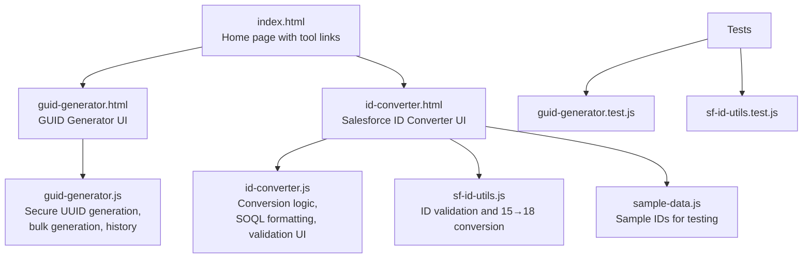
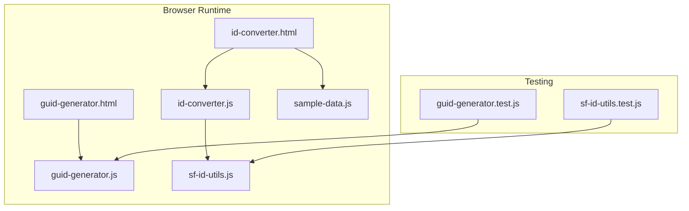
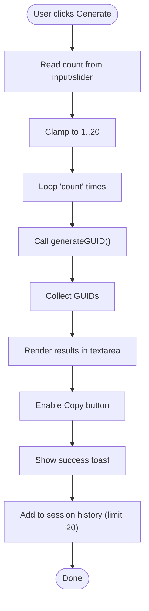
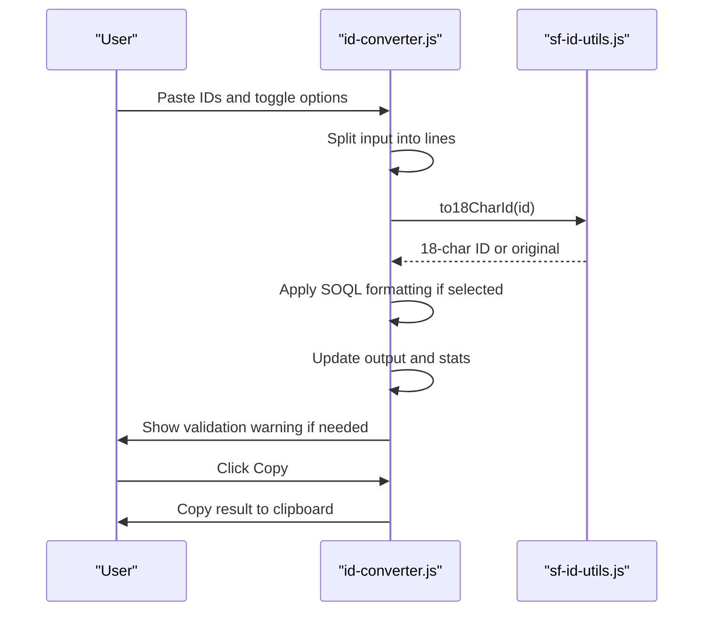
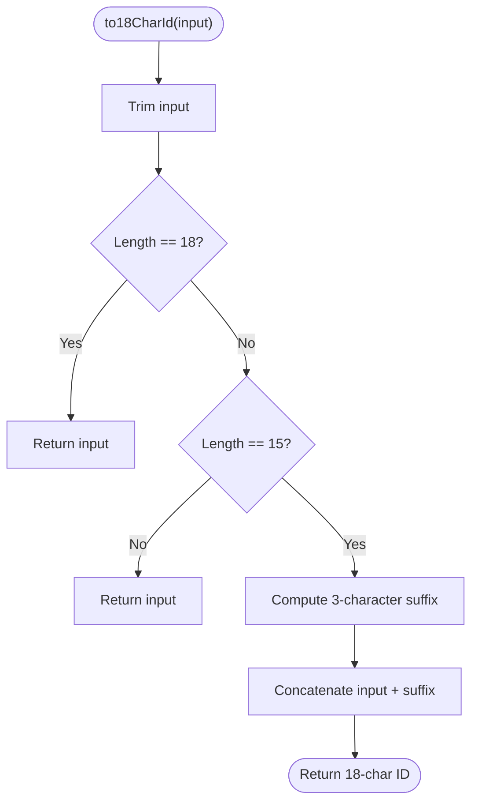
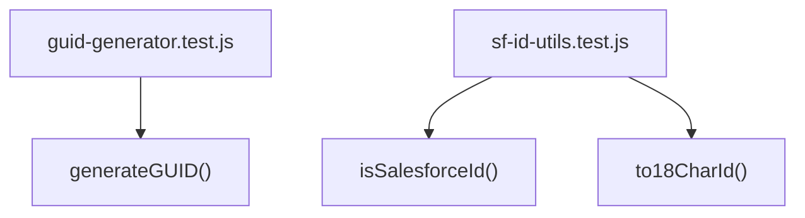
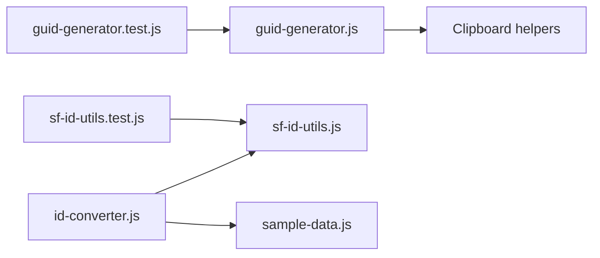

# ID Management Tools

<cite>
**Referenced Files in This Document**
- [README.md](file://README.md)
- [index.html](file://index.html)
- [guid-generator.html](file://guid-generator.html)
- [guid-generator.js](file://guid-generator.js)
- [guid-generator.test.js](file://guid-generator.test.js)
- [id-converter.html](file://id-converter.html)
- [id-converter.js](file://id-converter.js)
- [sf-id-utils.js](file://sf-id-utils.js)
- [sf-id-utils.test.js](file://sf-id-utils.test.js)
- [sample-data.js](file://sample-data.js)
</cite>

## Table of Contents
1. [Introduction](#introduction)
2. [Project Structure](#project-structure)
3. [Core Components](#core-components)
4. [Architecture Overview](#architecture-overview)
5. [Detailed Component Analysis](#detailed-component-analysis)
6. [Dependency Analysis](#dependency-analysis)
7. [Performance Considerations](#performance-considerations)
8. [Troubleshooting Guide](#troubleshooting-guide)
9. [Conclusion](#conclusion)
10. [Appendices](#appendices)

## Introduction
This document focuses on the ID management utilities within the Dev Utils project. It covers:
- Secure GUID generation with fallback strategies and bulk generation up to 20
- Session history tracking and copy/capture features
- Salesforce ID conversion from 15 to 18 characters with validation and SOQL formatting
- General ID conversion tool input/output handling and format conversion capabilities
- Shared Salesforce utilities, validation algorithms, and the testing framework used for quality assurance
- Practical workflows and security considerations for random number generation

The tools operate entirely in the browser, ensuring local processing and privacy.

**Section sources**
- [README.md:1-63](file://README.md#L1-L63)

## Project Structure
The ID management tools are organized as follows:
- GUID Generator: standalone tool with HTML UI and JavaScript logic for secure UUID generation, bulk generation, and session history
- Salesforce ID Converter: tool that converts 15-character IDs to 18-character case-safe IDs, with SOQL formatting and clean mode
- Shared Salesforce utilities: reusable functions for ID validation and 15→18 conversion
- Testing framework: Jest-based tests for both utilities

**Diagram sources**
- [index.html:38-88](file://index.html#L38-L88)
- [guid-generator.html:1-123](file://guid-generator.html#L1-L123)
- [id-converter.html:1-149](file://id-converter.html#L1-L149)
- [guid-generator.js:1-270](file://guid-generator.js#L1-L270)
- [id-converter.js:1-209](file://id-converter.js#L1-L209)
- [sf-id-utils.js:1-45](file://sf-id-utils.js#L1-L45)
- [sample-data.js:1-69](file://sample-data.js#L1-L69)
- [guid-generator.test.js:1-24](file://guid-generator.test.js#L1-L24)
- [sf-id-utils.test.js:1-55](file://sf-id-utils.test.js#L1-L55)

**Section sources**
- [index.html:38-88](file://index.html#L38-L88)
- [guid-generator.html:1-123](file://guid-generator.html#L1-L123)
- [id-converter.html:1-149](file://id-converter.html#L1-L149)

## Core Components
- GUID Generator
  - Secure random UUID v4 generation with multiple fallback strategies
  - Bulk generation up to 20 per batch
  - Session history with copy and delete actions
  - Clipboard integration with graceful fallbacks
- Salesforce ID Converter
  - Validates 15 or 18-character IDs
  - Converts 15-char IDs to 18-char case-safe IDs
  - SOQL formatting toggle and clean mode to separate invalid IDs
  - Real-time validation feedback and statistics
- Shared Salesforce Utilities
  - ID validation (15 or 18 characters, alphanumeric)
  - 15→18 conversion with checksum computation
- Testing Framework
  - Jest tests for GUID generation (format, uniqueness)
  - Jest tests for ID utilities (validation and conversion)

**Section sources**
- [guid-generator.js:1-270](file://guid-generator.js#L1-L270)
- [sf-id-utils.js:1-45](file://sf-id-utils.js#L1-L45)
- [id-converter.js:1-209](file://id-converter.js#L1-L209)
- [guid-generator.test.js:1-24](file://guid-generator.test.js#L1-L24)
- [sf-id-utils.test.js:1-55](file://sf-id-utils.test.js#L1-L55)

## Architecture Overview
The ID management tools share a common pattern:
- HTML pages define the UI and bind events
- JavaScript modules encapsulate core logic
- Shared utilities provide reusable functions
- Tests validate correctness and resilience

**Diagram sources**
- [guid-generator.html:1-123](file://guid-generator.html#L1-L123)
- [id-converter.html:1-149](file://id-converter.html#L1-L149)
- [guid-generator.js:1-270](file://guid-generator.js#L1-L270)
- [id-converter.js:1-209](file://id-converter.js#L1-L209)
- [sf-id-utils.js:1-45](file://sf-id-utils.js#L1-L45)
- [sample-data.js:1-69](file://sample-data.js#L1-L69)
- [guid-generator.test.js:1-24](file://guid-generator.test.js#L1-L24)
- [sf-id-utils.test.js:1-55](file://sf-id-utils.test.js#L1-L55)

## Detailed Component Analysis

### GUID Generator
The GUID Generator produces secure random UUID v4 with robust fallbacks and a user-friendly UI for bulk generation and history.

Key capabilities:
- Secure random generation
  - Uses the browser’s cryptographically secure randomUUID when available
  - Falls back to crypto.getRandomValues for modern browsers
  - Provides an insecure fallback for legacy contexts (not recommended)
- Bulk generation
  - Up to 20 GUIDs per batch with slider and numeric input
  - Enforces limits and updates UI accordingly
- History tracking
  - Stores up to 20 recent sessions with timestamp, count, and preview
  - Supports copy and delete actions per history item
- Clipboard integration
  - Uses navigator.clipboard when available and in a secure context
  - Falls back to execCommand-based copy otherwise
  - Toast notifications provide user feedback

**Diagram sources**
- [guid-generator.js:79-102](file://guid-generator.js#L79-L102)
- [guid-generator.js:45-129](file://guid-generator.js#L45-L129)
- [guid-generator.js:231-270](file://guid-generator.js#L231-L270)

Implementation highlights:
- Secure generation strategies and fallbacks are centralized in a single function
- UI wiring handles input validation, bulk generation, and history rendering
- Clipboard logic includes both modern API and fallback mechanisms

Security considerations:
- Prefer secure contexts for clipboard operations
- The insecure fallback uses Math.random and should be avoided in production contexts
- All processing remains local in the browser

Practical examples:
- Generate 15 GUIDs in one go and copy to clipboard
- Review session history and copy/delete individual entries
- Use the slider for quick selection of common counts (1–20)

**Section sources**
- [guid-generator.js:1-270](file://guid-generator.js#L1-L270)
- [guid-generator.html:55-123](file://guid-generator.html#L55-L123)
- [guid-generator.test.js:1-24](file://guid-generator.test.js#L1-L24)

### Salesforce ID Converter
The Salesforce ID Converter transforms 15-character IDs into 18-character case-safe IDs, with optional SOQL formatting and clean mode to separate invalid IDs.

Core logic:
- Input parsing
  - Splits input into lines and trims whitespace
  - Validates each line for 15 or 18 characters
- Conversion
  - Calls the shared 15→18 conversion utility
  - Applies SOQL formatting when enabled
- Output handling
  - Displays converted IDs or marks invalid ones
  - Shows statistics and validation warnings
  - Clean mode separates invalid IDs into a dedicated area
- Clipboard integration
  - Copies the formatted output to the clipboard
  - Uses toast notifications for feedback

**Diagram sources**
- [id-converter.js:22-100](file://id-converter.js#L22-L100)
- [sf-id-utils.js:17-39](file://sf-id-utils.js#L17-L39)
- [id-converter.js:103-108](file://id-converter.js#L103-L108)

Validation and conversion:
- ID validation checks for 15 or 18 characters and alphanumeric content
- 15→18 conversion computes a checksum suffix based on uppercase flags for blocks of five characters
- Clean mode isolates invalid IDs for review and potential correction

Practical examples:
- Convert a list of 15-character IDs to 18-character IDs for SOQL queries
- Use clean mode to identify and remove invalid IDs from a mixed dataset
- Load sample data to quickly test conversion scenarios

**Section sources**
- [id-converter.js:1-209](file://id-converter.js#L1-L209)
- [sf-id-utils.js:1-45](file://sf-id-utils.js#L1-L45)
- [id-converter.html:1-149](file://id-converter.html#L1-L149)
- [sample-data.js:14-19](file://sample-data.js#L14-L19)

### Shared Salesforce ID Utilities
Reusable functions for ID validation and conversion.

- ID validation
  - Ensures the string is non-empty and matches 15 or 18 characters of alphanumeric characters
- 15-character to 18-character conversion
  - Trims input and returns early if already 18 characters
  - Computes a 3-character suffix using uppercase flags for each group of five characters
  - Concatenates the original ID with the computed suffix

**Diagram sources**
- [sf-id-utils.js:17-39](file://sf-id-utils.js#L17-L39)

**Section sources**
- [sf-id-utils.js:1-45](file://sf-id-utils.js#L1-L45)

### Testing Framework
Quality assurance is implemented with Jest tests for both utilities.

- GUID Generator tests
  - Verifies return type is a string
  - Ensures UUID v4 format using a strict regular expression
  - Confirms uniqueness across 1000 generations
- Salesforce ID utilities tests
  - Validates 15-character and 18-character IDs
  - Rejects invalid lengths and characters
  - Confirms conversion behavior for various cases and whitespace handling

**Diagram sources**
- [guid-generator.test.js:1-24](file://guid-generator.test.js#L1-L24)
- [sf-id-utils.test.js:1-55](file://sf-id-utils.test.js#L1-L55)

**Section sources**
- [guid-generator.test.js:1-24](file://guid-generator.test.js#L1-L24)
- [sf-id-utils.test.js:1-55](file://sf-id-utils.test.js#L1-L55)

## Dependency Analysis
The ID management tools exhibit low coupling and clear separation of concerns:
- GUID Generator depends on browser APIs for secure randomness and clipboard
- Salesforce ID Converter depends on shared utilities for validation and conversion
- Both tools rely on shared clipboard helpers for cross-browser compatibility
- Tests depend on the exported functions for verification

**Diagram sources**
- [guid-generator.js:231-270](file://guid-generator.js#L231-L270)
- [id-converter.js:1-209](file://id-converter.js#L1-L209)
- [sf-id-utils.js:1-45](file://sf-id-utils.js#L1-L45)
- [sample-data.js:1-69](file://sample-data.js#L1-L69)
- [guid-generator.test.js:1-24](file://guid-generator.test.js#L1-L24)
- [sf-id-utils.test.js:1-55](file://sf-id-utils.test.js#L1-L55)

**Section sources**
- [guid-generator.js:231-270](file://guid-generator.js#L231-L270)
- [id-converter.js:1-209](file://id-converter.js#L1-L209)
- [sf-id-utils.js:1-45](file://sf-id-utils.js#L1-L45)
- [sample-data.js:1-69](file://sample-data.js#L1-L69)
- [guid-generator.test.js:1-24](file://guid-generator.test.js#L1-L24)
- [sf-id-utils.test.js:1-55](file://sf-id-utils.test.js#L1-L55)

## Performance Considerations
- GUID generation
  - Uses native crypto APIs when available to minimize overhead
  - Bulk generation is linear in the number of GUIDs requested
  - History storage is bounded (20 items) to keep memory usage predictable
- Salesforce ID conversion
  - Conversion runs in O(n) where n is the number of IDs
  - SOQL formatting adds minimal overhead by wrapping valid IDs
  - Clean mode maintains separate lists for invalid IDs to avoid reprocessing

[No sources needed since this section provides general guidance]

## Troubleshooting Guide
Common issues and resolutions:
- Clipboard not copying
  - Ensure the page is served over HTTPS (secure context) for navigator.clipboard
  - If unavailable, the fallback mechanism attempts execCommand-based copy
- Invalid IDs not converted
  - Verify IDs are exactly 15 or 18 characters and alphanumeric
  - Use clean mode to isolate and review invalid entries
- History not saving
  - Confirm the browser allows local storage and that the page is not blocked by privacy settings
- Large input causing slow UI
  - Break input into smaller batches (up to 20 per batch)
  - Use clean mode to reduce noise and improve processing speed

**Section sources**
- [guid-generator.js:231-270](file://guid-generator.js#L231-L270)
- [id-converter.js:91-100](file://id-converter.js#L91-L100)

## Conclusion
The ID management tools provide secure, offline-first solutions for generating GUIDs and converting Salesforce IDs. They emphasize:
- Robust fallback strategies for secure randomness and clipboard operations
- Practical UI features for bulk generation, validation, and history tracking
- Reusable utilities for ID validation and conversion
- Comprehensive testing to ensure correctness and reliability

[No sources needed since this section summarizes without analyzing specific files]

## Appendices

### Practical Workflows
- Generate GUIDs
  - Choose a count (1–20) using the slider or input
  - Click Generate, then Copy Result
  - Review and manage history entries
- Convert Salesforce IDs
  - Paste IDs into the input area
  - Toggle SOQL formatting if building query lists
  - Enable Clean mode to separate invalid IDs
  - Copy the converted output to clipboard

[No sources needed since this section provides general guidance]

### Security Considerations for Random Number Generation
- Prefer secure contexts (HTTPS) for clipboard and crypto APIs
- Avoid relying on Math.random-based fallbacks in production
- Keep all processing local to the browser to prevent data leakage
- Validate inputs rigorously to prevent misuse

[No sources needed since this section provides general guidance]