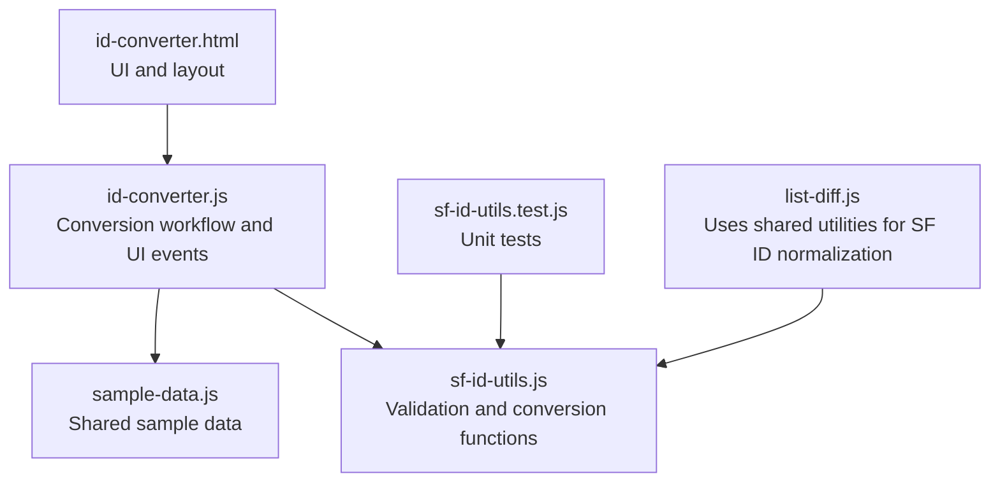
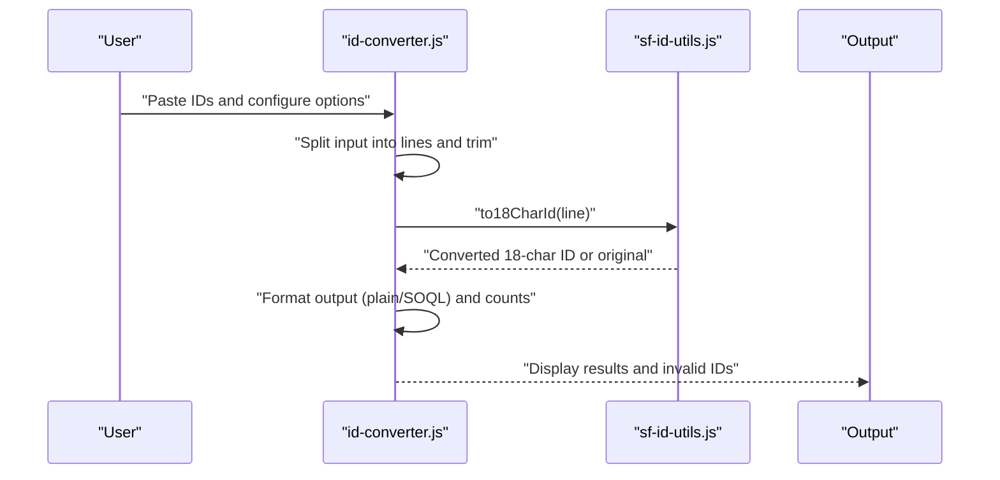
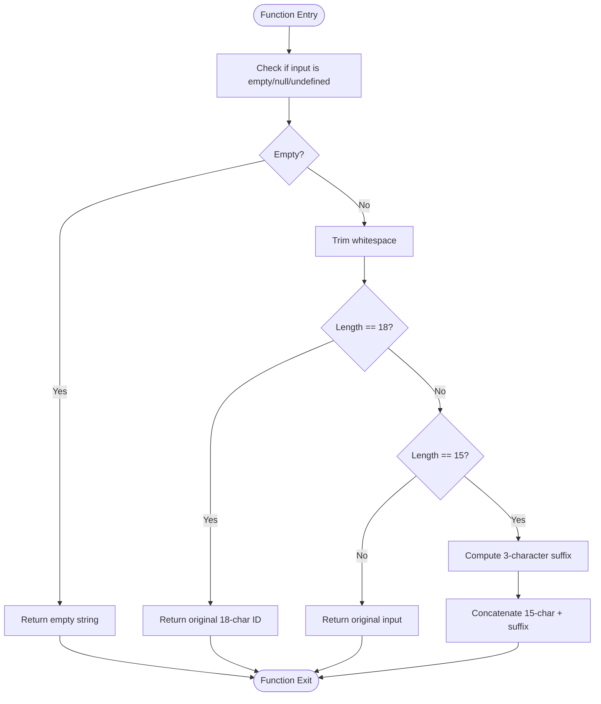
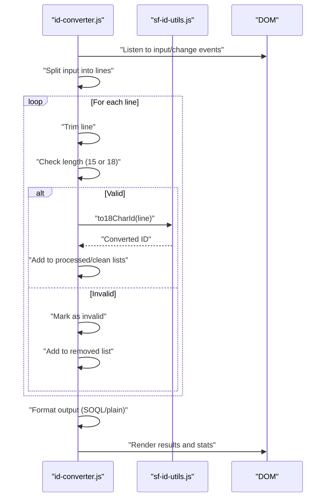
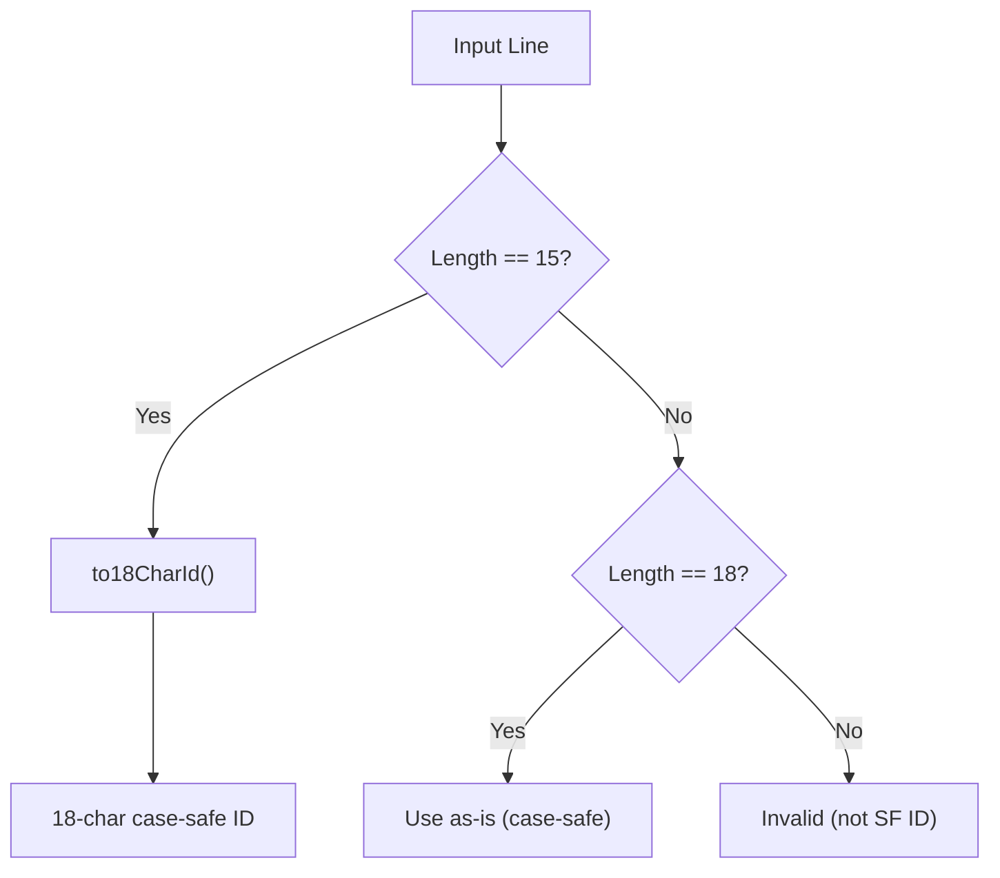
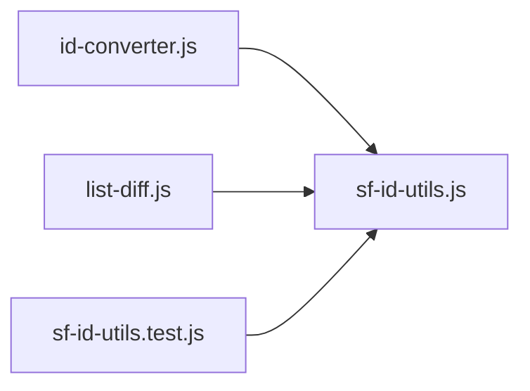

# Salesforce ID Converter

<cite>
**Referenced Files in This Document**
- [id-converter.html](file://id-converter.html)
- [id-converter.js](file://id-converter.js)
- [sf-id-utils.js](file://sf-id-utils.js)
- [sf-id-utils.test.js](file://sf-id-utils.test.js)
- [sample-data.js](file://sample-data.js)
- [list-diff.js](file://list-diff.js)
- [README.md](file://README.md)
</cite>

## Table of Contents
1. [Introduction](#introduction)
2. [Project Structure](#project-structure)
3. [Core Components](#core-components)
4. [Architecture Overview](#architecture-overview)
5. [Detailed Component Analysis](#detailed-component-analysis)
6. [Dependency Analysis](#dependency-analysis)
7. [Performance Considerations](#performance-considerations)
8. [Troubleshooting Guide](#troubleshooting-guide)
9. [Conclusion](#conclusion)
10. [Appendices](#appendices)

## Introduction
This document describes the Salesforce ID Converter utility, focusing on the 15-character to 18-character ID conversion algorithm, case-insensitive ID handling, and format validation processes. It explains the shared Salesforce ID utilities, including validation functions, conversion logic, and error handling mechanisms. The guide covers input validation rules, ID format detection, and the bidirectional conversion capabilities between different Salesforce ID formats. Practical examples demonstrate converting various ID formats, handling invalid inputs, and implementing the conversion workflow. Testing coverage and edge cases are documented, along with common Salesforce development scenarios where ID format conversion is essential.

## Project Structure
The Salesforce ID Converter is part of a suite of developer utilities that run entirely in the browser. The ID conversion tool consists of:
- A static HTML page that renders the UI and loads scripts.
- A JavaScript module that implements the conversion and validation logic.
- A shared utilities module containing reusable validation and conversion functions.
- A test suite validating the utilities.
- Sample data used by multiple tools, including the ID converter.

**Diagram sources**
- [id-converter.html:1-149](file://id-converter.html#L1-L149)
- [id-converter.js:1-125](file://id-converter.js#L1-L125)
- [sf-id-utils.js:1-45](file://sf-id-utils.js#L1-L45)
- [sf-id-utils.test.js:1-55](file://sf-id-utils.test.js#L1-L55)
- [sample-data.js:1-69](file://sample-data.js#L1-L69)
- [list-diff.js:1-200](file://list-diff.js#L1-L200)

**Section sources**
- [README.md:14-17](file://README.md#L14-L17)
- [id-converter.html:1-149](file://id-converter.html#L1-L149)
- [id-converter.js:1-125](file://id-converter.js#L1-L125)
- [sf-id-utils.js:1-45](file://sf-id-utils.js#L1-L45)
- [sf-id-utils.test.js:1-55](file://sf-id-utils.test.js#L1-L55)
- [sample-data.js:1-69](file://sample-data.js#L1-L69)
- [list-diff.js:1-200](file://list-diff.js#L1-L200)

## Core Components
- Salesforce ID utilities:
  - Validation function to check whether a string matches the Salesforce ID format (15 or 18 characters, alphanumeric).
  - Conversion function to transform a 15-character ID into an 18-character case-safe ID using a checksum mechanism.
- ID Converter UI and workflow:
  - Parses multiline input, trims lines, validates lengths, converts valid IDs, and formats output as either plain list or SOQL list.
  - Supports “clean” mode to separate invalid IDs into a dedicated list.
  - Provides copy-to-clipboard functionality and sample data loading.

Key responsibilities:
- Input validation: Detects 15-character and 18-character IDs; rejects others.
- Conversion: Applies the checksum algorithm to produce a unique 18-character ID.
- Formatting: Produces clean lists or SOQL-ready quoted lists.
- Error handling: Highlights invalid IDs and displays counts.

**Section sources**
- [sf-id-utils.js:6-39](file://sf-id-utils.js#L6-L39)
- [id-converter.js:22-100](file://id-converter.js#L22-L100)

## Architecture Overview
The ID Converter UI orchestrates user interactions and delegates validation and conversion to shared utilities. The conversion algorithm computes a 3-character suffix derived from the uppercase letter positions in fixed 5-character blocks of the 15-character ID.

**Diagram sources**
- [id-converter.js:22-100](file://id-converter.js#L22-L100)
- [sf-id-utils.js:17-39](file://sf-id-utils.js#L17-L39)

## Detailed Component Analysis

### Salesforce ID Utilities
The shared utilities module provides:
- Validation: Ensures the input is non-empty and matches exactly 15 or 18 alphanumeric characters.
- Conversion: Computes a 3-character suffix from uppercase letter positions across three 5-character segments of the 15-character ID.

Implementation highlights:
- Input sanitization: Trims whitespace before validation and conversion.
- Early exits: Returns the input unchanged if already 18 characters or not 15.
- Checksum computation: Uses a fixed set of characters to encode bit flags derived from uppercase letters.

**Diagram sources**
- [sf-id-utils.js:17-39](file://sf-id-utils.js#L17-L39)

**Section sources**
- [sf-id-utils.js:6-39](file://sf-id-utils.js#L6-L39)

### ID Converter UI and Workflow
The converter’s frontend handles:
- Parsing input lines, trimming, and skipping empty lines.
- Validation: Only IDs with 15 or 18 characters are considered valid.
- Conversion: Applies the 15→18 conversion for valid entries.
- Output formatting: Plain list or SOQL list; clean mode separates invalid IDs.
- Statistics: Counts valid and invalid IDs and updates UI.
- Copy-to-clipboard: Copies formatted output to the system clipboard with a toast notification.

**Diagram sources**
- [id-converter.js:22-100](file://id-converter.js#L22-L100)
- [sf-id-utils.js:17-39](file://sf-id-utils.js#L17-L39)

**Section sources**
- [id-converter.js:1-125](file://id-converter.js#L1-L125)

### Case-Insensitive ID Handling and Format Detection
- Format detection: Only 15-character and 18-character IDs are considered valid for conversion.
- Case-insensitive handling:
  - 15-character IDs are case-sensitive.
  - 18-character IDs are case-safe and unique.
  - The conversion produces a unique 18-character ID that is case-safe.
- Shared usage in other tools:
  - The list difference tool uses the same validation and conversion to normalize 15-character IDs to 18-character for accurate comparisons.

**Diagram sources**
- [sf-id-utils.js:17-39](file://sf-id-utils.js#L17-L39)
- [list-diff.js:131-157](file://list-diff.js#L131-L157)

**Section sources**
- [list-diff.js:131-157](file://list-diff.js#L131-L157)

### Bidirectional Conversion Capabilities
- 15-character to 18-character conversion:
  - Implemented via the conversion function.
- 18-character to 15-character:
  - Not implemented in the shared utilities; the conversion function returns the input unchanged if it is already 18 characters.
- Practical implication:
  - When comparing lists containing mixed formats, convert all IDs to 18 characters for consistent uniqueness checks.

**Section sources**
- [sf-id-utils.js:17-39](file://sf-id-utils.js#L17-L39)
- [list-diff.js:131-157](file://list-diff.js#L131-L157)

### Input Validation Rules
- Non-empty strings only.
- Exactly 15 or 18 characters.
- Alphanumeric characters only.
- Whitespace is trimmed before validation.

Behavioral outcomes:
- Valid IDs are converted to 18-character case-safe IDs.
- Invalid IDs are flagged and optionally separated in clean mode.

**Section sources**
- [sf-id-utils.js:6-9](file://sf-id-utils.js#L6-L9)
- [id-converter.js:40-50](file://id-converter.js#L40-L50)

### Practical Examples and Conversion Workflow
- Converting a batch of 15-character IDs:
  - Paste IDs into the input area.
  - Enable SOQL formatting if needed.
  - Review statistics and copy results.
- Handling invalid inputs:
  - Invalid IDs are appended with an indicator and can be moved to the removed list in clean mode.
- Using sample data:
  - Load sample IDs to quickly test the converter.

**Section sources**
- [id-converter.html:14-149](file://id-converter.html#L14-L149)
- [id-converter.js:110-123](file://id-converter.js#L110-L123)
- [sample-data.js:14-19](file://sample-data.js#L14-L19)

### Testing Framework and Edge Cases
- Unit tests cover:
  - Valid 15-character and 18-character IDs.
  - Invalid lengths and characters.
  - Null/undefined/empty inputs.
  - Leading/trailing spaces.
  - Preservation of already 18-character IDs.
- Edge cases validated:
  - Mixed-case 15-character IDs.
  - Whitespace trimming.
  - Non-alphanumeric characters.

**Section sources**
- [sf-id-utils.test.js:3-27](file://sf-id-utils.test.js#L3-L27)
- [sf-id-utils.test.js:29-54](file://sf-id-utils.test.js#L29-L54)

## Dependency Analysis
The ID Converter depends on the shared utilities module for validation and conversion. The list difference tool also reuses these utilities for SF ID normalization.

**Diagram sources**
- [id-converter.js:1-125](file://id-converter.js#L1-L125)
- [sf-id-utils.js:1-45](file://sf-id-utils.js#L1-L45)
- [list-diff.js:131-157](file://list-diff.js#L131-L157)
- [sf-id-utils.test.js:1-55](file://sf-id-utils.test.js#L1-L55)

**Section sources**
- [id-converter.js:1-125](file://id-converter.js#L1-L125)
- [sf-id-utils.js:1-45](file://sf-id-utils.js#L1-L45)
- [list-diff.js:131-157](file://list-diff.js#L131-L157)
- [sf-id-utils.test.js:1-55](file://sf-id-utils.test.js#L1-L55)

## Performance Considerations
- Client-side processing ensures no network overhead and preserves privacy.
- The conversion algorithm runs in linear time relative to the number of IDs.
- Large inputs are processed line-by-line; consider splitting very large batches to keep the UI responsive.

## Troubleshooting Guide
- Invalid IDs detected:
  - The UI highlights the input field and shows a warning with the count of invalid IDs.
  - In clean mode, invalid IDs are separated into a dedicated list for review.
- Copy-to-clipboard failures:
  - Falls back to a text area selection method if the Clipboard API is unavailable or insecure contexts are used.
- Sample data conflicts:
  - Loading sample data prompts to confirm overwriting existing input.

**Section sources**
- [id-converter.js:91-100](file://id-converter.js#L91-L100)
- [id-converter.js:170-208](file://id-converter.js#L170-L208)
- [id-converter.js:110-123](file://id-converter.js#L110-L123)

## Conclusion
The Salesforce ID Converter provides a fast, secure, and offline-capable solution for converting 15-character IDs to 18-character case-safe IDs. Its shared utilities ensure consistent validation and conversion across tools, while the UI offers flexible formatting and clean separation of invalid inputs. The testing suite validates core behaviors, including edge cases and error handling, making it suitable for production use in Salesforce development workflows.

## Appendices

### Common Salesforce Development Scenarios
- SOQL IN clause preparation:
  - Use SOQL formatting to generate comma-separated, quoted IDs for queries.
- Data migration and reconciliation:
  - Normalize mixed-format ID lists to 18 characters for accurate comparisons.
- Batch operations:
  - Convert large batches of IDs and copy results for downstream systems.

**Section sources**
- [id-converter.html:88-107](file://id-converter.html#L88-L107)
- [list-diff.js:131-157](file://list-diff.js#L131-L157)