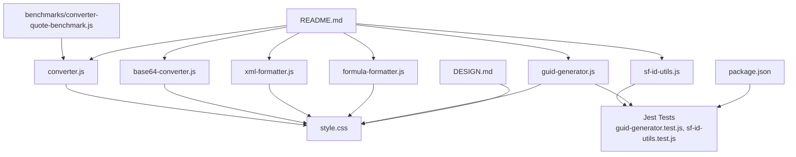
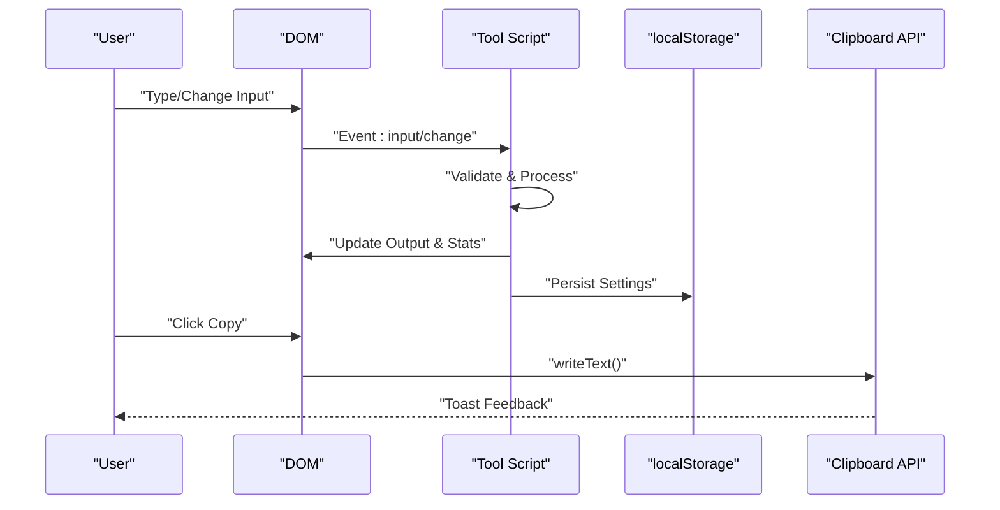
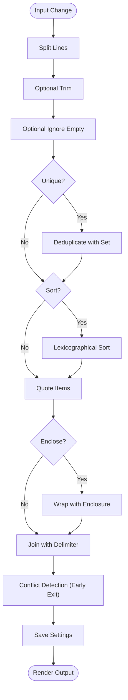
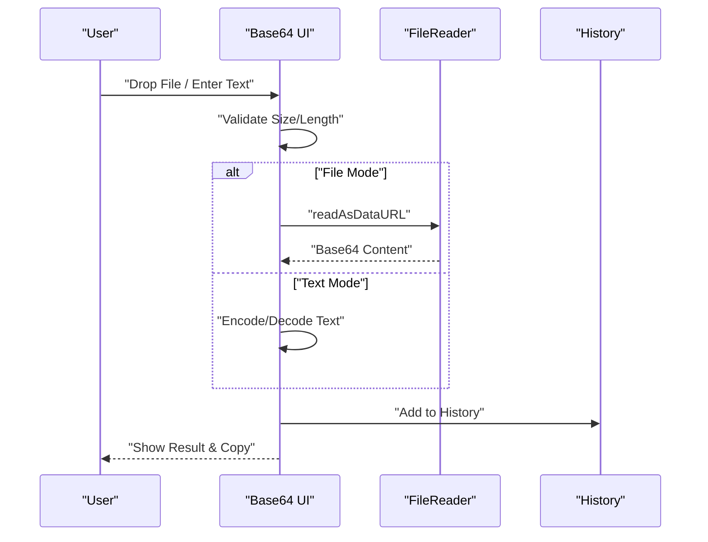
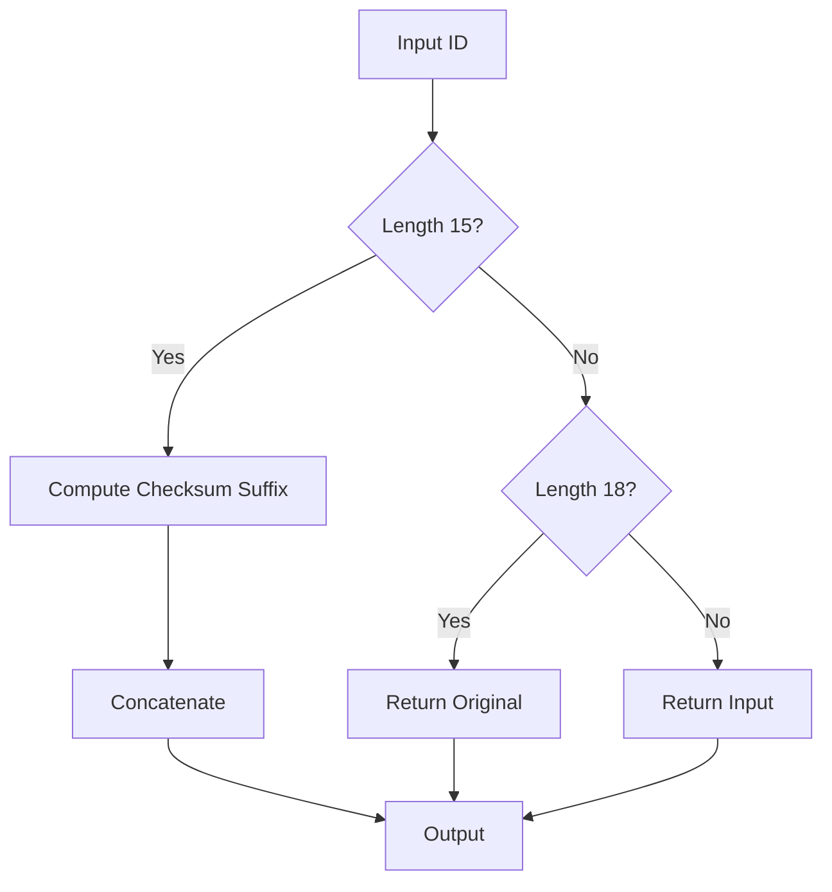
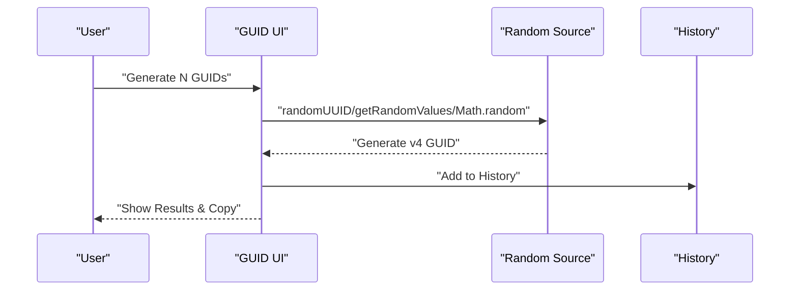
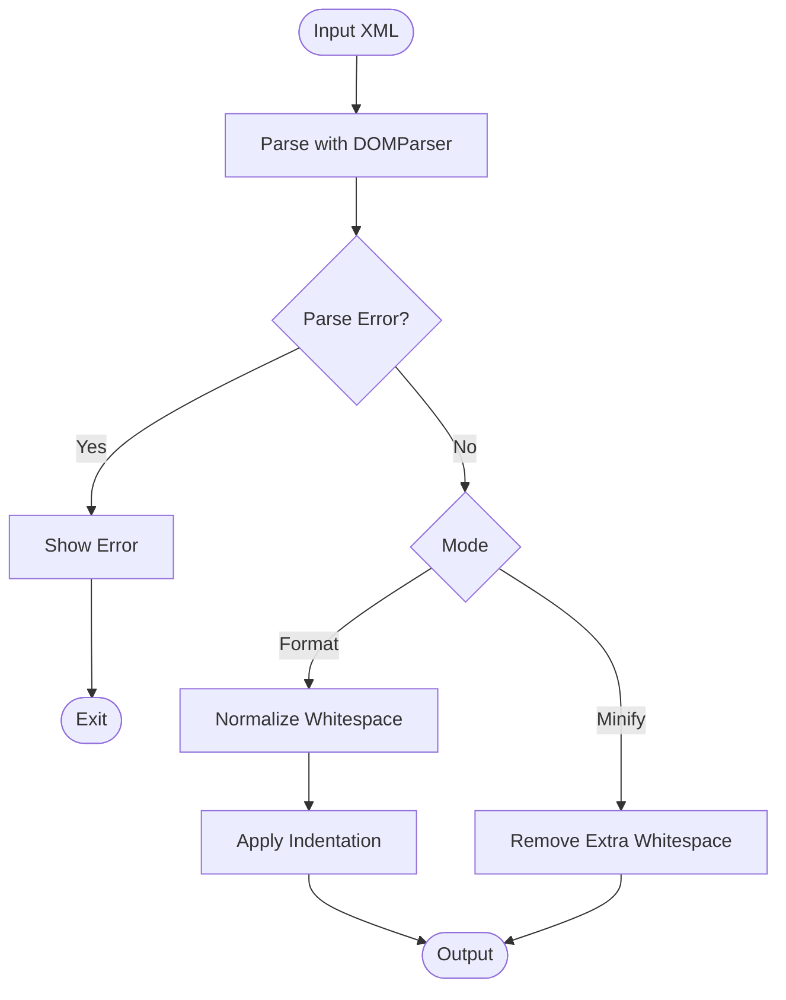
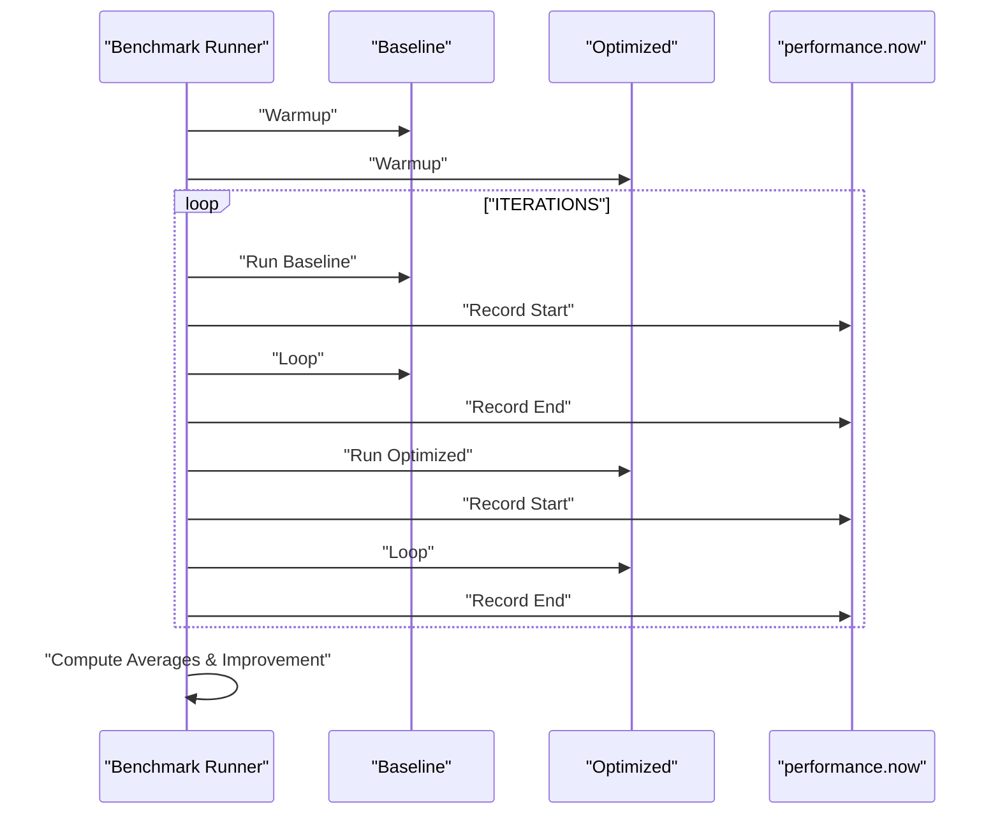
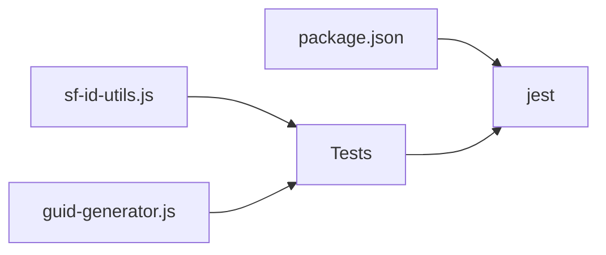

# Performance and Optimization

<cite>
**Referenced Files in This Document**
- [converter-quote-benchmark.js](file://benchmarks/converter-quote-benchmark.js)
- [converter.js](file://converter.js)
- [base64-converter.js](file://base64-converter.js)
- [sf-id-utils.js](file://sf-id-utils.js)
- [guid-generator.js](file://guid-generator.js)
- [xml-formatter.js](file://xml-formatter.js)
- [formula-formatter.js](file://formula-formatter.js)
- [package.json](file://package.json)
- [README.md](file://README.md)
- [DESIGN.md](file://DESIGN.md)
- [style.css](file://style.css)
- [guid-generator.test.js](file://guid-generator.test.js)
- [sf-id-utils.test.js](file://sf-id-utils.test.js)
</cite>

## Table of Contents
1. [Introduction](#introduction)
2. [Project Structure](#project-structure)
3. [Core Components](#core-components)
4. [Architecture Overview](#architecture-overview)
5. [Detailed Component Analysis](#detailed-component-analysis)
6. [Dependency Analysis](#dependency-analysis)
7. [Performance Considerations](#performance-considerations)
8. [Troubleshooting Guide](#troubleshooting-guide)
9. [Conclusion](#conclusion)
10. [Appendices](#appendices)

## Introduction
This document explains the performance optimization strategies and benchmarking approaches used across the Developer Utilities suite. It focuses on:
- Benchmarking methodology and algorithmic improvements demonstrated in the quote-conversion benchmark
- Real-time processing optimizations, DOM manipulation efficiency, and responsive design performance
- Input validation limits and browser compatibility safeguards
- Testing framework setup for performance validation and algorithm comparison
- Guidelines for adding new tools while balancing functionality and performance in the browser environment

## Project Structure
The project is organized around standalone HTML/JS tools that run entirely in the browser. Each tool encapsulates its own DOM listeners, processing logic, and persistence helpers. A dedicated benchmark script demonstrates algorithmic improvements for a specific operation.



**Diagram sources**
- [converter-quote-benchmark.js](file://benchmarks/converter-quote-benchmark.js)
- [converter.js](file://converter.js)
- [base64-converter.js](file://base64-converter.js)
- [sf-id-utils.js](file://sf-id-utils.js)
- [guid-generator.js](file://guid-generator.js)
- [xml-formatter.js](file://xml-formatter.js)
- [formula-formatter.js](file://formula-formatter.js)
- [package.json](file://package.json)
- [README.md](file://README.md)
- [DESIGN.md](file://DESIGN.md)
- [style.css](file://style.css)

**Section sources**
- [README.md](file://README.md)
- [DESIGN.md](file://DESIGN.md)
- [style.css](file://style.css)

## Core Components
- Column to List Converter: Real-time processing with early-exit conflict detection, optimized join strategies, and local persistence.
- Base64 Converter: Input size limits, drag-and-drop, and efficient history management.
- Salesforce ID Utilities: Lightweight validation and conversion functions with export support for tests.
- GUID Generator: Secure random generation with fallbacks and session history.
- XML Formatter: DOMParser-based validation and regex-driven formatting/minification.
- Formula Formatter: Regex-based formatting with indentation control and safe handling of quoted literals.
- Benchmarking: A micro-benchmark comparing baseline vs optimized join strategies for quoting.

Key performance themes:
- Early exits and single-pass scans to reduce unnecessary work
- Efficient string joins and minimal intermediate arrays
- Input validation limits to prevent UI stalls
- Minimal DOM updates and batched rendering
- Local storage persistence to avoid reprocessing

**Section sources**
- [converter.js](file://converter.js)
- [base64-converter.js](file://base64-converter.js)
- [sf-id-utils.js](file://sf-id-utils.js)
- [guid-generator.js](file://guid-generator.js)
- [xml-formatter.js](file://xml-formatter.js)
- [formula-formatter.js](file://formula-formatter.js)
- [converter-quote-benchmark.js](file://benchmarks/converter-quote-benchmark.js)

## Architecture Overview
The tools share a common pattern:
- DOMContentLoaded listener initializes UI and event handlers
- Real-time processing triggered by input/change events
- Validation and conflict detection with early exits
- Local persistence via localStorage
- Clipboard operations with graceful fallbacks
- Responsive design via CSS variables and media queries



**Diagram sources**
- [converter.js](file://converter.js)
- [base64-converter.js](file://base64-converter.js)
- [guid-generator.js](file://guid-generator.js)
- [xml-formatter.js](file://xml-formatter.js)
- [formula-formatter.js](file://formula-formatter.js)

## Detailed Component Analysis

### Column to List Converter: Real-time Processing and Conflict Detection
- Real-time processing: Listens to input and change events on multiple form controls to update results instantly.
- Conflict detection: Consolidates multiple checks into a single pass with early exits to minimize DOM reads.
- Quote and enclosure logic: Uses a single join with carefully constructed separators to avoid intermediate array cloning.
- Local persistence: Saves and restores settings to localStorage to avoid reprocessing on reload.



**Diagram sources**
- [converter.js](file://converter.js)

**Section sources**
- [converter.js](file://converter.js)

### Base64 Converter: Input Limits and History Management
- Input limits: Enforces maximum file size and character count to prevent UI freezes.
- Drag-and-drop: Efficiently handles file drops with visual feedback.
- History management: Maintains a bounded session history with previews and fast copy/delete actions.



**Diagram sources**
- [base64-converter.js](file://base64-converter.js)

**Section sources**
- [base64-converter.js](file://base64-converter.js)
- [README.md](file://README.md)

### Salesforce ID Utilities: Lightweight Algorithms
- Validation: Simple regex-based checks for 15/18-character IDs.
- Conversion: Deterministic checksum computation with minimal loops.



**Diagram sources**
- [sf-id-utils.js](file://sf-id-utils.js)

**Section sources**
- [sf-id-utils.js](file://sf-id-utils.js)
- [sf-id-utils.test.js](file://sf-id-utils.test.js)

### GUID Generator: Secure Randomness and History
- Secure randomness: Uses crypto.randomUUID when available, falls back to crypto.getRandomValues, then Math.random with a warning.
- History: Maintains a bounded list of generated GUIDs with copy/delete actions.



**Diagram sources**
- [guid-generator.js](file://guid-generator.js)

**Section sources**
- [guid-generator.js](file://guid-generator.js)
- [guid-generator.test.js](file://guid-generator.test.js)

### XML Formatter: DOMParser Validation and Regex Formatting
- Validation: Uses DOMParser to detect malformed XML before processing.
- Formatting/Minification: Regex-based normalization and indentation control.



**Diagram sources**
- [xml-formatter.js](file://xml-formatter.js)

**Section sources**
- [xml-formatter.js](file://xml-formatter.js)

### Formula Formatter: Regex-Based Formatting with Quoted Literals
- Cleans input by removing newlines and collapsing spaces.
- Formats with indentation controlled by parenthesis depth, respecting quoted literals.

```mermaid
flowchart TD
Start(["Raw Formula"]) --> Clean["Remove Newlines & Collapse Spaces"]
Clean --> Scan["Scan Characters"]
Scan --> Quote{"Inside Quotes?"}
Quote --> |Yes| AppendQ["Append Character"]
Quote --> |No| Paren{"( or ) or ,"}
Paren --> |(| Inc["Increase Indent"] --> AppendC["Append"]
Paren --> |)| Dec["Decrease Indent"] --> AppendC
Paren --> |,| Comma["Append , + NL + Indent"] --> AppendC
Paren --> |Other| AppendC
AppendC --> Next["Next Character"]
Next --> |More| Scan
Next --> |Done| Post["Post-process & Trim"]
Post --> End(["Formatted Output"])
```

**Diagram sources**
- [formula-formatter.js](file://formula-formatter.js)

**Section sources**
- [formula-formatter.js](file://formula-formatter.js)

### Benchmarking Methodology: Quote Conversion Micro-Benchmark
The benchmark compares a baseline approach with an optimized approach for quoting and joining a large array of strings.

- Dataset: One million items generated programmatically
- Operations: Quote wrapping and joining with a delimiter
- Metrics: Average runtime over multiple iterations using performance.now
- Improvement calculation: Percentage difference between baseline and optimized



**Diagram sources**
- [converter-quote-benchmark.js](file://benchmarks/converter-quote-benchmark.js)

**Section sources**
- [converter-quote-benchmark.js](file://benchmarks/converter-quote-benchmark.js)

## Dependency Analysis
- Tools depend on DOM APIs, localStorage, Clipboard API, and optional Bootstrap Toast integration.
- Cross-tool dependencies are minimal; each tool is self-contained.
- Testing relies on Jest for unit-style validation of pure functions and deterministic behaviors.



**Diagram sources**
- [package.json](file://package.json)
- [sf-id-utils.js](file://sf-id-utils.js)
- [guid-generator.js](file://guid-generator.js)
- [guid-generator.test.js](file://guid-generator.test.js)
- [sf-id-utils.test.js](file://sf-id-utils.test.js)

**Section sources**
- [package.json](file://package.json)

## Performance Considerations

### Large Dataset Handling
- Prefer single-pass scans with early exits to avoid redundant work.
- Use efficient string joins with carefully constructed separators to minimize intermediate allocations.
- Avoid cloning arrays when the original array can be reused for validation or output.
- Limit input sizes to prevent UI stalls; enforce explicit caps where applicable.

### Input Validation Limits
- Base64 Converter enforces maximum file size and character count.
- XML Formatter validates input with DOMParser before heavy processing.
- Formula Formatter cleans input by removing newlines and collapsing spaces.

### Browser Compatibility Optimizations
- Use feature detection for Clipboard API and secure contexts; fall back to execCommand when necessary.
- Provide fallbacks for secure randomness (crypto.getRandomValues, then Math.random).
- Avoid heavy synchronous operations on the main thread; keep UI responsive.

### Debouncing Strategies for Real-time Processing
- Current tools trigger processing on input/change events. For very large inputs, consider debouncing to reduce CPU usage during rapid typing.
- Debounce intervals should be tuned to balance responsiveness and performance.

### Efficient DOM Manipulation Techniques
- Batch DOM updates and avoid frequent reflows; prefer innerHTML for large table renders.
- Use CSS variables and media queries for responsive layouts to minimize JS-driven layout changes.
- Minimize class toggling and element creation; reuse elements where possible.

### Responsive Design Performance
- CSS-based animations and transitions are preferred over JS-driven effects.
- Media queries adjust layout and overflow behavior for desktop, reducing unnecessary JS overhead.
- Glassmorphism effects rely on backdrop-filter; ensure they are not overly intensive on low-end devices.

**Section sources**
- [converter.js](file://converter.js)
- [base64-converter.js](file://base64-converter.js)
- [xml-formatter.js](file://xml-formatter.js)
- [formula-formatter.js](file://formula-formatter.js)
- [style.css](file://style.css)

## Troubleshooting Guide
- Clipboard failures: The system gracefully falls back to textarea selection and execCommand when the Clipboard API is unavailable or not in a secure context.
- Invalid XML: DOMParser errors are caught and surfaced to the user with actionable messages.
- Large inputs causing slow UI: Reduce input size or consider debouncing real-time processing.
- History overflow: Session histories are bounded; oldest items are automatically pruned.

**Section sources**
- [base64-converter.js](file://base64-converter.js)
- [xml-formatter.js](file://xml-formatter.js)
- [converter.js](file://converter.js)
- [guid-generator.js](file://guid-generator.js)

## Conclusion
The Developer Utilities prioritize performance through:
- Early-exit logic and single-pass scans
- Efficient string joins and minimal intermediate allocations
- Input validation limits and robust error handling
- Feature detection and graceful fallbacks
- Responsive design with CSS-driven effects

The benchmark demonstrates measurable improvements in join strategies for quoting operations, reinforcing the importance of algorithmic choices in real-world scenarios.

## Appendices

### Testing Framework Setup for Performance Validation
- Jest is configured for unit tests; pure functions and deterministic behaviors are validated.
- For performance validation, integrate micro-benchmarks similar to the quote-conversion benchmark within the same testing harness.

**Section sources**
- [package.json](file://package.json)
- [guid-generator.test.js](file://guid-generator.test.js)
- [sf-id-utils.test.js](file://sf-id-utils.test.js)
- [converter-quote-benchmark.js](file://benchmarks/converter-quote-benchmark.js)

### Optimization Guidelines for Adding New Tools
- Encapsulate processing logic in small, testable functions.
- Validate inputs early and fail fast to avoid expensive operations.
- Use efficient string operations and avoid unnecessary array cloning.
- Persist settings locally to reduce recomputation on reload.
- Provide fallbacks for browser APIs and warn users when features are unavailable.
- Keep UI responsive by minimizing synchronous work on the main thread.