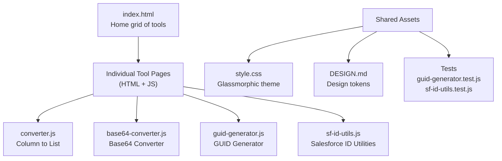
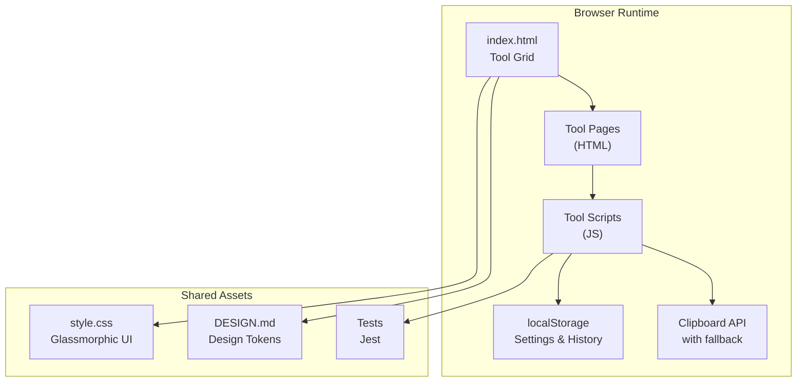
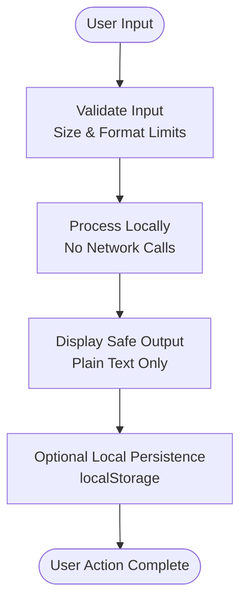
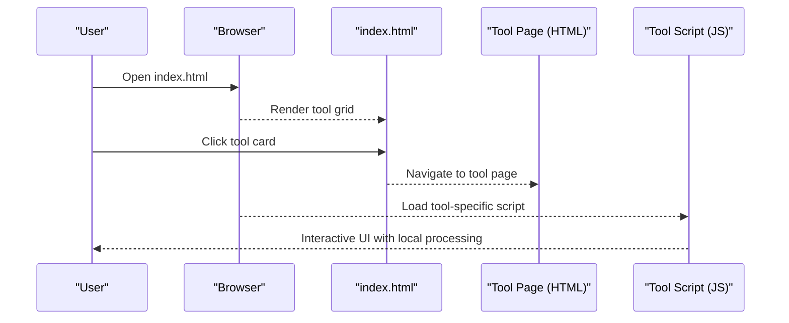
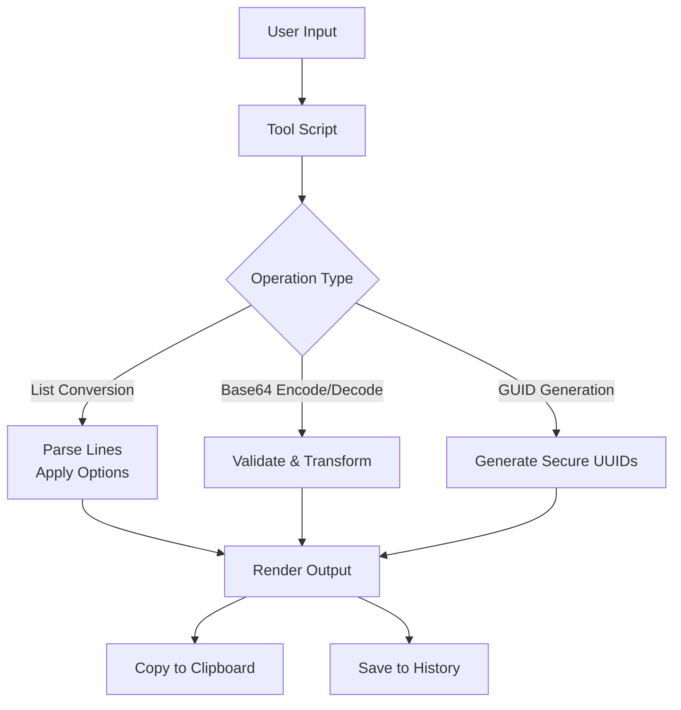
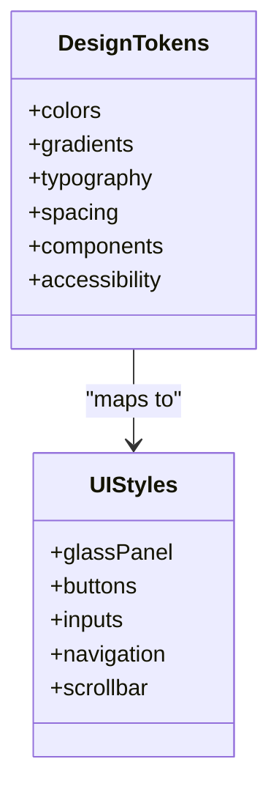
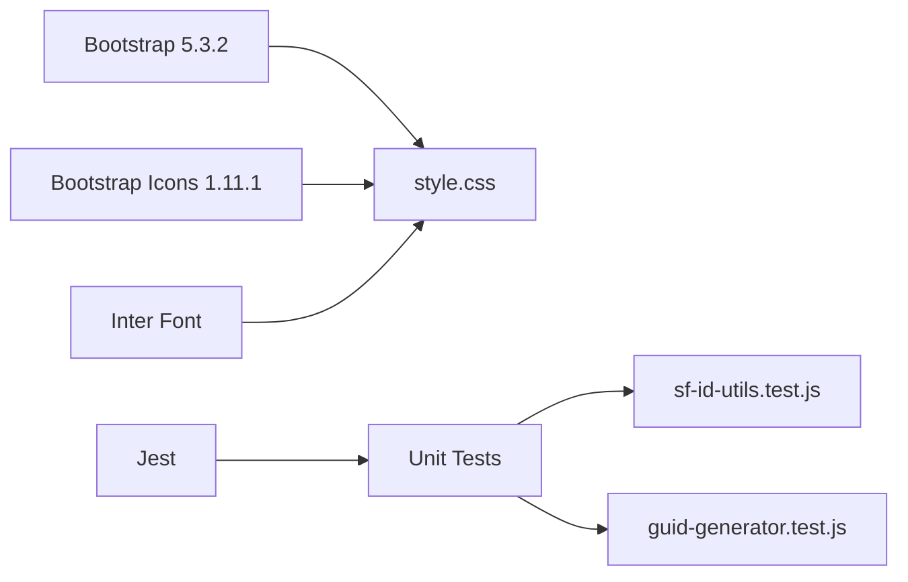

# Project Overview

<cite>
**Referenced Files in This Document**
- [README.md](file://README.md)
- [DESIGN.md](file://DESIGN.md)
- [package.json](file://package.json)
- [index.html](file://index.html)
- [style.css](file://style.css)
- [converter.js](file://converter.js)
- [base64-converter.js](file://base64-converter.js)
- [guid-generator.js](file://guid-generator.js)
- [sf-id-utils.js](file://sf-id-utils.js)
- [guid-generator.test.js](file://guid-generator.test.js)
- [sf-id-utils.test.js](file://sf-id-utils.test.js)
</cite>

## Table of Contents
1. [Introduction](#introduction)
2. [Project Structure](#project-structure)
3. [Core Components](#core-components)
4. [Architecture Overview](#architecture-overview)
5. [Detailed Component Analysis](#detailed-component-analysis)
6. [Dependency Analysis](#dependency-analysis)
7. [Performance Considerations](#performance-considerations)
8. [Troubleshooting Guide](#troubleshooting-guide)
9. [Conclusion](#conclusion)

## Introduction
Dev Utils is a secure, offline-first developer toolkit that runs entirely in the browser. It provides a comprehensive suite of utilities for developers, administrators, and Salesforce professionals without requiring any server infrastructure. The project emphasizes privacy-first design, local-only data processing, and cross-platform compatibility. All tools operate client-side, ensuring no data leaves the user’s device.

Key benefits:
- Zero server dependencies
- Zero data transmission
- Cross-platform compatibility (runs from any modern browser)
- Privacy-first and security-conscious design
- Modular Single Page Application (SPA) enabling independent tool usage with shared functionality

Target audience:
- Salesforce developers (ID utilities, permission set assignment, formula formatting, Apex debug log filtering)
- General developers (Base64 conversion, XML formatting, list conversion)
- Administrators (bulk CSV generation, API name generation, scheduling helpers)

## Project Structure
Dev Utils follows a modular SPA design:
- Central landing page (index.html) presents a grid of tools
- Each tool is a standalone HTML page with its own JavaScript logic
- Shared UI framework and design tokens are centralized in CSS and a design spec
- Utilities share common patterns for persistence, history, and copy-to-clipboard

**Diagram sources**
- [index.html](file://index.html)
- [converter.js](file://converter.js)
- [base64-converter.js](file://base64-converter.js)
- [guid-generator.js](file://guid-generator.js)
- [sf-id-utils.js](file://sf-id-utils.js)
- [style.css](file://style.css)
- [DESIGN.md](file://DESIGN.md)
- [guid-generator.test.js](file://guid-generator.test.js)
- [sf-id-utils.test.js](file://sf-id-utils.test.js)

**Section sources**
- [index.html](file://index.html)
- [style.css](file://style.css)
- [DESIGN.md](file://DESIGN.md)

## Core Components
- Column to List Converter: Transforms spreadsheet columns into formatted lists with delimiters, quoting, enclosure, deduplication, sorting, and whitespace trimming. It persists settings and maintains a session history.
- Base64 Converter: Converts files to Base64 Data URLs and text to/from Base64 with validation, history, and mobile-friendly controls.
- GUID Generator: Generates random Version 4 UUIDs with bulk generation, session history, and copy features.
- Salesforce ID Utilities: Validates and converts 15-character IDs to 18-character case-safe IDs, and supports list difference with smart normalization.
- Permission Set Assigner: Generates CSV files for bulk Permission Set and License assignments.
- Apex Debug Log Filter: Filters massive raw debug logs for USER_DEBUG, EXCEPTION, METHOD_ENTRY/EXIT, with keyword search.
- XML Formatter: Formats and minifies XML and package.xml files with configurable indentation.
- API Name Generator: Bulk converts Salesforce labels to valid API names with custom suffixes.
- Cron Generator: Builds System.schedule() Cron expressions with a simple UI.
- Formula Formatter: Formats and indents Salesforce formula fields for readability.

Practical use cases:
- Salesforce developers: Convert IDs, compare lists, generate CSVs, format formulas, filter Apex logs.
- General developers: Convert Base64, format XML, transform lists, generate GUIDs.
- Administrators: Bulk assign permissions, generate API names, schedule jobs.

**Section sources**
- [README.md](file://README.md)
- [index.html](file://index.html)

## Architecture Overview
Dev Utils is a modular SPA with:
- Centralized navigation and tool grid in index.html
- Per-tool pages with dedicated JavaScript logic
- Shared UI and design tokens via CSS and DESIGN.md
- Local persistence using localStorage for settings and histories
- Clipboard operations with graceful fallbacks
- Security model: all processing happens locally; no analytics, cookies, or server-side logging

**Diagram sources**
- [index.html](file://index.html)
- [style.css](file://style.css)
- [DESIGN.md](file://DESIGN.md)
- [converter.js](file://converter.js)
- [base64-converter.js](file://base64-converter.js)
- [guid-generator.js](file://guid-generator.js)
- [sf-id-utils.js](file://sf-id-utils.js)
- [guid-generator.test.js](file://guid-generator.test.js)
- [sf-id-utils.test.js](file://sf-id-utils.test.js)

## Detailed Component Analysis

### Security Model and Privacy
- All tools run client-side; no data is transmitted to servers.
- Decoded outputs are displayed as plain text and are not executed by the browser.
- Input limits prevent performance degradation and potential hangs.
- No analytics, cookies, or server-side logging.
- Sandboxed execution within the browser ensures safe handling of sensitive data.

**Section sources**
- [README.md](file://README.md)

### Modular SPA Design and Independent Tool Usage
Each tool is a self-contained page with its own script, enabling:
- Independent usage: open any tool directly from the file system
- Shared UI: consistent glassmorphic design and navigation
- Shared functionality: copy-to-clipboard, toast notifications, and history management

**Diagram sources**
- [index.html](file://index.html)
- [converter.js](file://converter.js)
- [base64-converter.js](file://base64-converter.js)
- [guid-generator.js](file://guid-generator.js)

### Example Tools and Their Capabilities
- Column to List Converter: Processes multi-line input, applies transformations (trim, dedupe, sort), quoting, and enclosure, then saves to history and copies to clipboard.
- Base64 Converter: Handles file drag-and-drop, validates size and content, encodes/decodes text safely, and manages a recent history.
- GUID Generator: Generates secure UUIDs with bulk selection, enforces limits, and maintains a history of generated sets.

**Diagram sources**
- [converter.js](file://converter.js)
- [base64-converter.js](file://base64-converter.js)
- [guid-generator.js](file://guid-generator.js)

**Section sources**
- [converter.js](file://converter.js)
- [base64-converter.js](file://base64-converter.js)
- [guid-generator.js](file://guid-generator.js)

### Design Tokens and Theming
Dev Utils uses a dark-first glassmorphic theme with:
- Primary palette, semantic colors, gradients, and typography scales
- Glass panels, buttons, form inputs, and navigation components
- Accessibility-focused design with WCAG 2.1 AA contrast and focus-visible states

**Diagram sources**
- [DESIGN.md](file://DESIGN.md)
- [style.css](file://style.css)

**Section sources**
- [DESIGN.md](file://DESIGN.md)
- [style.css](file://style.css)

## Dependency Analysis
- Frontend dependencies: Bootstrap 5.3.2 (CSS and JS), Bootstrap Icons 1.11.1, Inter font
- Internal dependencies: Shared CSS and design tokens; each tool script depends on its own HTML page and local storage
- Testing: Jest for unit tests validating GUID and Salesforce ID utilities

**Diagram sources**
- [package.json](file://package.json)
- [style.css](file://style.css)
- [guid-generator.test.js](file://guid-generator.test.js)
- [sf-id-utils.test.js](file://sf-id-utils.test.js)

**Section sources**
- [package.json](file://package.json)

## Performance Considerations
- Input limits: Base64 text mode caps at 5000 characters; file uploads cap at 5 MB to prevent browser freezes.
- Local processing: All heavy computations occur in the browser; no network overhead.
- Clipboard operations: Prefer native Clipboard API with fallback to textarea execCommand for broad compatibility.
- UI responsiveness: Debounced or event-driven updates minimize reflows; history lists are capped to reduce memory usage.

[No sources needed since this section provides general guidance]

## Troubleshooting Guide
Common issues and resolutions:
- Clipboard not copying: Ensure the page is served over a secure context (HTTPS or localhost) to enable the Clipboard API; fallback to textarea method otherwise.
- Large input causing slow performance: Reduce input size or split into smaller chunks; the Base64 converter enforces a 5000-character limit for text mode.
- Tool not saving settings/history: Verify localStorage is enabled in the browser; clearing site data removes persisted settings.
- Drag-and-drop not working: Confirm the browser supports the File API and that the drop zone is visible and not disabled.

**Section sources**
- [base64-converter.js](file://base64-converter.js)
- [converter.js](file://converter.js)
- [guid-generator.js](file://guid-generator.js)

## Conclusion
Dev Utils delivers a privacy-first, offline-first toolkit that empowers developers and administrators to perform essential tasks securely and efficiently. Its modular SPA design enables independent tool usage while sharing a cohesive UI and robust local processing model. With zero server dependencies, strict privacy controls, and comprehensive utility coverage, it is a reliable companion for daily development and administrative tasks.