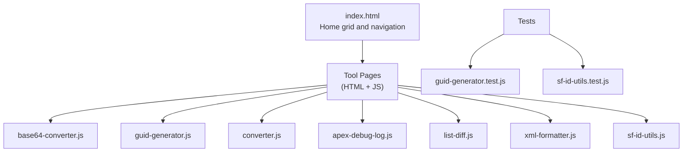
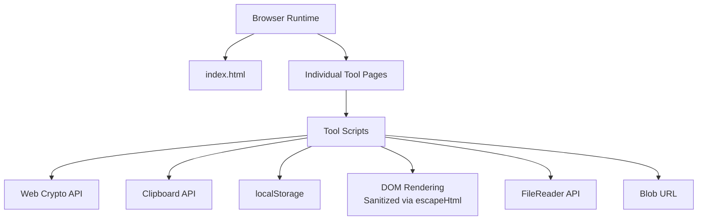
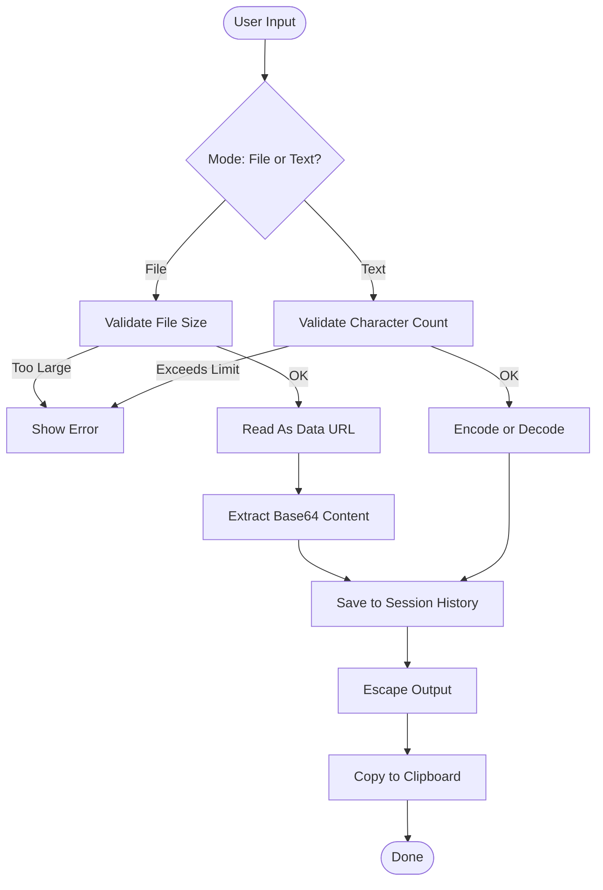
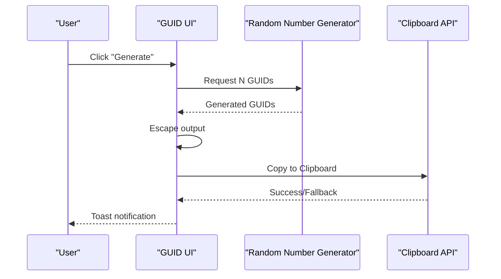
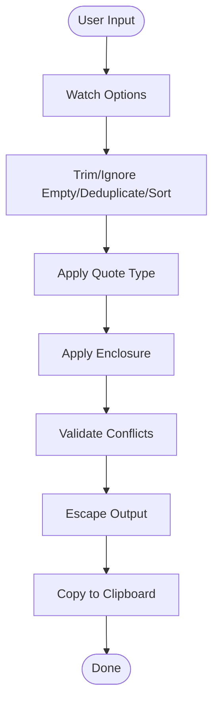
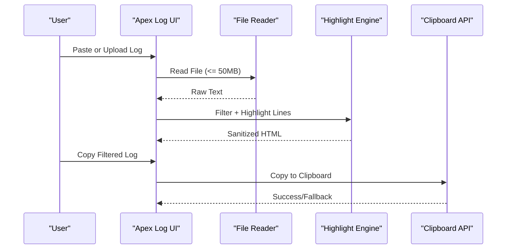
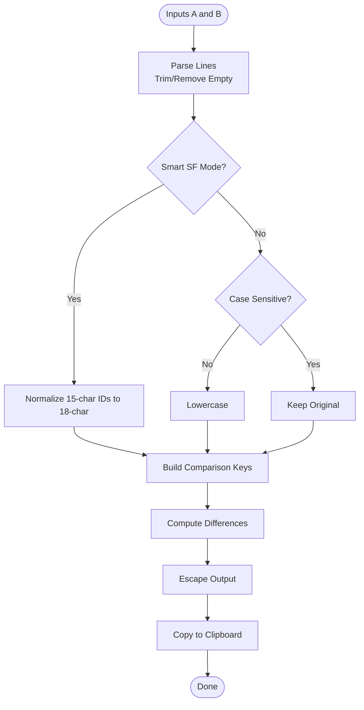
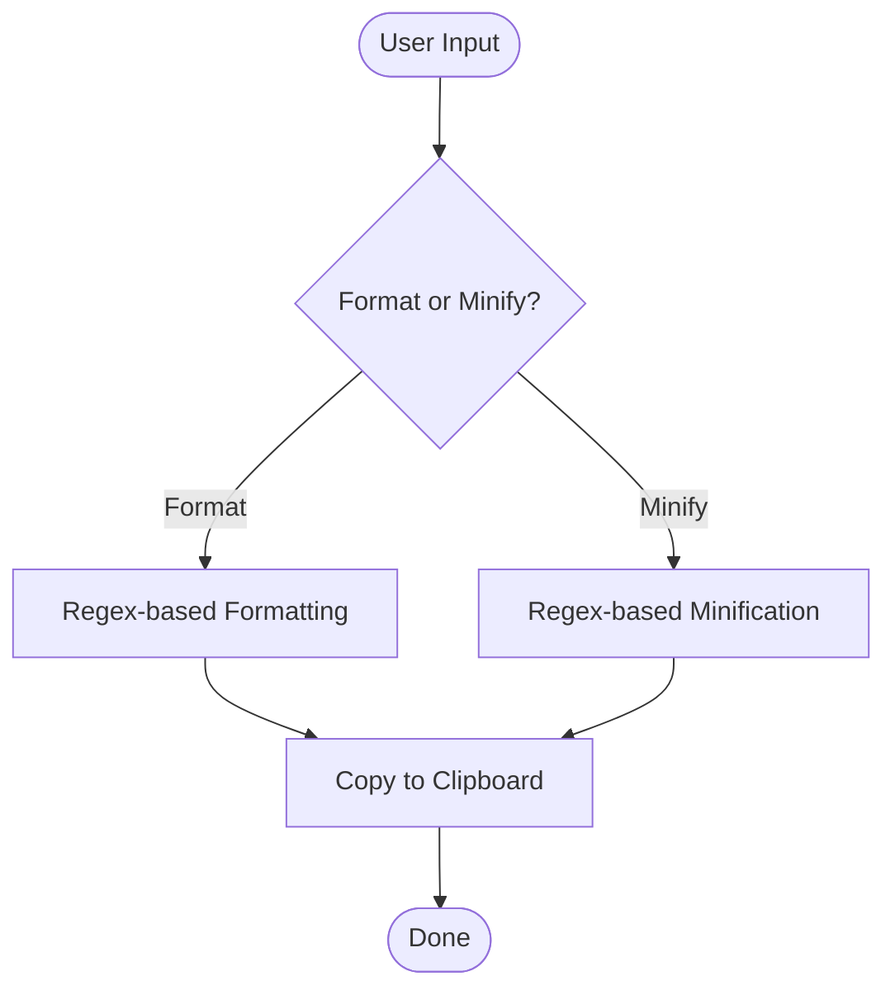
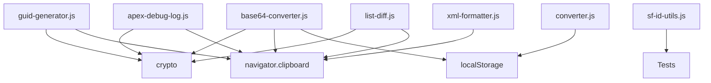

# Security and Privacy

<cite>
**Referenced Files in This Document**
- [README.md](file://README.md)
- [DESIGN.md](file://DESIGN.md)
- [index.html](file://index.html)
- [package.json](file://package.json)
- [base64-converter.js](file://base64-converter.js)
- [guid-generator.js](file://guid-generator.js)
- [converter.js](file://converter.js)
- [apex-debug-log.js](file://apex-debug-log.js)
- [list-diff.js](file://list-diff.js)
- [xml-formatter.js](file://xml-formatter.js)
- [sf-id-utils.js](file://sf-id-utils.js)
- [guid-generator.test.js](file://guid-generator.test.js)
- [sf-id-utils.test.js](file://sf-id-utils.test.js)
</cite>

## Table of Contents
1. [Introduction](#introduction)
2. [Project Structure](#project-structure)
3. [Core Components](#core-components)
4. [Architecture Overview](#architecture-overview)
5. [Detailed Component Analysis](#detailed-component-analysis)
6. [Dependency Analysis](#dependency-analysis)
7. [Performance Considerations](#performance-considerations)
8. [Troubleshooting Guide](#troubleshooting-guide)
9. [Conclusion](#conclusion)

## Introduction
This document details the security and privacy model that underpins the Developer Utilities suite. It explains the privacy-first design principles, the 100% client-side processing model, and the zero data transmission policy. It also covers XSS prevention measures, secure random number generation using the Web Crypto API, input validation strategies, performance safety limits, sandboxing approaches for decoded outputs, browser API security considerations, clipboard API usage safety, and local storage security practices. Finally, it clarifies the no-analytics, no-cookies, and no-server-side-logging policies and how these design choices protect user data while maintaining functionality.

## Project Structure
The project is organized as a static web application with a central index page and modular tool pages. Each tool implements its own security and privacy safeguards within the browser context.

**Diagram sources**
- [index.html](file://index.html)
- [base64-converter.js](file://base64-converter.js)
- [guid-generator.js](file://guid-generator.js)
- [converter.js](file://converter.js)
- [apex-debug-log.js](file://apex-debug-log.js)
- [list-diff.js](file://list-diff.js)
- [xml-formatter.js](file://xml-formatter.js)
- [sf-id-utils.js](file://sf-id-utils.js)
- [guid-generator.test.js](file://guid-generator.test.js)
- [sf-id-utils.test.js](file://sf-id-utils.test.js)

**Section sources**
- [index.html](file://index.html)
- [README.md](file://README.md)

## Core Components
- Privacy-first design: The project emphasizes “All processing happens locally” and “Runs locally. No data leaves your browser.”
- Zero data transmission: No analytics, cookies, or server-side logging are present because there is no server.
- Client-side-only execution: All tools run entirely in the browser; no network requests are made.
- XSS prevention: Outputs are sanitized via HTML escaping before insertion into the DOM.
- Secure randomness: Uses the Web Crypto API when available; falls back to less secure methods only when necessary.
- Input validation: Enforces strict limits and sanitization to prevent resource exhaustion and injection.
- Clipboard safety: Uses the Clipboard API when available and safe; falls back to a controlled textarea method.
- Local storage security: Used for UI preferences and session history; avoids storing sensitive data.

**Section sources**
- [DESIGN.md](file://DESIGN.md)
- [README.md](file://README.md)

## Architecture Overview
The system architecture is a pure client-side application. Each tool page loads its JavaScript logic after DOMContentLoaded, performs processing in memory, and renders sanitized output. There is no server component, ensuring no data leaves the browser.

**Diagram sources**
- [index.html](file://index.html)
- [base64-converter.js](file://base64-converter.js)
- [guid-generator.js](file://guid-generator.js)
- [converter.js](file://converter.js)
- [apex-debug-log.js](file://apex-debug-log.js)
- [list-diff.js](file://list-diff.js)
- [xml-formatter.js](file://xml-formatter.js)

## Detailed Component Analysis

### Base64 Converter
- Purpose: Convert files to Base64 and text to/from Base64.
- Security and privacy:
  - XSS prevention: Output previews are escaped before insertion into the DOM.
  - Clipboard safety: Uses navigator.clipboard when available and in a secure context; otherwise falls back to a controlled textarea method.
  - Input limits: Enforces a 5 MB file size limit and a 5000-character text limit to prevent performance issues.
  - Sandboxing: Decoded outputs are rendered as plain text; no script execution occurs.
  - History: Stores recent conversions in-memory for the session; no persistent storage.

**Diagram sources**
- [base64-converter.js](file://base64-converter.js)

**Section sources**
- [base64-converter.js](file://base64-converter.js)

### GUID Generator
- Purpose: Generate cryptographically strong random UUIDs (v4).
- Security and privacy:
  - Secure randomness: Prefers crypto.randomUUID when available; falls back to crypto.getRandomValues; last resort uses Math.random.
  - XSS prevention: Output is escaped before rendering.
  - Clipboard safety: Uses navigator.clipboard when available and in a secure context; otherwise falls back to a controlled textarea method.
  - Limits: Caps batch generation at 20 per request to avoid performance issues.
  - History: Maintains a short-lived session history.

**Diagram sources**
- [guid-generator.js](file://guid-generator.js)

**Section sources**
- [guid-generator.js](file://guid-generator.js)

### Column to List Converter
- Purpose: Transform columns into lists with quoting, enclosure, deduplication, sorting, and trimming.
- Security and privacy:
  - XSS prevention: Escapes HTML in previews and warnings.
  - Clipboard safety: Uses navigator.clipboard when available and in a secure context; otherwise falls back to a controlled textarea method.
  - Persistence: Saves settings to localStorage; no server communication.
  - History: Stores session history for quick reuse.

**Diagram sources**
- [converter.js](file://converter.js)

**Section sources**
- [converter.js](file://converter.js)

### Apex Debug Log Filter
- Purpose: Filter and highlight Apex debug logs.
- Security and privacy:
  - XSS prevention: Escapes HTML for timestamps and keywords; highlights are applied to escaped content.
  - Clipboard safety: Uses navigator.clipboard when available and in a secure context; otherwise falls back to a controlled textarea method.
  - File handling: Validates file type and enforces a 50 MB size limit to prevent browser crashes.
  - Display settings: Stores font family, size, and highlight toggle in localStorage.

**Diagram sources**
- [apex-debug-log.js](file://apex-debug-log.js)

**Section sources**
- [apex-debug-log.js](file://apex-debug-log.js)

### List Diff (Salesforce ID Utilities)
- Purpose: Compare two lists, with optional smart normalization for 15/18 char Salesforce IDs.
- Security and privacy:
  - XSS prevention: Escapes HTML for list items and previews.
  - Clipboard safety: Uses navigator.clipboard when available and in a secure context; otherwise falls back to a controlled textarea method.
  - ID utilities: Provides validation and normalization helpers for Salesforce IDs.

**Diagram sources**
- [list-diff.js](file://list-diff.js)
- [sf-id-utils.js](file://sf-id-utils.js)

**Section sources**
- [list-diff.js](file://list-diff.js)
- [sf-id-utils.js](file://sf-id-utils.js)

### XML Formatter
- Purpose: Format and minify XML.
- Security and privacy:
  - XSS prevention: Renders output as plain text; no script execution.
  - Clipboard safety: Uses navigator.clipboard when available and in a secure context; otherwise falls back to a controlled textarea method.

**Diagram sources**
- [xml-formatter.js](file://xml-formatter.js)

**Section sources**
- [xml-formatter.js](file://xml-formatter.js)

## Dependency Analysis
- Tool pages depend on shared browser APIs: Web Crypto, Clipboard, localStorage, FileReader, and Blob URL.
- There is no server-side dependency; all logic runs client-side.
- Tests validate correctness of core utilities (e.g., GUID regex and Salesforce ID helpers).

**Diagram sources**
- [base64-converter.js](file://base64-converter.js)
- [guid-generator.js](file://guid-generator.js)
- [converter.js](file://converter.js)
- [apex-debug-log.js](file://apex-debug-log.js)
- [list-diff.js](file://list-diff.js)
- [xml-formatter.js](file://xml-formatter.js)
- [sf-id-utils.js](file://sf-id-utils.js)
- [guid-generator.test.js](file://guid-generator.test.js)
- [sf-id-utils.test.js](file://sf-id-utils.test.js)

**Section sources**
- [package.json](file://package.json)

## Performance Considerations
- Input limits:
  - Base64 Converter: 5 MB file size limit and 5000-character text limit.
  - Apex Debug Log: 50 MB file size limit.
  - GUID Generator: Batch limit capped at 20.
  - Column to List Converter: Settings persisted to localStorage; heavy processing is client-side only.
- DOM rendering:
  - Sanitization via escapeHtml prevents expensive reflows and XSS.
  - Fragmented DOM updates reduce layout thrashing.
- Clipboard operations:
  - Prefer navigator.clipboard for performance and reliability; fallback to textarea only when necessary.

[No sources needed since this section provides general guidance]

## Troubleshooting Guide
- Clipboard fails:
  - The system attempts navigator.clipboard and gracefully falls back to a textarea-based method. If both fail, errors are logged to the console.
- XSS concerns:
  - All user-visible outputs are escaped before insertion into the DOM. If unexpected content appears, verify that escapeHtml is applied consistently.
- Performance issues:
  - Exceeding input limits triggers immediate validation errors. Reduce input size or split tasks.
- Local storage anomalies:
  - Settings and histories are stored in localStorage. If corrupted, clear browser storage or reload the page to regenerate defaults.

**Section sources**
- [base64-converter.js](file://base64-converter.js)
- [guid-generator.js](file://guid-generator.js)
- [converter.js](file://converter.js)
- [apex-debug-log.js](file://apex-debug-log.js)
- [list-diff.js](file://list-diff.js)

## Conclusion
The Developer Utilities enforce a strict privacy-first, 100% client-side model. By leveraging the Web Crypto API for secure randomness, implementing robust input validation and XSS prevention, and using safe clipboard and storage practices, the suite protects user data while preserving functionality. The absence of analytics, cookies, and server-side logging ensures no data leaves the browser, aligning with the stated zero data transmission policy.