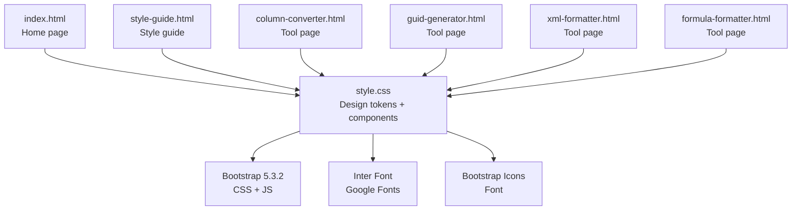
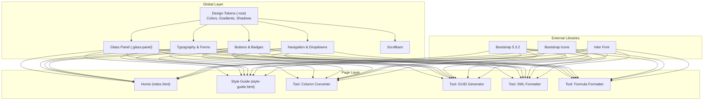
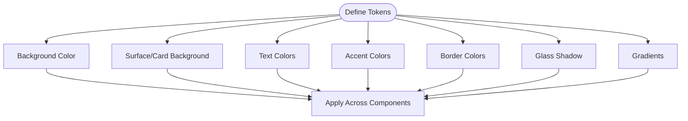
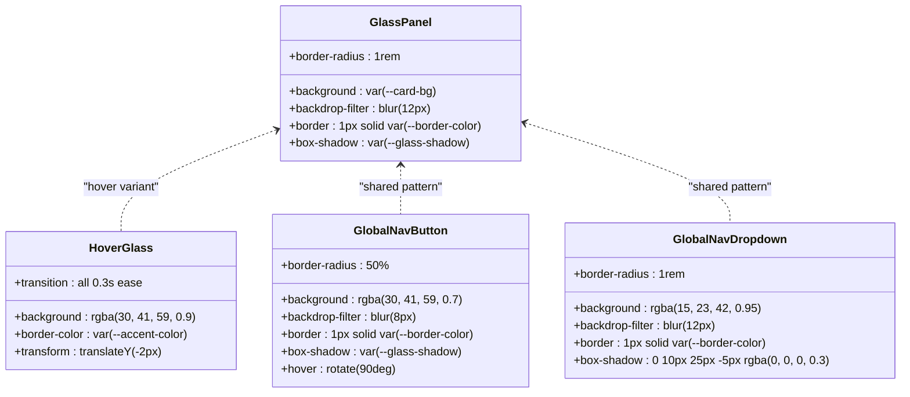
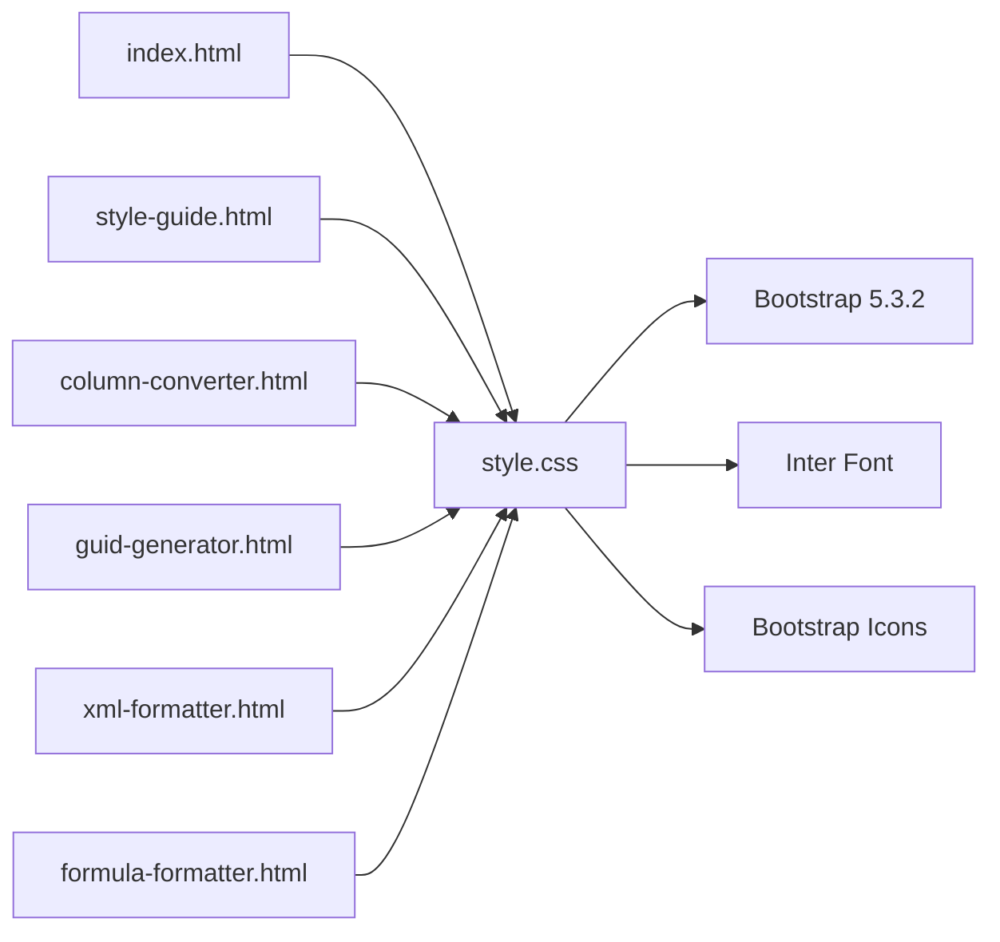

# Styling and Design System

<cite>
**Referenced Files in This Document**
- [style.css](file://style.css)
- [index.html](file://index.html)
- [DESIGN.md](file://DESIGN.md)
- [style-guide.html](file://style-guide.html)
- [column-converter.html](file://column-converter.html)
- [guid-generator.html](file://guid-generator.html)
- [xml-formatter.html](file://xml-formatter.html)
- [formula-formatter.html](file://formula-formatter.html)
- [package.json](file://package.json)
</cite>

## Table of Contents
1. [Introduction](#introduction)
2. [Project Structure](#project-structure)
3. [Core Components](#core-components)
4. [Architecture Overview](#architecture-overview)
5. [Detailed Component Analysis](#detailed-component-analysis)
6. [Dependency Analysis](#dependency-analysis)
7. [Performance Considerations](#performance-considerations)
8. [Troubleshooting Guide](#troubleshooting-guide)
9. [Conclusion](#conclusion)
10. [Appendices](#appendices)

## Introduction
This document describes the styling architecture and design system used across the Developer Utilities suite. It explains the CSS organization, dark theme implementation, glassmorphism effects, responsive design patterns, Bootstrap integration, component styling approaches, and custom CSS variables for theme customization. It also covers the Inter font family usage, icon integration via Bootstrap Icons, cross-browser compatibility considerations, and the style guide principles, color schemes, spacing systems, typography hierarchy, mobile-first design approach, breakpoint strategies, and accessibility considerations.

## Project Structure
The styling system is organized around a central stylesheet that defines design tokens and reusable components, with individual tool pages applying consistent patterns and adding tool-specific overrides. The index page demonstrates the home layout and navigation, while the style guide serves as a visual reference for components and patterns.

**Diagram sources**
- [index.html:1-406](file://index.html#L1-L406)
- [style.css:1-293](file://style.css#L1-L293)
- [style-guide.html:1-245](file://style-guide.html#L1-L245)
- [column-converter.html:1-226](file://column-converter.html#L1-L226)
- [guid-generator.html:1-123](file://guid-generator.html#L1-L123)
- [xml-formatter.html:1-143](file://xml-formatter.html#L1-L143)
- [formula-formatter.html:1-108](file://formula-formatter.html#L1-L108)

**Section sources**
- [index.html:1-406](file://index.html#L1-L406)
- [style.css:1-293](file://style.css#L1-L293)
- [style-guide.html:1-245](file://style-guide.html#L1-L245)

## Core Components
The design system centers on a set of reusable components and design tokens:

- Design tokens: CSS custom properties define the color palette, gradients, shadows, and backgrounds.
- Glass panels: A foundational component with backdrop blur, subtle borders, and rounded corners.
- Typography: Inter as the primary font family with a monospace variant for code-like inputs.
- Forms: Glass-style inputs and selects with focused states and placeholders.
- Buttons: Gradient primary and success variants with hover effects and outline light variants.
- Navigation: Fixed global navigation with a glass effect and dropdown menu.
- Tables: Dark-themed tables styled to integrate with glass panels.
- Scrollbars: Customized WebKit scrollbars for a cohesive look.

These components are consistently applied across pages and tool layouts.

**Section sources**
- [style.css:1-293](file://style.css#L1-L293)
- [DESIGN.md:1-202](file://DESIGN.md#L1-L202)

## Architecture Overview
The styling architecture follows a layered approach:
- Global styles: Central stylesheet defines design tokens and reusable components.
- Page-level styles: Individual tool pages apply layout-specific adjustments and overrides.
- Bootstrap integration: Bootstrap’s grid, utilities, and components are extended with custom styles.
- Iconography: Bootstrap Icons are used consistently for actions and navigation.

**Diagram sources**
- [style.css:1-293](file://style.css#L1-L293)
- [index.html:1-406](file://index.html#L1-L406)
- [style-guide.html:1-245](file://style-guide.html#L1-L245)
- [column-converter.html:1-226](file://column-converter.html#L1-L226)
- [guid-generator.html:1-123](file://guid-generator.html#L1-L123)
- [xml-formatter.html:1-143](file://xml-formatter.html#L1-L143)
- [formula-formatter.html:1-108](file://formula-formatter.html#L1-L108)

## Detailed Component Analysis

### Design Tokens and Variables
The design system relies on CSS custom properties defined in the root scope to maintain consistency and enable easy theming. These tokens include:
- Background and surface colors
- Text colors (primary and secondary)
- Accent colors and hover states
- Border colors
- Glass shadow and gradient definitions

These variables are consumed across components to ensure uniformity.

**Diagram sources**
- [style.css:1-12](file://style.css#L1-L12)

**Section sources**
- [style.css:1-12](file://style.css#L1-L12)
- [DESIGN.md:5-31](file://DESIGN.md#L5-L31)

### Dark Theme Implementation
The dark theme is implemented through:
- A dark background color for the body
- Radial gradient overlays for depth
- Surface panels with translucent backgrounds and backdrop blur
- Subtle borders and shadows to maintain depth without heavy visuals

This creates a cohesive dark-first experience that integrates with glassmorphism.

**Section sources**
- [style.css:21-31](file://style.css#L21-L31)
- [DESIGN.md:28-31](file://DESIGN.md#L28-L31)

### Glassmorphism Effects
Glass panels are the cornerstone of the visual identity:
- Backdrop blur with vendor prefixes
- Subtle borders and rounded corners
- Soft shadows
- Hover states with elevation and accent highlighting

These effects are applied to panels, navigation buttons, and dropdowns to create depth and a sense of transparency.

**Diagram sources**
- [style.css:59-74](file://style.css#L59-L74)
- [style.css:196-216](file://style.css#L196-L216)
- [style.css:218-227](file://style.css#L218-L227)

**Section sources**
- [style.css:59-74](file://style.css#L59-L74)
- [style.css:196-216](file://style.css#L196-L216)
- [style.css:218-227](file://style.css#L218-L227)

### Typography and Fonts
Typography is anchored by the Inter font family for readable headings and body text, with a monospace font for code-like inputs. Headings emphasize weight and letter-spacing for clarity, and gradient text effects are available for highlights.

- Primary font: Inter
- Monospace font: SFMono-Regular, Consolas, Liberation Mono, Menlo
- Heading weights and letter-spacing are standardized
- Gradient text is achieved via background gradients and text clipping

**Section sources**
- [style.css:76-92](file://style.css#L76-L92)
- [DESIGN.md:32-51](file://DESIGN.md#L32-L51)

### Form Elements and Inputs
Form controls adopt a glass aesthetic:
- Inputs and selects use translucent backgrounds and subtle borders
- Focus states highlight the accent color with soft glows
- Placeholders use reduced opacity for clarity
- A dedicated glass input class is used for monospace code areas

**Section sources**
- [style.css:94-130](file://style.css#L94-L130)
- [DESIGN.md:117-130](file://DESIGN.md#L117-L130)

### Buttons and Interactive States
Buttons come in several variants:
- Primary: gradient background with hover lift and glow
- Success: gradient success background with strong contrast
- Outline light: subtle borders and hover transitions to bright accents
- Active states: segmented control active styling

These provide clear affordances and consistent interactions across tools.

**Section sources**
- [style.css:132-167](file://style.css#L132-L167)
- [DESIGN.md:92-115](file://DESIGN.md#L92-L115)

### Navigation and Dropdowns
The global navigation features:
- A floating glass button with a subtle rotation on hover
- A backdrop-filter dropdown with rounded corners and soft shadows
- Active item highlighting for current selection

This ensures quick access to the home page and tool switching.

**Section sources**
- [style.css:188-244](file://style.css#L188-L244)

### Tables and Lists
Tables inside glass panels are styled to integrate seamlessly:
- Transparent backgrounds with subtle striped and hover effects
- Reduced border visibility to avoid visual clutter
- Fixes to prevent border overlap with panel edges

**Section sources**
- [style.css:271-292](file://style.css#L271-L292)

### Scrollbars
WebKit scrollbars are customized to match the dark theme:
- Track and thumb colors aligned with the theme
- Rounded thumb and hover state changes

**Section sources**
- [style.css:169-186](file://style.css#L169-L186)

### Responsive Design Patterns
The system employs a mobile-first approach with Bootstrap’s grid and custom media queries:
- Base layout uses Flexbox and Bootstrap grid classes
- Desktop-specific adjustments for app mode and full-height tool containers
- Tool-specific media queries for optimal touch targets and readability on smaller screens

Breakpoints align with Bootstrap defaults:
- sm: 576px
- md: 768px
- lg: 992px
- xl: 1200px

**Section sources**
- [style.css:40-57](file://style.css#L40-L57)
- [DESIGN.md:73-77](file://DESIGN.md#L73-L77)
- [column-converter.html:19-29](file://column-converter.html#L19-L29)
- [guid-generator.html:14-23](file://guid-generator.html#L14-L23)
- [xml-formatter.html:14-36](file://xml-formatter.html#L14-L36)

### Bootstrap Integration
Bootstrap is integrated for:
- Grid system and utility classes
- Components like buttons, forms, badges, tabs, and dropdowns
- JavaScript components (e.g., toasts) via Bootstrap’s bundle

Custom styles extend Bootstrap components to match the glassmorphism theme.

**Section sources**
- [index.html:8-11](file://index.html#L8-L11)
- [style-guide.html:8-11](file://style-guide.html#L8-L11)
- [column-converter.html:8-11](file://column-converter.html#L8-L11)
- [guid-generator.html:8-11](file://guid-generator.html#L8-L11)
- [xml-formatter.html:8-11](file://xml-formatter.html#L8-L11)
- [formula-formatter.html:7-11](file://formula-formatter.html#L7-L11)

### Icon Integration (Bootstrap Icons)
Icons are integrated via Bootstrap Icons CDN and used consistently:
- Navigation icons for home and back actions
- Action icons for buttons and badges
- Visual cues for states and categories

**Section sources**
- [index.html:10](file://index.html#L10)
- [style-guide.html:10](file://style-guide.html#L10)
- [column-converter.html:10](file://column-converter.html#L10)
- [guid-generator.html:10](file://guid-generator.html#L10)
- [xml-formatter.html:10](file://xml-formatter.html#L10)
- [formula-formatter.html:10](file://formula-formatter.html#L10)

### Cross-Browser Compatibility
Compatibility considerations include:
- Vendor-prefixed backdrop-filter for glass effects
- WebKit scrollbar customization for Chromium-based browsers
- Bootstrap’s cross-browser support for components and utilities
- Progressive enhancement for JavaScript features (e.g., toasts)

**Section sources**
- [style.css:62-63](file://style.css#L62-L63)
- [style.css:169-186](file://style.css#L169-L186)

### Accessibility Considerations
Accessibility is addressed through:
- WCAG 2.1 AA contrast ratios for text and backgrounds
- Focus-visible indicators via Bootstrap utilities
- Semantic HTML and ARIA attributes in interactive elements
- Clear labeling and keyboard navigability

**Section sources**
- [DESIGN.md:196-198](file://DESIGN.md#L196-L198)
- [index.html:19-22](file://index.html#L19-L22)
- [style-guide.html:160-241](file://style-guide.html#L160-L241)

## Dependency Analysis
The styling system depends on:
- Bootstrap CSS and JS for layout and components
- Inter font from Google Fonts for typography
- Bootstrap Icons for iconography
- Internal CSS for design tokens and component styles

**Diagram sources**
- [style.css:1-293](file://style.css#L1-L293)
- [index.html:8-11](file://index.html#L8-L11)
- [style-guide.html:8-11](file://style-guide.html#L8-L11)
- [column-converter.html:8-11](file://column-converter.html#L8-L11)
- [guid-generator.html:8-11](file://guid-generator.html#L8-L11)
- [xml-formatter.html:8-11](file://xml-formatter.html#L8-L11)
- [formula-formatter.html:7-11](file://formula-formatter.html#L7-L11)

**Section sources**
- [index.html:8-11](file://index.html#L8-L11)
- [style-guide.html:8-11](file://style-guide.html#L8-L11)
- [column-converter.html:8-11](file://column-converter.html#L8-L11)
- [guid-generator.html:8-11](file://guid-generator.html#L8-L11)
- [xml-formatter.html:8-11](file://xml-formatter.html#L8-L11)
- [formula-formatter.html:7-11](file://formula-formatter.html#L7-L11)
- [style.css:1-293](file://style.css#L1-L293)

## Performance Considerations
- Use of backdrop-filter and blur can impact performance on lower-end devices; consider disabling or reducing blur on demand.
- Minimize reflows by avoiding frequent DOM manipulation during interactions.
- Prefer CSS transforms and opacity for animations to leverage GPU acceleration.
- Keep media queries targeted and avoid excessive repaints on scroll.

[No sources needed since this section provides general guidance]

## Troubleshooting Guide
Common styling issues and resolutions:
- Glass effects not rendering: Ensure vendor-prefixed backdrop-filter is present and supported by the browser.
- Scrollbar styling not applied: Verify WebKit scrollbar selectors are included and not overridden by user agent styles.
- Form focus states inconsistent: Confirm focus styles are applied to both form-control and form-select classes.
- Table borders overlapping panels: Apply the table fixes for border spacing and last-row removal.
- Tool layout breaking on small screens: Add tool-specific media queries to adjust heights and minimum sizes.

**Section sources**
- [style.css:62-63](file://style.css#L62-L63)
- [style.css:169-186](file://style.css#L169-L186)
- [style.css:102-108](file://style.css#L102-L108)
- [style.css:271-292](file://style.css#L271-L292)
- [column-converter.html:19-29](file://column-converter.html#L19-L29)
- [guid-generator.html:14-23](file://guid-generator.html#L14-L23)
- [xml-formatter.html:14-36](file://xml-formatter.html#L14-L36)

## Conclusion
The Developer Utilities styling system establishes a cohesive, dark-first design with glassmorphism as its visual anchor. Through carefully defined design tokens, consistent component patterns, and thoughtful Bootstrap integration, the system delivers a modern, accessible, and performant user experience across tools. The approach balances aesthetics with usability, ensuring that developers can efficiently use the utilities while enjoying a visually pleasing interface.

[No sources needed since this section summarizes without analyzing specific files]

## Appendices

### Style Guide Principles
The style guide consolidates design principles and component references for quick reference and consistency across the suite.

**Section sources**
- [style-guide.html:1-245](file://style-guide.html#L1-L245)

### Package Information
The project metadata indicates a focus on local execution and testing, with Jest configured for unit tests.

**Section sources**
- [package.json:1-25](file://package.json#L1-L25)