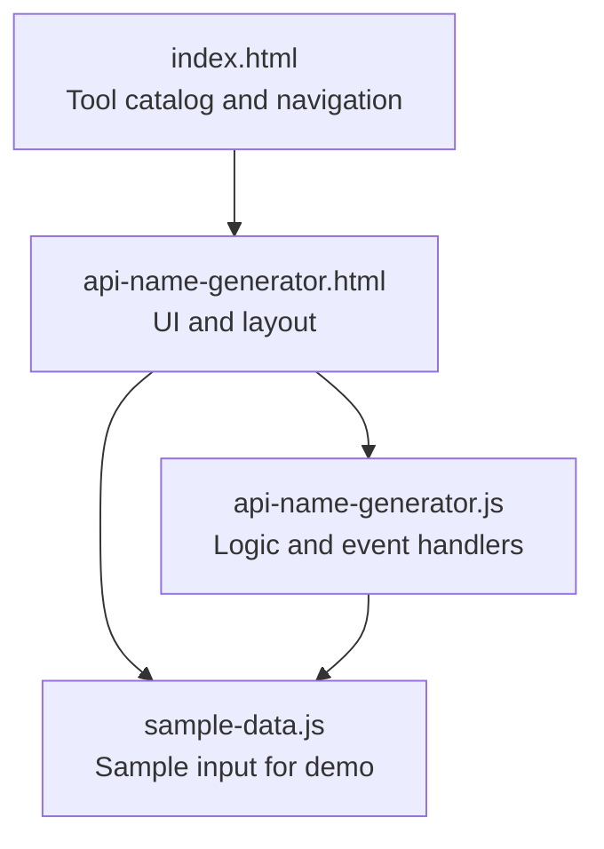
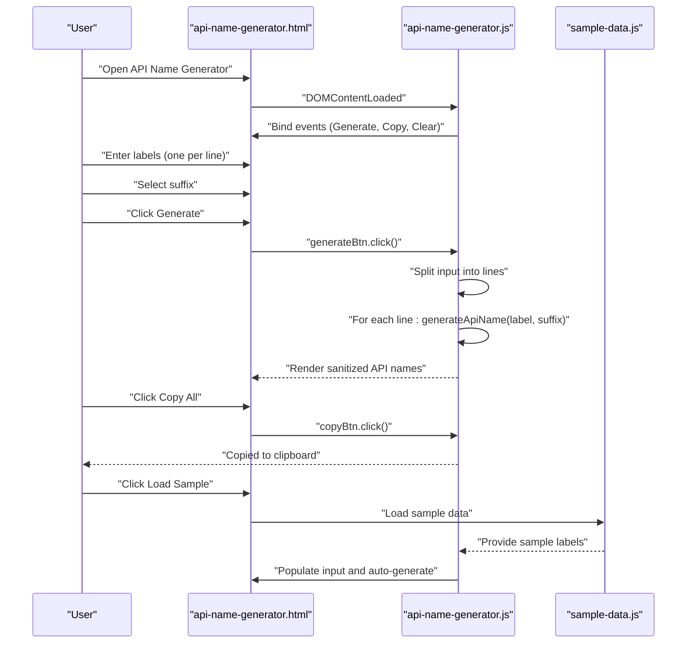
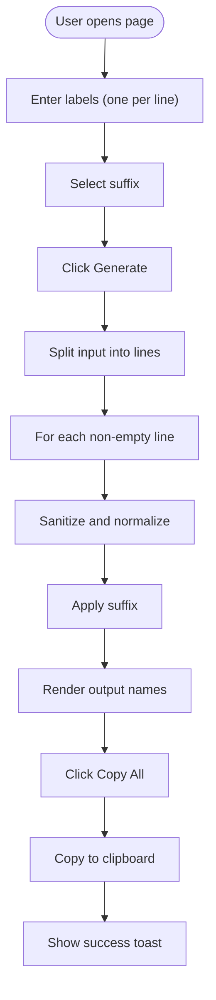
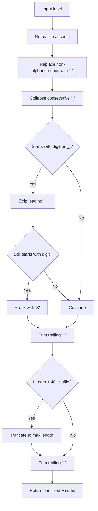
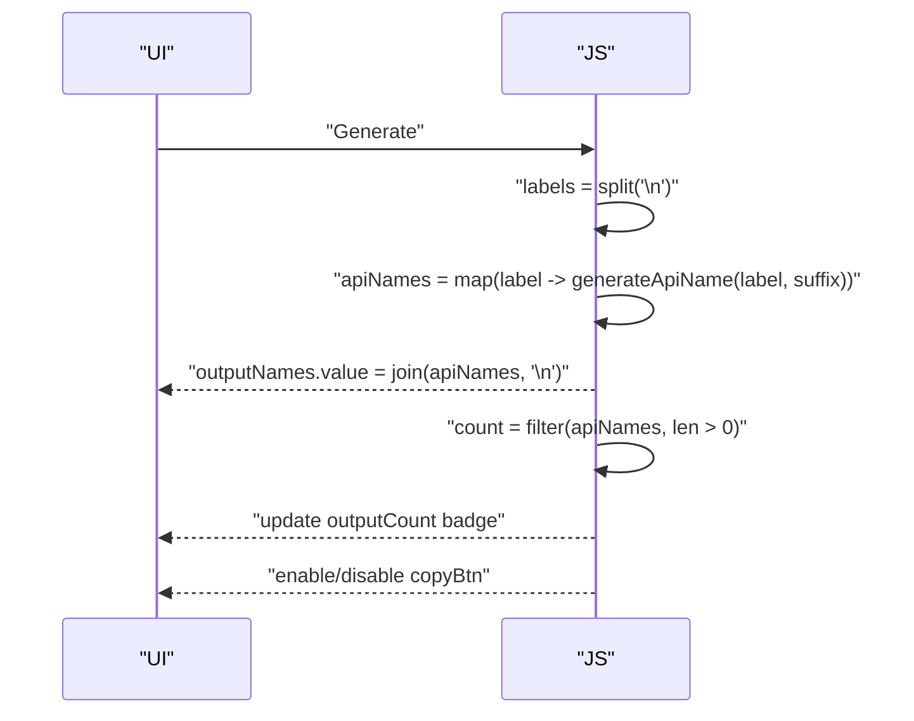
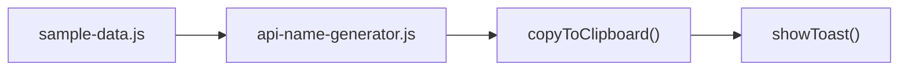
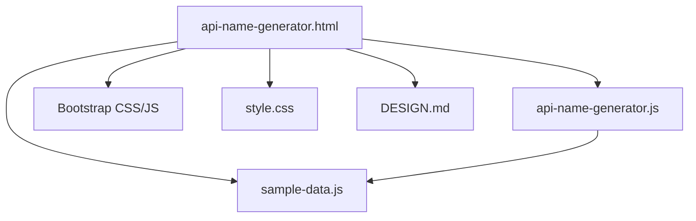

# API Name Generator

<cite>
**Referenced Files in This Document**
- [api-name-generator.html](file://api-name-generator.html)
- [api-name-generator.js](file://api-name-generator.js)
- [sample-data.js](file://sample-data.js)
- [index.html](file://index.html)
- [README.md](file://README.md)
- [DESIGN.md](file://DESIGN.md)
</cite>

## Table of Contents
1. [Introduction](#introduction)
2. [Project Structure](#project-structure)
3. [Core Components](#core-components)
4. [Architecture Overview](#architecture-overview)
5. [Detailed Component Analysis](#detailed-component-analysis)
6. [Dependency Analysis](#dependency-analysis)
7. [Performance Considerations](#performance-considerations)
8. [Troubleshooting Guide](#troubleshooting-guide)
9. [Conclusion](#conclusion)
10. [Appendices](#appendices)

## Introduction
The API Name Generator is a browser-based utility that converts human-friendly labels (for example, “Customer First Name”) into valid Salesforce API names. It supports batch processing of multiple labels, automatic sanitization of input, suffix selection for different entity types, and real-time feedback on counts and copy actions. The tool enforces Salesforce API name restrictions such as allowed characters, length limits, and prohibited prefixes, ensuring generated names are compliant for use in custom fields, custom objects, platform events, and metadata types.

## Project Structure
The API Name Generator is implemented as a standalone HTML page with embedded JavaScript logic and a small set of shared assets. It integrates with a centralized sample data module for demonstration and is linked from the main index page.

**Diagram sources**
- [index.html:173-187](file://index.html#L173-L187)
- [api-name-generator.html:1-107](file://api-name-generator.html#L1-L107)
- [api-name-generator.js:1-221](file://api-name-generator.js#L1-L221)
- [sample-data.js:1-69](file://sample-data.js#L1-L69)

**Section sources**
- [index.html:173-187](file://index.html#L173-L187)
- [api-name-generator.html:1-107](file://api-name-generator.html#L1-L107)
- [api-name-generator.js:1-221](file://api-name-generator.js#L1-L221)
- [sample-data.js:1-69](file://sample-data.js#L1-L69)

## Core Components
- Input panel: Multi-line text area for labels, with a counter and sample loader.
- Suffix selector: Dropdown to choose the API suffix for the generated names.
- Generate button: Triggers batch processing of labels into API names.
- Output panel: Displays sanitized and validated API names, with a copy-all action.
- Clipboard utilities: Copy-to-clipboard with toast notifications.

Key behaviors:
- Batch generation: Each non-empty line is processed independently.
- Sanitization pipeline: Normalizes accents, replaces non-alphanumeric characters with underscores, removes consecutive underscores, trims trailing underscores, and ensures the name does not start with a number or underscore.
- Length enforcement: Enforces a maximum length of 40 characters including the selected suffix.
- Suffix application: Appends the chosen suffix to each sanitized name.

**Section sources**
- [api-name-generator.html:41-98](file://api-name-generator.html#L41-L98)
- [api-name-generator.js:40-114](file://api-name-generator.js#L40-L114)

## Architecture Overview
The tool follows a simple client-side architecture: the HTML page defines the UI, the JavaScript handles user interactions and performs the generation logic, and the sample data module supplies example inputs.

**Diagram sources**
- [api-name-generator.html:1-107](file://api-name-generator.html#L1-L107)
- [api-name-generator.js:1-221](file://api-name-generator.js#L1-L221)
- [sample-data.js:1-69](file://sample-data.js#L1-L69)

## Detailed Component Analysis

### UI and Interaction Flow
- Input area: Supports multi-line labels; real-time count updates show the number of non-empty lines.
- Suffix selector: Provides options for custom fields, standard, relationship fields, custom metadata types, and platform events.
- Generate button: Processes all labels, applies sanitization and suffix, and writes results to the output area.
- Copy button: Copies all generated names to the clipboard with a success toast notification.
- Clear button: Resets both input and output areas and disables copy.

**Diagram sources**
- [api-name-generator.html:41-98](file://api-name-generator.html#L41-L98)
- [api-name-generator.js:40-114](file://api-name-generator.js#L40-L114)

**Section sources**
- [api-name-generator.html:41-98](file://api-name-generator.html#L41-L98)
- [api-name-generator.js:40-114](file://api-name-generator.js#L40-L114)

### Sanitization and Validation Pipeline
The core generation function applies a deterministic sequence of transformations to each label:

1. Accent normalization: Converts accented characters to basic Latin equivalents.
2. Non-alphanumeric replacement: Replaces spaces, symbols, and hyphens with underscores.
3. Consecutive underscore removal: Ensures only single underscores remain.
4. Leading character enforcement: Removes leading underscores and prefixes with a safe character if the name starts with a digit.
5. Trailing underscore removal: Ensures the name does not end with an underscore.
6. Length enforcement: Caps the total length to 40 characters minus the suffix length.

**Diagram sources**
- [api-name-generator.js:78-113](file://api-name-generator.js#L78-L113)

**Section sources**
- [api-name-generator.js:78-113](file://api-name-generator.js#L78-L113)

### Batch Generation and Feedback
- Batch processing: Each non-empty line is processed independently; empty lines produce empty outputs.
- Count feedback: Both input and output panels show item counts reflecting non-empty entries.
- Copy feedback: Copy button is enabled only when there are generated names.

**Diagram sources**
- [api-name-generator.js:40-59](file://api-name-generator.js#L40-L59)

**Section sources**
- [api-name-generator.js:40-59](file://api-name-generator.js#L40-L59)

### Example Input/Output Mapping
Below are representative examples derived from the sample data and the sanitization rules. These demonstrate how various input formats are transformed into valid API names.

- Input: “First Name”
  - Output: “FirstName” (underscores removed; no suffix)
- Input: “Last Name”
  - Output: “LastName” (underscores removed; no suffix)
- Input: “Annual Revenue (%)”
  - Output: “Annual_Revenue” (special characters replaced with underscores; no suffix)
- Input: “Is Active?”
  - Output: “Is_Active” (special characters replaced with underscores; no suffix)
- Input: “123 Street Address”
  - Output: “X123_Street_Address” (leading digits prefixed with X; underscores normalized; no suffix)
- Input: “A very long field name that exceeds the forty character limit by quite a lot”
  - Output: “A_very_long_field_name_that_exceeds_the_forty_character_limit_by_qu” (truncated to fit 40-char limit; suffix not included in limit calculation)

Notes:
- Suffixes are appended after sanitization. For example, selecting “Custom Field (__c)” would append “__c” to each sanitized name.
- The maximum length is enforced after suffix application.

**Section sources**
- [sample-data.js:61](file://sample-data.js#L61)
- [api-name-generator.js:103-113](file://api-name-generator.js#L103-L113)

### Integration with Shared Utilities
- Sample data integration: The sample loader injects pre-defined labels and sets a default suffix for quick demonstrations.
- Clipboard utilities: A reusable copy-to-clipboard function with graceful fallback and toast notifications enhances UX.

**Diagram sources**
- [sample-data.js:1-69](file://sample-data.js#L1-L69)
- [api-name-generator.js:182-220](file://api-name-generator.js#L182-L220)

**Section sources**
- [sample-data.js:1-69](file://sample-data.js#L1-L69)
- [api-name-generator.js:182-220](file://api-name-generator.js#L182-L220)

## Dependency Analysis
- Internal dependencies:
  - api-name-generator.html depends on api-name-generator.js for behavior and on sample-data.js for sample input.
  - api-name-generator.js depends on sample-data.js for sample data and on the browser APIs for clipboard and DOM manipulation.
- External dependencies:
  - Bootstrap CSS and icons for UI styling and icons.
  - Local styles via style.css and design tokens defined in DESIGN.md.

**Diagram sources**
- [api-name-generator.html:1-107](file://api-name-generator.html#L1-L107)
- [api-name-generator.js:1-221](file://api-name-generator.js#L1-L221)
- [sample-data.js:1-69](file://sample-data.js#L1-L69)
- [DESIGN.md:1-202](file://DESIGN.md#L1-L202)

**Section sources**
- [api-name-generator.html:1-107](file://api-name-generator.html#L1-L107)
- [api-name-generator.js:1-221](file://api-name-generator.js#L1-L221)
- [sample-data.js:1-69](file://sample-data.js#L1-L69)
- [DESIGN.md:1-202](file://DESIGN.md#L1-L202)

## Performance Considerations
- Batch processing: The tool processes each line independently; performance scales linearly with the number of lines.
- Clipboard operations: Uses the modern Clipboard API with a fallback to execCommand for broader compatibility.
- DOM updates: Minimal DOM manipulation; counts and output are updated after processing completes.
- Input limits: While not enforced by the tool itself, users should keep input sizes reasonable to avoid UI sluggishness.

[No sources needed since this section provides general guidance]

## Troubleshooting Guide
Common issues and resolutions:
- Empty output after generation:
  - Cause: No non-empty lines were entered.
  - Resolution: Ensure each label occupies a separate non-empty line.
- Generated names exceed 40 characters:
  - Cause: Exceeded the maximum length including the suffix.
  - Resolution: Shorten the label or remove unnecessary words; note that the suffix length reduces the available space.
- Names starting with a digit:
  - Cause: Original label started with a digit.
  - Resolution: The tool automatically prefixes with a safe character; review the output to confirm.
- Special characters not preserved:
  - Cause: Non-alphanumeric characters are replaced with underscores.
  - Resolution: Use letters and numbers; underscores are allowed and preserved as single underscores.
- Copy button disabled:
  - Cause: No generated names to copy.
  - Resolution: Generate names first, then copy.

**Section sources**
- [api-name-generator.js:78-113](file://api-name-generator.js#L78-L113)
- [api-name-generator.js:40-59](file://api-name-generator.js#L40-L59)

## Conclusion
The API Name Generator provides a fast, reliable way to transform labels into valid Salesforce API names while preserving usability and safety. Its sanitization pipeline enforces strict naming rules, supports batch processing, and integrates seamlessly with shared utilities for samples and clipboard operations. The tool’s design emphasizes clarity, accessibility, and local processing, aligning with the project’s privacy-first philosophy.

[No sources needed since this section summarizes without analyzing specific files]

## Appendices

### Salesforce API Name Restrictions Enforced by the Tool
- Allowed characters: Letters and digits only; all other characters are replaced with underscores.
- Leading character: Must not start with an underscore or digit; digits are prefixed with a safe character.
- Trailing character: Must not end with an underscore.
- Maximum length: 40 characters including the suffix; truncation occurs if exceeded.
- Suffixes: Supported suffixes include custom fields, standard, relationship fields, custom metadata types, and platform events.

**Section sources**
- [api-name-generator.js:78-113](file://api-name-generator.js#L78-L113)

### UI and Styling Context
- The tool adheres to the project’s design tokens and glassmorphic UI guidelines, ensuring consistent theming and accessibility.

**Section sources**
- [DESIGN.md:1-202](file://DESIGN.md#L1-L202)