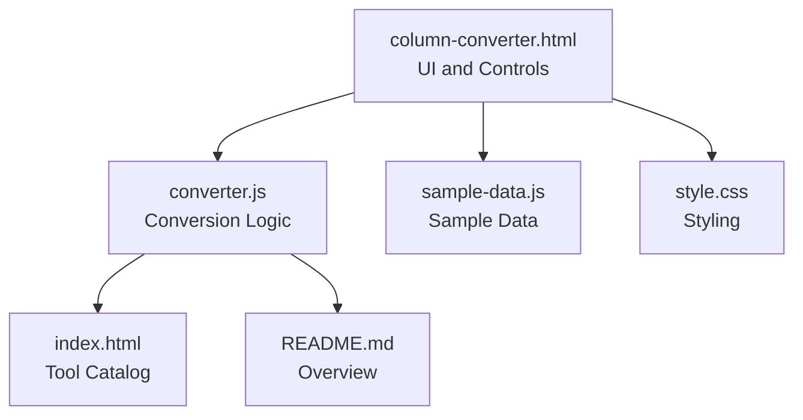
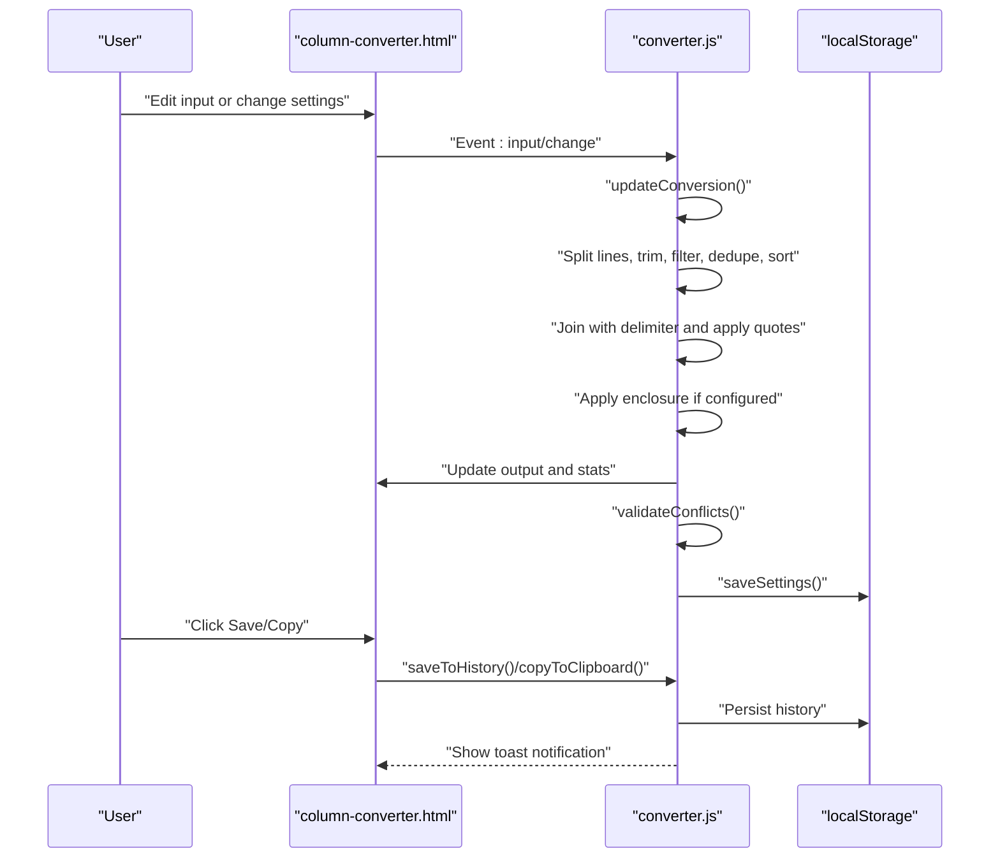
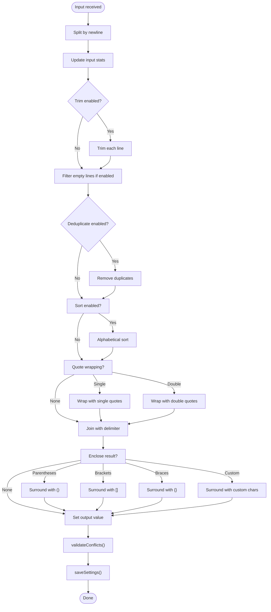
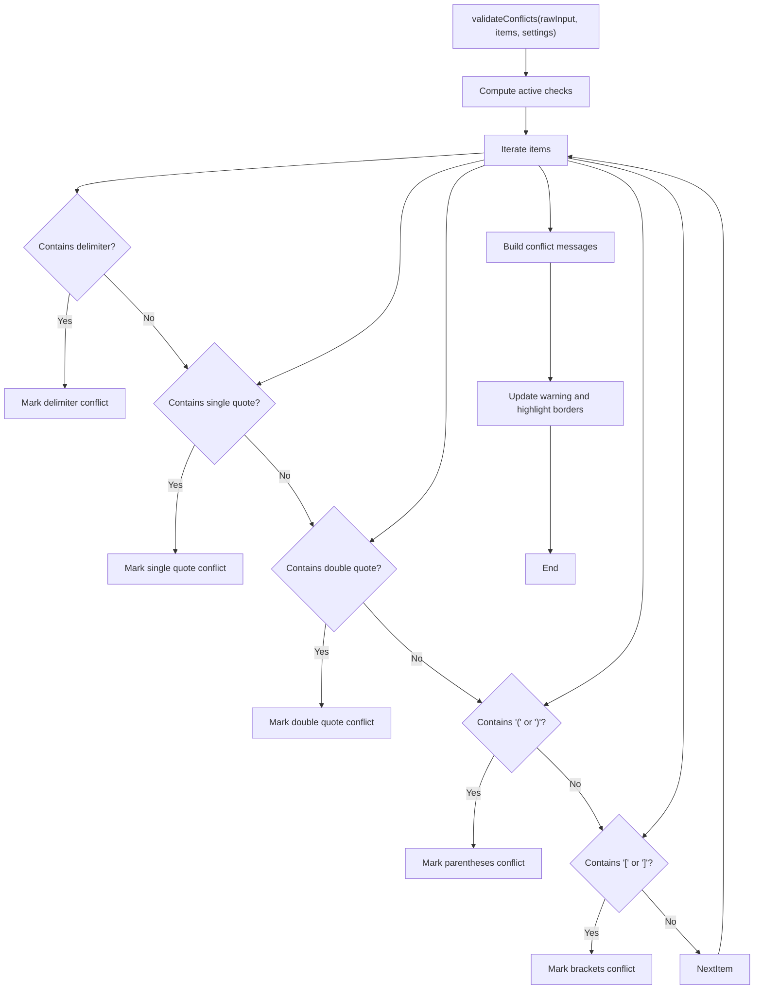
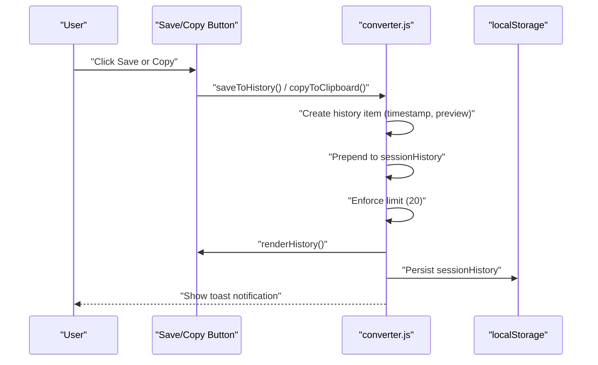
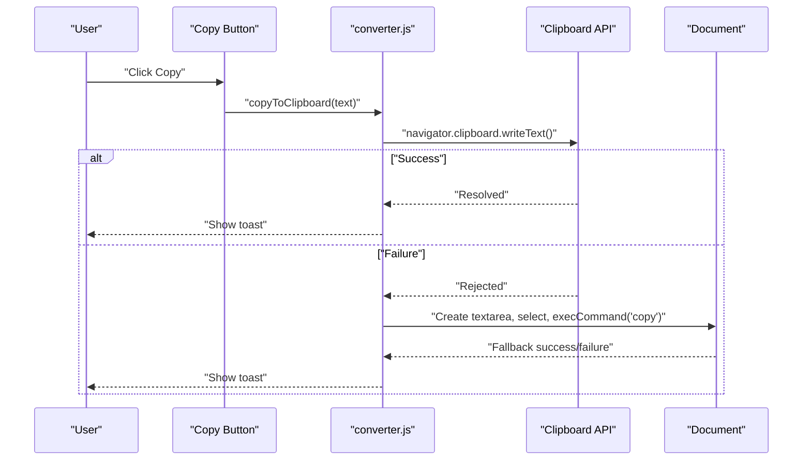
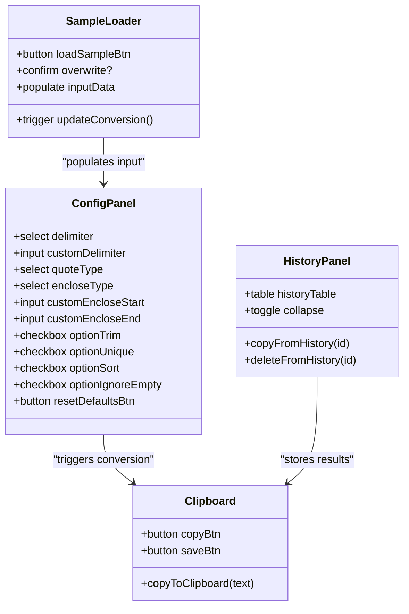
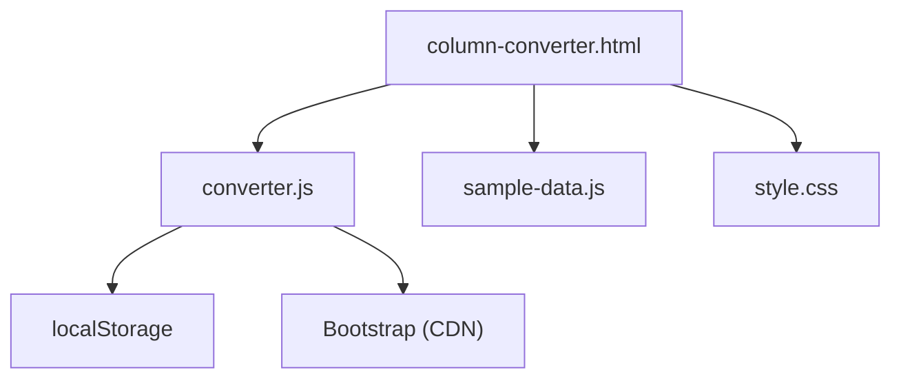

# Column to List Converter

<cite>
**Referenced Files in This Document**
- [column-converter.html](file://column-converter.html)
- [converter.js](file://converter.js)
- [sample-data.js](file://sample-data.js)
- [README.md](file://README.md)
- [index.html](file://index.html)
- [style.css](file://style.css)
- [benchmarks/converter-quote-benchmark.js](file://benchmarks/converter-quote-benchmark.js)
</cite>

## Table of Contents
1. [Introduction](#introduction)
2. [Project Structure](#project-structure)
3. [Core Components](#core-components)
4. [Architecture Overview](#architecture-overview)
5. [Detailed Component Analysis](#detailed-component-analysis)
6. [Dependency Analysis](#dependency-analysis)
7. [Performance Considerations](#performance-considerations)
8. [Troubleshooting Guide](#troubleshooting-guide)
9. [Conclusion](#conclusion)
10. [Appendices](#appendices)

## Introduction
The Column to List Converter transforms multi-line column data into a single formatted list. It supports configurable delimiters (comma, semicolon, pipe, space, newline, and custom), optional quote wrapping (single quotes, double quotes, or none), enclosure options (parentheses, brackets, braces, or custom), and cleanup features (trimming whitespace, removing duplicates, sorting alphabetically, and ignoring empty lines). The tool provides real-time validation, sample data loading, session history, and clipboard integration for seamless workflows.

## Project Structure
The Column to List Converter is implemented as a standalone HTML page with embedded JavaScript logic and a shared stylesheet. It integrates with a centralized sample data module and uses Bootstrap for layout and components.

**Diagram sources**
- [column-converter.html:1-226](file://column-converter.html#L1-L226)
- [converter.js:1-507](file://converter.js#L1-L507)
- [sample-data.js:1-69](file://sample-data.js#L1-L69)
- [style.css:1-293](file://style.css#L1-L293)
- [index.html:1-406](file://index.html#L1-L406)
- [README.md:1-63](file://README.md#L1-L63)

**Section sources**
- [column-converter.html:1-226](file://column-converter.html#L1-L226)
- [converter.js:1-507](file://converter.js#L1-L507)
- [sample-data.js:1-69](file://sample-data.js#L1-L69)
- [style.css:1-293](file://style.css#L1-L293)
- [index.html:1-406](file://index.html#L1-L406)
- [README.md:1-63](file://README.md#L1-L63)

## Core Components
- Input area for column data with sample loading and clearing.
- Configuration panel for delimiter selection, quote wrapping, enclosure, and cleanup options.
- Real-time conversion output with statistics and validation warnings.
- Session history panel with copy/delete actions.
- Clipboard integration for saving and copying results.

Key capabilities:
- Delimiter configuration: comma, semicolon, pipe, space, newline, and custom delimiter.
- Quote wrapping: single quotes, double quotes, or no wrapping.
- Enclosure: parentheses, brackets, braces, or custom start/end enclosures.
- Cleanup: trim whitespace, remove duplicates, sort alphabetically, ignore empty lines.
- Real-time validation highlighting potential formatting conflicts.
- Sample data loader and defaults reset.
- History tracking with local storage persistence.
- Clipboard integration with fallback support.

**Section sources**
- [column-converter.html:55-179](file://column-converter.html#L55-L179)
- [converter.js:68-152](file://converter.js#L68-L152)
- [converter.js:154-219](file://converter.js#L154-L219)
- [converter.js:271-413](file://converter.js#L271-L413)
- [converter.js:468-507](file://converter.js#L468-L507)
- [sample-data.js:4-12](file://sample-data.js#L4-L12)
- [README.md:8-12](file://README.md#L8-L12)

## Architecture Overview
The tool follows a reactive architecture: user interactions trigger immediate conversion updates. The conversion pipeline processes input lines through a series of transformations and produces a formatted output string with optional wrapping and enclosure.

**Diagram sources**
- [column-converter.html:32-62](file://column-converter.html#L32-L62)
- [converter.js:32-64](file://converter.js#L32-L64)
- [converter.js:68-152](file://converter.js#L68-L152)
- [converter.js:154-219](file://converter.js#L154-L219)
- [converter.js:221-269](file://converter.js#L221-L269)
- [converter.js:307-354](file://converter.js#L307-L354)
- [converter.js:468-507](file://converter.js#L468-L507)

## Detailed Component Analysis

### Conversion Pipeline
The conversion process is implemented in a single function that orchestrates splitting, cleaning, deduplication, sorting, quoting, and enclosure.

**Diagram sources**
- [converter.js:68-152](file://converter.js#L68-L152)
- [converter.js:154-219](file://converter.js#L154-L219)
- [converter.js:221-269](file://converter.js#L221-L269)

**Section sources**
- [converter.js:68-152](file://converter.js#L68-L152)
- [converter.js:154-219](file://converter.js#L154-L219)

### Real-Time Validation
The validator scans processed items for potential conflicts with selected delimiter and enclosure settings, highlighting the input and output areas when issues are detected.

**Diagram sources**
- [converter.js:154-219](file://converter.js#L154-L219)

**Section sources**
- [converter.js:154-219](file://converter.js#L154-L219)

### History Tracking
The history system maintains a recent list of results with timestamps and previews, supports copy and delete actions, and persists data locally.

**Diagram sources**
- [converter.js:307-354](file://converter.js#L307-L354)
- [converter.js:368-413](file://converter.js#L368-L413)
- [converter.js:271-276](file://converter.js#L271-L276)

**Section sources**
- [converter.js:307-354](file://converter.js#L307-L354)
- [converter.js:368-413](file://converter.js#L368-L413)
- [converter.js:271-276](file://converter.js#L271-L276)

### Clipboard Integration
Clipboard integration uses the modern Clipboard API with a fallback to a temporary textarea for older browsers.

**Diagram sources**
- [converter.js:468-507](file://converter.js#L468-L507)

**Section sources**
- [converter.js:468-507](file://converter.js#L468-L507)

### UI Controls and Options
The configuration panel exposes all conversion options with dynamic visibility for custom inputs.

**Diagram sources**
- [column-converter.html:85-157](file://column-converter.html#L85-L157)
- [column-converter.html:181-215](file://column-converter.html#L181-L215)
- [converter.js:22-30](file://converter.js#L22-L30)
- [converter.js:271-284](file://converter.js#L271-L284)
- [converter.js:356-366](file://converter.js#L356-L366)

**Section sources**
- [column-converter.html:85-157](file://column-converter.html#L85-L157)
- [column-converter.html:181-215](file://column-converter.html#L181-L215)
- [converter.js:22-30](file://converter.js#L22-L30)
- [converter.js:271-284](file://converter.js#L271-L284)
- [converter.js:356-366](file://converter.js#L356-L366)

## Dependency Analysis
The tool’s dependencies are minimal and self-contained:
- HTML page defines UI and binds events.
- JavaScript handles conversion, validation, persistence, history, and clipboard.
- Sample data module provides pre-filled content.
- Stylesheet defines theming and responsive layout.
- No third-party libraries are used; relies on native APIs and Bootstrap for UI.

**Diagram sources**
- [column-converter.html:1-226](file://column-converter.html#L1-L226)
- [converter.js:1-507](file://converter.js#L1-L507)
- [sample-data.js:1-69](file://sample-data.js#L1-L69)
- [style.css:1-293](file://style.css#L1-L293)

**Section sources**
- [column-converter.html:1-226](file://column-converter.html#L1-L226)
- [converter.js:1-507](file://converter.js#L1-L507)
- [sample-data.js:1-69](file://sample-data.js#L1-L69)
- [style.css:1-293](file://style.css#L1-L293)

## Performance Considerations
- The conversion pipeline is optimized to minimize intermediate allocations and early exits when conflicts are detected.
- Sorting is lexicographical and performed only when enabled.
- Deduplication uses a set-based approach for O(n) uniqueness checks.
- The benchmark script demonstrates a significant improvement in joining with quotes by constructing the joined string in one operation rather than mapping then joining.

Practical tips:
- Prefer enabling deduplication and sorting only when needed to reduce overhead.
- Use “Ignore Empty Lines” to reduce processing volume.
- Choose simpler delimiters and enclosures for very large inputs.

**Section sources**
- [converter.js:68-152](file://converter.js#L68-L152)
- [benchmarks/converter-quote-benchmark.js:1-62](file://benchmarks/converter-quote-benchmark.js#L1-L62)

## Troubleshooting Guide
Common issues and resolutions:
- Conflicting delimiter: If the input contains the chosen delimiter, a warning highlights potential parsing issues. Adjust delimiter or clean the input.
- Quote conflicts: If items contain single or double quotes, consider changing quote wrapping or delimiter to avoid ambiguity.
- Enclosure conflicts: If items contain parentheses or brackets, choose a different enclosure or delimiter.
- Empty output: Ensure input lines are not all empty and “Ignore Empty Lines” is configured appropriately.
- Clipboard failures: The tool falls back to a textarea-based copy when the Clipboard API is unavailable. Verify browser permissions and HTTPS context.

**Section sources**
- [converter.js:154-219](file://converter.js#L154-L219)
- [converter.js:468-507](file://converter.js#L468-L507)

## Conclusion
The Column to List Converter provides a fast, flexible, and secure way to transform columnar data into formatted lists. Its real-time conversion, validation, and clipboard integration streamline workflows, while history tracking and sample data loading improve usability. The tool’s minimal dependencies and client-side processing ensure privacy and portability.

## Appendices

### Practical Examples
Below are example scenarios demonstrating how the tool transforms input data under various configurations. Replace placeholders with your own data and adjust options as needed.

- Example A: Basic comma-separated list
  - Input: Multiple lines of company names
  - Settings: Delimiter = comma, Quote wrapping = single quotes, Enclose = none, Trim = enabled, Remove duplicates = disabled, Sort = disabled, Ignore empty = enabled
  - Output: A comma-separated list with single quotes around each item

- Example B: Semicolon-delimited with double quotes
  - Input: Product categories
  - Settings: Delimiter = semicolon, Quote wrapping = double quotes, Enclose = none, Trim = enabled, Remove duplicates = enabled, Sort = enabled, Ignore empty = enabled
  - Output: A semicolon-delimited list with double quotes around each item, deduplicated and sorted

- Example C: Pipe-delimited with parentheses
  - Input: Country codes
  - Settings: Delimiter = pipe, Quote wrapping = none, Enclose = parentheses, Trim = enabled, Remove duplicates = enabled, Sort = disabled, Ignore empty = enabled
  - Output: A pipe-delimited list enclosed in parentheses

- Example D: Space-delimited with custom enclosure
  - Input: Tags
  - Settings: Delimiter = space, Quote wrapping = none, Enclose = custom (start="[", end="]"), Trim = enabled, Remove duplicates = enabled, Sort = enabled, Ignore empty = enabled
  - Output: A space-delimited list enclosed in square brackets

- Example E: Newline delimiter with single quotes
  - Input: Names
  - Settings: Delimiter = newline, Quote wrapping = single quotes, Enclose = none, Trim = enabled, Remove duplicates = enabled, Sort = enabled, Ignore empty = enabled
  - Output: A newline-delimited list with single quotes around each item

- Example F: Custom delimiter and enclosure
  - Input: Email addresses
  - Settings: Delimiter = custom (e.g., “ | ”), Quote wrapping = double quotes, Enclose = custom (start="(", end=")"), Trim = enabled, Remove duplicates = enabled, Sort = enabled, Ignore empty = enabled
  - Output: A custom-delimited list with double quotes around each item and custom parentheses around the entire result

Notes:
- Use the “Load Sample” button to quickly populate the input with realistic sample data.
- Use “Load Defaults” to reset to a safe combination of comma delimiter, single quotes, and no enclosure.
- Use “Save” or “Copy” to persist or copy results to the clipboard, and review them in the history panel.

**Section sources**
- [sample-data.js:4-12](file://sample-data.js#L4-L12)
- [column-converter.html:73-81](file://column-converter.html#L73-L81)
- [column-converter.html:153-156](file://column-converter.html#L153-L156)
- [converter.js:341-354](file://converter.js#L341-L354)
- [converter.js:356-366](file://converter.js#L356-L366)