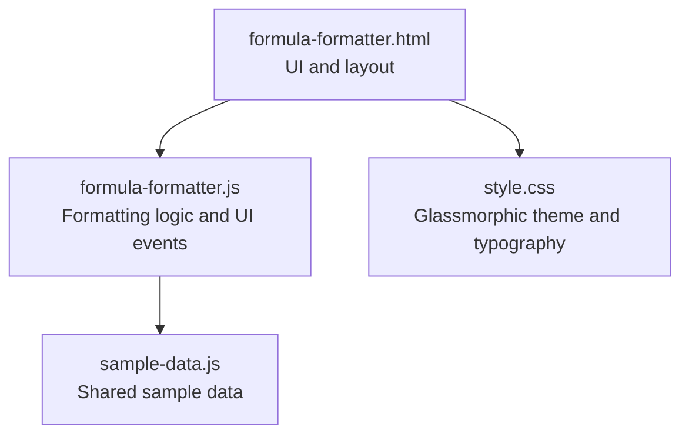
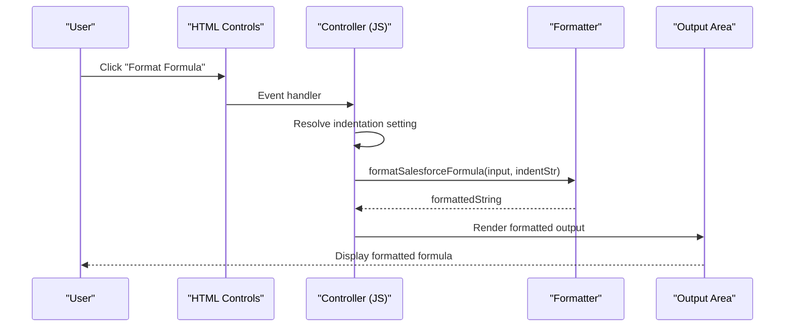
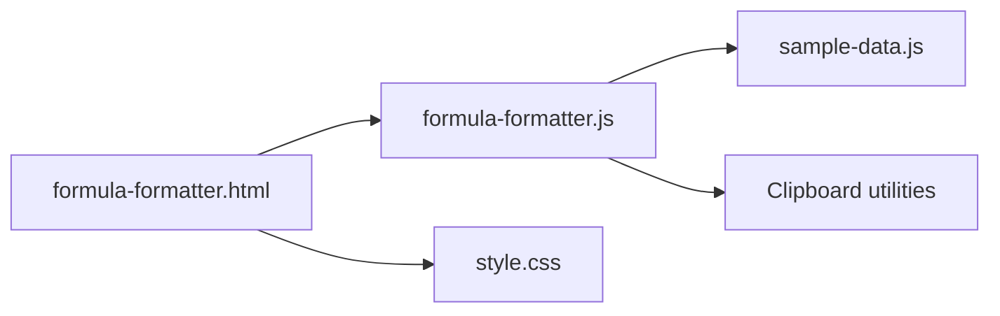

# Formula Formatter

<cite>
**Referenced Files in This Document**
- [formula-formatter.html](file://formula-formatter.html)
- [formula-formatter.js](file://formula-formatter.js)
- [sample-data.js](file://sample-data.js)
- [style.css](file://style.css)
- [README.md](file://README.md)
</cite>

## Table of Contents
1. [Introduction](#introduction)
2. [Project Structure](#project-structure)
3. [Core Components](#core-components)
4. [Architecture Overview](#architecture-overview)
5. [Detailed Component Analysis](#detailed-component-analysis)
6. [Dependency Analysis](#dependency-analysis)
7. [Performance Considerations](#performance-considerations)
8. [Troubleshooting Guide](#troubleshooting-guide)
9. [Conclusion](#conclusion)
10. [Appendices](#appendices)

## Introduction
The Formula Formatter is a client-side tool designed to format and indent Salesforce formula fields. It transforms compact, single-line formulas into readable, structured layouts with configurable indentation and line breaks. The tool emphasizes:
- Real-time formatting on button click
- Configurable indentation (spaces or tabs)
- Parentheses-aware indentation and line breaks
- String literal preservation during formatting
- Copy-to-clipboard and download capabilities

Unlike tools that validate syntax or detect errors, this formatter focuses purely on structure and presentation. It cleans up spacing, respects quoted strings, and applies indentation based on nesting depth.

## Project Structure
The Formula Formatter consists of a minimal HTML page, a JavaScript controller, and a shared sample dataset. Styling is centralized in a CSS file.

**Diagram sources**
- [formula-formatter.html:1-108](file://formula-formatter.html#L1-L108)
- [formula-formatter.js:1-211](file://formula-formatter.js#L1-L211)
- [sample-data.js:1-69](file://sample-data.js#L1-L69)
- [style.css:1-293](file://style.css#L1-L293)

**Section sources**
- [formula-formatter.html:1-108](file://formula-formatter.html#L1-L108)
- [formula-formatter.js:1-211](file://formula-formatter.js#L1-L211)
- [sample-data.js:1-69](file://sample-data.js#L1-L69)
- [style.css:1-293](file://style.css#L1-L293)

## Core Components
- UI container and layout: The HTML page defines two panels (input and output), controls for indentation selection, and action buttons.
- Formatting engine: A single function performs cleaning, scanning, and indentation while preserving string literals.
- Clipboard and persistence helpers: Reusable functions for copying text and showing notifications.
- Sample data: A shared dataset includes a representative Salesforce formula for quick testing.

Key responsibilities:
- Input capture and event wiring
- Indentation configuration resolution
- Formula formatting pipeline
- Output rendering and export

**Section sources**
- [formula-formatter.html:38-99](file://formula-formatter.html#L38-L99)
- [formula-formatter.js:27-42](file://formula-formatter.js#L27-L42)
- [formula-formatter.js:76-126](file://formula-formatter.js#L76-L126)
- [sample-data.js:63-63](file://sample-data.js#L63-L63)

## Architecture Overview
The tool follows a straightforward client-side architecture:
- UI layer (HTML) renders controls and text areas
- Controller layer (JavaScript) wires events and invokes formatting
- Formatting layer (algorithm) transforms the input into a formatted output
- Clipboard utilities (shared) support copy and notifications

**Diagram sources**
- [formula-formatter.html:54-96](file://formula-formatter.html#L54-L96)
- [formula-formatter.js:27-42](file://formula-formatter.js#L27-L42)
- [formula-formatter.js:76-126](file://formula-formatter.js#L76-L126)

## Detailed Component Analysis

### UI and Controls
- Input panel: Text area for raw formula input, sample loader, and clear button.
- Output panel: Read-only text area for formatted output, copy and save buttons.
- Indentation selector: Options for 2-space, 4-space, or tab indentation.
- Action buttons: Format, Copy, Save, and Load Sample.

Behavior highlights:
- Load Sample pre-fills the input with a known formula and triggers formatting.
- Clear resets both input and output and disables export buttons.
- Copy writes the formatted output to the clipboard with a toast notification.
- Save downloads the formatted output as a plain text file.

**Section sources**
- [formula-formatter.html:42-98](file://formula-formatter.html#L42-L98)
- [formula-formatter.js:12-23](file://formula-formatter.js#L12-L23)
- [formula-formatter.js:63-68](file://formula-formatter.js#L63-L68)
- [formula-formatter.js:57-61](file://formula-formatter.js#L57-L61)
- [formula-formatter.js:44-55](file://formula-formatter.js#L44-L55)

### Formatting Engine
The core algorithm:
- Cleans input by removing line breaks and collapsing extra spaces.
- Iterates through characters while tracking:
  - Whether inside a quoted string
  - Current indentation level based on parentheses nesting
- Applies line breaks and indentation around parentheses and commas.
- Preserves spacing for operators and tokens except where removed for readability.
- Post-processes to remove empty lines and trim trailing whitespace.

Indentation rules:
- Increase indentation on opening parenthesis
- Decrease indentation on closing parenthesis
- Apply current indentation to comma-separated arguments
- Preserve indentation for subsequent arguments

Line break optimization:
- Places a newline before opening parenthesis and after closing parenthesis
- Ensures a newline after comma and aligns subsequent arguments

Code structure enhancement:
- Removes redundant spaces
- Normalizes spacing around operators and tokens
- Maintains quoted strings intact

Real-time formatting:
- Triggered by clicking the Format button
- Immediate rendering in the output area

Syntax validation and error detection:
- The formatter does not validate syntax or detect errors
- It treats all input as a single pass of structural formatting

Integration with converter utilities:
- The formatter shares the same clipboard utilities and toast notification system used across tools
- It reuses the shared sample data for quick testing

Best practices for readability:
- Prefer 4-space indentation for better readability in most contexts
- Keep function arguments aligned under the opening parenthesis
- Avoid unnecessary spaces around operators for compactness

Common formula patterns:
- Nested IF statements with multiple branches
- Logical operators combined with function calls
- Mixed quoted strings and numeric literals

Examples of before and after formatting:
- See the sample formula in the shared dataset for a representative complex formula.

**Section sources**
- [formula-formatter.js:76-126](file://formula-formatter.js#L76-L126)
- [sample-data.js:63-63](file://sample-data.js#L63-L63)

### Clipboard and Notifications
- Copy to clipboard: Uses the modern Clipboard API when available, with a fallback to execCommand.
- Toast notifications: Dynamically creates and shows a toast element with a success message.

**Section sources**
- [formula-formatter.js:172-210](file://formula-formatter.js#L172-L210)
- [formula-formatter.js:131-170](file://formula-formatter.js#L131-L170)

### Integration with Shared Utilities
- Clipboard helpers: Reused across tools for consistent UX.
- Toast system: Unified notification mechanism.
- Sample data: Centralized for quick testing across tools.

**Section sources**
- [formula-formatter.js:172-210](file://formula-formatter.js#L172-L210)
- [sample-data.js:1-69](file://sample-data.js#L1-L69)

## Dependency Analysis
The formatter depends on:
- HTML for UI structure and Bootstrap icons
- Shared sample data for quick testing
- Clipboard utilities and toast system for user feedback

**Diagram sources**
- [formula-formatter.html:104-105](file://formula-formatter.html#L104-L105)
- [formula-formatter.js:172-210](file://formula-formatter.js#L172-L210)
- [sample-data.js:1-69](file://sample-data.js#L1-L69)
- [style.css:1-293](file://style.css#L1-L293)

**Section sources**
- [formula-formatter.html:104-105](file://formula-formatter.html#L104-L105)
- [formula-formatter.js:172-210](file://formula-formatter.js#L172-L210)
- [sample-data.js:1-69](file://sample-data.js#L1-L69)
- [style.css:1-293](file://style.css#L1-L293)

## Performance Considerations
- Single-pass scanning: The formatter iterates through the cleaned input once, making it efficient for large formulas.
- Minimal memory allocation: Builds the result string incrementally without heavy intermediate structures.
- String literal preservation: Avoids expensive parsing by treating quoted segments as opaque blocks.
- Post-processing cleanup: A single regex removes extra blank lines and trims whitespace.

[No sources needed since this section provides general guidance]

## Troubleshooting Guide
Common issues and resolutions:
- Empty input: The formatter ignores blank input; ensure the input area contains a formula.
- Overwriting current input: Loading a sample will prompt confirmation; cancel to preserve current content.
- Copy/save disabled: Buttons are enabled only when there is formatted output.
- Unexpected spacing: The formatter collapses extra spaces; adjust indentation settings if needed.
- Quoted strings: The formatter preserves strings; ensure quotes are balanced in the original formula.

Operational tips:
- Use the Load Sample button to quickly test the formatter with a known formula.
- Switch indentation settings to improve readability for deeply nested formulas.
- Copy the formatted output to clipboard or save it as a file for later use.

**Section sources**
- [formula-formatter.js:12-23](file://formula-formatter.js#L12-L23)
- [formula-formatter.js:27-42](file://formula-formatter.js#L27-L42)
- [formula-formatter.js:57-61](file://formula-formatter.js#L57-L61)
- [formula-formatter.js:44-55](file://formula-formatter.js#L44-L55)

## Conclusion
The Formula Formatter provides a fast, client-side solution for transforming compact Salesforce formulas into readable, indented layouts. It focuses on structure and presentation rather than syntax validation, making it ideal for quick formatting tasks. Its integration with shared utilities ensures consistent UX across the developer utilities suite.

[No sources needed since this section summarizes without analyzing specific files]

## Appendices

### Example: Before and After Formatting
- See the sample formula in the shared dataset for a representative complex formula used for testing.

**Section sources**
- [sample-data.js:63-63](file://sample-data.js#L63-L63)

### Best Practices Checklist
- Choose 4-space indentation for readability
- Keep function arguments aligned under the opening parenthesis
- Avoid unnecessary spaces around operators
- Verify quotes are balanced in the original formula

[No sources needed since this section provides general guidance]