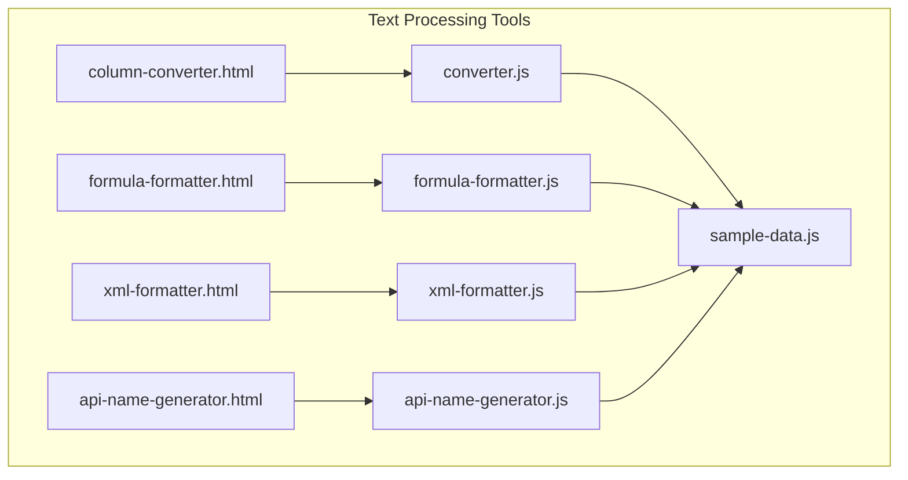
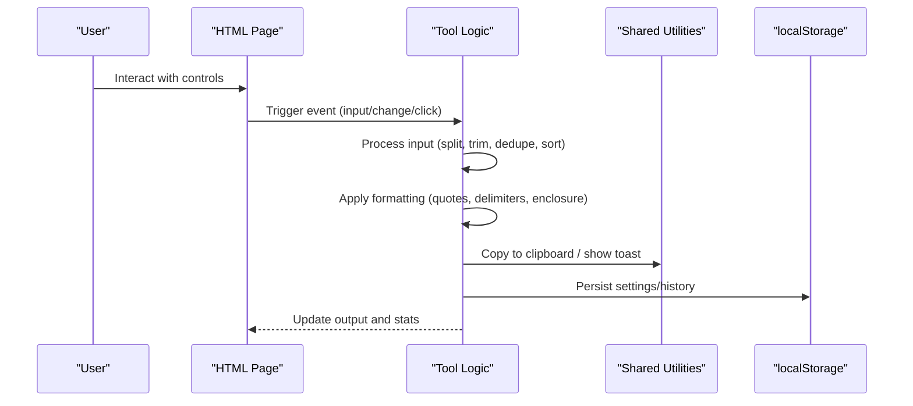
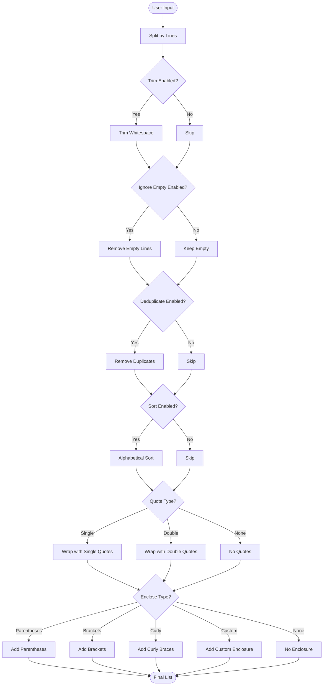
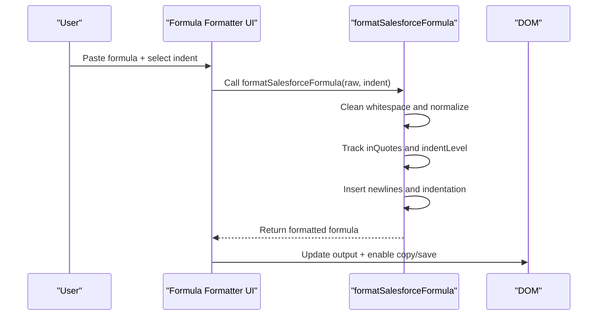
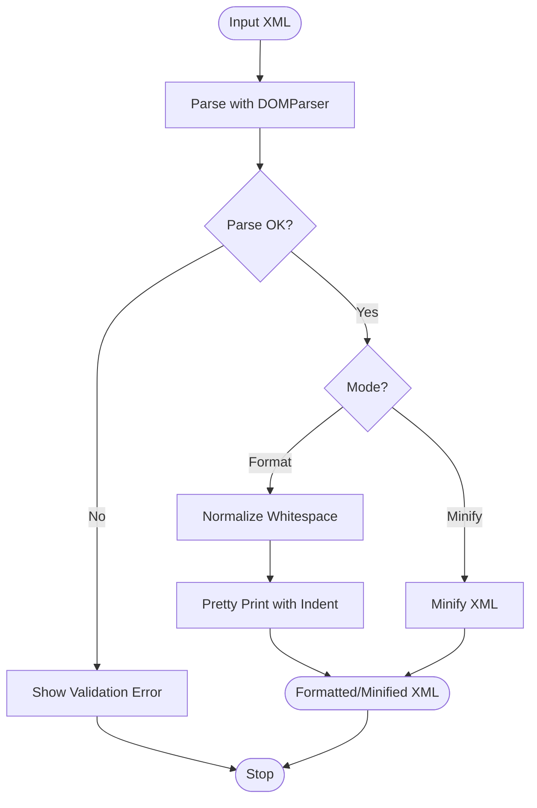
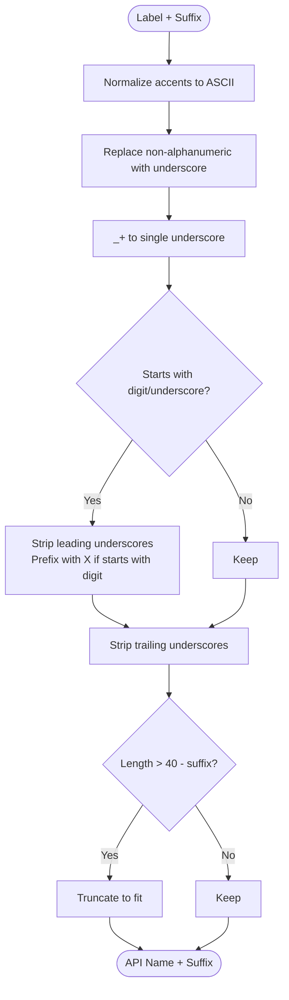
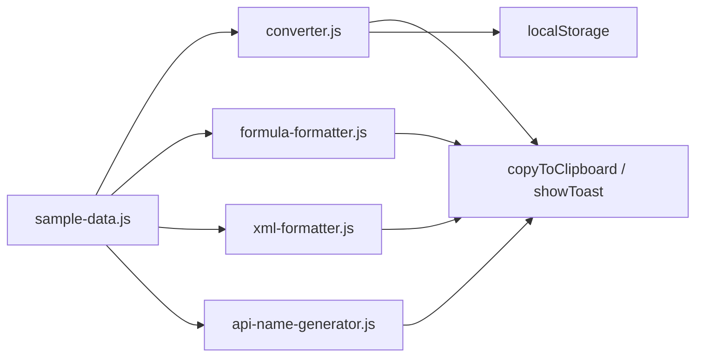

# Text Processing Tools

<cite>
**Referenced Files in This Document**
- [column-converter.html](file://column-converter.html)
- [converter.js](file://converter.js)
- [formula-formatter.html](file://formula-formatter.html)
- [formula-formatter.js](file://formula-formatter.js)
- [xml-formatter.html](file://xml-formatter.html)
- [xml-formatter.js](file://xml-formatter.js)
- [api-name-generator.html](file://api-name-generator.html)
- [api-name-generator.js](file://api-name-generator.js)
- [sample-data.js](file://sample-data.js)
- [benchmarks/converter-quote-benchmark.js](file://benchmarks/converter-quote-benchmark.js)
- [README.md](file://README.md)
- [package.json](file://package.json)
</cite>

## Table of Contents
1. [Introduction](#introduction)
2. [Project Structure](#project-structure)
3. [Core Components](#core-components)
4. [Architecture Overview](#architecture-overview)
5. [Detailed Component Analysis](#detailed-component-analysis)
6. [Dependency Analysis](#dependency-analysis)
7. [Performance Considerations](#performance-considerations)
8. [Troubleshooting Guide](#troubleshooting-guide)
9. [Conclusion](#conclusion)
10. [Appendices](#appendices)

## Introduction
This document provides comprehensive documentation for the text processing utilities suite focused on:
- Column to List Converter: delimiter options, quote wrapping, deduplication, sorting, and conflict detection
- Formula Formatter: Salesforce formula syntax highlighting and formatting rules
- XML Formatter: auto-indent options and minification capabilities
- API Name Generator: Salesforce field naming conventions and validation rules

It also covers shared converter utilities and text processing algorithms used across these tools, including real-time validation, sample data usage, and practical examples.

## Project Structure
The suite consists of standalone HTML pages with associated JavaScript logic and a centralized sample data module. Each tool is self-contained with its own UI and processing logic, while sharing common clipboard utilities and persistence mechanisms.

**Diagram sources**
- [column-converter.html](file://column-converter.html)
- [converter.js](file://converter.js)
- [formula-formatter.html](file://formula-formatter.html)
- [formula-formatter.js](file://formula-formatter.js)
- [xml-formatter.html](file://xml-formatter.html)
- [xml-formatter.js](file://xml-formatter.js)
- [api-name-generator.html](file://api-name-generator.html)
- [api-name-generator.js](file://api-name-generator.js)
- [sample-data.js](file://sample-data.js)

**Section sources**
- [README.md:1-63](file://README.md#L1-L63)
- [package.json:1-25](file://package.json#L1-L25)

## Core Components
- Column to List Converter: transforms multi-line input into a delimited list with optional quoting, enclosure, deduplication, sorting, and whitespace trimming. It includes conflict detection to warn about potential delimiter or quote collisions.
- Formula Formatter: formats Salesforce formulas by removing extra whitespace, adding indentation based on parentheses depth, and handling logical operators and commas.
- XML Formatter: provides pretty-print formatting and minification for XML with configurable indentation and robust error handling for invalid XML.
- API Name Generator: converts human-readable labels into valid Salesforce API names with suffix support and strict length constraints.

**Section sources**
- [column-converter.html:55-179](file://column-converter.html#L55-L179)
- [converter.js:68-152](file://converter.js#L68-L152)
- [formula-formatter.html:38-99](file://formula-formatter.html#L38-L99)
- [formula-formatter.js:76-126](file://formula-formatter.js#L76-L126)
- [xml-formatter.html:61-133](file://xml-formatter.html#L61-L133)
- [xml-formatter.js:73-113](file://xml-formatter.js#L73-L113)
- [api-name-generator.html:38-99](file://api-name-generator.html#L38-L99)
- [api-name-generator.js:40-113](file://api-name-generator.js#L40-L113)

## Architecture Overview
Each tool follows a consistent pattern:
- HTML page defines the UI and binds events to JavaScript handlers
- JavaScript handles real-time processing, validation, persistence, and clipboard operations
- Shared utilities (clipboard, toasts) are reused across tools
- Sample data is centrally managed for quick testing

**Diagram sources**
- [converter.js:32-42](file://converter.js#L32-L42)
- [formula-formatter.js:27-42](file://formula-formatter.js#L27-L42)
- [xml-formatter.js:34-66](file://xml-formatter.js#L34-L66)
- [api-name-generator.js:40-59](file://api-name-generator.js#L40-L59)

## Detailed Component Analysis

### Column to List Converter
- Delimiter options: comma, semicolon, pipe, space, newline, or custom delimiter
- Quote wrapping: none, single quotes, or double quotes
- Enclosure: parentheses, brackets, curly braces, or custom pair
- Cleanup options: trim whitespace, remove duplicates, sort alphabetically, ignore empty lines
- Real-time validation: detects conflicts with delimiter and quotes in input
- Persistence: saves settings to localStorage and maintains a session history panel
- Clipboard utilities: copy and save to history with visual feedback

**Diagram sources**
- [converter.js:68-152](file://converter.js#L68-L152)

**Section sources**
- [column-converter.html:88-157](file://column-converter.html#L88-L157)
- [converter.js:68-152](file://converter.js#L68-L152)
- [converter.js:154-219](file://converter.js#L154-L219)
- [converter.js:221-266](file://converter.js#L221-L266)
- [converter.js:271-413](file://converter.js#L271-L413)
- [sample-data.js:4-12](file://sample-data.js#L4-L12)

#### Conflict Detection
- Scans processed items for delimiter and quote conflicts
- Updates UI with warnings and visual indicators
- Uses early exit optimization to minimize iterations

**Section sources**
- [converter.js:154-219](file://converter.js#L154-L219)

#### Settings Persistence and History
- Saves and restores settings to/from localStorage
- Maintains a session history with preview and actions
- Provides defaults reset and immediate feedback

**Section sources**
- [converter.js:221-266](file://converter.js#L221-L266)
- [converter.js:271-413](file://converter.js#L271-L413)

### Formula Formatter
- Removes extra whitespace and line breaks
- Adds indentation based on parentheses depth
- Handles commas and respects string literals
- Supports 2-space, 4-space, or tab indentation
- Provides copy/save functionality and sample loading

**Diagram sources**
- [formula-formatter.js:27-42](file://formula-formatter.js#L27-L42)
- [formula-formatter.js:76-126](file://formula-formatter.js#L76-L126)

**Section sources**
- [formula-formatter.html:38-99](file://formula-formatter.html#L38-L99)
- [formula-formatter.js:27-42](file://formula-formatter.js#L27-L42)
- [formula-formatter.js:76-126](file://formula-formatter.js#L76-L126)
- [sample-data.js:61-63](file://sample-data.js#L61-L63)

### XML Formatter
- Validates XML using DOMParser and reports parsing errors
- Supports pretty-print formatting with configurable indentation
- Provides minification to reduce whitespace
- Shows validation warnings and maintains character counts

**Diagram sources**
- [xml-formatter.js:83-113](file://xml-formatter.js#L83-L113)
- [xml-formatter.js:115-155](file://xml-formatter.js#L115-L155)

**Section sources**
- [xml-formatter.html:61-133](file://xml-formatter.html#L61-L133)
- [xml-formatter.js:73-113](file://xml-formatter.js#L73-L113)
- [xml-formatter.js:115-155](file://xml-formatter.js#L115-L155)
- [xml-formatter.js:157-166](file://xml-formatter.js#L157-L166)
- [sample-data.js](file://sample-data.js#L59)

### API Name Generator
- Converts labels to valid Salesforce API names
- Supports suffixes: __c (custom field/object), __r (relationship), __mdt (metadata), __e (event), or none (standard)
- Applies normalization, character replacement, and length constraints
- Provides real-time counting and copy functionality

**Diagram sources**
- [api-name-generator.js:77-113](file://api-name-generator.js#L77-L113)

**Section sources**
- [api-name-generator.html:38-99](file://api-name-generator.html#L38-L99)
- [api-name-generator.js:40-59](file://api-name-generator.js#L40-L59)
- [api-name-generator.js:77-113](file://api-name-generator.js#L77-L113)
- [sample-data.js](file://sample-data.js#L61)

## Dependency Analysis
- HTML pages depend on their respective JavaScript logic files
- All tools depend on the centralized sample data module for quick testing
- Clipboard utilities and toast notifications are shared across tools
- Local storage is used for settings persistence in the Column to List Converter

**Diagram sources**
- [sample-data.js:4-63](file://sample-data.js#L4-L63)
- [converter.js:468-506](file://converter.js#L468-L506)
- [formula-formatter.js:172-210](file://formula-formatter.js#L172-L210)
- [xml-formatter.js:219-257](file://xml-formatter.js#L219-L257)
- [api-name-generator.js:182-220](file://api-name-generator.js#L182-L220)

**Section sources**
- [converter.js:221-266](file://converter.js#L221-L266)
- [formula-formatter.js:172-210](file://formula-formatter.js#L172-L210)
- [xml-formatter.js:219-257](file://xml-formatter.js#L219-L257)
- [api-name-generator.js:182-220](file://api-name-generator.js#L182-L220)

## Performance Considerations
- Column to List Converter includes a benchmark script demonstrating optimized join patterns for large datasets
- XML Formatter normalizes whitespace before formatting to improve consistency and reduce processing overhead
- Clipboard operations fall back gracefully for environments without secure contexts
- Real-time processing is optimized with early exits and minimal DOM manipulation

**Section sources**
- [benchmarks/converter-quote-benchmark.js:1-62](file://benchmarks/converter-quote-benchmark.js#L1-L62)
- [xml-formatter.js:96-104](file://xml-formatter.js#L96-L104)
- [converter.js:159-198](file://converter.js#L159-L198)
- [converter.js:468-506](file://converter.js#L468-L506)

## Troubleshooting Guide
- Column to List Converter
  - Conflict warnings indicate delimiter or quote collisions; adjust delimiter or quotes accordingly
  - Use defaults reset to restore safe defaults
  - Session history helps track recent results and copy from history
- Formula Formatter
  - Ensure formulas are syntactically valid; formatting relies on balanced parentheses
  - Use sample data to validate behavior with complex formulas
- XML Formatter
  - Invalid XML triggers a validation error; check for malformed tags or unclosed elements
  - Switch between format and minify modes as needed
- API Name Generator
  - Verify suffix selection matches intended entity type
  - Note the 40-character limit including suffix; long labels will be truncated

**Section sources**
- [converter.js:154-219](file://converter.js#L154-L219)
- [converter.js:278-305](file://converter.js#L278-L305)
- [converter.js:307-413](file://converter.js#L307-L413)
- [formula-formatter.js:27-42](file://formula-formatter.js#L27-L42)
- [xml-formatter.js:83-113](file://xml-formatter.js#L83-L113)
- [xml-formatter.js:157-166](file://xml-formatter.js#L157-L166)
- [api-name-generator.js:77-113](file://api-name-generator.js#L77-L113)

## Conclusion
The text processing utilities suite delivers secure, offline-first tools for common developer tasks. Each tool emphasizes usability with real-time validation, sample data integration, and persistent settings. The shared utilities and algorithms ensure consistent behavior across the suite while maintaining performance and reliability.

## Appendices

### Practical Examples
- Column to List Converter
  - Load sample data and experiment with different delimiters and quote types
  - Enable deduplication and sorting for clean, sorted lists
- Formula Formatter
  - Paste a complex formula and adjust indentation to improve readability
  - Use sample data to compare before/after formatting
- XML Formatter
  - Paste raw XML and toggle between format and minify modes
  - Validate with sample package.xml data
- API Name Generator
  - Enter labels and select appropriate suffixes for field/object naming
  - Copy generated names for use in Salesforce metadata

**Section sources**
- [sample-data.js:4-63](file://sample-data.js#L4-L63)
- [column-converter.html:73-81](file://column-converter.html#L73-L81)
- [formula-formatter.html:46-51](file://formula-formatter.html#L46-L51)
- [xml-formatter.html:72-79](file://xml-formatter.html#L72-L79)
- [api-name-generator.html:50-58](file://api-name-generator.html#L50-L58)