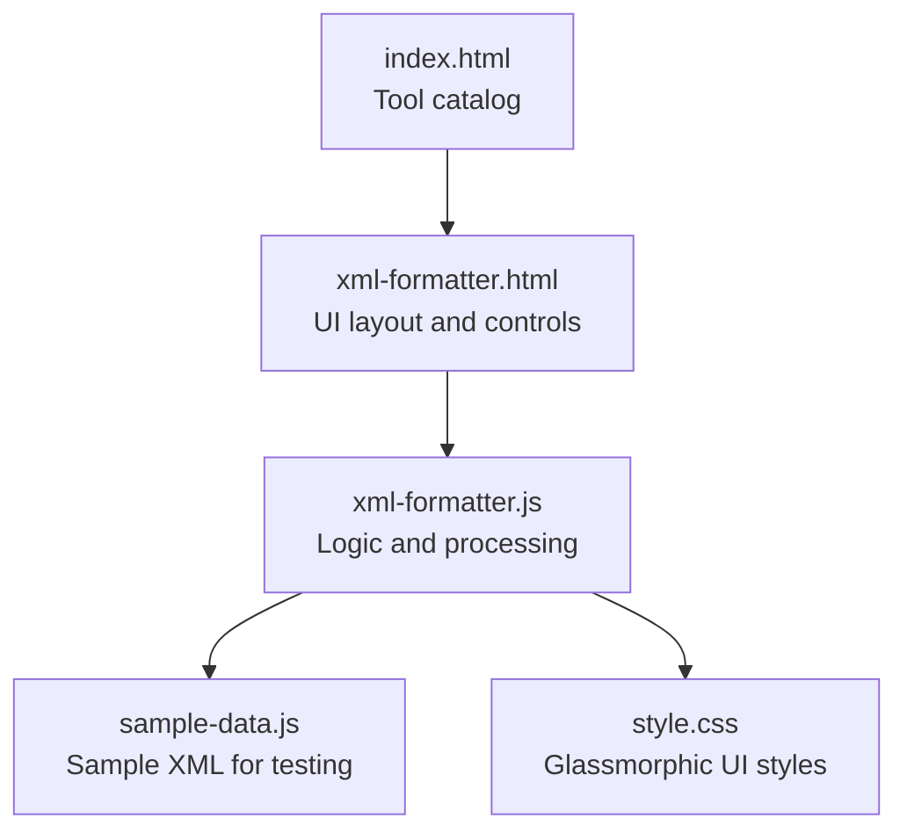
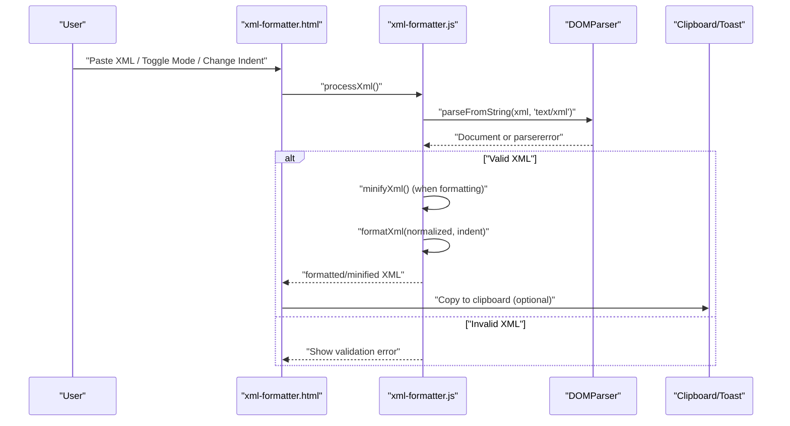
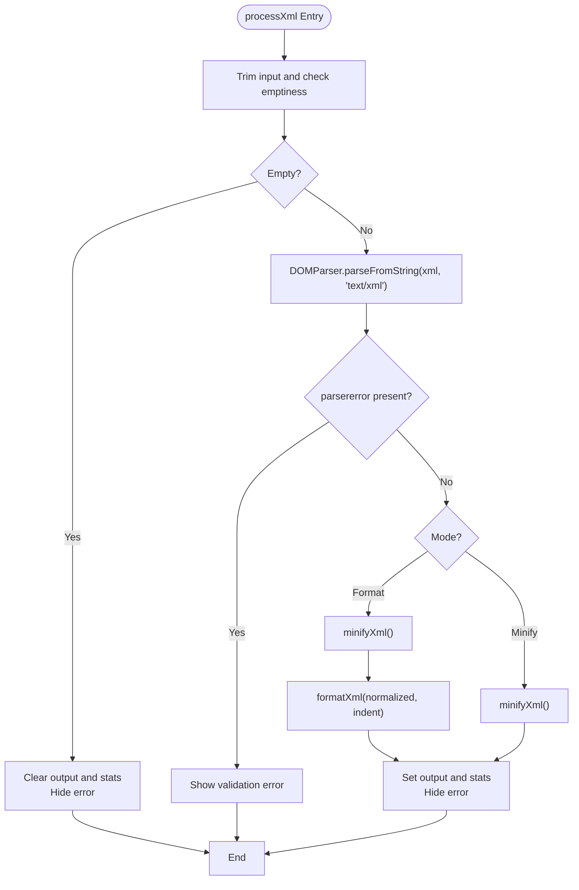
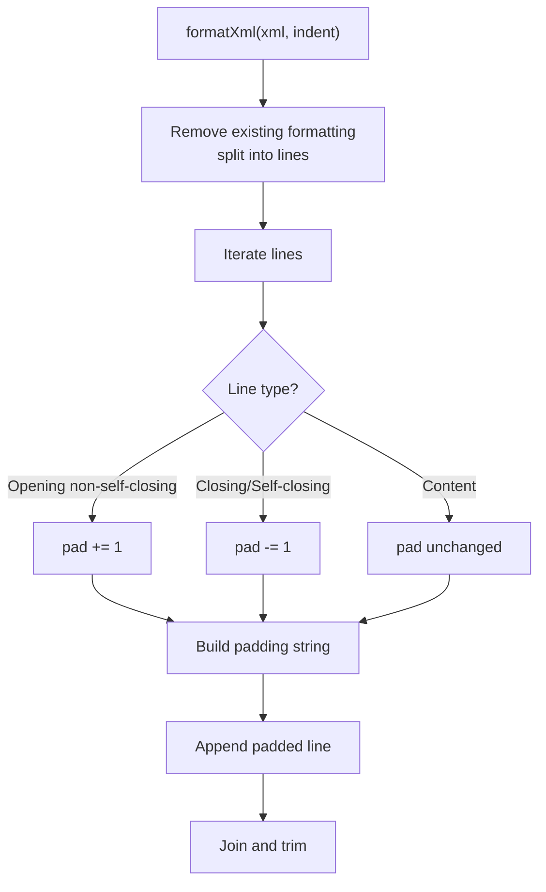
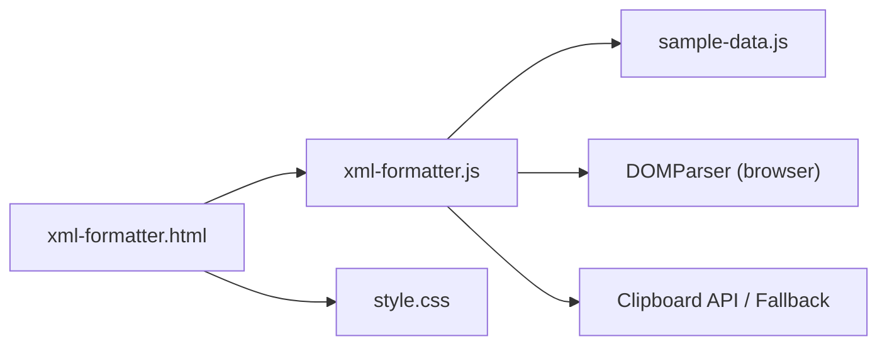

# XML Formatter

<cite>
**Referenced Files in This Document**
- [xml-formatter.html](file://xml-formatter.html)
- [xml-formatter.js](file://xml-formatter.js)
- [sample-data.js](file://sample-data.js)
- [style.css](file://style.css)
- [index.html](file://index.html)
- [README.md](file://README.md)
</cite>

## Table of Contents
1. [Introduction](#introduction)
2. [Project Structure](#project-structure)
3. [Core Components](#core-components)
4. [Architecture Overview](#architecture-overview)
5. [Detailed Component Analysis](#detailed-component-analysis)
6. [Dependency Analysis](#dependency-analysis)
7. [Performance Considerations](#performance-considerations)
8. [Troubleshooting Guide](#troubleshooting-guide)
9. [Conclusion](#conclusion)
10. [Appendices](#appendices)

## Introduction
The XML Formatter is a client-side tool that formats and minifies XML documents directly in the browser. It provides:
- Pretty-printing with configurable indentation (2 spaces, 4 spaces, or tabs)
- Minification to remove unnecessary whitespace and normalize formatting
- Real-time validation with user-friendly error notifications
- Seamless integration with the shared converter utilities’ clipboard and toast helpers
- A responsive UI with sample data loading and copy-to-clipboard functionality

This document explains the auto-indentation features, hierarchical XML structure formatting, minification behavior, validation mechanics, and pretty-printing options. It also covers performance considerations for large XML files and how the tool integrates with shared utilities.

## Project Structure
The XML Formatter consists of a minimal HTML page, a JavaScript controller, and a shared sample dataset. Styling is inherited from the global stylesheet.

**Diagram sources**
- [index.html:157-171](file://index.html#L157-L171)
- [xml-formatter.html:1-143](file://xml-formatter.html#L1-L143)
- [xml-formatter.js:1-258](file://xml-formatter.js#L1-L258)
- [sample-data.js:59](file://sample-data.js#L59)
- [style.css:1-293](file://style.css#L1-L293)

**Section sources**
- [xml-formatter.html:1-143](file://xml-formatter.html#L1-L143)
- [xml-formatter.js:1-258](file://xml-formatter.js#L1-L258)
- [sample-data.js:1-69](file://sample-data.js#L1-L69)
- [style.css:1-293](file://style.css#L1-L293)
- [index.html:157-171](file://index.html#L157-L171)
- [README.md:42-46](file://README.md#L42-L46)

## Core Components
- UI shell and controls: input area, format/minify buttons, indentation selector, output area, validation message, and copy button.
- Processing pipeline: DOMParser-based validation, minification normalization, and pretty-printing with configurable indentation.
- Clipboard and toast utilities: copy-to-clipboard with fallbacks and a reusable toast notification system.
- Sample data loader: loads a representative XML payload for quick testing.

Key behaviors:
- Real-time processing on input change and mode toggle.
- Validation via DOMParser; parsererror detection triggers user-visible errors.
- Minification removes redundant whitespace and normalizes tag boundaries.
- Pretty-printing splits nodes onto new lines and applies hierarchical indentation.

**Section sources**
- [xml-formatter.html:61-133](file://xml-formatter.html#L61-L133)
- [xml-formatter.js:34-113](file://xml-formatter.js#L34-L113)
- [xml-formatter.js:115-155](file://xml-formatter.js#L115-L155)
- [xml-formatter.js:168-175](file://xml-formatter.js#L168-L175)
- [sample-data.js:59](file://sample-data.js#L59)

## Architecture Overview
The tool follows a straightforward client-side architecture: the UI dispatches events, the controller validates and transforms the XML, and the UI updates the output and messages.

**Diagram sources**
- [xml-formatter.html:61-133](file://xml-formatter.html#L61-L133)
- [xml-formatter.js:73-113](file://xml-formatter.js#L73-L113)
- [xml-formatter.js:115-155](file://xml-formatter.js#L115-L155)

## Detailed Component Analysis

### UI and Controls
- Input area: raw XML text with character count.
- Format/Minify buttons: mutually exclusive modes; clicking toggles active styling and triggers processing.
- Indentation selector: chooses 2 spaces, 4 spaces, or tab.
- Output area: formatted/minified XML with character count.
- Validation message: shows parser error details with a danger alert.
- Copy button: copies output to clipboard and shows a toast notification.

User interactions:
- Input events trigger processing and statistics updates.
- Mode toggles switch between formatting and minification.
- Indentation changes re-process only when in format mode.
- Copy button triggers clipboard write and toast feedback.

**Section sources**
- [xml-formatter.html:61-133](file://xml-formatter.html#L61-L133)
- [xml-formatter.js:34-66](file://xml-formatter.js#L34-L66)
- [xml-formatter.js:168-175](file://xml-formatter.js#L168-L175)

### Validation and Error Handling
- Validation uses DOMParser to parse the input as XML.
- Parser error detection scans for “parsererror” nodes; if present, an error is thrown with the message text.
- On success, processing proceeds; on failure, the validation message is shown and the input border is highlighted.

**Diagram sources**
- [xml-formatter.js:73-113](file://xml-formatter.js#L73-L113)

**Section sources**
- [xml-formatter.js:83-113](file://xml-formatter.js#L83-L113)

### Pretty Printing and Auto-Indentation
Pretty printing is implemented by:
- Normalizing existing formatting by splitting adjacent tags across lines.
- Iterating through lines and computing indentation based on tag types:
  - Self-closing or closing tags reduce indentation.
  - Opening non-self-closing tags increase indentation.
  - Content lines keep indentation unchanged.
- Applying the chosen indentation string (spaces or tab) per nesting level.

Indentation options:
- 2 spaces
- 4 spaces
- Tab

**Diagram sources**
- [xml-formatter.js:115-150](file://xml-formatter.js#L115-L150)

**Section sources**
- [xml-formatter.js:96-104](file://xml-formatter.js#L96-L104)
- [xml-formatter.js:115-150](file://xml-formatter.js#L115-L150)

### Minification
Minification performs:
- Removing whitespace between adjacent tags.
- Normalizing spacing around opening and closing tag pairs.
- Trimming leading/trailing whitespace.

This ensures compact output suitable for packaging and deployment scenarios.

**Section sources**
- [xml-formatter.js:152-155](file://xml-formatter.js#L152-L155)

### Namespace Handling and Attribute Formatting
- Namespaces are preserved as-is during both minification and pretty-printing because the implementation operates on a line-by-line basis and does not parse attributes or namespaces specifically.
- Attribute formatting is not altered; the tool maintains attribute positions and spacing as provided in the input.

Practical implications:
- XML with namespaces and attributes remains valid after processing.
- Attribute ordering and spacing are not changed by the formatter.

**Section sources**
- [xml-formatter.js:115-155](file://xml-formatter.js#L115-L155)

### Sample Data and Integration
- A representative XML payload is embedded in the shared sample dataset for quick testing.
- The “Load Sample” button clears the input if confirmed, injects the sample, sets format mode, resets indentation to 4 spaces, and runs processing.

**Section sources**
- [sample-data.js:59](file://sample-data.js#L59)
- [xml-formatter.js:17-32](file://xml-formatter.js#L17-L32)

### Clipboard and Toast Utilities
- Copy to clipboard uses the modern Clipboard API when available; otherwise, falls back to a textarea-based method.
- Toast notifications are created dynamically and shown via Bootstrap’s Toast or a lightweight fallback.

Integration points:
- Copy button triggers clipboard write and toast.
- Shared toast and fallback copy functions are reused across tools.

**Section sources**
- [xml-formatter.js:168-175](file://xml-formatter.js#L168-L175)
- [xml-formatter.js:178-257](file://xml-formatter.js#L178-L257)

## Dependency Analysis
High-level dependencies:
- xml-formatter.html depends on xml-formatter.js for logic and on sample-data.js for sample XML.
- xml-formatter.js depends on the browser’s DOMParser for validation and on shared clipboard/toast utilities.
- style.css provides the UI theme and glassmorphic styling.

**Diagram sources**
- [xml-formatter.html:1-143](file://xml-formatter.html#L1-L143)
- [xml-formatter.js:1-258](file://xml-formatter.js#L1-L258)
- [sample-data.js:1-69](file://sample-data.js#L1-L69)
- [style.css:1-293](file://style.css#L1-L293)

**Section sources**
- [xml-formatter.html:1-143](file://xml-formatter.html#L1-L143)
- [xml-formatter.js:1-258](file://xml-formatter.js#L1-L258)
- [sample-data.js:1-69](file://sample-data.js#L1-L69)
- [style.css:1-293](file://style.css#L1-L293)

## Performance Considerations
- Input size: The tool processes the entire XML as a string and iterates over lines. For very large XML files, consider:
  - Breaking input into chunks if needed (not implemented).
  - Avoiding frequent reflows by batching UI updates.
  - Using a worker thread for heavy parsing/minification in the future.
- DOMParser overhead: Parsing large XML can be CPU-intensive; defer processing until user stops typing or clicks a dedicated action if needed.
- Minification cost: Regex-based minification is linear in input length; acceptable for typical XML sizes.
- Pretty printing cost: Line-by-line iteration plus padding string construction is O(n) with respect to the number of lines.

[No sources needed since this section provides general guidance]

## Troubleshooting Guide
Common issues and resolutions:
- Invalid XML detected:
  - Symptom: Red validation message appears with details.
  - Cause: DOMParser reports a parsererror.
  - Resolution: Fix malformed tags, unclosed tags, or invalid characters; ensure proper encoding.
- No output after processing:
  - Symptom: Output area is empty.
  - Cause: Input was empty or contained only whitespace.
  - Resolution: Enter valid XML content.
- Unexpected indentation:
  - Symptom: Output uses unexpected indentation.
  - Cause: Indentation setting not applied or changed mid-edit.
  - Resolution: Confirm the selected indentation option; note that changing indentation re-processes only in format mode.
- Copy fails:
  - Symptom: Copy button does nothing or shows an error.
  - Cause: Clipboard API unavailable or permission denied.
  - Resolution: Try again in a secure context; the fallback method writes to a temporary textarea and attempts execCommand.

**Section sources**
- [xml-formatter.js:83-113](file://xml-formatter.js#L83-L113)
- [xml-formatter.js:168-175](file://xml-formatter.js#L168-L175)
- [xml-formatter.js:219-257](file://xml-formatter.js#L219-L257)

## Conclusion
The XML Formatter provides a fast, client-side solution for formatting and minifying XML with real-time validation and a clean UI. Its pretty-printing engine offers flexible indentation, while minification produces compact output. The tool integrates smoothly with shared utilities for clipboard and toast notifications, and it leverages a sample dataset for immediate testing. For very large XML files, consider future enhancements such as chunked processing or worker threads to maintain responsiveness.

[No sources needed since this section summarizes without analyzing specific files]

## Appendices

### Example Workflows
- Pretty print with 4-space indentation:
  - Paste XML into the input area.
  - Click “Pretty Print”; adjust indentation if desired.
  - Review output and copy if needed.
- Minify for packaging:
  - Paste XML into the input area.
  - Click “Minify” to produce compact output.
- Load sample XML:
  - Click “Load Sample” to populate the input with a representative payload.
  - Switch to “Pretty Print” to format it immediately.

**Section sources**
- [xml-formatter.html:61-133](file://xml-formatter.html#L61-L133)
- [xml-formatter.js:17-32](file://xml-formatter.js#L17-L32)
- [sample-data.js:59](file://sample-data.js#L59)