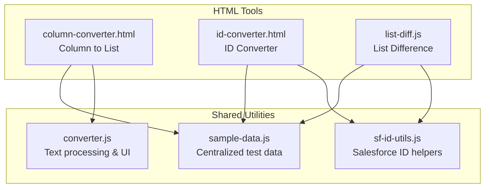
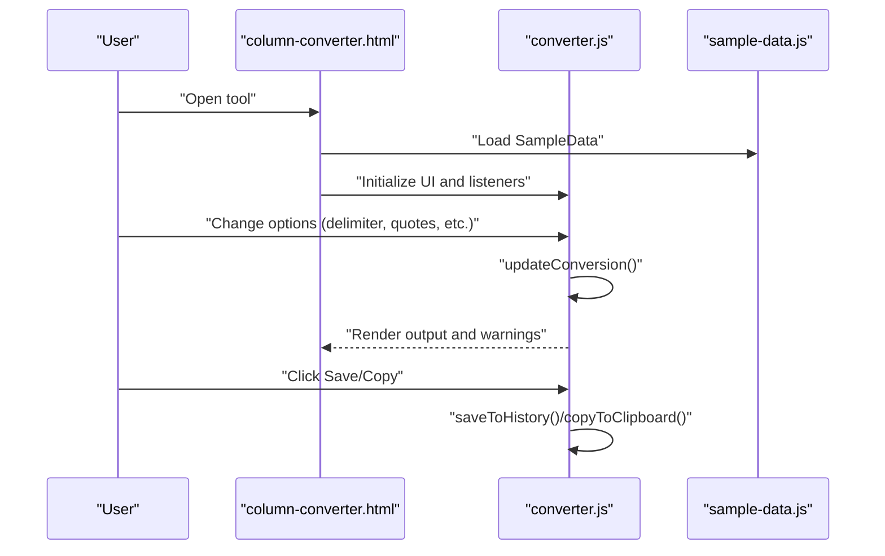
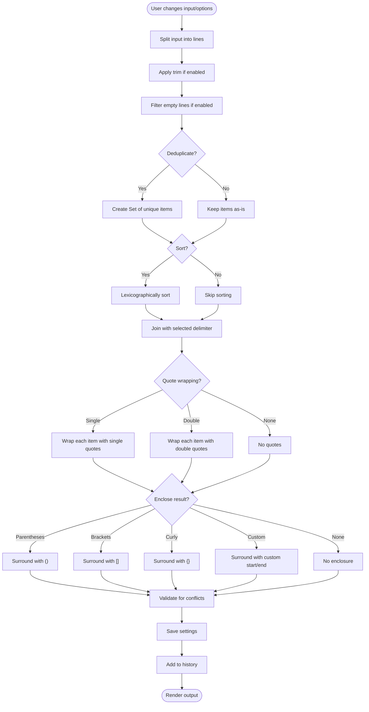
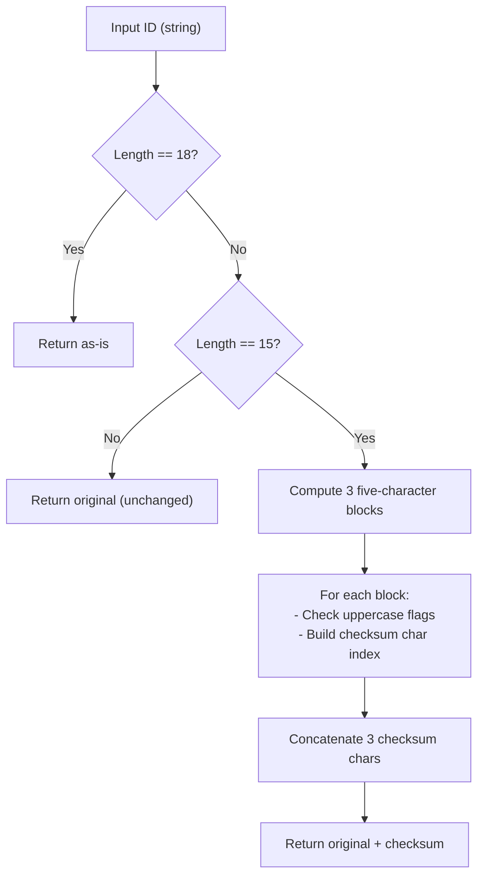
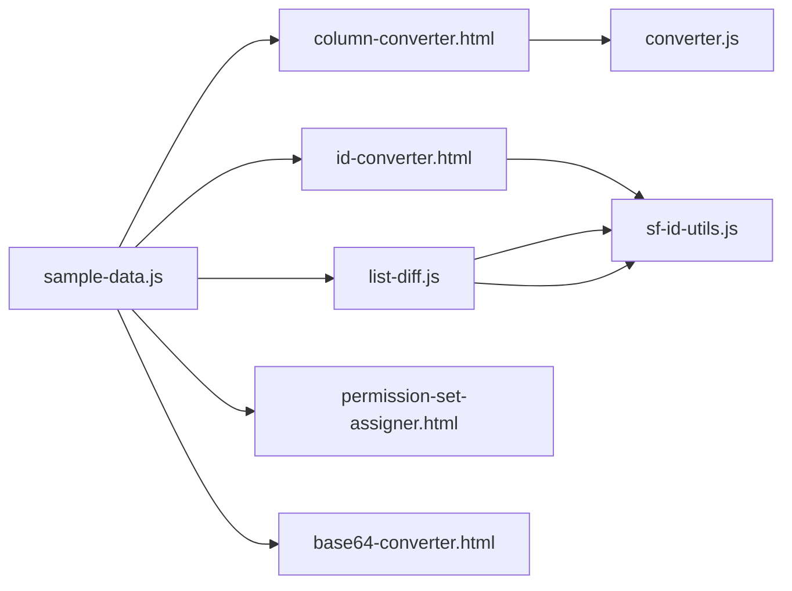

# Utility Libraries and Shared Components

<cite>
**Referenced Files in This Document**
- [converter.js](file://converter.js)
- [sf-id-utils.js](file://sf-id-utils.js)
- [sample-data.js](file://sample-data.js)
- [sf-id-utils.test.js](file://sf-id-utils.test.js)
- [guid-generator.test.js](file://guid-generator.test.js)
- [column-converter.html](file://column-converter.html)
- [id-converter.html](file://id-converter.html)
- [list-diff.js](file://list-diff.js)
- [package.json](file://package.json)
- [README.md](file://README.md)
</cite>

## Table of Contents
1. [Introduction](#introduction)
2. [Project Structure](#project-structure)
3. [Core Components](#core-components)
4. [Architecture Overview](#architecture-overview)
5. [Detailed Component Analysis](#detailed-component-analysis)
6. [Dependency Analysis](#dependency-analysis)
7. [Performance Considerations](#performance-considerations)
8. [Troubleshooting Guide](#troubleshooting-guide)
9. [Conclusion](#conclusion)

## Introduction
This document describes the shared utility libraries that power the Developer Utilities suite. It focuses on:
- The centralized text processing engine in converter.js, including real-time validation and quote wrapping strategies
- The Salesforce ID utilities in sf-id-utils.js, covering validation, conversion, and format checking
- The centralized sample data provider in sample-data.js and its integration across tools
- Testing framework setup and patterns used in the project
- Module export/import architecture and cross-tool integration

These utilities enable consistent, secure, and offline-first behavior across all tools in the suite.

## Project Structure
The suite is organized as a collection of standalone HTML tools, each embedding shared JavaScript utilities via script tags. The shared utilities are:
- converter.js: central text processing and UI orchestration for the Column to List Converter
- sf-id-utils.js: Salesforce ID validation and conversion helpers
- sample-data.js: centralized test data exposed globally and exported for Node tests

**Diagram sources**
- [column-converter.html](file://column-converter.html)
- [id-converter.html](file://id-converter.html)
- [list-diff.js](file://list-diff.js)
- [sample-data.js](file://sample-data.js)
- [sf-id-utils.js](file://sf-id-utils.js)
- [converter.js](file://converter.js)

**Section sources**
- [README.md:1-63](file://README.md#L1-L63)
- [column-converter.html:220-224](file://column-converter.html#L220-L224)
- [id-converter.html:143-146](file://id-converter.html#L143-L146)
- [list-diff.js:43-58](file://list-diff.js#L43-L58)

## Core Components
This section documents the three shared libraries and their roles.

- converter.js
  - Provides the real-time text processing pipeline for transforming multi-line inputs into delimited lists with optional quoting and enclosure
  - Implements conflict detection to warn users about potential delimiter or quote collisions
  - Manages UI persistence, defaults, and session history
  - Exposes clipboard copy utilities and toast notifications

- sf-id-utils.js
  - Validates Salesforce IDs (15 or 18 characters, alphanumeric)
  - Converts 15-character IDs to 18-character case-safe IDs using checksum computation
  - Exports functions for Node-based tests

- sample-data.js
  - Centralizes sample data for all tools
  - Exposes window.SampleData for browser tools
  - Exports module.exports for Node tests

**Section sources**
- [converter.js:68-152](file://converter.js#L68-L152)
- [converter.js:154-219](file://converter.js#L154-L219)
- [converter.js:221-269](file://converter.js#L221-L269)
- [converter.js:307-354](file://converter.js#L307-L354)
- [sf-id-utils.js:6-9](file://sf-id-utils.js#L6-L9)
- [sf-id-utils.js:17-39](file://sf-id-utils.js#L17-L39)
- [sf-id-utils.js:41-45](file://sf-id-utils.js#L41-L45)
- [sample-data.js:4-64](file://sample-data.js#L4-L64)
- [sample-data.js:66-69](file://sample-data.js#L66-L69)

## Architecture Overview
The suite follows a modular, shared-library architecture:
- Each tool page embeds shared utilities via script tags
- converter.js orchestrates UI events and drives the Column to List Converter
- sf-id-utils.js is consumed by tools that deal with Salesforce IDs (ID Converter and List Difference)
- sample-data.js is loaded by tools that need sample data and is also exported for Node tests

**Diagram sources**
- [column-converter.html:220-224](file://column-converter.html#L220-L224)
- [converter.js:68-152](file://converter.js#L68-L152)
- [converter.js:307-354](file://converter.js#L307-L354)
- [sample-data.js:4-64](file://sample-data.js#L4-L64)

## Detailed Component Analysis

### converter.js: Centralized Text Processing Engine
This module encapsulates:
- Real-time processing pipeline
- Quote wrapping strategies
- Conflict detection
- Persistence and defaults
- Session history and clipboard integration

Key processing steps:
1. Parse input lines
2. Apply transformations (trim, dedupe, sort, filter empty)
3. Join with selected delimiter
4. Apply quote wrapping (single/double/none)
5. Apply enclosure (parentheses, brackets, braces, custom)
6. Validate for conflicts and update UI warnings
7. Persist settings and maintain history

Quote wrapping strategies:
- None: items joined by delimiter
- Single: wraps each item with single quotes
- Double: wraps each item with double quotes

Enclosure strategies:
- None: no outer enclosure
- Parentheses: wraps entire result with ()
- Brackets: wraps entire result with []
- Curly: wraps entire result with {}
- Custom: wraps with user-provided start/end strings

Conflict detection:
- Scans processed items for presence of delimiter, single quotes, double quotes, parentheses, or brackets
- Emits warnings and visual indicators when conflicts are detected

Persistence:
- Saves UI settings to localStorage
- Loads previous settings on initialization
- Resets to defaults and triggers conversion

Session history:
- Stores last N results with preview and timestamp
- Supports copy and delete actions

Clipboard integration:
- Copies output to clipboard with graceful fallback
- Shows toast notifications for user feedback

**Section sources**
- [converter.js:68-152](file://converter.js#L68-L152)
- [converter.js:154-219](file://converter.js#L154-L219)
- [converter.js:221-269](file://converter.js#L221-L269)
- [converter.js:307-354](file://converter.js#L307-L354)
- [converter.js:417-425](file://converter.js#L417-L425)
- [converter.js:427-466](file://converter.js#L427-L466)
- [converter.js:468-506](file://converter.js#L468-L506)

#### Real-Time Processing Flow

**Diagram sources**
- [converter.js:68-152](file://converter.js#L68-L152)
- [converter.js:154-219](file://converter.js#L154-L219)
- [converter.js:221-269](file://converter.js#L221-L269)
- [converter.js:307-354](file://converter.js#L307-L354)

### sf-id-utils.js: Salesforce ID Utilities
Functions:
- isSalesforceId(str): validates 15 or 18-character alphanumeric IDs
- to18CharId(id15): converts 15-char IDs to 18-char case-safe IDs using checksum computation

Export pattern:
- Exports functions for Node-based tests via CommonJS

Integration:
- Used by ID Converter tool for 15-to-18 conversions
- Consumed by List Difference tool for Smart SF mode normalization

**Section sources**
- [sf-id-utils.js:6-9](file://sf-id-utils.js#L6-L9)
- [sf-id-utils.js:17-39](file://sf-id-utils.js#L17-L39)
- [sf-id-utils.js:41-45](file://sf-id-utils.js#L41-L45)
- [list-diff.js:138-139](file://list-diff.js#L138-L139)

#### Conversion Algorithm Details

**Diagram sources**
- [sf-id-utils.js:17-39](file://sf-id-utils.js#L17-L39)

### sample-data.js: Centralized Test Data Provider
Role:
- Provides sample data for all tools
- Exposes window.SampleData for browser tools
- Exports module.exports for Node tests

Data sets:
- Column Converter sample
- ID Converter sample
- List Difference samples (A/B lists)
- Permission Set Assigner samples (users and permission sets)
- Base64 Converter sample
- Apex Debug Log sample
- XML Formatter sample
- API Name Generator sample
- Formula Formatter sample

**Section sources**
- [sample-data.js:4-64](file://sample-data.js#L4-L64)
- [sample-data.js:66-69](file://sample-data.js#L66-L69)

## Dependency Analysis
Module-level dependencies and integration patterns:
- converter.js depends on:
  - DOM elements defined in column-converter.html
  - sample-data.js for “Load Sample” functionality
- sf-id-utils.js is consumed by:
  - id-converter.html (directly)
  - list-diff.js (via isSalesforceId and to18CharId)
- sample-data.js is consumed by:
  - column-converter.html
  - id-converter.html
  - list-diff.js
  - permission-set-assigner.html
  - base64-converter.html

**Diagram sources**
- [column-converter.html:220-224](file://column-converter.html#L220-L224)
- [id-converter.html:143-146](file://id-converter.html#L143-L146)
- [list-diff.js:43-58](file://list-diff.js#L43-L58)
- [sample-data.js:66-69](file://sample-data.js#L66-L69)
- [sf-id-utils.js:41-45](file://sf-id-utils.js#L41-L45)
- [converter.js:221-269](file://converter.js#L221-L269)

**Section sources**
- [column-converter.html:220-224](file://column-converter.html#L220-L224)
- [id-converter.html:143-146](file://id-converter.html#L143-L146)
- [list-diff.js:43-58](file://list-diff.js#L43-L58)
- [sample-data.js:66-69](file://sample-data.js#L66-L69)
- [sf-id-utils.js:41-45](file://sf-id-utils.js#L41-L45)
- [converter.js:221-269](file://converter.js#L221-L269)

## Performance Considerations
- converter.js
  - Uses a single pass with early exits to minimize conflict checks
  - Avoids cloning arrays during processing to reduce memory overhead
  - Limits history size to keep UI responsive
- sf-id-utils.js
  - Performs constant-time operations per ID (three five-character blocks)
  - Minimal memory footprint for checksum computation
- sample-data.js
  - Centralized data reduces duplication across tools
  - Export pattern supports both browser globals and Node tests

[No sources needed since this section provides general guidance]

## Troubleshooting Guide
Common issues and resolutions:
- Conflicts detected in converter.js
  - Cause: Input contains the chosen delimiter or special characters
  - Resolution: Adjust delimiter or quoting; the UI highlights warnings and adds visual borders
- Settings not persisting
  - Cause: localStorage disabled or blocked
  - Resolution: Verify browser settings; the module logs errors on load failure
- Clipboard copy failures
  - Cause: Mixed content or unsupported context
  - Resolution: Falls back to execCommand with user gesture; ensure operation is triggered by a user action
- Node tests failing to import
  - Cause: Incorrect export pattern
  - Resolution: Ensure module.exports is present; see sample-data.js and sf-id-utils.js exports

**Section sources**
- [converter.js:154-219](file://converter.js#L154-L219)
- [converter.js:240-266](file://converter.js#L240-L266)
- [converter.js:468-506](file://converter.js#L468-L506)
- [sample-data.js:66-69](file://sample-data.js#L66-L69)
- [sf-id-utils.js:41-45](file://sf-id-utils.js#L41-L45)

## Conclusion
The shared utility libraries provide a cohesive foundation for the Developer Utilities suite:
- converter.js delivers robust, real-time text processing with conflict detection and persistence
- sf-id-utils.js offers reliable Salesforce ID validation and conversion
- sample-data.js ensures consistent, centralized test data across tools

The module export/import architecture cleanly integrates these utilities across HTML tools while supporting Node-based testing. Together, they enable secure, offline-first, and user-friendly developer utilities.